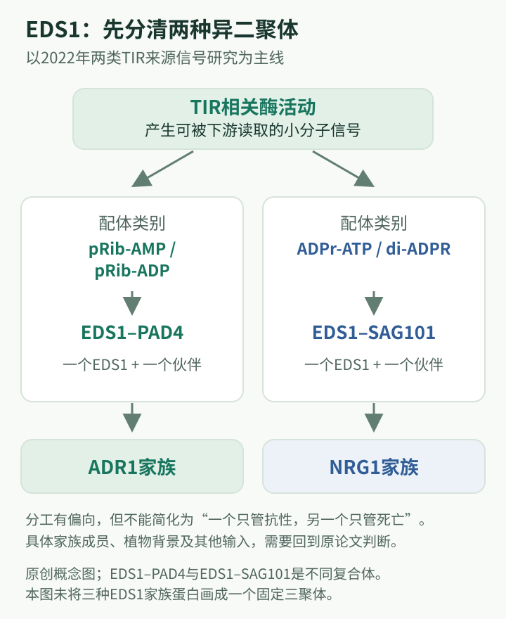

# EDS1、PAD4与SAG101研究史：从遗传必需因子到小分子受体模块

## 先把三个蛋白分清

EDS1、PAD4、SAG101是三个相关但不同的蛋白。拟南芥中，EDS1分别与PAD4或SAG101形成异源二聚体；不能把它们写成必然同时存在的三聚体。EDS1得名于增强感病表型，PAD4得名于植保素相关筛选，SAG101得名于早期衰老相关研究。名字记录的是发现入口，并不穷尽后来认识到的功能。

它们的历史展示了一个特别长的解释跨度：研究者先知道这些蛋白对抗性不可缺少，再知道它们需要结伴，最后才找到它们读取的内源小分子信号。本篇学习目标是理解遗传位置、结构相似性与生化功能为何不能彼此替代。

## 关键年表

| 年份 | 认识推进 | 原始研究 |
|---|---|---|
| 1999 | EDS1与PAD4被鉴定为脂肪酶样蛋白 | [Falk等](https://doi.org/10.1073/pnas.96.6.3292)；[Jirage等](https://doi.org/10.1073/pnas.96.23.13583) |
| 2005 | SAG101进入EDS1相关免疫复合体模型 | [Feys等](https://doi.org/10.1105/tpc.105.033910) |
| 2019 | EDS1-SAG101与NRG1的功能及物种兼容性被联系 | [Lapin等](https://doi.org/10.1105/tpc.19.00118) |
| 2021 | 激活依赖的EDS1-SAG101-NRG1关联获得证据 | [Sun等](https://pubmed.ncbi.nlm.nih.gov/34099661/) |
| 2022 | 两类EDS1复合体被确认为不同TIR产物的受体 | [Huang等](https://doi.org/10.1126/science.abq3297)；[Jia等](https://doi.org/10.1126/science.abq8180) |

## 第一阶段：从“更容易生病”寻找共享信号环节

一个特异性受体突变可能只影响有限抗性，而某些遗传改变会影响多条抗性路径。EDS1研究的重要性正来自后一类现象：它不像只决定一个识别配对的受体，更像多个受体需要使用的共同环节。1999年Falk等完成分子鉴定后，发现其部分序列与真核脂肪酶相似，于是脂质相关催化成为自然的工作假说（Falk等，1999）。

同年Jirage等研究PAD4，把它与水杨酸积累、响应及脂肪酶样序列特征相联系。两个发现相互呼应，让研究者看到抗性、激素调节和一类蛋白之间可能存在共同机制（Jirage等，1999）。但当时最重要的保留条件是“样”：看起来像脂肪酶，不等于已经证明在免疫中催化哪种脂质反应。

对初学者而言，基因名称也容易造成误会。PAD4并不是因为名称含“植保素”就只能属于某一条专门合成路线；突变筛选是从可见表型抓住一个入口，后续可能发现更广泛的调控功能。这正是正向遗传学的力量，也是按名字理解功能的风险。

## 第二阶段：不是一串独立因子，而是不同复合体

2005年Feys等将SAG101确立为EDS1的免疫相关伙伴。蛋白关联、亚细胞分析与遗传证据共同支持复合体模型，研究单位由单个蛋白转向“EDS1和谁在一起”（Feys等，2005）。这个问题后来变得比单纯测量EDS1是否升高更加关键。

异源二聚体意味着两个不同蛋白共同形成作用单位。EDS1-PAD4与EDS1-SAG101共享一个成员，但具有不同的伙伴界面及功能联系。一个成员共享，并不代表两条分支可以在任何条件下互相替换。类似地，某个双突变比单突变严重，既可能表示部分冗余，也可能包含反馈和补偿，不能马上画成两条完全独立的直线。

这一时期的研究还显示细胞内位置值得考虑。蛋白出现在细胞核或细胞质，是理解其可能作用场所的线索；但某一时刻的定位图，不能单独证明信号在两个区域之间如何传递。位置、结合和功能需要互相约束。

## 第三阶段：辅助NLR让下游关系变得可解释

到2019年，Lapin等把EDS1-SAG101与辅助型NLR NRG1联系成共同演化的功能模块。研究不仅比较哪些突变影响细胞死亡，也比较抗性等不同输出，并利用物种间的功能兼容性检验模型。它揭示的关键不是“名字又多了一个”，而是蛋白需要与匹配的伙伴共同工作（Lapin等，2019）。

2021年Sun等进一步观察到识别激活后NRG1与EDS1、SAG101的关联。这把遗传依赖推进为受状态调控的物理联系。与此同时，EDS1-PAD4与ADR1家族构成另一条重要功能联系。二者在拟南芥中表现出偏重不同输出、又存在合作的关系，不能简化成“NRG1只管死亡，ADR1只管抗病”的绝对分工（Sun等，2021）。

跨物种比较尤其容易被过度概括。本氏烟与拟南芥的遗传配置、冗余程度和实验读出不同；某个组分在一种植物中强烈必需，不足以断言在另一种植物所有免疫反应中同样必需。阅读时应始终记录物种、受体来源和所观察的表型。

## 第四阶段：2022年，信号“缺失的一环”成为化学实体

此前已知道TIR结构域具有产生核苷酸相关产物的酶功能，但“产物怎样传给EDS1”仍不完整。Huang等与Jia等2022年两篇Science研究将化学鉴定、结构分析与功能证据结合，给出了两类不同的信号及其受体对应关系。

Huang等研究的pRib-AMP和pRib-ADP，即含磷酸核糖的腺苷酸相关分子，被EDS1-PAD4复合体读取，并促进与ADR1-L1相关的联系。Jia等研究的ADPr-ATP和di-ADPR，被EDS1-SAG101读取，并与NRG1相关的激活过程联系起来（Huang等，2022；Jia等，2022）。名称较长，初学者首先应掌握的是“两个小分子组—两类受体二聚体—不同辅助NLR联系”这一层级。

这个认识与早期“脂肪酶样”假说有明显差异：关键作用之一是读取内源信号并改变伙伴结合，而不是仅凭序列相似性推断脂质水解。历史假说并非毫无价值，它指出了可能的化学联系；新证据则迫使研究者改变对实际生化角色的描述。

## 怎样读懂2022年的突破

可以把证据拆为四问：活化系统产生了什么分子？该分子是否与候选复合体结合？结合是否改变复合体构象或伙伴关系？这些变化是否与免疫功能相连？只回答第一问，会得到代谢物清单；只回答第二问，可能只是结合现象。四层连接，才使“第二信使—受体”模型有解释力。

还要区分结构中的配体密度、化学结构鉴定和生物学活性。看见一个结合口袋并不自动确定里面是什么；检出一个化合物也不自动意味着它在细胞内达到有效水平。正因为需要不同专长，相关论文包含结构、生化、有机化学和植物遗传学团队的协作。

## 现在应怎样表述，哪些仍需保留

可以说，EDS1复合体是连接TIR酶信号与辅助NLR的重要内源小分子受体模块。不能说所有TIR产物都同等激活EDS1，也不能把历史上测到的v-cADPR直接替换成已经确定的通用EDS1配体。更不能把两个复合体的偏好写成植物界普遍而绝对的输出分界。

尚待深入的问题包括：不同细胞中的信号产生与清除如何平衡，复合体的数量如何影响阈值，以及相似模块为什么在不同谱系中保留或缺失。它们要求从静态结构回到组织环境与演化背景。

这条线索由Falk、Jirage、Feys、Parker及多位合作者长期推进，并与Lapin、Sun、Huang、Jia、Song等研究者和Chai、Chang等合作团队汇合。应按具体论文与贡献讨论，不能将多年遗传学基础和后期结构化学解释归为某一位研究者独自完成。

## 先修补充：这一模块究竟连接哪两种信号

上游的TIR是某些NLR受体的氨基端结构域，也存在于一些非完整NLR蛋白中。活化的TIR可以参与核苷酸相关化学反应；因此“上游受体已识别”到“下游开始工作”之间，不一定只靠蛋白逐个接触，还可以经由细胞内部的小分子完成。第二信使是由细胞内过程产生、再由其他组分读取的信号分子，不能与最初的外界识别线索混为一谈。

下游的ADR1与NRG1属于辅助NLR家族。它们和上游感知型TNL同属NLR大类，分工却不同：上游感知型受体决定某些输入是否被识别，辅助家族参与将已经建立的信号转成细胞反应。EDS1二聚体位于两者之间，承担读取特定小分子并建立相应辅助受体联系的作用。这里的“下游”是一种功能关系，不代表它们始终在细胞里排成一条永久相连的蛋白链。

EDS1、PAD4和SAG101的蛋白结构也有两层。氨基端保留α/β水解酶样折叠，羧基端具有称为EP的螺旋区域。2013年结构研究提示，二聚体形成使这些区域构成新的相互作用表面。理解结构域分工，比把整条蛋白笼统叫“脂肪酶”更能解释后来的信号受体角色（Wagner等，2013）。

## 深读一：2001年为何说EDS1与PAD4既合作又不同

在两者分子身份已知之后，最容易画出的模型是EDS1和PAD4串联组成同一条路径。如果它们缺失后的表型相近，这个模型似乎很自然；另一种解释则是二者共同参与部分输出，但EDS1还具有PAD4不能完全替代的功能。Feys、Moisan、Newman与Parker在2001年同时比较遗传表型、水杨酸积累和蛋白关系，使这两种解释有了可以区分的依据。

原文指出，在所研究的抗性背景中，EDS1对过敏性反应的要求与PAD4并不相同，而二者都参与防御相关水杨酸积累。EDS1对诱导PAD4转录的重要性也并非简单的相互对称关系。这样，表型相似之处支持共同过程，差异之处则迫使模型保留分工；不能把“两者都增强感病”理解为“两者完全等价”。

Y2H与植物中的共同沉淀又将遗传合作连接到蛋白关联。研究者因而提出EDS1具有较早作用，以及与PAD4合作放大防御的作用。这里需要保留历史层级：2001年的两功能模型并不知道2022年的具体小分子，因此不能把当时的“早期作用”直接重命名为某一已知配体口袋。后续SAG101、结构与辅助NLR工作，才逐渐解释为什么EDS1缺失可能造成比单个伙伴缺失更广的后果（Feys等，2001）。

这一论文也让水杨酸反馈变得具体。PAD4影响激素相关防御，激素状态又可影响基因表达，于是植物表型不只是单向箭头的结果。若一个突变让防御基因表达降低，原因可能既有信号传递缺陷，也有正反馈未被充分放大。只有同时看时间、分子关系和不同输出，才能避免把反馈系统误写为简单排列。

## 深读二：2013年结构如何改变“脂肪酶样”的含义

早期序列发现提供了两类竞争解释：这些蛋白在免疫中主要执行脂质水解，或者水解酶样结构已被用于一种非经典催化的信号功能。Wagner、Stuttmann、Rietz等解析的是EDS1—SAG101异源二聚体晶体结构，并据此建立EDS1—PAD4的结构模型；**不能把后一项写成同年已经获得同等实测结构**。

研究将结构与功能变化联系起来，支持互斥的异源复合体，而非EDS1先后套着PAD4、SAG101组成必然的三聚体。它还显示，保留水解酶样拓扑并不要求经典催化机制是免疫功能的核心。氨基端区域帮助组织伙伴，羧基端EP区域形成重要的信号表面，使“相似于酶”与“发挥特定酶反应”这两个原先容易混同的命题分开。

这个结果具体排除了什么？它削弱了只靠序列注释就解释功能的做法，并为为什么EDS1可以使用不同伙伴提供了物理基础。它尚未指出每种二聚体接收什么小分子，也没有解释辅助NLR如何被选择。因而2013年的结构是重新定义问题：既然二聚体产生新的表面，什么信号会改变这些表面，什么下游组分会读取这种改变（Wagner等，2013）？

## 深读三：2019—2021年怎样证明分支需要匹配伙伴

如果PAD4和SAG101只是等价的稳定因子，那么只要让EDS1蛋白稳定存在，就应能较容易地相互替代。如果它们决定不同下游联系，替代结果则会依赖辅助受体的身份。Lapin等2019年的遗传、蛋白功能和进化比较，支持后一种解释：EDS1—SAG101与NRG1在TNL相关细胞死亡中形成需要配套的功能模块。

跨物种比较在这里不是单纯展示“某基因在另一植物也有用”。拟南芥模块在本氏烟背景中的功能，以及不匹配伙伴组合的差异，帮助区分宿主细胞是否普遍缺少执行能力，还是模块成员之间需要特定兼容关系。整套匹配关系的重要性，使“每个蛋白看起来保守，所以任意物种之间都能互换”成为不充分解释。进化共现与功能分析互相支持，但不能只凭共现就宣称蛋白直接结合。

Sun等2021年进一步把关联放到免疫激活前后比较，发现NRG1与EDS1—SAG101的联系具有状态依赖性。遗传学先告诉研究者哪一组功能需要一起考虑，动态蛋白关联再说明它们何时进入物理联系。于是模块可以被理解为受信号控制的功能组织，而不是平时一直固定存在、激活时数量增加的永久复合体。

同时，“细胞死亡分支”与“转录防御分支”是观察上的概括。不同组织、遗传背景和输出指标会改变两个分支的贡献程度。细胞死亡与限制病害也并非同一个读数：前者被保留，不代表全部抗性完好；前者减弱，也不代表植物完全失去保护。模块分工必须与具体植物结局一起陈述。

## 深读四：2022年两个受体二聚体为何要分别研究

上游TIR能够产生多个核苷酸相关分子，仅从总NAD消耗量推断信号，会丢掉化学特异性。竞争解释包括：EDS1读取的是普遍代谢紊乱，或者它识别一类具有特定结构的产物；两个伙伴二聚体也可能读同一信号，再在后面分流。2022年两项研究将这些问题落到分子的化学身份和受体选择性。

Huang等将pRib-AMP及pRib-ADP与EDS1—PAD4联系；Jia等则将ADPr-ATP和di-ADPR与EDS1—SAG101联系。两类产物不是给同一种物质起了不同简称。相应化学鉴定和结合结构为识别提供实体，生化与细胞功能证据进一步将配体结合与辅助受体关联相接。与早期“脂质代谢因子”的直观想象相比，这是一种明确的信号读取机制。

最关键的不是背四个化学名，而是理解组合特异性：EDS1是共享成员，却因结合PAD4或SAG101而形成不同接收界面；相应信号改变二聚体状态后，分别有利于ADR1-L1或NRG1A相关的结合。共享EDS1因此不等于共享全部配体偏好，下游都叫辅助NLR也不等于可以随意对调。两篇论文把分支差异从遗传图中的两条线，推进为可以讨论的化学和蛋白选择性。

它们仍没有让每个组织内的信号时空过程自动变得清楚。纯化或重构体系显示某物质具备直接功能，细胞内还要考虑产生位置、局部浓度、寿命和竞争关系。这样的保留不是削弱受体模型，而是区分“能够直接作用的分子机制”和“天然组织如何调度该机制”两个层次。

*原创概念示意，非实验结构图。依据Huang等2022及Jia等2022原始研究；EDS1分别与PAD4或SAG101组成异二聚体，并非三蛋白固定三聚体。图中分支也不表示所有物种与输出绝对隔离，见正文适用范围。*

## 旧模型—关键证据—现有解释

| 旧问题或简化模型 | 使模型改变的研究 | 应保留的解释 |
|---|---|---|
| EDS1与PAD4表型相近，因此工作完全相同 | 2001年输出差异及直接关联 | 二者合作放大部分防御，EDS1还具有其他伙伴相关功能 |
| 三个相关蛋白应形成一个固定三聚体 | 2013年EDS1—SAG101结构及功能分析 | 主要以EDS1分别配对的互斥异源二聚体组织信号 |
| 水解酶样折叠足以决定免疫催化机制 | 2013年结构与功能证据 | 经典水解酶注释不足以解释免疫，EP相关表面及伙伴关系重要 |
| 同源蛋白都能自由跨物种替代 | 2019年模块兼容性与进化比较 | 保守模块也可能共同演化，需要匹配伙伴 |
| 辅助受体与EDS1始终稳定相连 | 2021年激活依赖关联 | 物理联系受到上游信号状态调控 |
| TIR造成的所有核苷酸变化都是同一个信号 | 2022年化学鉴定及二聚体选择性 | 不同信号分子被不同EDS1二聚体读取，并连接相应辅助受体 |

## 给初学者的模型核对练习

可以画三个相互独立的小框：上游信号的产生、EDS1复合体的读取、辅助NLR相关输出。然后给每条连接标注证据类型：化学鉴定、结构结合、蛋白关联或遗传依赖。若某个箭头只有一种证据，不必急于否定它，但应知道还有哪些替代解释尚未排除。

例如，遗传上位性能够说明一个表型需要某个组分，却不直接告诉我们两个蛋白是否接触；结构展示接触界面，却不自动说明这种接触在每个组织中都发生。将两者结合，是让模型可靠的途径。对于复杂模块，最专业的表达往往不是增加术语，而是精确说明每个结论的证据层次。

还可把不同物种的结果分别画图，先保留差异，再寻找共同点。若一开始就把所有物种并入一张统一通路图，冗余成员、缺失组分与输出差异容易被隐藏。共同机制应由比较后抽取，而不是在比较前作为前提。

## 自测

**1. 为什么“脂肪酶样蛋白”不等于“免疫中发挥脂肪酶作用”？**

因为前者来自序列或结构相似性，后者需要催化底物、产物与生理作用证据。EDS1历史说明生化功能必须单独验证。

**2. EDS1、PAD4与SAG101都重要，是否应画成固定三聚体？**

不应。经典模块是EDS1分别与PAD4或SAG101形成二聚体。共享组分与同时存在于同一固定复合体是不同命题。

**3. 2013年EDS1—SAG101晶体结构与EDS1—PAD4结构模型，证据地位是否相同？**

不相同。前者由实测结构直接约束，后者由已有结构与相关信息推导，需要其他证据检验。后来获得的新结构可以增强模型，但不能倒写成当年已经直接测得。

**4. 两个复合体共享EDS1，为什么还能读取不同信号并联系不同辅助NLR？**

因为识别界面与构象变化由整个异源二聚体共同决定。PAD4或SAG101改变了接收与输出的具体组合，共享一个成员并不消除这种组合特异性。

## 原始论文

1. Falk A, Feys BJ, Frost LN, Jones JDG, Daniels MJ, Parker JE. *EDS1, an essential component of R gene-mediated disease resistance in Arabidopsis has homology to eukaryotic lipases.* PNAS, 1999. [DOI](https://doi.org/10.1073/pnas.96.6.3292)。
2. Jirage D, Tootle TL, Reuber TL, Frost LN, Feys BJ, Parker JE, Ausubel FM, Glazebrook J. *Arabidopsis thaliana PAD4 encodes a lipase-like gene that is important for salicylic acid signaling.* PNAS, 1999. [DOI](https://doi.org/10.1073/pnas.96.23.13583)。
3. Feys BJ, Wiermer M, Bhat RA, et al. *Arabidopsis SENESCENCE-ASSOCIATED GENE101 Stabilizes and Signals within an ENHANCED DISEASE SUSCEPTIBILITY1 Complex in Plant Innate Immunity.* The Plant Cell, 2005. [DOI](https://doi.org/10.1105/tpc.105.033910)。
4. Lapin D, Kovacova V, Sun X, et al. *A Coevolved EDS1-SAG101-NRG1 Module Mediates Cell Death Signaling by TIR-Domain Immune Receptors.* The Plant Cell, 2019. [DOI](https://doi.org/10.1105/tpc.19.00118)。
5. Sun X, Lapin D, Feehan JM, et al. *Pathogen effector recognition-dependent association of NRG1 with EDS1 and SAG101 in TNL receptor immunity.* Nature Communications, 2021. [PubMed](https://pubmed.ncbi.nlm.nih.gov/34099661/)。
6. Huang S, Jia A, Song W, et al. *Identification and receptor mechanism of TIR-catalyzed small molecules in plant immunity.* Science, 2022. [DOI](https://doi.org/10.1126/science.abq3297)。
7. Jia A, Huang S, Song W, et al. *TIR-catalyzed ADP-ribosylation reactions produce signaling molecules for plant immunity.* Science, 2022. [DOI](https://doi.org/10.1126/science.abq8180)。
8. Feys BJ, Moisan LJ, Newman MA, Parker JE. *Direct interaction between the Arabidopsis disease resistance signaling proteins, EDS1 and PAD4.* The EMBO Journal, 2001. [DOI](https://doi.org/10.1093/emboj/20.19.5400)。
9. Wagner S, Stuttmann J, Rietz S, et al. *Structural Basis for Signaling by Exclusive EDS1 Heteromeric Complexes with SAG101 or PAD4 in Plant Innate Immunity.* Cell Host & Microbe, 2013. [DOI](https://doi.org/10.1016/j.chom.2013.11.006)。

<!-- HISTORY READING LINKS -->
## 配套阅读

以下按相关科学问题连接；具体发现归属以正文原始文献为准。

[Jane E. Parker](../labs/Parker.md) · [柴继杰 / Jijie Chai](../labs/Chai-Jijie.md) · [全部课题组](../labs/index.md) · [基因目录](index.md)
