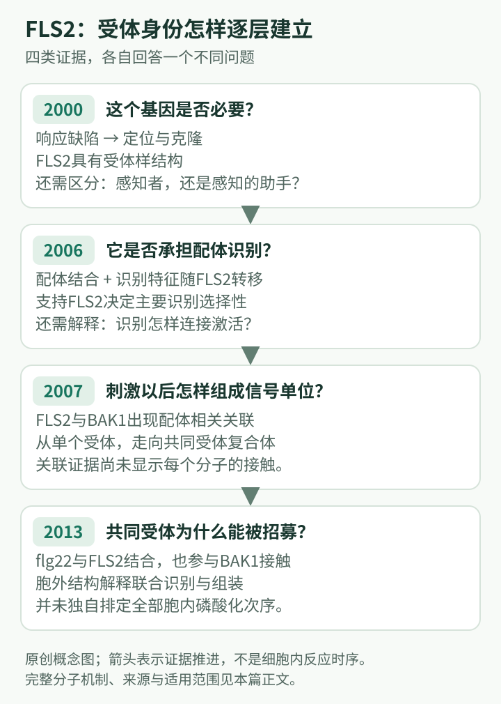

# FLS2研究史：怎样把“植物能感知细菌”变成可检验的受体机制

## 阅读定位与基因身份

**物种与名称**：以拟南芥为主。FLS2指单个受体激酶基因及其蛋白，常译为鞭毛蛋白感知受体2；flg22是细菌鞭毛蛋白中的免疫活性片段，既不是FLS2的别名，也不是植物基因。**核心问题**：植物如何在细胞表面把微生物分子的存在转换成胞内信号？**覆盖范围**：2000—2013年确立受体身份、共同受体与结构机制的关键阶段，联系后续免疫网络认识。

阅读前先区分“识别分子”“传递信号”“产生抗性”三个层次。本文的目标是看清：一个基因从遗传学候选到真正受体，为什么需要不同类型的证据。可先读[第21章蛋白质相互作用技术](../../part7-研究技术与实验逻辑/ch21-蛋白质相互作用研究技术.md)。

## 里程碑时间轴

| 年份 | 关键证据 | 认识发生的变化 |
| --- | --- | --- |
| 2000 | Gómez-Gómez与Boller定位克隆FLS2，发现其编码LRR受体样激酶。[论文](https://doi.org/10.1016/S1097-2765(00)80265-8) | 对鞭毛蛋白不敏感的表型获得了分子入口 |
| 2006 | Chinchilla等提供flg22与FLS2结合及识别特异性转移的证据。[论文](https://doi.org/10.1105/tpc.105.036574) | 从“响应所需组分”推进到“决定识别特异性的受体” |
| 2007 | Chinchilla等发现配体诱导FLS2与BAK1形成复合体。[论文](https://doi.org/10.1038/nature05999) | 受体启动被理解为复合体组装，而非单蛋白自行开关 |
| 2013 | Sun等解析FLS2–flg22–BAK1胞外复合体结构。[论文](https://doi.org/10.1126/science.1243825) | 配体如何同时参与识别与共同受体招募得到空间解释 |

## 第一阶段：先找到“不响应”，再问缺失了什么

在FLS2被克隆之前，植物受到微生物来源分子刺激后会出现生理变化，已经是可观察的现象。问题是，反应来自一个具有选择性的感知装置，还是较一般的细胞受扰？遗传学提供了一种有效切入方式：如果某些植物对同一刺激明显不敏感，而且差异能够稳定遗传，就可能沿着这种差异找到必需组分。

2000年的研究把响应缺陷定位到FLS2。其编码蛋白拥有胞外富含亮氨酸重复区、跨膜区和胞内激酶区。这种结构十分符合“外面接收信息、里面传递信息”的设想。但结构符合并不等于证明：缺失一个负责运输受体的蛋白，也可能导致刺激不敏感。因此，早期结论最牢靠的部分是FLS2对这一响应必需，以及它具备受体样结构（Gómez-Gómez & Boller, 2000）。

对初学者而言，这一阶段最有价值的不是记住2000这个年份，而是理解命名和证据的先后关系。基因名称往往来自最早观察到的表型，后来的分子功能则需要继续验证。FLS2也不是“识别所有细菌的总受体”；它所识别的是特定分子模式，不直接读取微生物的分类学名称。

## 第二阶段：如何证明它承担识别，而非只是帮助识别

2006年研究把两个层面的证据放到一起。一方面，结合和交联相关实验把免疫活性肽与FLS2联系起来；另一方面，拟南芥FLS2在番茄细胞背景中带来了具有拟南芥特征的感知性质。后者特别关键，因为它把“这个蛋白存在”与“识别规则发生变化”联系起来（Chinchilla et al., 2006）。

可以把这篇论文拆成三个推理台阶。第一，观察响应缺失只支持必要性；第二，配体与蛋白发生特异性结合，支持直接承担感知功能；第三，在另一种细胞环境中改变识别特异性，说明FLS2携带决定这一特异性的核心信息。这几类证据相互补足，比任何一张阳性互作图都强。

然而，识别特异性可以随FLS2转移，并不说明FLS2不需要其他蛋白。受体可以决定“接收什么信息”，同时依赖宿主提供下游传递装置。这一区分为下一阶段留下了清楚的问题：识别完成以后，受体如何进入有活性的状态？

## 第三阶段：BAK1使受体成为一个组装过程

2007年的FLS2–BAK1研究改变了受体示意图的画法。BAK1此前已经在生长激素信号中出现；它与FLS2的联系表明，植物能够让不同的识别蛋白使用部分共同的信号组分。尤其有意义的是，二者的关联与配体刺激有关。因此，时间顺序成为机制的一部分：受体复合体在刺激前后具有不同组成（Chinchilla et al., 2007）。

这里不能把Co-IP条带直接翻译成“BAK1就是flg22受体”。Co-IP首先说明同一复合体中的关联；遗传学则说明这种关联对信号具有功能意义。两者合并支持共同受体模型，但它们尚未展示每个分子在空间上怎样接触。有关互作证据的边界，也适用于[BAK1研究史](BAK1.md)和[SOBIR1研究史](SOBIR1.md)。

这项认识还引出一个更一般的问题：共同组分并不意味着所有输出完全一样。不同配体结合蛋白的表达、位置、激活方式和下游联系，都可能使同一共同受体参加不同反应。把BAK1画成公共节点有助于理解网络，却不能把每条通路都简化为完全相同的一条直线。

## 第四阶段：结构解释“识别”与“激活”之间的联系

2013年复合体结构显示，flg22沿FLS2的胞外表面结合，而BAK1还接触被FLS2结合的配体末端。这说明配体不仅被受体捕捉，还参与建立适合共同受体进入的界面。信号由此可以通过分子的联合组装开始，而不必假定FLS2胞外区先发生巨大构象变化（Sun et al., 2013）。

这篇论文值得按“结构提出关系—生化检验关系—细胞功能检验关系”的顺序读。晶体结构让接触成为可见的假说，功能证据才说明相关界面在生物过程中重要。反过来，结构得到的是特定条件下的胞外复合体，并不自动给出完整受体在活细胞膜内的运动、寿命或所有磷酸化事件。最好的历史阅读，是同时记住它填补的空白与它尚未回答的部分。

## 当前认识、旧模型边界与合作归属

如今，FLS2更适合被理解为免疫网络的一个入口：它决定一类外部信息的接收，通过共同受体和胞内激酶联系活性氧、钙信号、转录与其他输出。它的重要性没有因为网络变复杂而减弱；恰恰是这个清楚的入口，使研究者能够分别检验下游分支。早期把模式识别与胞内免疫画成严格隔离两层的图，在教学上有帮助，但不能作为所有生物情境的定律。

不能把全部FLS2历史归于一个课题组。Gómez-Gómez、Boller及合作研究奠定遗传学基础；Chinchilla、Felix及同事推进结合与受体复合体证据；Sun、Li、Macho、Han、Zipfel、周俭民、柴继杰等组成的合作团队完成重要结构解释。遗传材料、生化分析、细胞体系和结构生物学形成的是连续的证据接力。

## 把四个历史阶段读成一条证据链

*原创教学概念图，非实验结构图。各阶段分别对应[Gómez-Gómez与Boller，2000](https://doi.org/10.1016/S1097-2765(00)80265-8)、[Chinchilla等，2006](https://doi.org/10.1105/tpc.105.036574)、[Chinchilla等，2007](https://doi.org/10.1038/nature05999)及[Sun等，2013](https://doi.org/10.1126/science.1243825)；四类证据相互补充。*

初学者可以在纸上画四个框，依次写“响应所需”“结合配体”“刺激后组装”“空间机制”，再把四篇论文放到相应位置。这样便能看见，每一阶段解决的都是上一阶段留下的一个具体缺口。后来的论文不必重新证明全部旧结论，也不能因为机制变得复杂，就把早期遗传学说成错误。

还应在图的末端另加一个“抗病结果”框。快速信号、某个标志基因表达和最后的疾病结局属于不同尺度；一个早期响应变弱，不一定意味着每类病原互作中的抗性都会同幅度下降。组织状态、其他受体和后续信号可以改变结果。这正是FLS2研究由单个受体走向免疫网络的理由。

最后检查箭头的含义。配体“结合”受体、共同受体“参与组装”、激酶“传递信号”和某个基因“影响抗性”，不能都用同一个无说明箭头代替。把动词写清楚，会使一张简单示意图比充满名称却缺少证据层次的复杂图更有学习价值。

## 深读一：2006年研究怎样区别“受体本人”与“受体的助手”

当时最大的悬念并非FLS2是否重要，而是重要在哪里。胞外LRR，即富含亮氨酸重复序列，通常形成弯曲的蛋白支架，适合建立识别界面；胞内激酶区能够把磷酸基团转移到蛋白上，改变信号活动。然而，受体的折叠、定位或复合体稳定性也可能影响配体结合。仅凭某个FLS2变异材料同时失去结合与响应，无法在这些解释中作出选择。

Chinchilla等（2006）首先把“结合位点与FLS2一起被分离”推进到“被配体标记的蛋白就是FLS2”。关键不是普通的蛋白共沉淀，而是将配体接触与蛋白身份鉴定连接起来，并考察在蛋白间非共价关联被破坏后，配体标记是否仍随FLS2出现。这类证据减少了“配体其实结合另一个恰好同行的蛋白”的解释空间。

另一条证据来自物种间的识别差异。番茄和拟南芥都能感知鞭毛蛋白，但它们对相关肽段的识别特征并不完全相同。如果FLS2只是一个通用的信号助手，换入拟南芥FLS2未必会带来拟南芥式的选择性；如果它承载配体识别信息，这种特征就有可能随之改变。原论文观察到后一种结果，因而使“FLS2决定识别规则”的解释远强于单纯的响应恢复。

这里的历史桥梁是：2000年确定了遗传入口，2006年给这个入口赋予了明确的分子工作——辨认配体。后续2007年发现BAK1并不是另起炉灶，而是在保留FLS2选择性的前提下，追问接收信息之后由谁帮助启动信号。对于受体研究，识别特异性与完整激活能力可以分别落在不同分子贡献上。

## 深读二：2007年的复合体与2013年的结构怎样接上

“配体诱导复合体”至少容许两种机制。第一种是配体改变FLS2的整体形状，暴露原来不可接近的蛋白界面；第二种是配体本身成为组装界面的一部分，使BAK1能够识别由FLS2与配体共同形成的表面。这两种模型都可以产生刺激后Co-IP增强的结果，因此仅靠关联变化难以区分。

Sun等（2013）的胞外结构使第二种机制具有直接的空间依据。LRR支架并不是一个只能容纳小分子的封闭口袋；flg22在FLS2的表面形成延展接触，不同区域承担不同识别贡献。BAK1既与FLS2建立接触，也接触FLS2已经结合的配体。这一组织方式使“有受体”与“受体被合适配体占据”成为两种可以区别的状态。

所谓共同受体，因而不是一个在配体识别完成后才完全置身事外的接线头。它可以参与识别单元的最终形成，并把胞外的合适组合与胞内激酶的靠近联系起来。但胞外结构不包含全部胞内事件，不能单凭它排定所有磷酸化的先后顺序。这里发生的是解释范围的准确扩展：从动态关联走到接触关系，再由其他研究补充胞内传递。

这项结构工作还帮助理解为什么“结合得上”与“有效激活”需要分开讨论。能够占据主要受体表面，并不自动意味着能够形成合适的共同受体界面。配体结合、共同受体招募和胞内激酶活动由此成为三个可以连接、也可以分别分析的机制层次。

## 被经典四阶段略去的一步：受体响应何时变成实际防御

[Zipfel等（2004）](https://doi.org/10.1038/nature02485)把FLS2研究从分子响应连接到植物抗细菌疾病。此前的快速活性氧、培养液碱化和生长反应，说明植物感知到了刺激，却不足以说明这种感知在整株植物生活中有什么意义。该研究同时考察防御相关基因表达和疾病结果，将受体输入与防御状态建立联系。

特别值得保留的是空间背景：研究显示FLS2的抗性贡献与细菌进入植物的阶段有关。叶片表面的防御与病原已经进入组织后的环境不是同一个问题；因此，受体缺失的效应不能脱离所观察的感染阶段解释。这里需要学习的是“屏障与组织内防御具有不同条件”，而不是把某个结果简化为FLS2在所有阶段都同等有效。

“转录重编程”指许多基因的表达分配一起改变，而不是单个标志基因被打开。FLS2输入可以动员多种防御相关过程，说明一个保守分子模式能够引起较广泛的生理调整。不过，这种准备状态也不等同于每个细胞都进入细胞死亡，更不意味着植物已经知道了微生物的完整身份。模式识别提供的是一种值得应对的线索。

## 胞内桥梁：FLS2–BAK1怎样联系BIK1

Lu等（2010）将受体样胞质激酶BIK1与FLS2–BAK1复合体联系起来。[原始论文](https://doi.org/10.1073/pnas.0909705107)中的重要进展，是把细胞膜外的识别事件与膜内侧一个可被激活的信号蛋白连接起来。与FLS2相比，BIK1缺少相同的胞外感知结构，主要问题因此不是“它识别哪种外界配体”，而是“它怎样接收受体活动”。

研究支持BIK1的磷酸化变化依赖FLS2与BAK1，并观察到这些激酶之间的相互作用与磷酸化关系。它改变了只有“FLS2→下游反应”一个箭头的示意图：受体启动可以通过多个激酶组成的局部网络进行，既有向胞内的信号传递，也有受体复合体内部的相互调节。体外磷酸化关系不宜直接读成活细胞中唯一、固定的事件次序。

这一步为后来的活性氧和钙信号研究提供了可追踪的中间环节。初学者可以把FLS2、BAK1、BIK1分别暂时理解为主要识别者、共同受体和胞内连接者；这些是主要分工，不是互不接触的岗位。BIK1历史中2026年对旧遗传材料的复核，见[BIK1专篇](BIK1.md)，不应把所有早期整株表型无条件用于证明FLS2下游的普遍规律。

## 受体并非永久留在原位：2006与2011年的另一条历史线

Robatzek、Chinchilla与Boller（2006）观察到功能性FLS2位于细胞膜，并在配体刺激后出现在细胞内移动囊泡中，随后伴随受体降解。这一[细胞生物学研究](https://doi.org/10.1101/gad.366506)使问题从“受体怎样打开”扩展到“被打开之后去哪里”。内吞是膜蛋白及其周围膜结构进入细胞内运输系统的过程，不能简单等同于受体立即失活。

其历史意义在于指出感知装置本身也是动态对象。细胞表面的受体数量、受体所在位置和下游信号强度可以一起变化。因而，对不同时间点观察到的FLS2，不宜默认它们处于完全相同的生物学状态。早期成像结果并未单独解决内吞的所有功能：它可能影响信号持续、运输与最终清除，这些环节需要进一步区分。

Lu等（2011）提供了另一个调节入口：PUB12与PUB13这两种E3泛素连接酶被联系到FLS2的泛素化和周转。[原论文](https://doi.org/10.1126/science.1204903)支持BAK1参与其招募与磷酸化，继而促进FLS2的修饰及受体量下降。泛素是一种可以附着于蛋白的调节标记，E3帮助选择接受标记的对象；它不是所有场景下都只表示同一种命运的标签。

这项工作揭示一个初学者容易忽略的特点：同一受体复合体既参与启动防御，也连接限制响应的过程。植物不必等到产生损伤以后才寻找外部制动装置，制动可以是响应程序本身的一部分。然而，PUB12/13依赖的受体周转与显微镜下的每一次内吞并非已被证明完全一一对应，不能把两篇论文机械拼成单一路线。

## 科学问题演进表：每一层解释新增了什么

| 较早的工作模型 | 随后新增的证据 | 现在适合怎样理解 |
|---|---|---|
| FLS2是鞭毛蛋白响应所需基因 | 结合证据与跨物种识别特征随FLS2改变 | FLS2承担主要配体识别，而不只是一般下游组分 |
| 一个受体结合配体后自行传信号 | 配体诱导FLS2–BAK1关联；胞外复合体结构 | 识别与激活通过联合组装连接，BAK1参与完整识别单元 |
| 受体响应可直接代表最终抗性 | 2004年的防御转录与疾病研究 | FLS2具有生物学防御意义，但贡献取决于阶段和背景 |
| 膜上的受体直接接通全部胞内输出 | BIK1与受体复合体的激酶联系 | 膜内侧存在可进一步分支的信号连接层 |
| 激活后的受体一直留在表面 | 配体相关内吞以及PUB12/13介导的周转 | 位置、数量与寿命也是受体调控的一部分 |

这张表的箭头不代表历史模型全部被废弃。遗传必要性、直接结合和共同受体组装是能够同时成立的不同层次。后来的复杂性并不是把“FLS2是受体”变得含糊，而是使这句话有了更具体的内容：它在一个会组装、传信号并更新自身的系统中承担选择性识别。

## 自测

**1. fls2突变体不响应flg22，为什么仍不能单独证明FLS2直接结合flg22？**

解析：突变可能破坏识别、运输、稳定性或信号传递。直接受体身份需要配体结合及识别特异性等独立证据。必要性是重要起点，但不是完整机制。

**2. 2013年发现BAK1接触受体结合的flg22，是否推翻2006年FLS2决定识别特异性的结论？**

解析：没有。决定主要选择性的受体与协助组装和激活的共同受体可以共同接触配体。后来的结构是在补全识别单元，不能把“单个基因决定关键差异”误解为“整个过程只需一个蛋白”。

**3. 为什么2004年的疾病研究与2006年的配体结合研究不能互相替代？**

解析：前者把FLS2与整株防御意义联系起来，后者说明它怎样承担识别。一个基因可以影响抗性而不直接感知配体；一个蛋白可以结合配体，却尚未证明这种结合在特定疾病环境中有多大作用。FLS2的经典地位来自这些尺度相互补全。

**4. BAK1同时联系信号启动和PUB12/13介导的受体周转，是否自相矛盾？**

解析：不矛盾。防御需要启动，也需要调节强度和持续时间。不同底物、复合体状态及时间阶段可以使同一激酶参与不同环节。将一个蛋白永久贴上“促进”或“抑制”标签，会丢失这种调控结构。

## 原始论文与推荐阅读

- Gómez-Gómez L, Boller T. *FLS2: an LRR receptor-like kinase involved in the perception of the bacterial elicitor flagellin in Arabidopsis.* Molecular Cell, 2000;5:1003–1011. [DOI](https://doi.org/10.1016/S1097-2765(00)80265-8)。必读：遗传学发现。
- Chinchilla D, Bauer Z, Regenass M, Boller T, Felix G. *The Arabidopsis receptor kinase FLS2 binds flg22 and determines the specificity of flagellin perception.* The Plant Cell, 2006;18:465–476. [DOI](https://doi.org/10.1105/tpc.105.036574)。必读：受体身份的证据链。
- Chinchilla D et al. *A flagellin-induced complex of the receptor FLS2 and BAK1 initiates plant defence.* Nature, 2007;448:497–500. [DOI](https://doi.org/10.1038/nature05999)。重要：配体诱导组装。
- Sun Y et al. *Structural basis for flg22-induced activation of the Arabidopsis FLS2–BAK1 immune complex.* Science, 2013;342:624–628. [DOI](https://doi.org/10.1126/science.1243825)。进阶：结构与功能如何互证。

- Zipfel C, Robatzek S, Navarro L, Oakeley EJ, Jones JDG, Felix G, Boller T. *Bacterial disease resistance in Arabidopsis through flagellin perception.* Nature, 2004;428:764–767. [DOI](https://doi.org/10.1038/nature02485)。连接受体研究与疾病防御。
- Robatzek S, Chinchilla D, Boller T. *Ligand-induced endocytosis of the pattern recognition receptor FLS2 in Arabidopsis.* Genes & Development, 2006;20:537–542. [DOI](https://doi.org/10.1101/gad.366506)。受体位置与动态。
- Lu D, Wu S, Gao X, Zhang Y, Shan L, He P. *A receptor-like cytoplasmic kinase, BIK1, associates with a flagellin receptor complex to initiate plant innate immunity.* PNAS, 2010;107:496–501. [DOI](https://doi.org/10.1073/pnas.0909705107)。受体与胞内连接层。
- Lu D, Lin W, Gao X, et al. *Direct ubiquitination of pattern recognition receptor FLS2 attenuates plant innate immunity.* Science, 2011;332:1439–1442. [DOI](https://doi.org/10.1126/science.1204903)。受体周转与信号限制。

<!-- HISTORY READING LINKS -->
## 配套阅读

以下按相关科学问题连接；具体发现归属以正文原始文献为准。

[Thomas Boller](../labs/Boller.md) · [Georg Felix](../labs/Felix.md) · [Cyril Zipfel](../labs/Zipfel.md) · [周俭民 / Jian-Min Zhou](../labs/Zhou-Jianmin.md) · [柴继杰 / Jijie Chai](../labs/Chai-Jijie.md) · [全部课题组](../labs/index.md) · [基因目录](index.md)
