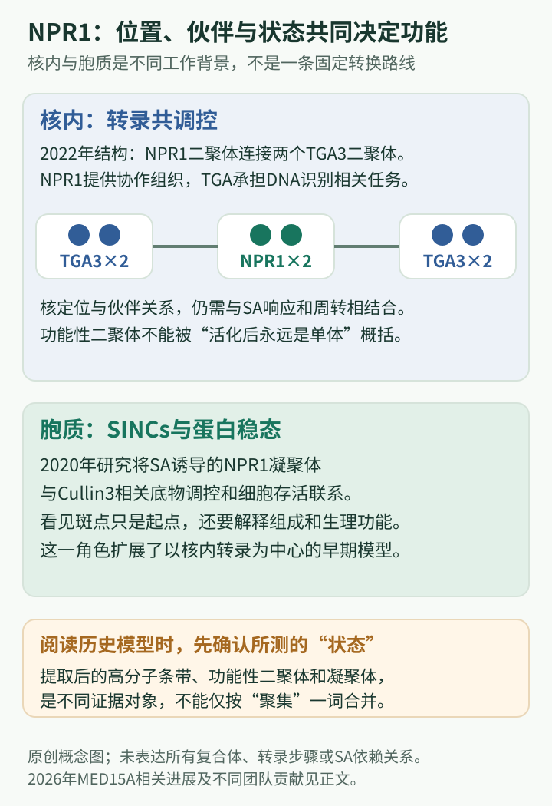

# NPR1研究史：从“不表达防御基因”到水杨酸驱动的转录组装机制

## 阅读定位与基因身份

**物种与名称**：主要讨论拟南芥NONEXPRESSOR OF PATHOGENESIS-RELATED GENES1（NPR1），历史上也称NIM1。NPR3、NPR4是相关但不同的基因；PR1则是常用防御标志基因，绝不是NPR1的简称。**核心问题**：水杨酸这一小分子信号，怎样转化成大量防御基因的协调表达？**覆盖范围**：1994—2026年9月，区分早期模型、后续争议与新结构证据。

本篇学习目标是看清“遗传调控者—转录辅因子—配体感知与组装机制”的递进。需要先理解转录因子能够识别DNA，而转录共调控因子可以通过伙伴协助转录，并不一定自己具有序列特异性DNA结合能力。

## 里程碑时间轴

| 年份 | 关键证据 | 历史意义 |
| --- | --- | --- |
| 1994、1997 | Cao等先鉴定不响应系统抗性诱导信号的突变体，后克隆NPR1。[1994](https://doi.org/10.1105/tpc.6.11.1583)、[1997](https://doi.org/10.1016/S0092-8674(00)81858-9) | 防御表达的遗传控制获得分子身份 |
| 2003 | Mou等提出氧化还原与NPR1寡聚体—单体转换模型。[论文](https://doi.org/10.1016/S0092-8674(03)00429-X) | 提供连接细胞状态与核内功能的经典解释 |
| 2020 | Zavaliev等研究NPR1凝聚体与细胞存活。[论文](https://doi.org/10.1016/j.cell.2020.07.016) | NPR1功能扩展到空间组织与蛋白稳态 |
| 2021 | Ishihama等对活体二硫键寡聚体模型提出实验挑战。[论文](https://doi.org/10.1038/s41467-021-27489-w) | 提取后状态与活体状态必须严格区分 |
| 2022 | Kumar等解析NPR1及其与TGA3的复合体。[论文](https://doi.org/10.1038/s41586-022-04699-w) | 活性二聚体与转录复合体获得结构基础 |
| 2026 | Zhang等解释SA促进NPR1与MED15A结合及转录激活。[论文](https://doi.org/10.1038/s41586-026-11021-5) | 从激素感知推进到转录机器的招募 |

## 第一阶段：从一个沉默的报告系统找到调控节点

系统获得性抗性研究面对的是整株植物的协调变化，很难直接从宏观表型找到关键蛋白。Cao等1994年利用防御相关表达作为入口，鉴定了对相应诱导信号不能正常表达防御基因的npr1材料。这里最初找到的是“表达响应所需的遗传组分”，而不是已经知道作用方式的受体（Cao et al., 1994）。

1997年克隆表明NPR1编码含锚蛋白重复等特征的蛋白。这些结构提示蛋白互作的重要性，也使研究转向它如何与转录调节伙伴合作。NPR1没有因此被证明是一个直接识别所有防御基因启动子的DNA结合因子；相反，它的核心问题逐渐变成“怎样组织和调节其他蛋白”（Cao et al., 1997）。

这两篇论文适合联合拆解。第一篇通过稳定遗传的响应缺陷建立必要性，第二篇给出基因身份并检验功能恢复。报告基因方便观察，但仍需与内源防御表达和抗性联系；基因克隆解决身份，却没有自动解决分子机制。一个重要基因的研究史，往往正是沿着这些不同层次继续前进。

### 从遗传节点到启动子：1999年补上的连接

早期遗传结果留下一个具体缺口：若NPR1不直接识别DNA，它如何让PR1这样的基因作出反应？Zhang等1999年以蛋白伙伴为线索，发现NPR1可以与TGA类bZIP转录因子相互作用；其中的DNA结合实验又将相关伙伴连接到PR1启动子的SA响应元件。bZIP的“碱性区”参与DNA识别，“亮氨酸拉链”有助于蛋白配对，二者与NPR1中的锚蛋白重复承担不同任务。[原始论文](https://doi.org/10.1073/pnas.96.11.6523)

这篇工作的解释力来自把两个原本分离的关系接起来：一边是NPR1与转录因子的蛋白联系，另一边是转录因子与防御基因调控DNA的联系。它支持“由伙伴把NPR1接到特定基因”这一方案，同时没有把所有TGA成员、所有启动子都视为同一种复合体。1997年的蛋白互作结构预测至此获得具体对象，而2022年要解决的，则是这些对象究竟怎样排列。

理解这一桥梁还能避免把SA作用误画成“SA直接打开PR1”。SA是激素，NPR1是感知与共调控枢纽，TGA是能与DNA建立特定联系的因子，PR1是输出之一；四者属于不同层级。许多防御表达改变还有间接层级：一个被调控的转录因子又影响另一批基因。因此，NPR1能改变大量转录本，并不要求它亲自坐在每一个相关基因的启动子上。

## 第二阶段：2003年的红氧模型为什么影响很大

Mou等2003年提出，免疫诱导相关的氧化还原变化影响NPR1聚集状态，从而与其进入细胞核并调节表达相联系。这一模型把小分子信号、细胞状态、蛋白形式和转录输出串成了一条容易理解的因果链，因而长期进入教材与综述（Mou et al., 2003）。

但是，历史影响与当前证据状态必须分开。经典模型常被缩成“静息时二硫键寡聚体，激活后变成单体，单体入核”。这种简图忽略了不同检测体系、蛋白提取过程中氧化反应，以及非共价二聚体和二硫键高聚体并不是同一种结构状态。

2021年Ishihama等利用不同生化证据指出，某些二硫键连接的寡聚状态可能在体外或提取过程中形成，其所测活体条件并不支持简单的寡聚体—单体转换解释。因此，本书把旧模型作为重要历史假说介绍，而不将其写成已无争议的普遍事实（Ishihama et al., 2021）。

这段争议体现一条重要方法论：凝胶上看到的分子量分布，是样品经过处理之后的状态；研究者必须检验它多大程度上保留活体信息。与此同时，也不能从一篇反证论文进一步跳到“氧化还原不影响NPR1的任何功能”。直接结构状态、细胞红氧环境和蛋白稳态是不同命题，需分别评价。

### 读懂2021年的反证对象

Ishihama等研究起于一种影响SA响应的化合物，并不是简单重复旧论文。他们遇到的矛盾是：防御表达受到抑制时，传统分析仍可能显示所谓“单体”增加。若单体增加就是激活的充分解释，两者应当方向一致。研究随后从蛋白中巯基的化学状态及提取后变化重新检验这个矛盾，使“检测过程中产生共价连接”成为必须考虑的解释。

这里的关键不是把一个胶图换成另一个，而是区分三种命题：细胞环境改变、NPR1发生某类共价变化、这种变化决定转录。第一种成立，不能自动保证后两种以经典方式成立。2022年的非共价二聚体结构也不需要否定2021年关于提取后二硫键的发现；它们所检查的分子连接类型不同。当前更稳妥的图景是将红氧调节置于伙伴、构象和蛋白稳态的具体语境，不再让一幅寡聚体解聚图代替所有环节。

## 第三阶段：NPR1不只在细胞核里发挥一种作用

### 2009年的意外：降解为什么有时帮助表达

在“更多活性NPR1带来更强表达”的直觉下，蛋白酶体降解似乎只应关闭信号。Spoel等2009年却发现，核内NPR1的周转有双重功能：平时限制不必要的表达，而激活条件下持续更新NPR1又与充分启动目标基因有关。蛋白酶体是负责选择性蛋白降解的复合体；这里的“周转”同时包含旧分子的移除和功能分子的持续补充，不能只读作总体含量降低。[原始论文](https://doi.org/10.1016/j.cell.2009.03.038)

当时比较的是“稳定积累本身足以提高输出”与“转录需要动态更替”两种解释。蛋白稳定性、核内状态和表达读数之间的不一致，让后一种解释获得支持。它并不意味着任何NPR1降解都促进防御，而是说明同一种蛋白在静息和激活阶段可以受到不同功能约束。这为后来的凝聚体工作提供了桥梁：研究关注的不再只是有没有NPR1，还包括它在哪里、与哪些蛋白共同组织、哪些分子被保留或清除。

Zavaliev等2020年研究NPR1在细胞质中的凝聚体，联系蛋白组织方式、免疫调控组分的处理与细胞存活。它提出的问题与启动子上的共激活作用不同：当免疫可能伤害周围组织时，细胞如何控制反应边界和维持存活（Zavaliev et al., 2020）？

凝聚体不能简单等同于旧模型的二硫键寡聚体。前者描述一定条件下多组分的空间聚集和物理组织，后者描述特定共价连接假说。相似的“聚在一起”语言可能掩盖完全不同的证据与机制。对初学者，这也是为什么需要把显微图像、蛋白状态与功能结果联合阅读。

这一阶段还纠正“促进免疫必然意味着促进细胞死亡”的直观印象。NPR1参与防御表达的同时，也可在特定语境中促进细胞存活。生物学目的并非将所有细胞的反应推到最大，而是组织有效且受约束的防御。

在2020年的模型中，SA诱导的细胞质NPR1凝聚体富集与应激和蛋白处理有关的组分，并与以CUL3为核心的泛素连接系统合作。泛素可作为蛋白命运的标记；NPR1在这里既是受调节对象，也参与组织对其他调控蛋白的处理。作者将EDS1及部分WRKY因子与这一过程联系起来，从而把显微镜下的空间组织连接到细胞能否存活的功能问题。

因此，2009和2020年的工作共同拓宽了“免疫正调控因子”的含义。在细胞核中，NPR1有助于启动防御转录；在另一空间和条件下，它可限制某些促死亡组分的作用。局部死亡与周围存活并非矛盾终点，而是免疫在组织中的不同任务。也应保留凝聚体论文自己的边界：活细胞中具有凝聚体特征的组织，不等于所有纯化体系已经重建了相同的物理过程。

## 第四阶段：结构让共调控因子从名字变成实体

2022年Kumar等解析NPR1及其与TGA3的复合体，显示NPR1二聚体可以组织转录因子伙伴，SA相关构象变化与其共调控功能相联系。研究给出了“为什么NPR1需要这些蛋白互作结构”的具体解释（Kumar et al., 2022）。

这里最重要的修正，是不能把“活性NPR1”继续自动等同于孤立单体。NPR1的二聚体、与TGA形成的较大复合体以及可能的其他聚集状态，要按照各自证据讨论。结构揭示的功能组装与早期非还原凝胶上的高分子带，不是可直接互换的概念。

这篇论文的推理价值在于将结构、生化和遗传功能组合起来。结构显示伙伴相对位置；DNA结合与功能分析检验这种排列是否能帮助转录。只有结构而没有功能，仍可能只是某个稳定构象；只有表达变化而没有结构，则难以解释“共激活”具体发生了什么。

### 深读2022年：为什么二聚体能成为转录的支架

这项工作面对的不是“NPR1是否重要”，而是“一个没有经典DNA结合区的蛋白怎样协调多个DNA结合伙伴”。结构揭示位于二聚体中央的BTB结构域参与同类分子的配对，锚蛋白重复则提供伙伴联系；具有柔性的SA结合区域在激素作用下获得更有序的构象。蛋白结构域可以理解为同一蛋白上承担不同任务的区域，不能把“SA结合区”和“整条蛋白”混作一个刚性开关。

研究中的复合体让一个NPR1二聚体连接两组TGA3二聚体，从而提出更高层次的转录组装体。这里的“增强体”是多个因子共同组织DNA相关调控的概念，不是另一个单独基因。结构解释了伙伴之间的相对安排，DNA结合和植物功能结果则支持这种安排的生物学作用。它让1999年的“互作桥梁”变得可视，也留下一个新问题：转录因子被组织好以后，负责合成RNA的机器怎样被带过来？

## 第五阶段：2026年把SA感知连接到转录机器

2026年9月16日发表的Zhang等研究显示，SA稳定NPR1的相应结合区域，并促进其与Mediator复合体亚基MED15A建立功能联系。这样，受体感知、TGA伙伴与基础转录机器之间的连接更具体了（Zhang et al., 2026）。

这篇新研究应作为当前证据的一次推进，而不是把NPR1史写成“以前都不知道、现在一篇解决全部”。NPR1的遗传必要性、伙伴关系与空间功能已由长期研究建立；新工作重点补足了SA如何改变转录招募。本文核验截至2026年9月19日，不把尚未长期比较的新结果扩大成所有物种、所有NPR成员均已证实的统一机制。

### 深读2026年：从识别激素到接通转录机器

Mediator通常译为介体复合物，是由多个亚基构成的转录协调装置，能把调控因子的状态与RNA聚合酶Ⅱ联系起来。MED15A是其中一个亚基，KIX则是它的蛋白互作区域。Zhang等将NPR1邻近蛋白信息、结构预测、真实结合测量和功能分析接在一起：预测帮助提出候选，后续实验才支持SA依赖的NPR1—MED15A联系。

新模型比“SA先单独激活NPR1，然后NPR1寻找伙伴”更有协同性：SA和MED15A可相互加强它们与NPR1的联系。这提供一种理解长期差异的线索——孤立蛋白在不同测量体系中的配体结合表现，未必等于它在完整功能伙伴中的表现。这里应理解为该研究支持的合作组装解释，不能据此把所有早期测量差异都归给一个原因。[Zhang等2026](https://doi.org/10.1038/s41586-026-11021-5)

同日，Peng、Tian、Ming等发表的独立研究也把MED15A确立为NPR1与介体复合物之间的桥梁，并将SA促进激活与解除NPR3/NPR4相关抑制联系起来。后者涉及不同的调节蛋白和染色质机制，说明植物对同一激素的反应可以同时改变“促进表达”与“抑制表达”的作用。本篇以NPR1为主，因此不把NPR3/NPR4的全部机制并入NPR1，也不把两篇同日工作归为一项发现。[Peng等2026](https://doi.org/10.1038/s41586-026-11123-0)

## 研究问题怎样连续变化

*原创教学概念图，非实验结构图。核内部分依据[Kumar等，2022](https://doi.org/10.1038/s41586-022-04699-w)所示二聚体及TGA3组装，细胞质部分依据[Zavaliev等，2020](https://doi.org/10.1016/j.cell.2020.07.016)的凝聚体研究。图中两种组织方式属于不同空间和问题，不能读成同一蛋白必然依次经历的固定转换，也不把凝聚体等同于二硫键寡聚体。*

| 早期问题或简化解释 | 新增证据 | 当前更准确的理解 |
| --- | --- | --- |
| NPR1可能直接打开PR1 | TGA互作和启动子结合，后来获得复合体结构 | DNA识别、共调控组装和表达输出属于不同任务 |
| 单体增加就代表NPR1被激活 | 2021年化学状态分析与2022年二聚体结构 | 共价寡聚、非共价二聚和功能复合体必须分别讨论 |
| 稳定积累越多，防御一定越强 | 2009年核内周转的双重作用 | 蛋白更新也是转录控制的一部分 |
| NPR1只有核内促表达作用 | 2020年细胞质凝聚体与蛋白稳态证据 | 同一枢纽可在不同空间协调表达和组织存活 |
| TGA组装已经解释转录全过程 | 2026年MED15A桥梁与协同结合 | 激素感知还须与基础转录机器建立功能连接 |

## 当前认识与合作归属

NPR1如今可理解为SA感知与防御转录组织的重要枢纽，还参与蛋白稳态及细胞存活调节。可靠教学应同时讲清哪些结论很稳固、哪些经典图需要修正，以及不同实验观察的是哪一种状态。

早期遗传与多数长期机制工作包含Cao、Dong（董欣年）、Glazebrook等贡献；2020与2022年的研究汇集Zavaliev、Kumar、Wu、Dong及结构生物学合作团队。2021年的模型检验来自Ishihama及合作研究者；2026年的MED15A结构研究由Zhang、Gish、Li、Zheng（郑宁）等推进。NPR1研究史既有同一团队持续追问，也有独立团队对模型的检验与扩展。

## 初学者怎样阅读相互修正的模型

建议先给每项结果加上对象标签：测的是细胞内NPR1、提取后的蛋白、纯化复合体，还是特定转录输出？再注明它讨论共价连接、非共价组装或凝聚状态中的哪一种。名称都叫“多聚”并不代表同一物理现象，研究条件不同也不能直接作一对一比较。

模型修正不是把旧论文从历史中删掉。2003年的工作提出可检验的氧化还原框架，后来的研究则重新审查其中具体的化学和结构环节。读者应保留仍被支持的生理联系，同时放下已不足以充当统一解释的结构假设。这种分层更新，比将某个年代的模式图当成永远正确的答案更接近科学研究。

2026年Peng、Tian、Ming、Sun、Li、Zhang等的共同贡献也应与Zhang、Gish、Li、Zheng等团队并列记录。前者含张跃林、李昕及合作研究者，后者包含郑宁等结构研究团队；作者同姓不能作为判断同一课题组的依据。贯穿这段历史的连续性来自共享科学问题，而不是某个团队包办全部层级。

## 自测

**1. 为什么“PR1不表达”不能直接翻译为“NPR1不结合PR1启动子”？**

解析：表达是终点，NPR1主要通过共调控伙伴组织转录。缺失可以影响多个步骤，直接DNA结合需要独立证据，且PR1与NPR1是不同基因。

**2. 2022年看到活性NPR1二聚体，为什么不能与旧模型中的高分子寡聚带简单对立或等同？**

解析：它们涉及非共价结构组装与二硫键状态等不同概念，所用体系也不同。必须先确定测量对象，才能讨论模型支持或修正。

**3. 为什么NPR1降解加快不一定意味着目标基因表达下降？**

解析：静息时清除NPR1有助于限制背景表达，激活后的核内转录又可能需要功能复合体持续更新。总量、周转速率和启动子上的有效组装不是同一变量，必须结合阶段解释。

**4. TGA与MED15A在NPR1机制中分别解决什么问题？**

解析：TGA提供与特定调控DNA相联系的转录因子伙伴；MED15A把SA结合的NPR1连接到介体复合物及转录机器。前者帮助解释目标基因的组织，后者补足如何推动RNA合成的联系，两者不能互相替代。

## 原始论文与推荐阅读

- Cao H, Bowling SA, Gordon AS, Dong X. *Characterization of an Arabidopsis mutant that is nonresponsive to inducers of systemic acquired resistance.* The Plant Cell, 1994;6:1583–1592. [DOI](https://doi.org/10.1105/tpc.6.11.1583)。
- Cao H et al. *The Arabidopsis NPR1 gene that controls systemic acquired resistance encodes a novel protein containing ankyrin repeats.* Cell, 1997;88:57–63. [DOI](https://doi.org/10.1016/S0092-8674(00)81858-9)。
- Ishihama N et al. *Oxicam-type non-steroidal anti-inflammatory drugs inhibit NPR1-mediated salicylic acid pathway.* Nature Communications, 2021;12:7303. [DOI](https://doi.org/10.1038/s41467-021-27489-w)。
- Kumar S et al. *Structural basis of NPR1 in activating plant immunity.* Nature, 2022;605:561–566. [DOI](https://doi.org/10.1038/s41586-022-04699-w)。
- Mou Z, Fan W, Dong X. *Inducers of plant systemic acquired resistance regulate NPR1 function through redox changes.* Cell, 2003;113:935–944. [DOI](https://doi.org/10.1016/S0092-8674(03)00429-X)。
- Zavaliev R et al. *Formation of NPR1 condensates promotes cell survival during the plant immune response.* Cell, 2020;182:1093–1108.e18. [DOI](https://doi.org/10.1016/j.cell.2020.07.016)。
- Zhang S, Gish M, Li H et al. *Transcriptional activation of plant immunity by salicylic acid.* Nature, 2026，9月16日在线发表. [DOI](https://doi.org/10.1038/s41586-026-11021-5)。

- Zhang Y, Fan W, Kinkema M, Li X, Dong X. *Interaction of NPR1 with basic leucine zipper protein transcription factors that bind sequences required for salicylic acid induction of the PR-1 gene.* PNAS, 1999;96:6523–6528. [DOI](https://doi.org/10.1073/pnas.96.11.6523)。
- Spoel SH, Mou Z, Tada Y, Spivey NW, Genschik P, Dong X. *Proteasome-mediated turnover of the transcription coactivator NPR1 plays dual roles in regulating plant immunity.* Cell, 2009;137:860–872. [DOI](https://doi.org/10.1016/j.cell.2009.03.038)。
- Peng Y, Tian H, Ming Z et al. *Mechanisms of Transcriptional Regulation by Salicylic Acid Receptors.* Nature, 2026，9月16日在线发表. [DOI](https://doi.org/10.1038/s41586-026-11123-0)。

<!-- HISTORY READING LINKS -->
## 配套阅读

以下按相关科学问题连接；具体发现归属以正文原始文献为准。

[董欣年 / Xinnian Dong](../labs/Dong-Xinnian.md) · [李昕 / Xin Li](../labs/Li-Xin.md) · [张跃林 / Yuelin Zhang](../labs/Zhang-Yuelin.md) · [全部课题组](../labs/index.md) · [基因目录](index.md)
