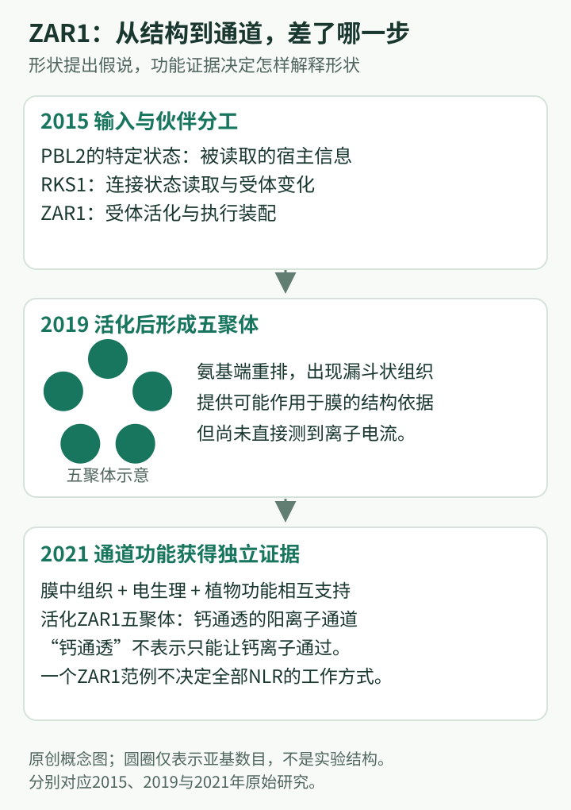

# ZAR1研究史：从遗传识别到抗病小体，再到离子通道

## 一个受体带来的三次问题转换

ZAR1即HOPZ-ACTIVATED RESISTANCE 1，是拟南芥的CNL型胞内免疫受体。它最初因特定抗性反应被识别，后来成为解析植物抗病小体的经典系统。本篇聚焦从2010年遗传鉴定到2021年通道证据的连续过程；这不是ZAR1全部文献的目录，而是一条“为什么下一项研究变得必要”的路线。

学习时先分开三个问题：**怎样感知变化，怎样组装活化，活化后具体做什么。**2019年的结构突破主要解决第二问，并为第三问提供线索；2021年的电生理与细胞证据才使第三问得到更直接解释。把两年合并成一句“2019年发现钙通道”，会丢失最值得学习的研究逻辑。

## 先修：一个ZAR1分子内部也存在分工

NLR是核苷酸结合与富亮氨酸重复受体的总称；ZAR1属于带卷曲螺旋结构域的CNL。这里的三个名称不是三个独立蛋白：氨基端的CC区参与活化装配和膜功能，中部核苷酸结合相关区域参与状态切换，羧基端LRR区参与维持静息构象并连接伙伴。识别并不必然发生在名字最像“受体”的LRR表面，更不能由LRR存在就推断它直接抓住微生物分子。

核苷酸在这条历史中具有调节意义。ADP结合状态与受体静息相关；适当核苷酸状态使活化构象与寡聚装配成为可能。它不是一个消耗越多ATP就越强的普通能量模型。变构调节指某处结合或结构变化，经由蛋白内部的耦合影响另一处；因此，信息可以从RKS1传到ZAR1内部，而无需被识别的宿主蛋白直接接触ZAR1的每个功能区。

另一个先修是“膜电流”与“细胞死亡”的区别。电流记录跨膜带电粒子的运动，胞内钙变化记录信号状态，死亡反映细胞最终命运。把它们排在同一模型中，需要证明彼此关系；仅看见死亡，不能倒推出具体通道存在，也不能判断通道允许哪些离子通过。

## 关键年表

| 年份 | 核心转折 | 原始论文 |
|---|---|---|
| 2010 | ZAR1成为可遗传追踪的抗性受体 | [Lewis等](https://doi.org/10.1371/journal.pgen.1000894) |
| 2013 | ZED1假激酶把最初的识别背景与ZAR1相连 | [Lewis等](https://doi.org/10.1073/pnas.1315520110) |
| 2015 | 宿主改变经PBL2、RKS1连接到ZAR1 | [Wang等](https://doi.org/10.1016/j.chom.2015.08.004) |
| 2019 | 静息与中间状态解释变构激活 | [Wang等](https://doi.org/10.1126/science.aav5868) |
| 2019 | 五聚体抗病小体被重构和解析 | [Wang等](https://doi.org/10.1126/science.aav5870) |
| 2021 | 可通透钙的阳离子通道功能获得直接证据 | [Bi等](https://doi.org/10.1016/j.cell.2021.05.003) |

## 第一阶段：先知道需要它，再问它认识什么

2010年Lewis、Wu、Guttman与Desveaux等把特定抗性反应与ZAR1联系起来。这个阶段的价值在于建立可重复的遗传依赖：缺少哪个植物组分，相关反应就不能正常完成。这样的发现为后续生化研究提供起点，但并没有自动说明ZAR1直接接触哪一种分子（Lewis等，2010）。

受体名称记录了最初发现情境，并不规定它只能参与这一个情境。后来围绕不同宿主伙伴的研究逐步表明，ZAR1具有借助关联蛋白读取宿主改变的能力。因此不宜从名称中的HOPZ反推它只有一个固定识别对象，更不能将不同背景中的伙伴混成一个永远同时存在的复合体。

对初学者来说，这是“遗传身份”和“分子配体”之间的区别：前者告诉我们系统需要谁，后者才解释信息如何进入系统。一个受体的克隆通常只是机制研究的开始。

2013年Lewis、Lee、Hassan等进一步鉴定ZED1对最初HopZ1a相关ZAR1反应的重要性。ZED1是一个假激酶，其发现把受体外围的宿主伙伴正式带入模型。2015年深入解析的RKS1—PBL2关系属于另一识别背景，不能把ZED1、RKS1和PBL2画成任何时候都同时工作的固定装配线。两条路线共同提出的是一个更一般的问题：同一个NLR是否能够借助不同的激酶样伙伴读取不同宿主异常？这比“一个受体只能对应一种输入”更能容纳后续发现（Lewis等，2013）。

## 第二阶段：PBL2与RKS1使识别模型能够被拆解

2015年Wang等将宿主蛋白PBL2的状态改变、假激酶RKS1及ZAR1联系起来。其意义是把间接识别变成一组可分析的宿主分子关系，而不再停留于“受体感知某种扰动”的笼统描述（Wang等，2015）。

RKS1称为假激酶，指它保留激酶样结构却不应被直接假定具有典型催化功能。“假”不意味着无用；失去或弱化催化能力的蛋白，仍可凭借结合与构象变化承担重要调控任务。PBL2、RKS1与ZAR1在该系统中提供不同层次的信息处理能力。

这里最值得记住的是识别单位发生了扩展。单个ZAR1的名称不足以解释全部特异性，相关宿主伙伴共同决定信息怎样传入。与此同时，“诱饵”一词包含对正常生理作用和演化来源的判断，应按具体证据使用，不能把所有被监视蛋白都叫无功能诱饵。

## 第三阶段：2019年为什么需要两篇结构论文

一个活化结构能展示最后的形状，却无法独自解释如何到达那里。2019年第一条结构主线比较ZAR1相关静息与中间状态，解释宿主信号如何经RKS1改变ZAR1核苷酸结合区域。由此，遗传学中的“依赖关系”被转写为能够讨论的变构过程，即一个区域的变化影响另一区域（Wang等，2019a）。

同年的另一篇研究重构并解析了五聚体抗病小体。多个ZAR1分子不只是随意聚在一起，而是形成有特定组织方式的环状组装；氨基端区域重新排列，产生与膜作用有关的结构。这为受体如何从识别走向执行提供了很强的线索（Wang等，2019b）。

“抗病小体”不是一个基因，也不是显微镜下所有亮点的统称。它描述有组织的免疫活化复合体。看到五聚体还不能直接推断所有NLR都形成五聚体；不同类别的NLR可能有不同组装数目、伙伴和生化功能。

这两篇论文分别回答“为什么能够启动”和“启动后装成什么”。将静息、中间和活化状态放在一起，比只展示一张漂亮结构更能解释分子过程。但是它们仍是由实验捕获的状态，不是逐帧录下的天然细胞内电影，状态之间的连接需要功能证据共同支持。

## 第四阶段：2021年把结构猜想变成通道功能

2019年的氨基端构型自然引出一个问题：它是否能形成离子通路？2021年Bi等结合单分子成像、异源体系电生理、膜相关分析和植物功能读出，支持ZAR1抗病小体具有可通透钙离子的阳离子通道活性（Bi等，2021）。

这一跨越重要在于，受体不再只被看作招募下游蛋白的开关，它本身形成的组装就能改变细胞内离子状态。钙离子作为信号，可连接后续多种反应；但不能因此把整个免疫过程简化成“膜被破坏所以细胞死亡”。受调控的导通、细胞信号和最终细胞命运仍是应区分的层级。

也要正确理解“钙通透”。它强调钙可以通过及其信号意义，并非声称ZAR1是只运输钙的高度专一通道。更不能由离子流直接推导所有抗病效应都只通过一个下游过程产生。通道性质与组织层面的抗性之间仍存在需要研究的距离。

## 拆解2019—2021年的证据阶梯

可以把研究看成五层：遗传学确认必要组分；生化重构检验哪些成分可以形成活化系统；结构解释可能的接触与构象变化；电生理判断是否真正导通；植物读出检验这些性质与免疫是否相关。每一层都为另一层提供约束。

例如，结构中出现孔样区域只是功能假说；若没有导通证据，也可能只是组装产生的几何空隙。相反，异源细胞中出现电流但缺少受体组装、定位及植物功能联系，也不足以解释天然免疫。经典论文的力量来自把这些可能各自误导的证据连接起来。

课堂上可尝试做一个思想练习：假如只能保留结构图，哪些结论必须降为假说？答案应包括离子选择性、膜中工作状态和生理输出。这个练习能够帮助读者理解技术进步如何改变可回答的问题，而不是只记住一串高影响力论文年份。

## 未解问题与不能外推的结论

ZAR1为CNL机制提供了非常清楚的样本，但TIR型NLR可以通过酶活性产生信号，再使用[EDS1及辅助NLR系统](EDS1-PAD4-SAG101.md)。因此“所有抗病小体都是同一种钙通道”并不正确。即使在CNL中，也应检查具体受体是否具有直接的结构和功能证据。

未来的概念问题包括：不同组织如何限制活化强度，通道何时关闭或清除，受体与膜环境怎样协同，以及局部细胞反应怎样帮助整株植物。这些问题需要动态、定量和组织背景的信息，不能仅靠更高分辨率的静态结构解决。

## 里程碑深读一：2015年如何把“异常”落实到特定宿主状态

当时未知的不是植物会不会产生抗性，而是ZAR1为何能将一个微生物活动转换为特异识别。至少有三种解释：ZAR1直接识别外来蛋白；它识别细胞整体受损的后果；或者它通过一个有限的宿主伙伴组合读取特定分子变化。2015年工作把PBL2、RKS1和ZAR1放到同一组功能与关联分析中，使第三种解释得到支持。

这里的PBL2是一种受体样胞质激酶；在该识别系统中，关键输入是其被修饰的状态，而不是单纯“细胞里有PBL2”。RKS1提供连接已改变PBL2与ZAR1的伙伴关系，ZAR1则承担后续免疫活化。以信息流描述，PBL2呈现被监测状态，RKS1帮助读取该状态，ZAR1执行受体层面的转换；这三者不能用“共同参与免疫”六个字抹平。

论文中遗传依赖限定哪些植物组分必需，蛋白状态与结合关系限定识别输入，防御表型则连接到系统输出。这一组合排除了“只要出现广泛细胞损害就足够解释特异反应”的简单模型，也使“每次都必须由ZAR1直接结合外来蛋白”不再是必要假设。它并未仅凭互作结果证明全部构象变化，具体怎样将状态传到核苷酸区域，仍是留给2019年结构研究的问题（Wang等，2015）。

“诱饵底物”是这篇论文的重要概念：被识别的PBL2状态可为免疫提供线索，而不必将PBL2等同于微生物活动所有生理效应的唯一来源。因此必须把三种对象分开：最初产生改变的微生物因子、携带改变的宿主分子、最终建立防御的免疫装置。初学者常把这三层压成“ZAR1的配体”，会使真正的发现消失。

## 里程碑深读二：2019年的两个状态比较解决了什么

如果只知道PBL2状态、RKS1及ZAR1相关，仍可设想RKS1只是把它们拉到一起，或者它参与真正的构象调节。2019a研究将静息ZAR1—RKS1与结合改变状态PBL2后的中间复合体对照。结构显示，对PBL2相应状态的读取由RKS1承担，并通过RKS1的构象变化影响ZAR1的ADP结合环境。这支持“结合事件经伙伴传入受体内部”的变构解释，而不是一个仅负责邻近的被动支架。

这一步还说明，配体结合与完整活化不是同义词。中间状态已经不等于静息状态，却尚不能被视为最终五聚体。若画图只用“关闭”“打开”两个方框，就会漏掉预激活阶段：受体先解除某些约束，再在适当核苷酸状态下进入寡聚装配。论文题名中的“primes”正强调准备过程，并非宣称检测到输入的瞬间所有下游事件已经完成。

2019b随即把问题推进到活化复合体。作者不仅分析中部核苷酸相关区域，还看到CC区重新组织，并参与五聚体相互接触；最氨基端的两亲性螺旋形成漏斗状结构。两亲性意指同一螺旋的不同表面对水与脂质环境具有不同亲和特征，这使膜作用成为可检验的解释。与此同时，功能分析把相关结构组织与质膜关联、细胞死亡及抗性联系起来。

因此这两篇论文共同排除了“活化只是一个单体局部抖动，最后仍不改变装配状态”的简单图景。它们却没有直接测出离子电流，也没有从几何形状给出离子选择性。中间态比较负责解释信息转换，活化态结构负责解释装配与候选执行部位；真正的生化输出仍需另一类证据。这种分工说明，结构论文的强结论和未回答问题可以同样明确（Wang等，2019a、2019b）。

## 里程碑深读三：2021年怎样区分通道与间接激活其他通道

到2021年，仍有几个竞争解释：ZAR1自身形成离子通路；它只是一座平台，招募植物原有通道；或者观察到的离子变化来自细胞已经受损。最后一种解释尤其重要，因为细胞死亡后膜屏障改变，也可能让离子进入，却不能证明离子流是免疫启动环节。

Bi等首先用单分子成像将活化ZAR1的五聚体组织联系到质膜，缩短了体外结构与细胞位置之间的距离。随后，电生理显示其具有阳离子通道行为；在人工脂质双层中的预组装复合体仍能导通，为“必须借助植物原有通道才有电流”的解释设置了直接限制。这不是单靠观察植物胞内钙升高就能得到的结论。

植物细胞中的钙进入、活性氧和后续细胞变化，则用于判断通道模型能否接回免疫背景。不同类型证据关注的对象并不相同：成像回答在哪里以及怎样聚集，电生理回答是否导通及离子性质，植物分析回答该性质是否与生理反应相关。它们组合后支持ZAR1抗病小体既是受体活化产物，也是执行离子信号的装置（Bi等，2021）。

要特别留意“钙通透、阳离子选择性”的措辞。阳离子选择性指它相对偏好带正电离子；钙通透说明钙是能够通过的重要离子，而不是宣布其他阳离子绝对无法通过。后续钙依赖过程也不等于已经知道全部抗病机制。局部钙升高如何被不同解码蛋白读取、何时转向死亡、怎样与转录程序相接，仍属于更下游的问题。

*原创概念示意，非实验结构图。依据Wang等2015、2019a、2019b及Bi等2021原始研究；2019年结构模型与2021年通道功能证据分别建立，见本篇对应深读与文献。*

## 旧模型怎样被逐步改写

| 当时可接受但不完整的解释 | 改变解释的具体证据 | 本篇采用的限定解释 |
|---|---|---|
| 找到ZAR1就等于找到全部识别单位 | ZED1及RKS1—PBL2等宿主伙伴具有背景相关的功能 | 特异输入由ZAR1及相应伙伴共同组织；不同伙伴组合不应混成一个固定复合体 |
| RKS1只负责把蛋白拉到一起 | 2019a中间态显示伙伴变化影响ZAR1核苷酸结合环境 | RKS1参与变构耦合；结合输入与最终五聚体装配仍是不同阶段 |
| NLR活化后只是招募下游组分 | 2019b显示活化五聚体及氨基端重排 | ZAR1自身形成有组织的执行候选装置，但结构当时尚未证明导通 |
| 漏斗形状足以证明钙通道 | 2021年膜中装配、电生理与植物细胞证据相接 | ZAR1抗病小体具有钙通透阳离子通道功能，结论依赖跨体系证据 |
| 一个CNL解释了所有抗病小体 | 不同NLR类别具有不同结构和信号化学 | ZAR1是经过深入验证的机制范例，不是所有TNL、辅助NLR或植物物种的统一模板 |

这张表也显示一个容易被忽略的历史事实：后来论文不总是否定以前的结果，很多时候是在改变原结果能够解释的范围。2019年并没有否定2015年的宿主状态模型，而是解释它如何传入受体；2021年也没有否定2019年的结构，而是决定该结构应被赋予什么功能意义。

## 合作贡献沿研究链分布

Lewis、Wu、Guttman、Desveaux等提供早期遗传入口；2015年Wang、Roux、Feng等与Zhou、Noël等合作，将宿主状态识别具体化；2019年Wang、Hu等与Chai、Zhou、Wang Hong-Wei等合作连接结构与功能；2021年Bi、Su、Li等及多个团队进一步建立通道解释。研究史应保留这些连续又互补的贡献，不能将“发现ZAR1”“解析抗病小体”和“证明通道活性”合并归为一个人或一年。

## 怎样把这条历史写成自己的知识卡

建议使用“旧问题—新增证据—仍未回答”三列，而不是只按年份抄论文标题。2010年确认遗传入口后，直接识别仍未知；2015年确定宿主伙伴后，活化组装仍未知；2019年获得结构后，导通性质仍需检验；2021年建立通道解释后，组织尺度调控仍有空间。

这样的卡片能让初学者看见科学工作的连续性。一篇里程碑论文往往不是把整个领域的问题关上，而是把一个模糊问题变成几个更加精确的问题。结构、生化与遗传学各自改变了问题的可检验程度，也因此需要长期协作。

## 自测

**1. 2019年看到漏斗状结构，为什么还需要2021年的研究？**

因为形状只能提出孔道假说；实际离子导通、钙通透性及其免疫意义，需要电生理、细胞定位和功能证据。

**2. ZAR1形成五聚体，是否说明所有NLR都形成五聚体？**

不是。不同NLR的结构、激活方式和生化作用不同。ZAR1是经过详细验证的案例，推广要有新证据。

**3. 在ZAR1—RKS1—PBL2系统中，为什么不能把PBL2、RKS1都称为同一种共受体？**

因为它们的信息角色不同：PBL2的特定状态构成被读取的输入，RKS1读取并传递相关变化，ZAR1完成受体活化与执行装配。三者都有功能必要性，不代表它们从事相同工作。

**4. 如果只观察到活化ZAR1后植物胞内钙升高，能否排除它间接激活其他通道？**

不能。胞内钙升高也可能由其他通道或后续损害造成。预组装复合体在人工脂膜中的导通证据，有助于把通道功能归到ZAR1装置本身；植物证据再说明其生理关联。

## 原始论文

1. Lewis JD, Wu R, Guttman DS, Desveaux D. *Allele-specific virulence attenuation of the Pseudomonas syringae HopZ1a type III effector via the Arabidopsis ZAR1 resistance protein.* PLoS Genetics, 2010. [DOI](https://doi.org/10.1371/journal.pgen.1000894)。
2. Wang G, Roux B, Feng F, et al. *The Decoy Substrate of a Pathogen Effector and a Pseudokinase Specify Pathogen-Induced Modified-Self Recognition and Immunity in Plants.* Cell Host & Microbe, 2015. [DOI](https://doi.org/10.1016/j.chom.2015.08.004)。
3. Wang J, Wang J, Hu M, et al. *Ligand-triggered allosteric ADP release primes a plant NLR complex.* Science, 2019a. [DOI](https://doi.org/10.1126/science.aav5868)。
4. Wang J, Hu M, Wang J, et al. *Reconstitution and structure of a plant NLR resistosome conferring immunity.* Science, 2019b. [DOI](https://doi.org/10.1126/science.aav5870)。
5. Bi G, Su M, Li N, et al. *The ZAR1 resistosome is a calcium-permeable channel triggering plant immune signaling.* Cell, 2021. [DOI](https://doi.org/10.1016/j.cell.2021.05.003)。
6. Lewis JD, Lee AHY, Hassan JA, et al. *The Arabidopsis ZED1 pseudokinase is required for ZAR1-mediated immunity induced by the Pseudomonas syringae type III effector HopZ1a.* PNAS, 2013. [DOI](https://doi.org/10.1073/pnas.1315520110)。

<!-- HISTORY READING LINKS -->
## 配套阅读

以下按相关科学问题连接；具体发现归属以正文原始文献为准。

[周俭民 / Jian-Min Zhou](../labs/Zhou-Jianmin.md) · [柴继杰 / Jijie Chai](../labs/Chai-Jijie.md) · [全部课题组](../labs/index.md) · [基因目录](index.md)
