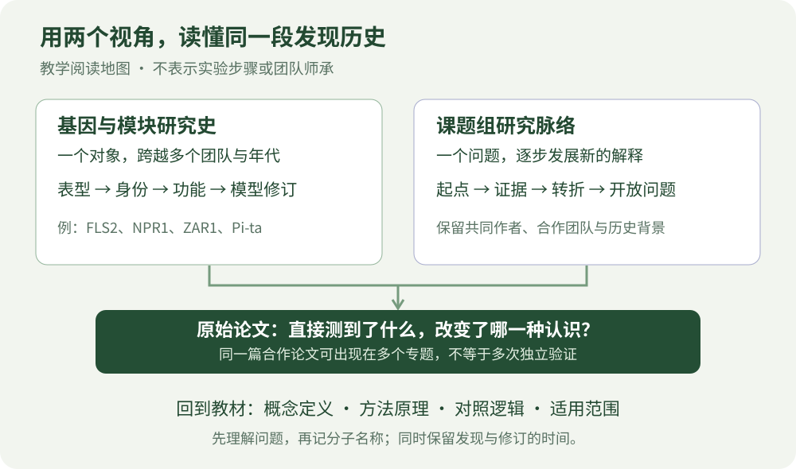

# 植物免疫研究史：从发现一个现象，到改变一种解释

为什么FLS2被称为受体，而一个与免疫有关的蛋白却不能直接这样命名？为什么NPR1研究几十年仍在更新？为什么同一个抗性位点的分子解释会被后来研究修正？这些问题需要把结论放回发现过程，才能真正理解。

本系列与24章教材并行，包含 **32篇经典基因或功能模块研究史**、**28篇课题组研究脉络**。前者以研究对象为线索，跨团队追踪证据；后者以持续的科学问题为线索，说明一个研究方向如何从遗传学走向分子机制、结构或生态。模块篇覆盖多个相关基因，因此“32篇”不等于只有32个基因。

## 两个系列怎样选择

| 你的问题 | 阅读入口 | 能获得什么 |
|---|---|---|
| 我想把一个经典分子真正读懂 | [经典基因研究史：32篇](genes/index.md) | 身份、命名、关键发现、模型修订、代表论文与自测 |
| 我想理解一个团队怎样形成研究主线 | [课题组研究脉络：28篇](labs/index.md) | 问题起点、阶段转折、证据演变、合作贡献与边界 |
| 我想先建立年代感 | [跨主题发现年表](timeline.md) | 把不同分支的关键节点放在同一时间轴上 |
| 我担心把历史模型当成今天的定论 | [资料、署名与判断方法](sources-and-attribution.md) | 区分发现层次，核对论文，识别过度归属与模型变化 |

## 入门先读这六组配对

不必按字母顺序读完所有分子。每次选一组，先读基因史，再读团队脉络，最后回到一篇原始论文。基因史回答“这个结论怎样形成”，团队史回答“这类问题怎样延伸”。

| 顺序 | 基因或模块 | 配套团队 | 这一组要学会的问题 |
|---|---|---|---|
| 1 | [FLS2](genes/FLS2.md) | [Boller](labs/Boller.md)、[Felix](labs/Felix.md)、[Zipfel](labs/Zipfel.md) | 从对一种刺激不响应，到证明受体身份，中间需要什么证据？ |
| 2 | [RIN4](genes/RIN4.md) | [Dangl](labs/Dangl.md) | 植物为什么可以通过宿主蛋白状态感知异常？ |
| 3 | [ZAR1](genes/ZAR1.md) | [周俭民](labs/Zhou-Jianmin.md)、[柴继杰](labs/Chai-Jijie.md) | 静态结构与通道功能分别解决了什么？ |
| 4 | [NPR1](genes/NPR1.md) | [董欣年](labs/Dong-Xinnian.md) | 遗传调控因子怎样逐步获得转录与结构解释？ |
| 5 | [MLO](genes/MLO.md) | [Schulze-Lefert](labs/Schulze-Lefert.md) | 为什么失去一种宿主功能，也可能形成抗性？ |
| 6 | [Pi-ta](genes/Pi-ta.md) | 对照该篇2000、2018与2024年原始文献 | 当新证据挑战经典模型时，怎样重新判断分子身份？ |

没有相关背景时，先读[细胞与分子基础](../learning/ch00-细胞与分子基础.md)；看不懂结合、定位或遗传证据时，转到[研究技术篇](../part7-研究技术与实验逻辑/ch21-蛋白质相互作用研究技术.md)。这两个系列以公开研究的概念、证据和认识变化为主，不承担实验操作手册的功能。

## 一篇研究史应当怎样做笔记

用下面六句话写一页阅读记录，比抄录整张通路图更有帮助。

1. **问题起点：**当时研究者能观察到什么，还不能解释什么？
2. **候选解释：**至少有哪两种模型可能解释同一现象？
3. **新增证据：**关键论文真正测到了什么，排除了哪一种解释？
4. **认识变化：**它确定了身份、建立了关联、支持了必要性，还是解释了直接机制？
5. **后续修订：**哪些结论保留下来，哪些连接、名称或适用范围发生改变？
6. **贡献归属：**哪些作者与团队共同完成了这个节点，哪些只是后来的综述整理？

同一篇原始论文可以出现在多个研究史中。重复出现往往反映合作和问题交叉，不应计作多个独立重复验证。阅读时，可为论文建立一张卡片，再给它添加不同主题标签。

## 本批次的覆盖范围

基因系列覆盖细胞表面受体、早期信号、NLR与辅助网络、激素和系统免疫、作物经典抗性及易感性。团队系列兼顾国际与中国研究者，按方向组织，不以国籍、期刊数量或引用次数排序。每个页面选择能解释问题演变的代表工作，并明确重点年代。

这是一份较广的教学选编，不能代表全球全部植物免疫团队，也不能把一个团队的数十年工作压缩成完整传记。未独立成篇的研究者仍可能在原始论文和合作说明中占有关键位置。全书通用核验日期为 **2026年9月19日**；各篇叙述的历史终点有所不同，近期更新以明确引用的论文为准。

[进入经典基因研究史](genes/index.md) · [进入课题组研究脉络](labs/index.md)
