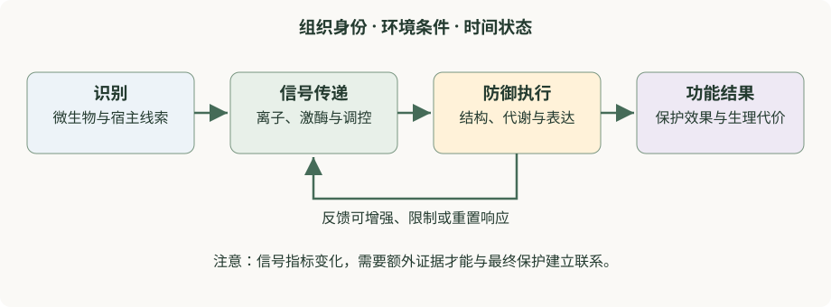

# 第 0 章　读懂植物免疫之前：细胞、分子与证据

植物看起来没有专门的免疫器官，却能在细胞表面感知微生物，在细胞内部发现异常，把局部信息传给其他组织，并调整生长和代谢。理解这些现象，不必先记住几十个基因名。更有效的起点是弄清：信号在哪里出现，什么分子能够接收它，接收之后发生什么，以及研究者怎样知道这些事情。

本章为缺少植物学或分子生物学基础的读者准备。读完后，你应能用一张植物细胞图定位主要免疫事件，区分基因、RNA 与蛋白质，解释受体、激酶和转录因子的不同作用，并判断一条实验结果究竟支持多强的结论。已经熟悉这些知识的读者，可以先做章末自测，再进入[第 1 章](../part1-免疫骨架/ch01-植物免疫全景.md)。

## 0.1 先明确“免疫”要解决什么问题

植物免疫是植物感知与感染相关的分子或自身异常，并组织防御反应的能力。它与覆盖植物表面的保护结构、组织更新、营养状态共同影响疾病结局。观察到一株植物没有发病，不能立刻断言它激活了更强免疫：它可能没有接触到病原，也可能所处环境不利于疾病发生。

植物病理学常用“疾病三角”描述感病宿主、具有致病能力的病原与适宜环境的共同作用。时间则影响这些因素如何相遇。这个模型的价值在于提醒我们：疾病是一个互作结局，不能只归因于某一个基因。后面的分子机制都发生在这个背景中。

**抗性（resistance）**通常指限制病原建立、繁殖或扩展的能力；**耐受性（tolerance）**指在一定病原负担下维持自身表现、降低损失的能力。相同病原负担下，一株植物仍能维持生长，可能体现耐受；病原负担下降则更直接支持抗性增强。两种能力可以并存，但测量对象不同。仅比较病斑照片，往往不能把它们分开。

还要区分“防御反应”和“有效保护”。某个防御基因升高、某种染色增强，说明一个可测过程发生了变化。这个变化是否限制疾病、代价有多大，需要其他证据。学会保留这个问号，是读懂本书的第一步。

## 0.2 一张细胞地图：免疫在哪里发生

植物细胞并不是一个均匀的液体袋。细胞壁在质膜外侧，提供机械支持并参与与外界的物质交换。质膜是选择性边界，膜上蛋白可以感知外部信息，也控制离子和其他物质跨膜运输。质膜以外的细胞壁及相互连通的胞间隙等空间构成**质外体（apoplast）**；由胞间连丝连接的细胞质系统称为**共质体（symplast）**。

这两个空间的区别很重要。一个分子位于质外体，并不意味着它已经进入细胞质。受体可以跨越质膜传递“有某种信号”的信息，而不让该信号本身进入细胞。后文提到细胞表面受体与胞内受体，就是按感知事件所在的细胞位置作出的重要区分。

| 区室或结构 | 基本功能 | 阅读免疫机制时应问什么 |
|---|---|---|
| 细胞壁、质外体 | 支持、交换、细胞外分子活动空间 | 信号来自微生物，还是宿主结构的变化？ |
| 质膜 | 选择性交换、受体感知、离子运输 | 信号如何跨膜传到细胞内部？ |
| 细胞质 | 大量代谢反应和信号蛋白活动 | 蛋白是否改变活性、位置或结合伙伴？ |
| 细胞核 | 保存主要遗传信息、调节转录 | 哪些基因的表达发生变化？ |
| 叶绿体、线粒体 | 能量转换、代谢与信号整合 | 代谢状态是否影响防御能力？ |
| 内质网、高尔基体、囊泡 | 蛋白加工和运输 | 受体或防御蛋白是否到达正确位置？ |
| 液泡 | 储存、降解、维持细胞内稳态 | 分子储存与细胞状态是否改变？ |
| 胞间连丝 | 相邻细胞之间的物质与信息交流 | 局部响应如何与邻近细胞联系？ |

胞内受体也不必一直停留在同一个区室；一些蛋白会在细胞质、细胞核或膜附近改变分布。“在哪里”因此既是静态地图，也是动态过程。阅读模式图时，应先找到细胞边界，再追踪箭头，不要把所有分子都想象成在同一个空间里自由碰撞。

## 0.3 从基因到蛋白质：三个层次不能互相替代

**基因（gene）**是与功能产物有关的遗传信息单位。对于编码蛋白质的基因，DNA 信息先通过转录形成 RNA，成熟的信使 RNA 再通过翻译产生蛋白质。并非所有 RNA 都编码蛋白质；非编码 RNA 可参与调控，[第 13 章](../part4-交叉前沿/ch13-非编码RNA与免疫调控.md)会进一步介绍。

蛋白质的功能取决于其数量、构象、位置和相互作用。同一种蛋白即使数量不变，也可能因为磷酸化、结合小分子或组装成复合体而迅速改变活性。因此，“转录本增加”“蛋白积累”“蛋白被激活”是三个不同命题。RNA 测序能够直接回答第一个问题，对后两个问题通常只能提供线索。

**启动子（promoter）**是参与调控转录的 DNA 区域；**转录因子（transcription factor）**能够通过与特定 DNA 区域及调控伙伴作用，影响一组基因的表达。转录因子本身也受调控，不是只要在细胞内存在就持续工作。可以把“基因是否表达”理解成多个条件共同决定的结果，而不是 DNA 上一个永久打开的按钮。

书中以 *FLS2* 表示基因，以 FLS2 表示蛋白质。若出现小写斜体的突变体名称，如 *fls2*，通常是在指某种遗传材料，而不是蛋白质浓度较低的所有植物。具体命名还依物种惯例而异，判断时应结合上下文。

| 文中常见说法 | 它直接描述什么 | 它没有自动证明什么 |
|---|---|---|
| 某基因表达上调 | 被测 RNA 的相对或绝对水平增加 | 蛋白活性一定增加 |
| 某蛋白积累 | 被测蛋白量增加 | 蛋白处于活化状态 |
| 某蛋白磷酸化增强 | 一种翻译后修饰发生变化 | 所有功能都增强 |
| 某蛋白定位改变 | 空间分布发生变化 | 它一定直接执行免疫功能 |
| 某植物出现抗性表型 | 特定条件下疾病相关指标改变 | 对所有病原、组织和环境都有效 |

## 0.4 遗传学的语言：等位基因、突变与表型

同一个基因在不同个体中可以有不同版本，称为**等位基因（allele）**。**基因型（genotype）**描述遗传组成，**表型（phenotype）**描述可以观察或测量的性状。表型由基因型、环境及二者的互作共同影响。

研究者常比较参考材料与某个基因功能改变的材料。如果改变该基因后，某种反应减弱，这提示它对该反应有贡献。但必须考虑其他解释，例如材料整体发育异常，或与目标基因无关的背景差异。这也是为什么遗传学论文常需要多个独立证据，而不是只呈现一个突变体。

**功能缺失（loss of function）**是功能减少或丧失；**功能获得（gain of function）**则可能是活性增强、出现新活性，或失去原有调控。表达量增加不总能等同于正常情况下的功能增强，因为过多蛋白可能出现在不该出现的位置，或与非典型伙伴结合。

**互补（complementation）**关注恢复相关遗传功能后，表型能否恢复。它能够加强基因与表型之间的联系，但仍需看恢复方式是否接近正常生理状态。**上位性（epistasis）**则讨论多个遗传变化共同存在时的表型关系。常见的“下游突变遮盖上游突变”是某些简单通路中的分析逻辑，不能直接套用于有分支、反馈和多种输出的免疫网络。

本书提到这些实验，是为了说明因果推理。初学者的目标是看懂“改变了什么、比较了什么、排除了什么解释”，而不是先学习具体操作。

## 0.5 分子怎样传递信息：受体、开关、复合体与反馈

**受体（receptor）**是能够感知特定信号并参与启动响应的分子。与受体发生识别性结合的分子常称为**配体（ligand）**。识别并不等于受体单独完成所有工作：有些受体需要共受体，有些需要激酶或其他信号蛋白参与。

**蛋白激酶（protein kinase）**催化把磷酸基团转移到特定蛋白上；**蛋白磷酸酶（protein phosphatase）**参与去除相应磷酸基团。磷酸化能改变蛋白活性、稳定性、位置或相互作用，但改变方向依位点和蛋白而定。因此，不能把“激酶”统一理解成油门、“磷酸酶”统一理解成刹车。

**蛋白复合体（protein complex）**是多个蛋白共同形成的功能性组合。复合体可以暂时组装、解离或改变成员。受体信号的特异性，不仅来自单个分子能识别什么，也来自当时附近有哪些伙伴。FLS2 与 BAK1 的配体诱导复合体，是学习这一点的经典例子（Chinchilla et al., 2007）。

**正反馈（positive feedback）**使一个响应促进其自身维持或增强；**负反馈（negative feedback）**限制响应的强度或持续时间。正反馈不一定有害，负反馈也不等于免疫缺陷。植物既要及时响应，也要避免把所有资源长期投入防御。一个能够关闭的系统，往往比一个只能持续开启的系统更适于生活。

**图 0.1　从感知到结果。** 箭头表示概念上的信息关系，并非每一步都只对应一种分子。相同输出可以由不同输入触发；同一输入也可以引起多个输出。环境与组织状态贯穿全过程，反馈又会改变下一次响应。

## 0.6 钙、活性氧和激素：三种常见信号语言

钙离子（Ca²⁺）不仅是营养元素，也是细胞信号的一部分。细胞质中的游离钙浓度受到严格调节；通道和运输系统的活动可以使它随时间和空间发生变化。细胞通过钙结合蛋白等“读取”这些变化。需要注意，信号不只包含浓度高低，还包含变化的起点、幅度、持续时间和位置。

**活性氧（reactive oxygen species, ROS）**是一组具有不同反应性质的含氧分子，例如超氧阴离子和过氧化氢。受控的活性氧产生可参与信号传递和细胞壁变化；过度或失控的积累则可能损伤细胞。某种探针信号增强，首先说明该检测体系中的氧化相关读数变化，不能直接等同于“细胞防御更成功”。

**植物激素（plant hormone）**是在较低水平下能够参与调节生理过程的一类内源信号分子。水杨酸（salicylic acid, SA）、茉莉酸（jasmonic acid, JA）和乙烯（ethylene, ET）经常出现在免疫研究中；生长素、脱落酸和油菜素内酯等也与防御交叉。激素的功能取决于合成、运输、代谢和感知，不宜只凭总含量判断作用强弱。

这些信号不是三条互不相干的直线。钙变化可影响某些酶，活性氧也可参与改变离子活动；激素能够重塑转录状态，而转录状态又影响后续信号能力。初学者先掌握“相互连接的网络”，再逐步学习特定系统中的明确连接，通常比死记整张通路图更有效。

## 0.7 PTI、ETI、HR、SAR：不要把不同坐标轴混为一谈

**模式触发免疫（pattern-triggered immunity, PTI）**主要按感知微生物相关模式或某些损伤信号的入口来描述响应。**效应子触发免疫（effector-triggered immunity, ETI）**则强调宿主识别效应子或其引起的变化。两类术语有历史背景，现实系统中存在紧密联系；“先 PTI 后 ETI”不应被当作每次免疫必定遵循的时间顺序。

**超敏反应（hypersensitive response, HR）**通常描述与某些免疫反应相联系的局部快速细胞死亡现象。它属于响应输出层面的概念，与受体识别类别不同。是否出现明显 HR，不能单独决定是否存在 ETI，也不能单独衡量保护效果。

**系统获得性抗性（systemic acquired resistance, SAR）**关注局部诱导之后，远端组织形成的防御能力变化。它属于空间和生理状态层面的概念。[第 18 章](../part6-专题与研读/ch18-系统免疫与防御预激.md)会把它与诱导系统抗性和防御预激仔细区分。

| 你正在问的问题 | 对应概念 | 常见混淆 |
|---|---|---|
| 从什么感知入口触发？ | PTI、ETI | 把两者当作绝对隔离的两条通路 |
| 出现了什么输出？ | ROS、转录变化、HR 等 | 把某一输出当作免疫全貌 |
| 发生在什么地方？ | 局部响应、系统响应 | 把远端分子变化直接认作远端抗性 |
| 响应状态怎样改变？ | 直接激活、预激 | 把预激理解成持续强激活 |
| 最终保护了什么？ | 抗性、耐受性、生长和繁殖表现 | 把任一分子指标当作最终结局 |

## 0.8 怎样读一张机制图和一篇论文

第一次读机制图时，先把“发生地点”与“箭头含义”标出来。直箭头可能表示激活、物质转移或时间顺序，虚线可能表示推测，但不同作者的约定不完全相同，必须看图例。两个分子画得相邻，不代表它们直接结合；两条路径汇合，也不保证已经证明协同。

第二次阅读时，把图上的每一条关键连接改写成可以检验的句子。例如，“A 促进 B”至少需要澄清：A 改变的是 B 的转录、蛋白量、酶活性还是细胞定位？第三次阅读时，再找支持这句话的图和对照。这样可以把一张看似复杂的图拆成若干可判断的小命题。

FLS2 的早期研究适合作为练习。遗传材料对鞭毛蛋白相关刺激的响应差异，帮助研究者定位与感知有关的基因；蛋白结构特征提供了受体功能的合理线索（Gómez-Gómez & Boller, 2000）。但“基因对响应重要”与“蛋白在生化意义上直接结合配体”仍是不同层次。后续对受体伙伴与复合体的研究，又进一步解释了识别如何连接到信号启动（Chinchilla et al., 2007）。

这段研究史说明，机制不是由一个漂亮实验一次证明的。遗传学、蛋白相互作用、结构与生理读数各自解决不同的问题。读者应练习用“这些证据合起来支持……”概括结论，而不是用“图中有箭头，所以……”代替推理。

## 0.9 学会给结论加上适用范围

一句完整的科学结论，通常至少包含对象、条件、读数与比较。把“某激素提高免疫”改写为“在某物种和组织的特定情境中，与对照相比，该激素相关调控伴随某些防御输出变化”，看起来更长，却更接近实际证据。如果还存在功能性疾病结局证据，再进一步讨论抗性。

这不是为了让所有结论都变得模糊。恰恰相反，明确边界能让读者知道何时可以使用一个概念，何时需要寻找新的证据。拟南芥是强大的研究模型，但某个机制是否适用于水稻、番茄、木本植物或根系，必须分别判断。相同基因名称、序列相似或共同表达，都不足以单独证明功能完全相同。

阅读后续章节时，可以始终保留三张小卡片：“已观察到什么”“机制解释是什么”“还有什么替代解释”。[第 20 章](../part6-专题与研读/ch20-如何阅读植物免疫证据.md)将把这个习惯扩展到统计图、组学和研究论文。

## 本章自测与讲解

**1. 一个防御基因的 RNA 增加了，但对应蛋白的活性没有变化，这是否矛盾？**

不矛盾。RNA 到蛋白之间还存在翻译、降解等调节；蛋白活性又受到修饰、位置和伙伴的影响。RNA 丰度增加可能来自合成增加，也可能来自降解减慢；它不能单独证明转录被激活，更不能替代蛋白活性测量。

**2. 一株植物病斑较小，是否足以说明病原繁殖受到更强抑制？**

不足以。病斑是宿主损伤的一种读数，受耐受性、发育和环境等影响。需要把病原负担与宿主表现分开评价，才能讨论抗性与耐受性的相对贡献。

**3. 为什么“去除一个基因后响应消失”不能单独证明其蛋白直接识别了信号？**

因为它也可能参与受体运输、共受体作用、下游传递或维持细胞基本状态。该结果支持必要性或重要贡献，而直接识别需要与这个命题匹配的其他证据。

**4. PTI、HR 和 SAR 能否写成互相排斥的三类免疫？**

不能。它们分别侧重触发入口、响应输出与系统层面的防御状态，分类坐标不同。同一植物的某次互作中可能同时涉及这些概念。

**5. 某负调控因子存在，是否说明植物“故意削弱”自己的防御？**

这种说法容易把进化过程拟人化。负调控能帮助系统限制自损、重置响应并协调其他生理活动。评价它的功能，需要综合防御效果、代价和环境，而不是只看某一免疫指标的高低。

## 推荐阅读与参考文献

- **必读入门案例**：Gómez-Gómez L, Boller T. *FLS2: An LRR receptor-like kinase involved in the perception of the bacterial elicitor flagellin in Arabidopsis.* Molecular Cell, 2000; 5: 1003–1011. [论文与摘要](https://pubmed.ncbi.nlm.nih.gov/10911994/)。阅读目标：分开“定位相关基因”“推断蛋白类型”和“解释生理响应”。
- **重要机制案例**：Chinchilla D, et al. *A flagellin-induced complex of the receptor FLS2 and BAK1 initiates plant defence.* Nature, 2007; 448: 497–500. [原始论文](https://doi.org/10.1038/nature05999)。阅读目标：理解受体如何通过复合体组装启动响应。本章不把所有膜受体都概括成这一种组合。

接下来可以按[学习路线](学习路线与知识地图.md)进入主干章节；遇到缩写时，查阅[术语表](../appendix/术语表.md)，不必停下来一次性背完。
