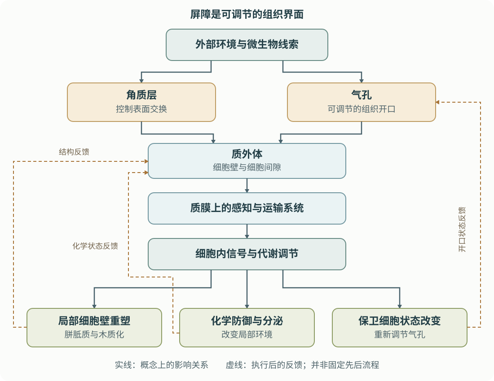

# 第17章 屏障与化学防御：植物怎样把识别转化为保护

> 核心问题：一个细胞已经“知道”周围有危险，为什么它还可能生病？

免疫受体只能提供信息。要让信息变成保护，植物还必须改变物质交换、组织结构和局部化学环境。细胞壁需要在适当的位置加固，气孔需要重新分配开放与关闭的时间，防御代谢物需要在恰当的组织发挥作用。这个过程把前几章的分子信号，落实为可以影响病程的生物学结果。

本章先把视线从蛋白质复合体拉回一片真实的叶子，再逐步走进细胞壁与质外体。你将看到，植物表面并不是一层等待被攻破的包装，化学防御也不是把“有毒物质”越积越多。二者都是持续维护、可以调节、受环境约束的生理系统。

**学习目标**

- 在组织示意图中区分角质层、细胞壁、质膜、气孔和质外体。
- 解释组成型与诱导型防御为什么互相补充，而不是谁取代谁。
- 区分胼胝质、木质素与防御小分子的功能，不把一种指标当作整体免疫强度。
- 说明 ROS 为什么既能传递信息，也可能造成伤害。
- 用“观察—替代解释—因果证据”的顺序阅读屏障和代谢研究。

**先修与衔接：**建议先读[第1章：植物免疫全景](../part1-免疫骨架/ch01-植物免疫全景.md)和[第3章：受体与信号转导](../part2-分子机制/ch03-受体与信号转导.md)。激素之间的协调见[第5章](../part2-分子机制/ch05-激素信号网络.md)；本章末尾的局部保护如何通知远处组织，将在[第18章](ch18-系统免疫与防御预激.md)继续展开。

## 17.1 先认识防御发生的空间：细胞外并不等于植物体外

把一片叶子想成装满细胞的塑料袋，很容易产生两个误解：表面以内都是细胞内部，细胞壁又是完全密闭的外壳。实际上，植物体内存在一套连通而受限制的细胞外空间。它包括细胞壁及细胞间隙等，称为**质外体（apoplast）**。细胞的内部则由质膜与质外体分隔；相邻活细胞还可以通过胞间连丝相连，构成共质体联系。

因此，一个微生物进入叶片的细胞间隙，已经进入植物组织，却未必进入任何一个植物细胞。它接触的不是“空白区域”，而是由植物持续调节的环境：水分、离子、酸碱度、营养物质、分泌蛋白与氧化还原状态，都影响这里的生物活动。免疫受体的胞外部分也朝向这一空间。理解质外体，是把受体识别、细胞壁防御与组织水分关系接起来的关键。

多数陆生植物地上器官的最外面覆盖**角质层（cuticle）**。它主要由角质聚酯与蜡质构成，与表皮细胞外侧细胞壁相联系。角质层不是另一种质膜，也不是整个细胞壁的同义词。它限制非气孔途径的水分散失，影响表面润湿性与分子交换。角质层之下，细胞壁由纤维素微纤丝及半纤维素、果胶等组分形成复合结构；不同组织、物种与发育阶段的具体构成并不一样。

气孔则是由保卫细胞调节的开口，承担二氧化碳交换与蒸腾调控。根、茎、果实还具有各自的组织边界，不能把叶片表面的构造原封不动地套用到所有器官。植物防御首先是一个空间问题：哪个界面发生了改变，决定了哪些细胞能感知变化、什么物质能够到达，以及什么代价会随之出现。

**图17.1 结构、信号和代谢共同维持组织边界。**实线表示概念上的影响关系，并非所有信号都必须依次经过每个节点。图中的反馈提醒我们：屏障既是免疫的执行对象，也会改变下一轮信息输入。

## 17.2 组成型与诱导型防御：已经存在，不代表永远不变

**组成型防御（constitutive defense）**指在特定威胁到来之前已经存在的防御属性。例如，某些表面结构、基础水平的防御蛋白，以及预先储存的化学物质。**诱导型防御（induced defense）**则是在感知刺激以后增强或新出现的反应，例如局部壁沉积、代谢通量改变和气孔状态调整。

这里的分类依据是“相对于一次刺激，何时出现”，并不等于“有没有基因调控”。一层健康的角质层需要持续合成与维护；一个预先存在的代谢物也会随叶龄、昼夜与营养状况变化。反过来，诱导型反应不一定要等待新蛋白从头合成。植物可以调节已有的酶、离子通道或运输系统，以较快速度改变状态。

为什么植物不把所有防御都预先备齐？因为构建组织、维持代谢和生长繁殖共享资源。更重要的是，一些防御状态会直接妨碍正常功能：开口长期关闭影响碳同化，细胞壁过度交联妨碍扩张，活性化学物质若失去区室控制也可能损伤自身。诱导与局部化并不是“反应慢”的同义词，而是避免把高代价状态维持在全株的组织方式。

但组成型与诱导型不是各占一半的简单加法。原有结构会影响刺激能否被感知；感知后的反应又会改变结构。Bessire 等在拟南芥中发现，某些角质层通透性升高的突变体对灰霉菌表现出较强抗性，提示表面交换和防御状态的改变可以抵消、甚至超过结构受损带来的不利作用。这一特定体系的结果不能推广为“角质层越薄越抗病”，却足以否定“屏障通透性与抗病性必然单调对应”的想法 (Bessire et al., 2007；[原始研究](https://pmc.ncbi.nlm.nih.gov/articles/PMC1852784/))。

| 比较维度 | 组成型防御 | 诱导型防御 |
|---|---|---|
| 观察时间 | 刺激前已经具有相应属性 | 刺激后性质或强度改变 |
| 典型例子 | 基础角质层、预存防御成分 | 局部壁加固、防御代谢重编程 |
| 主要优势 | 不必等待首次启动 | 可以按组织、时间和线索调整 |
| 主要约束 | 日常维护有成本，环境变化可能使配置不合适 | 启动需要时间，且依赖感知和执行能力 |
| 常见误读 | “组成型就是没有调控” | “诱导型就是全靠新基因表达” |

## 17.3 气孔是一种生理决策：免疫与水分管理共同使用一套细胞

气孔免疫让人直观地看到，结构防御并不都是“造一堵墙”。保卫细胞改变离子与水分状态，从而改变细胞膨压和气孔开度；免疫信号可以接入这一调节系统。植物由此在组织入口处降低部分微生物进入的机会，而不必先让每个叶肉细胞都遭遇同样的刺激。

Melotto 等在2006年提供了关键证据：保卫细胞能够响应细菌相关的分子线索，气孔关闭与免疫识别及保卫细胞信号组分有关。认识上的转折是，气孔不再只是一个供微生物利用的静态孔洞，而是免疫系统可以调节的组织界面 (Melotto et al., 2006；[原始研究](https://www.sciencedirect.com/science/article/pii/S0092867406010154))。

同一对保卫细胞也要响应光照、二氧化碳、湿度与脱落酸。因此，观察到气孔关闭，并不能仅凭这一现象认定“免疫变强了”。水分胁迫也能造成关闭；不同开度背后的信号原因可能不同。评价气孔免疫，要同时问：改变是否依赖相关免疫感知？是否影响组织层面的保护？是否只是整株水分状况或生长状态改变的结果？

保卫细胞提供的另一个启发是**空间分工**。表皮、保卫细胞、叶肉和维管组织面对的任务不同，因此同一种激素在不同细胞中的输出不必完全一致。所谓“全叶某基因表达上升”，可能来自少数细胞的强烈变化，也可能来自多数细胞的轻微改变。二者对入口防御的意义并不相同。

**读图提示：**如果论文只给出某时点的平均气孔开度，应先寻找样本分布、独立植物数和环境条件描述。平均值相同，可以掩盖一部分气孔关闭、一部分仍开放的差别。开度数据回答的是状态问题；保护性结果回答的是功能问题，两类证据需要互相支持。

## 17.4 细胞壁会被重塑：胼胝质和木质化为何不能互相替代

细胞壁必须同时承受力、容许生长、维持细胞形态并允许必要的物质交换。它因此并非一块均匀材料，而是可被分泌、沉积、修饰和重新组织的复合体系。免疫激活后，植物可以在局部改变这种体系，使组织边界更适合限制损伤。

**胼胝质（callose）**以β-1,3-葡聚糖为主要结构特征，常出现在受到刺激的细胞壁区域，也参与胞间连丝等结构的通透性调节。它与以β-1,4连接为主的纤维素不是同一种材料。免疫相关的壁突起或局部加厚区域通常包含多种成分，不能把整个结构都称作“胼胝质”。胼胝质的作用取决于何时沉积、沉积在哪里，以及与哪些壁组分和信号共同变化。

**木质素（lignin）**是复杂的芳香族聚合物。正常发育时的木质化支持机械强度和水分运输；免疫过程中某些组织的局部木质化，则有助于形成空间边界。Lee 等在拟南芥叶片体系中把木质素沉积的空间分布与局部限制作用联系起来，支持木质化能够参与限制损伤和微生物在组织中的扩展。它说明材料所在的位置十分重要，并不意味着所有抗病性都依赖同样的木质化方式 (Lee et al., 2019；[原始研究](https://doi.org/10.15252/embj.2019101948))。

壁结构发生改变时，植物还可以从组织完整性变化、机械状态或损伤相关分子中获得信息。这里要区分两个问题：某种壁碎片能否引发反应，以及它在自然组织中是否以足够的时间、位置和形态出现。前者证明可能的感知能力，后者才帮助解释实际病程。不能因为某个片段在一个体系中活跃，就把它画成所有物种都使用的唯一损伤信号。

| 对象 | 基本性质 | 与免疫相关的主要问题 | 单独测量不足以证明什么 |
|---|---|---|---|
| 角质层 | 表皮外侧的脂质性复合结构 | 表面交换、失水和环境感知 | 通透性低不等于对所有病害更抗性 |
| 胼胝质 | 以β-1,3-葡聚糖为主的聚合物 | 局部沉积、通透性和反应时序 | 染色强不等于保护一定更好 |
| 木质素 | 复杂芳香族聚合物 | 加固位置与组织空间限制 | 总量高不等于局部边界更有效 |
| 防御小分子 | 多种化学类别的代谢物 | 合成、储存、运输与局部作用 | 体外活性不等于体内决定抗病性 |

### 里程碑拆解：为什么缺少胼胝质的植物反而更抗病？

Nishimura 等研究的拟南芥 *pmr4* 突变体缺少相应的诱导胼胝质沉积，却在所研究的互作体系中表现出抗病性。这与“沉积减少必然更易感”的预期不符。进一步的遗传分析表明，当水杨酸防御途径受到阻断时，这种抗性可以消失，说明观察到的整体表型包含信号补偿的贡献 (Nishimura et al., 2003；[原始研究](https://pubmed.ncbi.nlm.nih.gov/12920300/))。

这项研究最值得学习的不是一个反常答案，而是一种推理习惯：**去掉某个组分，往往同时改变材料本身和系统对材料变化的反应。**只比较缺失前后的病害程度，无法自动把差异全部归给材料的物理功能。需要进一步识别补偿网络，才能区分直接作用与间接作用。

它也没有证明胼胝质“没有防御价值”。一个组分在某个遗传背景中被补偿，不能推出它在所有背景、组织或感染阶段都可有可无。读到相互矛盾的结果时，先核对体系和比较对象，往往比急于决定“哪篇论文错了”更有收获。

## 17.5 化学防御是一套空间化的代谢系统

植物产生大量并非所有物种都共有的化合物，常称为**专一性代谢物（specialized metabolites）**，传统上也称次生代谢物。“次生”容易让初学者误以为“不重要”。实际上，这些物质可以参与防御、信号交流、抗氧化和生态互作，只是它们的分布和功能往往具有谱系与环境特异性。

按防御发生的时间，经典文献区分**组成型抗菌物质或植物抗菌素（phytoanticipins）**与**植保素（phytoalexins）**。前者在威胁到来前已经存在，或可由预存前体在组织受损后释放出活性形式；后者通常在受到刺激后通过诱导代谢积累。这个区分属于生理学定义，不是化学结构分类。同一类化合物在不同植物、组织或条件下，可能具有不同的积累方式。

燕麦根部的某些皂苷是理解预存化学防御的经典例子。Papadopoulou 等通过植物遗传材料把皂苷缺乏与病害易感性联系起来，使“组织里含有一种有活性的物质”前进到“该代谢系统对植物的保护有贡献”。这类证据仍须关注突变是否同时影响根发育或其他代谢过程 (Papadopoulou et al., 1999；[原始研究](https://pmc.ncbi.nlm.nih.gov/articles/PMC23166/))。

拟南芥的**卡马来素（camalexin）**则是常见的诱导型防御代谢物例子。早期遗传研究已经显示，代谢物的积累与抗性不能逐项画等号：特定缺陷在不同微生物互作中的后果不同，而某些突变还涉及比一个终产物更广的生理变化。把“受到刺激后出现”直接写成“决定一切抗性”，会跳过必要的因果检验 (Glazebrook & Ausubel, 1994；[原始研究](https://pubmed.ncbi.nlm.nih.gov/8090752/))。

为什么同一片叶子的总代谢物含量相近，防御效果却可能不同？因为测得的总量可能混合了活性形式、储存形式、不同区室以及完全不同的细胞。某个物质存在于液泡，并不等于已经到达质外体；某类前体含量高，也不等于活性产物在适当的位置出现。**合成能力、区室化、运输和周转共同决定化学防御。**

这还解释了植物怎样限制自身代价。植物不是对自己制造的所有活性物质天然免疫，而是通过空间隔离、化学修饰和受到调节的动员，降低正常组织的暴露。化学防御与正常代谢因而紧密相连：同一份碳、氮和还原力也用于生长、繁殖与修复。

### 结构防御和化学防御会在同一过程中相遇

Clay 等在拟南芥的模式分子响应体系中发现，吲哚类硫代葡萄糖苷相关代谢与胼胝质反应存在功能联系。它提示我们，所谓“化学层”和“结构层”不是互相独立的章节标签；代谢状态可以参与决定结构反应是否形成 (Clay et al., 2009；[原始研究](https://pmc.ncbi.nlm.nih.gov/articles/PMC2630859/))。

不过，硫代葡萄糖苷系统并非所有植物都具有。跨物种阅读时，更值得迁移的是“代谢、分泌与局部材料沉积协同”的逻辑，而不是要求每种作物都拥有拟南芥的同一组化学物质。这也呼应[第6章的进化视角](../part2-分子机制/ch06-免疫的进化.md)：保护功能可以相似，承担功能的具体分子却可能不同。

## 17.6 ROS 的双重角色：信息来自受控制的变化

**活性氧（reactive oxygen species，ROS）**是一个化学类别的总称，包括超氧阴离子、过氧化氢等；不同成员的反应性、寿命与空间行为并不相同。它们既可以出现在正常能量代谢中，也可以在免疫和其他胁迫响应中产生。因此，“检测到 ROS”只说明发生了氧化还原相关变化，不能单独确定其来源或作用。

免疫中较早发生的质外体 ROS 变化，可以参与细胞间协调、蛋白调控及细胞壁反应。植物同时具有抗氧化和清除系统，这些系统并非单纯与免疫唱反调，而是帮助把信号限制在可解释、可恢复的范围内。信号需要的不是无限累积，而是产生、感知与清除之间的时间结构。

Wu 等在2020年把受体激酶 HPCA1 与细胞外过氧化氢引起的钙响应、保卫细胞反应联系起来，提供了“细胞能感知细胞外氧化还原变化”的直接分子证据 (Wu et al., 2020；[原始研究](https://www.nature.com/articles/s41586-020-2032-3))。但受体如何完成这一感知，仍需要持续修订。2026年的结构、生化与遗传研究提出 CARD1/HPCA1 的铜依赖性感知机制，并发现先前强调的特定半胱氨酸并非该研究体系中感知所必需 (Ishihama et al., 2026；[原始研究](https://www.nature.com/articles/s41467-026-72573-8))。

这个更新很适合练习区分两种知识：**较稳固的功能结论**是该受体参与相关氧化还原信号；**可修订的分子模型**是某些具体残基通过哪种化学方式完成感知。后者发生变化，并不等于前者所有证据都被推翻。

当产生与清除失衡、位置失控或持续时间过长时，ROS 可能损伤脂质、蛋白和核酸。保护性信号与氧化损伤之间没有一条适用于所有组织的固定数值界线。细胞的缓冲能力、产生部位、同时发生的代谢过程都很重要。叶片损伤增多，既可能伴随强烈防御，也可能说明防御代价过高或生理稳态已经崩溃。

因此，ROS 图像应与时间、区室、细胞活性和保护性结局一起解释。一个更亮的染色信号，不足以支持“免疫更有效”；信号变弱，也不必然意味着植物更脆弱。比较染色方法时，还应记住探针对不同化学物种的选择性、组织可达性以及成像设置都会影响读数。

## 17.7 把机制连起来：保护不是某一个指标达到最大值

沿着本章的路线，我们已经走过三种尺度：角质层与气孔调节组织边界，壁重塑改变局部材料，代谢物和 ROS 改变周围化学状态。真实植物会同时动用这些过程。一个指标上升，有时是有效保护的一部分，有时只是系统尝试补偿，有时还可能是损伤加重的结果。

**关键实验方法 Box：只看研究逻辑，不把方法当成结论。**组织成像用于回答“变化在哪里”；化学与代谢分析用于回答“哪些分子形式在变化”；遗传比较用于检验“某组分是否为观察到的结果所需”；时间序列用于区分“先出现的事件”和“随后出现的反应”。这些方法各有盲区，最有说服力的解释通常来自不同类型证据的收敛，而不是同一种测量做得越来越多。

例如，某材料的叶片总木质素更高，同时病害较轻。它支持二者相关，但至少还存在三个替代解释：叶龄不同改变了壁组成；局部防御信号同时驱动木质化与其他保护；生长变慢改变了组织条件。进一步研究应围绕这些解释组织比较，而不是把“高木质素”直接改写为唯一原因。这里讨论的是证据判断，不涉及具体的病原操作。

评价防御时还应分开**抗性**与**耐受性**：前者侧重限制病原负荷，后者侧重在一定负荷下减少损失。组织更完整不一定意味着病原更少；同样，病原较少也不自动保证植物生长恢复。关于这些结果怎样影响育种判断，可衔接[第14章](../part5-转化与展望/ch14-从基础到抗病育种.md)。

**Key Question：**植物如何把细胞壁完整性、氧化还原状态和代谢资源整合成一次局部决策，使保护足够及时，又不把短暂防御固定成妨碍生长的状态？不同物种可能采用哪些不同的材料，解决同一个组织问题？

### 常见误区

| 误区 | 更准确的理解 |
|---|---|
| 免疫就是受体识别，后面自然会抗病 | 识别与执行是不同环节，正确感知仍需要组织和代谢条件支持 |
| 屏障越厚越好 | 连续性、成分、位置和反馈都重要，过度加固也会妨碍正常功能 |
| 胼胝质越多，抗性必然越强 | 沉积是一个反应读数，保护作用需要独立功能证据 |
| 次生代谢物都只是抑菌物质 | 同一物质还可能参与信号、资源协调和微生物互作 |
| ROS 总量代表免疫强度 | 化学种类、区室和持续时间决定其信号与伤害意义 |

## 自测与讲解

**1．一个微生物处在叶肉细胞之间，它在植物体内还是细胞内？**

它可以处在植物组织内部的质外体，却仍位于植物细胞的质膜之外。这一区分决定了应关注胞外受体、分泌物和组织水分，还是细胞内感知与代谢。

**2．甲材料的角质层更通透，却对某种病害更抗性。能否据此建议所有植物都降低角质层完整性？**

不能。该结果说明物理性质与信号、代谢反馈共同决定了特定体系的结果。它没有证明对其他病害、干旱条件或正常发育也有利，更没有建立跨物种的一般规律。

**3．去除一个胼胝质相关组分后抗性增加，为什么仍不能说胼胝质是“有害防御”？**

因为遗传变化可能激活补偿性信号。应进一步判断新增抗性是否依赖这些信号，并区分材料本身的作用与系统重新配置的作用。*pmr4* 研究正是这种逻辑的经典例子。

**4．一篇研究显示防御代谢物在整片叶子中增加，同时组织损伤减少。还缺什么信息？**

至少要知道活性形式、所在组织与区室、变化时间，以及这种变化是否对保护必要。还应区分病原负荷下降与组织对损伤更耐受。总量测量和症状测量各提供一部分信息。

**5．为什么“把全部 ROS 清除干净”不是一个合理的免疫概念？**

因为 ROS 同时参与正常代谢和受到调控的信号。植物需要控制其来源、时间和空间，而不是把一整类分子归为完全有害。判断保护作用必须结合组织功能与实际结果。

## 本章术语速查

| 术语 | 本章中的含义 |
|---|---|
| 角质层 cuticle | 与表皮外侧细胞壁相联系、影响表面交换的脂质性复合结构 |
| 质外体 apoplast | 质膜之外的细胞壁和细胞间隙等空间，部分位于植物组织内部 |
| 组成型防御 constitutive defense | 在所讨论的刺激到来前已存在的防御属性 |
| 诱导型防御 induced defense | 刺激后被增强或新出现的防御状态 |
| 胼胝质 callose | 以β-1,3-葡聚糖为主、参与局部壁结构和通透性调节的聚合物 |
| 木质化 lignification | 木质素在特定组织或细胞壁中形成和沉积的过程 |
| 专一性代谢 specialized metabolism | 形成具有谱系与生态特征的一组代谢物的代谢活动 |
| phytoanticipin / phytoalexin | 分别侧重预存或由预存组分动员的防御化学物质，以及刺激后诱导积累的植保素 |
| ROS | 多种活性氧化学物种的集合，不能作为单一分子处理 |

## 推荐阅读与参考文献

以下按第一作者字母顺序列出本章引文。**必读**建议先读摘要、主要结果图和讨论；**重要**用于建立机制联系；**拓展**用于观察模型怎样被修订。文章年份采用正式卷期年份；在线首发日期可能更早。

1. **Bessire, M., et al.** *A permeable cuticle in Arabidopsis leads to a strong resistance to Botrytis cinerea.* The EMBO Journal, 2007; 26:2158–2168. [全文](https://pmc.ncbi.nlm.nih.gov/articles/PMC1852784/) · [DOI](https://doi.org/10.1038/sj.emboj.7601658)。**重要：**理解表面结构、环境交换与诱导反应之间的联系。
2. **Clay, N. K., et al.** *Glucosinolate metabolites required for an Arabidopsis innate immune response.* Science, 2009; 323:95–101. [全文](https://pmc.ncbi.nlm.nih.gov/articles/PMC2630859/) · [DOI](https://doi.org/10.1126/science.1164627)。**重要：**观察代谢防御怎样接入通常被视为结构指标的胼胝质反应。
3. **Glazebrook, J., & Ausubel, F. M.** *Isolation of phytoalexin-deficient mutants of Arabidopsis thaliana and characterization of their interactions with bacterial pathogens.* PNAS, 1994; 91:8955–8959. [论文记录与摘要](https://pubmed.ncbi.nlm.nih.gov/8090752/) · [DOI](https://doi.org/10.1073/pnas.91.19.8955)。**重要：**学习如何从代谢物积累走向遗传因果检验，也注意不同突变的多效性。
4. **Ishihama, N., et al.** *A copper-dependent redox-based hydrogen peroxide perception in plants.* Nature Communications, 2026; 17:4236. [全文与DOI](https://www.nature.com/articles/s41467-026-72573-8)。**拓展：**与第9条对照，区分受体功能结论和感知化学机制的更新。
5. **Lee, M.-H., et al.** *Lignin-based barrier restricts pathogens to the infection site and confers resistance in plants.* The EMBO Journal, 2019; 38:e101948. [DOI与论文](https://doi.org/10.15252/embj.2019101948) · [PubMed](https://pubmed.ncbi.nlm.nih.gov/31559647/)。**重要：**训练从空间分布理解材料功能，而不是只看总量。
6. **Melotto, M., et al.** *Plant stomata function in innate immunity against bacterial invasion.* Cell, 2006; 126:969–980. [论文](https://www.sciencedirect.com/science/article/pii/S0092867406010154) · [DOI](https://doi.org/10.1016/j.cell.2006.06.054)。**必读：**理解为什么一个熟悉的植物生理结构能够改变免疫研究框架。
7. **Nishimura, M. T., et al.** *Loss of a callose synthase results in salicylic acid-dependent disease resistance.* Science, 2003; 301:969–972. [论文记录与摘要](https://pubmed.ncbi.nlm.nih.gov/12920300/) · [DOI](https://doi.org/10.1126/science.1086716)。**必读：**学习结构缺陷、信号补偿与整体表型之间的因果区分。
8. **Papadopoulou, K., et al.** *Compromised disease resistance in saponin-deficient plants.* PNAS, 1999; 96:12923–12928. [全文](https://pmc.ncbi.nlm.nih.gov/articles/PMC23166/) · [DOI](https://doi.org/10.1073/pnas.96.22.12923)。**重要：**了解预存化学防御的经典植物遗传证据。
9. **Wu, F., et al.** *Hydrogen peroxide sensor HPCA1 is an LRR receptor kinase in Arabidopsis.* Nature, 2020; 578:577–581. [论文与DOI](https://www.nature.com/articles/s41586-020-2032-3)。**重要：**理解细胞外氧化还原变化如何与细胞内钙响应发生联系。

*本章文献与机制表述核验日期：2026年9月18日。图17.1为本书原创概念图，不是任一论文图的复绘。*
