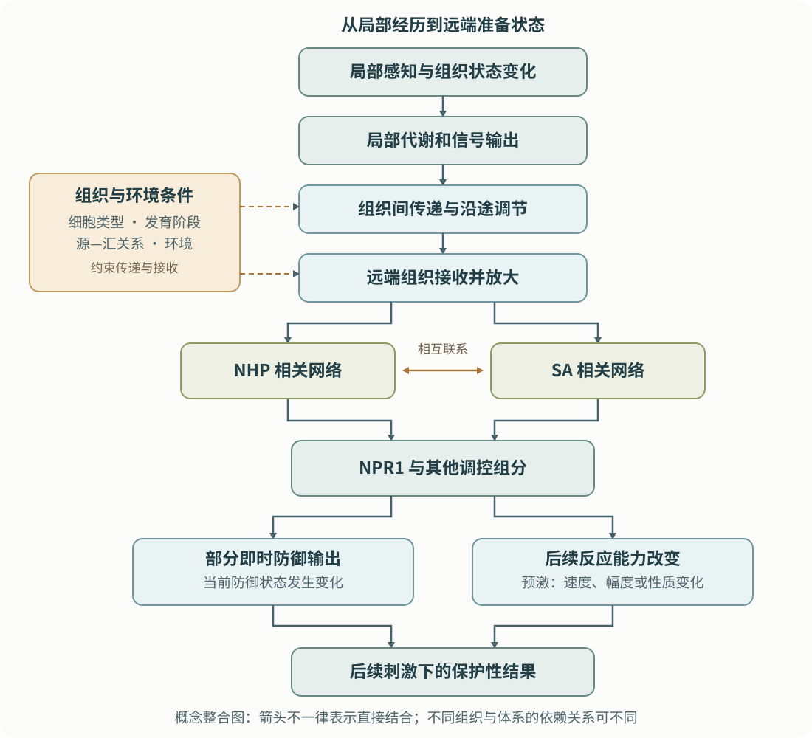

# 第18章 系统免疫与防御预激：一片叶子的经历怎样影响整株植物

> 核心问题：危险只发生在局部，远处尚未受到侵害的组织，怎样提前改变自己的应对方式？

如果只看一个植物细胞，免疫似乎是“识别—传信—执行”的局部过程。但植物由根、茎、叶和生殖器官组成，一个器官的经历会改变另一个器官的状态。远处细胞不必接触最初的刺激，也可能调整自己的感知能力、代谢准备和防御反应。

本章要解决两个容易混淆的问题：信息怎样传到远处，以及远处组织收到信息以后怎样改变。系统性保护不等于一种物质在全株均匀分布；提前准备也不等于所有防御基因一直高表达。学会区分这些概念，才能理解系统免疫为何既有保护潜力，又受到时间、组织和资源条件的限制。

**学习目标**

- 用“刺激位置—响应位置—功能结果”区分局部反应与系统性免疫。
- 区分 SAR、ISR 和防御预激，理解三者为何不处于同一分类层次。
- 解释 SA、NPR1、NHP 与 FMO1 的基本联系，同时避免把网络画成一条不可变直线。
- 区分移动分子的证据、远端信号放大的证据和保护性功能的证据。
- 评估“免疫记忆”和“跨代记忆”表述所需要的不同证据强度。

**先修与衔接：**基础概念见[第1章](../part1-免疫骨架/ch01-植物免疫全景.md)，激素知识见[第5章](../part2-分子机制/ch05-激素信号网络.md)，有益微生物相关背景见[第10章](../part4-交叉前沿/ch10-植物微生物组与免疫.md)。局部结构和代谢执行见[第17章](ch17-屏障与化学防御.md)。本章讨论全株协调和证据逻辑，不重复完整激素生化细节。

## 18.1 “系统性”首先是一个空间结论

一片叶子受到刺激，该叶片出现防御反应，属于**局部反应（local response）**。如果原先未直接接触刺激的其他组织也发生变化，则可以讨论**系统性响应（systemic response）**。但“响应”与“免疫保护”还不是同一个结论：远端某基因表达改变，说明信息或生理影响到达了那里；只有进一步观察到相应保护性结果，才支持系统性抗性。

读到“整株抗性增强”时，首先要问被测量的是哪些部位。一个器官可能存在强烈反应，另一器官反应较弱；即使同一片叶子，不同细胞类型也可能不同。系统性并不要求每一个细胞都同步、等强度地进入同样状态，它强调的是局部事件能够产生远端后果。

第二个问题是远端组织是否真的没有直接遇到原始刺激。若刺激物已经扩散过去，或者相关生物已经到达该组织，仅凭位置不同不能认定植物完成了内部预警。第三个问题是远端变化是否只是资源重新分配、失水或生长速度改变。系统性免疫研究需要把这些可能性与特异的防御信号过程区分开。

植物不依赖动物式循环免疫细胞完成这一协调，而是利用代谢物、蛋白相关过程、维管联系与局部放大等机制传递和处理信息。这里的“信息”不是一种神秘物质，而是能够使接收组织产生可重复变化的生理因果关系。传递途径可以不止一条，接收组织也具有自己的解释与响应能力。

## 18.2 SAR、ISR 与预激：两个抗性概念，一种响应方式

**系统性获得抗性（systemic acquired resistance，SAR）**通常指植物经历局部病原相关刺激后，在远端形成的增强抗性状态。在拟南芥等经典体系中，水杨酸相关过程和 NHP 相关过程具有核心作用。SAR 常具有一定广谱性，但广谱不等于对所有病原、所有器官和所有环境均有效，也不意味着必须先出现明显坏死才能建立。

**诱导系统抗性（induced systemic resistance，ISR）**在现代植物免疫语境中，常用于描述有益根际微生物等因素诱导的远端保护。历史上不同文献对 ISR 的用法并不完全一致，因此需要结合作者定义。经典根际细菌—拟南芥体系强调茉莉酸和乙烯的响应能力，并涉及 NPR1；这不能扩展成所有有益微生物诱导的保护都完全不依赖水杨酸。

Pieterse 等的经典遗传研究表明，有益根际细菌诱导的保护可以通过与经典 SAR 不同的激素依赖关系实现，同时共享某些调控组分。这项结果推动人们从“全株防御只有一条通路”转向“不同起点可以在部分节点汇合”的认识 (Pieterse et al., 1998；[原始研究](https://pmc.ncbi.nlm.nih.gov/articles/PMC144073/))。

**防御预激（defense priming）**描述的则是响应方式：植物经历先前的线索后，对后续刺激作出更快、更强或性质不同的反应。它并不是与 SAR、ISR 并列的第三条独立通路。SAR 和 ISR 都可能包含预激，预激也可能出现在其他生理背景中。

一个重要细节是，预激并不要求第一次刺激后“什么都没发生”。某些信号组分或代谢能力可以已经改变，某些基因可以轻度表达，另一些输出则在后续刺激时才明显增强。因此，直接防御激活与预激可以在同一株植物上并存，区别在于我们讨论哪一种输出、哪个时间阶段。

| 概念 | 分类依据 | 常见研究起点 | 核心判断 | 不应据此推断 |
|---|---|---|---|---|
| SAR | 一类系统性获得抗性状态 | 局部病原相关刺激 | 远端保护，以及相应的信号依赖关系 | SA 是唯一移动分子；对任何病原都有效 |
| ISR | 一类诱导的系统性抗性，常用于有益微生物情境 | 根际有益微生物等 | 局部互作与远端保护的联系 | 所有 ISR 都严格遵循同一激素组合 |
| 预激 | 后续响应如何被先前经历改变 | 多种生物或非生物线索 | 前次经历改变了后续反应的动力学或幅度 | 刺激前必须完全没有分子变化 |
| 持续激活 | 防御输出长期维持较高水平 | 持续信号或调控状态改变 | 不依赖后续刺激也存在较高输出 | 已经证明形成预激或长期记忆 |

## 18.3 预激的本质是改变下一次反应，而不只是提高当前读数

想象两个同龄、初始状态相近的植物群体。一个曾经接收到防御相关线索，另一个没有。过一段时间，只比较它们当前某个标志基因的表达，可能几乎看不出差别。但当它们经历同一种后续刺激时，先前有经历的群体反应启动更早。预激在这种比较中才显现出来。

因此，预激研究的核心不是一个终点，而是**前次经历与后续刺激之间的交互关系**。如果经过前次刺激的植物原本就一直保持很高的基因表达，后续只是延续这个高水平，那么仅凭终点差异无法把它命名为预激。必须知道后续刺激前的基线，以及后续反应相对于基线发生了什么。

下面是理解证据所需的四种概念状态，而不是操作流程：

| 先前是否有相关经历 | 当前是否出现后续刺激 | 这一状态主要回答的问题 |
|---|---|---|
| 无 | 无 | 原有基线是什么？ |
| 有 | 无 | 前次经历留下了什么持续变化？ |
| 无 | 有 | 未经预激的正常反应是什么？ |
| 有 | 有 | 同样的后续刺激是否产生了改变的反应？ |

即便最后一组的反应更强，也还要检查植物大小、叶龄和组织损伤是否已经不同。更高的表达不必然意味着更有效的保护；反应过强还可能损害生长。防御预激的潜在优势，是在需要时提高准备程度，但维持这种准备也可能有代谢成本。称它为“完全不耗能的免疫记忆”并不准确。

从机制上说，预激可以来自较稳定的信号蛋白积累、代谢状态改变、受体或转录调控能力变化，以及某些染色质状态的保留。这些机制并不互相排斥，也不需要每一次预激都具备所有机制。对于初学者，先掌握“先前经历改变后续反应”的定义，比先记忆一长串候选基因更有帮助。

## 18.4 SA—NPR1 与 NHP—FMO1：两组概念怎样接成网络

**水杨酸（salicylic acid，SA）**在经典 SAR 中承担重要调控作用。它是一个分子信号，不是直接负责所有保护作用的终端武器。接收组织需要把相关状态变化转成基因表达、蛋白活动和代谢输出，NPR1 正是其中的重要枢纽。

**NPR1**的名称源于 *NON-EXPRESSOR OF PATHOGENESIS-RELATED GENES 1*。它是一种转录共调控蛋白：并非独自识别一整套 DNA 序列，而是与 TGA 等转录因子及转录调控组分合作，影响基因表达。把 NPR1 理解为“协助组装和调节转录响应的核心部件”，比把它当成单一开关更准确。

旧版模型常把 NPR1 描写成“胞质寡聚体解离为单体，单体进入细胞核后开启防御”。这一描述有助于回顾研究历史，却不宜当成唯一、完整的现行机制。2022年的结构与功能研究显示 NPR1 同源二聚体能够连接 TGA3 二聚体，形成参与转录激活的复合物，强调构象和组装状态的重要性 (Kumar et al., 2022；[原始研究](https://pmc.ncbi.nlm.nih.gov/articles/PMC9346951/))。

**前沿更新：**2026年9月的研究进一步显示，SA 有助于稳定 NPR1 的相关结构域，并促进其与转录介体复合物亚基 MED15A 的相互作用；这种相互作用又反过来影响 SA 结合。这为“激素感知怎样接到转录机器”提供了新的结构解释。初学者此处只需把握合作与构象调节的逻辑，无需把刚发表的全部细节当作通用于所有细胞状态的最终模型 (Zhang et al., 2026；[原始研究](https://www.nature.com/articles/s41586-026-11021-5))。

另一组关键概念是**哌啶酸（pipecolic acid，Pip）**和**N-羟基哌啶酸（N-hydroxypipecolic acid，NHP）**。它们与植物的赖氨酸相关代谢相联系。ALD1、SARD4 等组分参与通向 Pip 的代谢过程，黄素依赖单加氧酶 FMO1 则与 NHP 的形成直接相关。这里的重点是代谢产物可以成为全株防御的调节因子，而不仅是局部反应的副产物。

Hartmann 等在2018年把 FMO1 的生化功能与 NHP 形成、系统免疫联系起来，使过去“一个必需基因”和“一组相关代谢变化”之间出现了清楚的化学连接 (Hartmann et al., 2018；[原始研究](https://pubmed.ncbi.nlm.nih.gov/29576453/))。同年 Chen 等提供了 NHP 相关代谢物移动性和系统保护作用的证据，进一步说明这些代谢变化参与组织间的协调 (Chen et al., 2018；[原始研究](https://pmc.ncbi.nlm.nih.gov/articles/PMC6003486/))。

SA 与 NHP 之间不是一场“谁才是真正信号”的竞争。后续研究表明，NHP 诱导的转录重编程和预激与 NPR1 密切相关，SA 积累能够加强其中的大部分响应；同时存在具有不同 SA 依赖程度的组分。这更符合一个具有正反馈和条件依赖性的网络，而不是“NHP 永远在 SA 上游、SA 永远在 NPR1 上游”的机械直线 (Yildiz et al., 2021；[原始研究](https://pmc.ncbi.nlm.nih.gov/articles/PMC8260123/))。

**图18.1 系统免疫包含传递、接收、放大和状态改变。**本图是概念整合；箭头不一律代表直接物理结合，双向箭头表示网络联系。NHP 和 SA 的关键作用也不意味着所有物种与所有 ISR 情境都具有完全相同的依赖关系。

## 18.5 能够移动，不等于唯一的长距离信号

如果远端叶片中某分子含量上升，有三种基本解释：它从局部运输了过去；别的信号到达后让远端自己合成；运输与远端合成同时发生。只测量含量，无法在三者之间做出选择。这是系统免疫论文最值得反复练习的逻辑问题。

同样，一个分子对远端抗性必需，并不意味着它一定承担运输任务。它可能参与局部信号生成，也可能负责远端接收，还可能维持与运输无关的正常生理条件。反过来，一个分子确实能够移动，也不意味着它的移动已经足以解释自然条件下的全部保护。

### 里程碑拆解：把“运输”与“接收所需”分开

Vernooij 等在1994年的烟草研究中，通过比较具有不同 SA 积累能力的局部和远端组织，发现缺乏正常 SA 积累的信号来源组织仍可以使具有正常能力的远端组织产生保护，而远端组织自身的 SA 相关能力很重要。这支持在该体系中把“可传递的信号”和“远端完成响应所需的 SA”区分开 (Vernooij et al., 1994；[原始研究](https://pmc.ncbi.nlm.nih.gov/articles/PMC160492/))。

这项研究改变的是问题的问法：与其只问哪一种物质在远处变多，不如分别问它在哪里产生、在哪里必需。它并不能支持“SA 永远不会运输”，也不能凭一个历史体系排除 SA 及相关化合物在其他物种中的长距离作用。

2018年的 NHP 研究同样值得按证据层级阅读。生化证据回答产物与酶功能的联系；植物遗传与响应证据回答该过程的功能重要性；远端代谢物观察和相应比较提供移动性线索。把这些证据组合起来，才能建立比“某分子在受刺激叶片中增多”更有力的模型。后续关于 NHP 移动和远端响应的研究又进一步强化了这一框架，而没有把其他信号过程一笔删除 (Chen et al., 2018; Yildiz et al., 2021)。

其他 SAR 文献也讨论水杨酸甲酯、脂质相关过程、甘油-3-磷酸等因素。对于这些候选，应该保留相同的提问顺序：是否参与生成、转运、感知或放大？哪些证据来自哪种植物？不同候选可以分工或互相依赖，而不是必须选出一个排他性冠军。注意这里的甘油-3-磷酸是 **glycerol-3-phosphate**，不要与糖代谢中的甘油醛-3-磷酸混淆。

**关键实验方法 Box：移动性研究的四层证据。**空间分辨的化学分析给出分子在哪里；能够区分分子来源的追踪证据帮助判断是否发生移动；不同组织能力的比较帮助定位作用环节；远端保护性结果检验生物学意义。任何单层都不等于完整机制。示踪本身也需要考虑被追踪分子是否发生代谢转化，不能把衍生产物的出现自动解释为原分子完整到达。

## 18.6 源—汇、组织与时间：植物不是一根均匀管道

叶片在发育中会改变资源角色。成熟叶通常能够输出光合产物，属于“源”；正在生长的幼叶、根尖或生殖结构常需要输入资源，属于“汇”。源—汇关系是生理联系，不是永久贴在某个器官上的标签。叶龄、昼夜、营养和胁迫都会改变这种关系。

系统性信号可以利用已有的组织运输与联系，但免疫信号的分布不能直接从糖运输图机械推导。Kiefer 与 Slusarenko 比较拟南芥莲座叶的物质运输模式与 SAR 分布，发现系统性保护并未严格局限在最明显的源—汇对应范围内。这说明主要运输路线固然重要，较少量的跨区域传递、其他通路以及信号放大，也需要纳入解释 (Kiefer & Slusarenko, 2003；[原始研究](https://pmc.ncbi.nlm.nih.gov/articles/PMC167024/))。

远端组织的“接收能力”也会不同。细胞是否具有相关受体、代谢能力和转录调控组分，决定同一信息能否转换为相似输出。根际微生物诱导叶片保护，并不要求根与叶出现完全相同的基因表达图谱；相反，不同器官完成不同环节，正是系统协调的一部分。

时间还会给同一张分子图增加新的含义。早期可能出现快速变化，随后发生转录和代谢重编程，再以后才看到稳定的保护性状态。快速的钙、ROS 或电生理变化不能自动等同于已经建立 SAR：它们也参与伤害、干旱等多种反应，而系统抗性需要相应的功能证据。

从读者角度，可以把时间轴分为“先前事件”“远端状态形成”“后续刺激”“结果评估”四段。每一段都需要自己的测量和解释。只在最后一天观察到较轻症状，无法直接知道最初的信息用了多久传到远处；只在早期看见信号波，也无法保证后续会形成持久保护。

这种时空观点还有一个实际后果：某结论在受控环境中成立，并不保证不同温度、光照、营养或生长阶段下作用强度相同。系统性免疫的可重复性，要建立在明确的植物状态之上。关于环境的深入讨论，可接着阅读[第12章](../part4-交叉前沿/ch12-环境因子与免疫.md)。

## 18.7 防御记忆可以存在，但“记忆”需要明确时间尺度

植物没有动物的神经记忆系统，也没有脊椎动物式抗体和记忆淋巴细胞；这不妨碍它保留影响未来反应的生理状态。在植物免疫中，“记忆”通常是一个功能性说法：先前经历在一段时间后仍影响反应。它不是植物具有主观回忆的证据，也不自动意味着能精确记住某个微生物身份。

首先是同一株植物在一定时期内保留的状态。某些蛋白或代谢物持续存在，可以降低再次反应所需的启动时间；调控网络也可能维持一个不同的基线。其次是染色质相关状态：DNA 与组蛋白的组织方式能够影响基因对信号的响应能力。

Jaskiewicz 等发现，某些防御相关基因可以在尚未明显启动时出现与预激相联系的染色质标记，并在后续刺激中增强响应。这为细胞保留先前经历提供了一类机制线索 (Jaskiewicz et al., 2011；[原始研究](https://pmc.ncbi.nlm.nih.gov/articles/PMC3024125/))。但“一个标记与预激同时出现”和“该标记本身承载了全部记忆”是不同强度的结论，还需要机制定位和功能检验。

更进一步，**代际效应**描述亲代经历与子代表型的联系；严格意义上的**跨代继承**要求排除直接暴露和母体携带等影响，并考察超出直接受影响世代的持续性。不同研究对“跨代”一词的使用可能不同，读论文时应看实际研究了哪些世代，而不要只接受标题。

Luna 等报告了亲代免疫经历与后代增强防御相关的现象，是这一方向的代表性证据之一 (Luna et al., 2012；[原始研究](https://pmc.ncbi.nlm.nih.gov/articles/PMC3271772/))。它支持植物中可能存在具有代际持续性的防御调节，但不能据此认为“所有植物获得的抗性都会稳定遗传”。物种、遗传背景、环境与暴露历史都会影响结果。

为什么需要这么谨慎？因为子代不仅继承 DNA，还可能受到种子营养、母体激素、种子大小、微生物携带与发育环境的影响。某些处理还可能改变哪些亲代成功繁殖，带来选择效应。如果这些因素没有被充分区分，就难以把后代差异全部归因于可遗传的表观遗传记忆。

| 观察结果 | 可以支持的判断 | 尚不能直接支持的判断 |
|---|---|---|
| 前次刺激后，同株后续反应改变 | 存在一定时段内的经验依赖性调节 | 该状态一定由染色质保存 |
| 染色质标记与预激相联系 | 染色质可能参与状态维持 | 这个标记是唯一或充分的记忆载体 |
| 子代防御与亲代经历相关 | 存在代际影响的证据 | 已排除种子携带、母体效应和选择 |
| 多个后代世代仍保留差异 | 增强了持续性继承的证据 | 自然环境中普遍稳定、不会有代价 |

## 18.8 把系统免疫放回植物一生：准备程度必须与代价协调

系统性保护的意义，在于局部经验能够改变尚未受害组织的准备程度。这种准备可能降低未来损失，但也会占用资源、改变生长和生态互作。植物所面对的并非只有一种威胁：湿度变化、缺水、营养不足和不同微生物群落，都可能要求不同的生理配置。

因此，不能把“系统性反应越强”作为普遍目标。评价一个系统状态，要同时考虑保护持续多久、适用于哪些组织和挑战、是否影响繁殖或生长，以及在不同环境下是否仍然成立。预激有时能够减少持续激活的负担，但它仍然要储备或维持某些能力，不能承诺完全没有成本。

在这里也要再次区分“分子标志”和“功能结果”。PR1 等基因是有用的研究读数，却不是所有 SAR 情况下单独足够的判定标准；同一个标志不变，也不能排除其他形式的系统性保护。反过来，有益微生物改善生长或病害表现，还可能涉及营养、局部竞争及环境变化，只有相应证据才能把其中一部分归因于 ISR。

**Key Question：**植物如何让一次局部经历留下足够持久、又可以适时消退的全株准备状态？哪些信息值得保留，哪些应当随组织更新或环境改变而清除？真正有解释力的模型，必须同时说明状态怎样建立、怎样维持，以及怎样结束。

### 常见误区

| 误区 | 更准确的理解 |
|---|---|
| SAR 就是 SA 从一片叶子流到全株 | SA 的功能重要性、分子移动与远端放大是不同问题 |
| 找到 NHP 后，其他系统信号都失去意义 | NHP 是重要调节因子，系统过程仍包括并行联系与接收能力 |
| ISR 永远只依赖 JA 和 ET | 这是部分经典体系的概括，不能代替具体微生物—植物证据 |
| 预激植物在后续刺激前一定毫无变化 | 准备状态本身可以有分子变化，关键是后续响应是否被改变 |
| 防御基因一直高表达就证明形成记忆 | 持续激活与经验依赖性的反应改变需要分开检验 |
| 亲代受刺激、子代更抗病，就证明稳定跨代继承 | 必须排除直接携带与母体效应，并明确追踪的世代和持续性 |

## 自测与讲解

**1．叶片甲受到刺激后，叶片乙的 PR1 表达提高，是否已经证明 SAR？**

它支持远端分子响应，但单一标志基因不足以完整证明系统性保护。还需要相关功能结果，并确认叶片乙的状态并非由原始刺激直接到达、发育差异或其他生理变化造成。

**2．一个分子在远端增加，而且缺少它的植物失去远端保护，是否证明它是移动信号？**

没有。它可能在远端重新合成，也可能只负责远端接收或执行。移动性需要能区分来源和位置的证据，功能必要性则需要定位它在过程中的作用环节。

**3．某植物第一次刺激后基因表达持续很高，第二次刺激后仍很高，可以直接叫预激吗？**

不能仅凭这种描述判断。要比较第二次刺激前后的变化，并与没有先前经历的植物比较。如果只是延续高基线，应先称为持续激活；若后续反应速度、幅度或性质也被改变，才进一步支持预激。

**4．为什么 NPR1 能参与多个抗性过程，而不必意味着这些过程完全相同？**

因为网络可以共享调控节点，同时由不同输入、互作伙伴和组织状态决定输出。共享一个组分说明有联系，不足以把两个过程合并为同一条不变通路。

**5．亲代与子代具有相似防御倾向，为什么还要记录种子大小、发育和微生物状态？**

这些因素可能把亲代经历带到子代，并影响生长和免疫读数。区分它们有助于判断观察到的是营养或携带效应、短暂代际影响，还是具有更强证据支持的跨代调控。

## 本章术语速查

| 术语 | 本章中的含义 |
|---|---|
| 局部 / 系统性 local / systemic | 分别强调直接经历刺激的部位，以及远端组织中的后果 |
| SAR | 系统性获得抗性，经典体系与 SA、NHP 等网络紧密相关 |
| ISR | 诱导系统抗性，现代文献常用于有益微生物诱导的远端保护 |
| 防御预激 priming | 先前经历使后续防御反应改变的状态 |
| NPR1 | SA 相关防御的重要转录共调控组分，与多个调控伙伴合作 |
| NHP / Pip | N-羟基哌啶酸与哌啶酸，是不同的代谢物，不应混写 |
| FMO1 | 与 NHP 形成直接相关的黄素依赖单加氧酶 |
| 源—汇 source–sink | 组织在资源输出与输入中的生理关系，可随发育和环境改变 |
| 信号放大 amplification | 接收组织产生新的响应与信号，使输入的影响增强 |
| 代际 / 跨代效应 | 亲代经历影响后代的现象；是否构成严格跨代继承取决于暴露、世代和机制证据 |

## 推荐阅读与参考文献

以下按第一作者字母顺序排列。**必读**用于建立核心概念，**重要**用于学习因果推理，**拓展**用于理解证据边界或最新机制。正式卷期年份与在线首发年份不同的文章，以卷期年份标注。

1. **Chen, Y.-C., et al.** *N-hydroxy-pipecolic acid is a mobile metabolite that induces systemic disease resistance in Arabidopsis.* PNAS, 2018; 115:E4920–E4929. [全文](https://pmc.ncbi.nlm.nih.gov/articles/PMC6003486/) · [DOI](https://doi.org/10.1073/pnas.1805291115)。**必读：**区分代谢产物、移动性与远端保护的证据层级。
2. **Hartmann, M., et al.** *Flavin Monooxygenase-Generated N-Hydroxypipecolic Acid Is a Critical Element of Plant Systemic Immunity.* Cell, 2018; 173:456–469.e16. [论文记录与摘要](https://pubmed.ncbi.nlm.nih.gov/29576453/) · [DOI](https://doi.org/10.1016/j.cell.2018.02.049)。**必读：**学习如何用生化与植物功能证据把基因和信号分子连接起来。
3. **Jaskiewicz, M., Conrath, U., & Peterhänsel, C.** *Chromatin modification acts as a memory for systemic acquired resistance in the plant stress response.* EMBO Reports, 2011; 12:50–55. [全文](https://pmc.ncbi.nlm.nih.gov/articles/PMC3024125/) · [DOI](https://doi.org/10.1038/embor.2010.186)。**重要：**理解基因当前表达与未来响应潜能可以不同。
4. **Kiefer, I. W., & Slusarenko, A. J.** *The Pattern of Systemic Acquired Resistance Induction within the Arabidopsis Rosette in Relation to the Pattern of Translocation.* Plant Physiology, 2003; 132:840–847. [全文](https://pmc.ncbi.nlm.nih.gov/articles/PMC167024/) · [DOI](https://doi.org/10.1104/pp.103.021709)。**重要：**理解运输结构约束系统响应，但不决定全部响应分布。
5. **Kumar, S., et al.** *Structural basis of NPR1 in activating plant immunity.* Nature, 2022; 605:561–566. [全文](https://pmc.ncbi.nlm.nih.gov/articles/PMC9346951/) · [DOI](https://doi.org/10.1038/s41586-022-04699-w)。**重要：**用结构证据修正过度简化的 NPR1 单体开关叙事。
6. **Luna, E., et al.** *Next-Generation Systemic Acquired Resistance.* Plant Physiology, 2012; 158:844–853. [全文](https://pmc.ncbi.nlm.nih.gov/articles/PMC3271772/) · [DOI](https://doi.org/10.1104/pp.111.187468)。**拓展：**学习代际防御现象，也练习界定哪些结果可以推广、哪些仍需验证。
7. **Pieterse, C. M. J., et al.** *A novel signaling pathway controlling induced systemic resistance in Arabidopsis.* The Plant Cell, 1998; 10:1571–1580. [全文](https://pmc.ncbi.nlm.nih.gov/articles/PMC144073/) · [DOI](https://doi.org/10.1105/tpc.10.9.1571)。**必读：**理解 ISR 的经典遗传依据，同时牢记这是一组具体互作体系的证据。
8. **Vernooij, B., et al.** *Salicylic Acid Is Not the Translocated Signal Responsible for Inducing Systemic Acquired Resistance but Is Required in Signal Transduction.* The Plant Cell, 1994; 6:959–965. [全文](https://pmc.ncbi.nlm.nih.gov/articles/PMC160492/) · [DOI](https://doi.org/10.1105/tpc.6.7.959)。**必读：**学习为什么“过程必需”与“承担运输”必须分开提问。
9. **Yildiz, I., et al.** *The mobile SAR signal N-hydroxypipecolic acid induces NPR1-dependent transcriptional reprogramming and immune priming.* Plant Physiology, 2021; 186:1679–1705. [全文](https://pmc.ncbi.nlm.nih.gov/articles/PMC8260123/) · [DOI](https://doi.org/10.1093/plphys/kiab166)。**重要：**把 NHP、SA、NPR1 和预激放进同一个具有条件依赖性的网络。
10. **Zhang, S., et al.** *Transcriptional activation of plant immunity by salicylic acid.* Nature, 2026，2026年9月16日在线发表。 [全文与DOI](https://www.nature.com/articles/s41586-026-11021-5)。**拓展：**观察激素感知、共调控蛋白和转录介体之间的结构机制；核验时尚未列出正式卷页，因此不填推测卷页。

*本章文献与机制表述核验日期：2026年9月18日。图18.1为本书原创概念图，表示教学上的网络整合，不是任一论文的完整通路图。*
