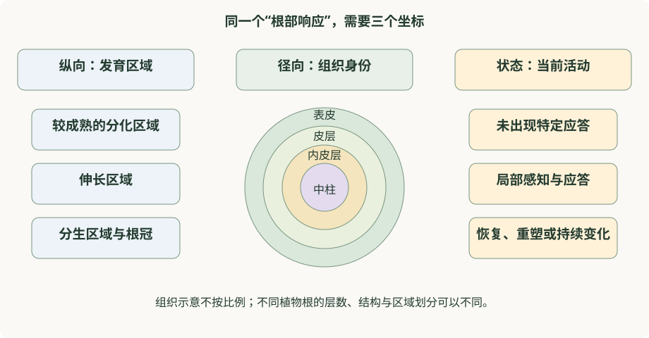

# 第 19 章　根部免疫：在持续接触微生物时维持边界

根每时每刻都与土壤微生物接触，却不能把每次接触都当作需要全力防御的事件。它还要吸收水分和矿质元素，继续伸长，并与某些微生物形成有益关系。因此，根部免疫的核心问题并不是“根有没有免疫”，而是：**不同位置的细胞如何根据组织状态和外界信息，决定何时响应、响应到什么程度。**

**学习目标。** 读完本章，你应能画出根的纵向与径向两套坐标，区分细胞类型与免疫状态，解释微生物模式和损伤信息为什么需要共同解读，并避免把叶片结论或整根平均值直接套用到所有根细胞。先修建议：[第 0 章](../learning/ch00-细胞与分子基础.md)、[第 3 章](../part2-分子机制/ch03-受体与信号转导.md)、[第 10 章](../part4-交叉前沿/ch10-植物微生物组与免疫.md)。

## 19.1 根不是埋在地下的叶片

叶片主要承担光合作用和气体交换；根主要承担吸收、固定、储存等功能。二者面对的微生物环境、表面结构、组织通透性和营养关系不同。它们可以共享许多信号组件，却不必以相同方式部署这些组件。

叶片免疫研究中常见的气孔反应，不能成为根部免疫的统一入口模型。根尖、根毛区、侧根形成区域和较成熟的根段，各自具有不同发育背景与外界接触方式。即使来自同一株植物，根与叶对同一种刺激的读数也可能不同。

Millet 等人的研究表明，拟南芥根能够对微生物相关分子模式产生响应，而且不同信号与组织位置存在响应差异（Millet et al., 2010）。对初学者而言，最重要的结论是“根具有可研究的免疫能力”，而不是寻找一条适用于整个根的固定响应曲线。

**认知修正。** “某个叶片标记基因在根中没有明显变化”不能直接推出“根没有发生免疫”。这也可能说明标记不适合该组织、检测时间不匹配，或只有少量细胞响应而被整根平均值稀释。应先检查测量是否能够回答问题，再讨论机制是否存在。

## 19.2 给根建立两套坐标

沿根的长度方向，可以识别根冠及靠近根尖的分生区域、伸长区域和较成熟的分化区域。它们是连续发育过程中的不同区域，而不是完全独立、永不变化的“器官”。根在生长，细胞的位置、年龄和功能也随之变化。

沿根的半径方向，则可以从外向内区分表皮、皮层、内皮层和中柱等组织。拟南芥常被用作简化模型，但不同物种的层数、结构和发育模式不完全相同。把拟南芥根画成几圈同心圆，有助于入门，却不代表所有作物根都具有同样的构造。

| 位置或细胞群 | 主要生理背景 | 理解免疫时的重点 |
|---|---|---|
| 根冠及根尖附近 | 保护生长端，与外部环境不断接触 | 细胞更新、分泌和位置依赖性 |
| 表皮和根毛 | 与根际直接交换物质 | 接触信号与吸收功能如何协调 |
| 皮层 | 支持组织功能与径向物质传递 | 不同细胞之间是否形成响应差异 |
| 内皮层 | 调节进入中柱的物质通路 | 屏障完整性与信号分区 |
| 中柱内各类组织 | 运输、维管功能与侧根相关发育 | 局部信息如何与整株状态联系 |
| 侧根相关区域 | 生长过程中发生组织重塑 | 发育变化与防御读数是否混杂 |

**图 19.1　用三种信息定位一个根部响应。** 纵向位置告诉我们细胞所处的发育区域，径向位置告诉我们组织身份，细胞状态告诉我们当前是否感知信号或处于应激。图为概念示意，未按实际组织比例绘制，也不表示所有物种具有相同层数。

同一细胞类型在不同发育区可以有不同响应；同一发育区内也可以同时存在不同细胞类型。一个结论若只写“根细胞中上调”，往往还不够精确。至少要继续问：是哪一类细胞，位于什么区域，在什么背景下上调？

## 19.3 微生物模式不是“坏微生物身份证”

微生物相关分子模式（microbe-associated molecular pattern, MAMP）往往来自微生物较为保守的结构或分子。它们可以出现在潜在病原，也可以出现在与植物和平共存的微生物中。植物感知到某类 MAMP，更接近获得“附近存在具有这一分子特征的微生物”的信息，而不是直接完成了对互作结局的判决。

危险判断还与宿主是否受损、受体是否存在、信号是否可达、组织是否成熟等有关。这里的“整合”不是要求植物有一个集中决策中心，而是指多个分子过程共同决定输出。某些条件改变后，相同的外界信号可能产生不同结果。

Zhou 等人在拟南芥根中观察到，邻近细胞损伤能够改变局部模式识别受体表达和响应能力，支持损伤信息与微生物模式共同控制局部免疫的模型（Zhou et al., 2020）。这项研究为解释根如何避免对持续微生物接触一律强响应提供了依据。

不过，“损伤门控（damage gating）”不能改写成“所有根部免疫都必须先损伤”。Rich-Griffin 等人记录的细胞类型特异性响应，以及不同研究条件下的响应差别，提示培养背景、刺激类型、细胞身份和所用读数都会影响观察（Rich-Griffin et al., 2020）。科学模型越有解释力，越需要明确它实际解释了哪些条件。

## 19.4 内皮层：营养边界也是免疫的空间背景

内皮层对根内物质通路的控制，依赖不同结构成分的有序形成。**凯氏带（Casparian strip）**主要指内皮层特定细胞壁区域形成的木质化屏障；**木栓质（suberin）**的沉积则形成另一种具有特定位置与发育调控的屏障特征。二者相关，但不是同一个结构的两个名字。

这些屏障改变物质如何从根表进入内部，也改变细胞接触某些外部信号的机会。因此，屏障缺陷材料中出现不同免疫读数，可能包含多条解释：信号到达位置改变、营养状态改变、发育状态改变，或免疫调控本身改变。把所有差异直接解释为“受体活性增强”会跳过必要步骤。

Salas-González 等人的研究将微生物组、内皮层屏障与矿质营养稳态联系起来，显示宿主屏障与微生物群落存在双向影响（Salas-González et al., 2021）。这支持把根看成营养与微生物互作相互连接的系统；它并不意味着任意增加屏障厚度都会提高抗病性。

一个简单的推理练习是：如果某材料根组织中的一个信号读数更高，但同时离子组成和生长发生变化，那么“免疫信号直接增强”只是候选解释之一。需要将结构、营养和免疫三个层次区分开，才能说明哪个变化在先，哪个变化可能是后果。[第 17 章](ch17-屏障与化学防御.md)进一步讨论屏障为何是动态结构。

## 19.5 共生、共栖与致病：关系取决于双方和环境

**共生（symbiosis）**在广义上指不同生物的紧密共同生活，并不在所有语境下都等于互利。**互利共生（mutualism）**强调双方获益；**共栖（commensalism）**通常指一方获益，而另一方在所考察条件下未见明确净影响。植物研究中常讨论的菌根或根瘤共生，强调了特定互作中的营养交换和双方调控。**内生（endophytic）**描述微生物位于植物组织内部的一种生活位置；仅凭“内生菌”这个名称，不能断言它在所有条件下都有益。

同样，“有益微生物”是对特定关系和条件下的结果作出的概括。一个菌株是否促进生长，取决于宿主、营养、环境以及群落背景。它具有某些微生物模式，并不妨碍它在合适条件下产生净收益。反过来，在健康植物上出现得多，也不自动证明它能够促进健康。

Hiruma 等人研究的根部内生真菌 *Colletotrichum tofieldiae*，为这一点提供了有意义的例子：其对宿主的营养和生长贡献与磷状态有关，宿主相关调控也参与维持有益互作（Hiruma et al., 2016）。这个案例的重要性在于说明，互作结果需要同时考虑营养条件与宿主控制，而不能只按微生物属名分类。

根与有益微生物的关系也不宜写成“植物完全关闭免疫，允许伙伴进入”。维持合适的空间、数量和资源交换，本身可能需要宿主调控。免疫系统在这里不只是清除入侵者，还参与维持一种可以持续的互作状态。[第 10 章](../part4-交叉前沿/ch10-植物微生物组与免疫.md)从群落角度展开这一主题。

## 19.6 根—冠联系：局部变化怎样成为整株问题

根与地上部共享水分、营养和信号运输网络。根际变化可能影响叶片生理，叶片状态也可能改变向根分配的碳和其他物质。因此，“根中发生”并不等于“只有根起作用”。解释远端防御改变时，应同时考虑局部感知、长距离信息传递和远端组织的响应能力。

如果叶片防御标记在根部条件改变后上升，首先支持的是根部条件与叶片分子状态存在联系。要把它解释为诱导系统抗性（induced systemic resistance, ISR），还需要与系统性保护相匹配的功能证据。若植物营养改善后整体长势更好，也不能直接把所有表现都归因于免疫增强。

远端响应还可能涉及不同时间尺度：较快的信息传递、较慢的代谢与转录重塑，以及更长期的生长调整。它们可以同时存在。把一张终点照片作为全部证据，容易把这些过程混成一个故事。关于移动信号与远端合成的区别，参见[第 18 章](ch18-系统免疫与防御预激.md)。

## 19.7 里程碑思路拆解：为什么必须看到具体细胞

**面对的问题。** 如果根一直暴露于微生物模式，为什么不总是表现为全根强烈防御？整根平均值只能告诉我们总体发生变化，难以定位决定变化的细胞。

**关键思路。** 将“是否存在受体”“能否出现响应”“邻近组织状态如何”分开观察，再比较不同位置。Zhou 等人的研究把局部损伤与模式感知相联系；Rich-Griffin 等人的研究则从细胞类型相关转录网络出发，显示细胞身份会影响响应组织方式。这两条证据路线回答不同问题，不能互相替代。

**如何读证据。** 若某一位置受体表达与响应一同增强，这支持二者相关，但尚不足以排除其他共同变化。若进一步有功能证据支持受体水平影响响应，则因果解释更有依据。仍需注意，受体表达报告信号不等于活性蛋白量，转录响应也不等于最终抗病结局。

**认知改变。** 讨论“根的免疫强弱”时，应同时给出组织坐标和测量层次。不同论文结果不完全一致，有时反映的是研究对象的空间或条件差别，而不是其中一方必然错误。

## 19.8 如何读根部单细胞结果

**细胞类型（cell type）**强调相对稳定的身份和功能，例如内皮层；**细胞状态（cell state）**强调在特定时间和条件下的活动模式，例如某种防御转录状态。同一类型可以包含多个状态，同一状态也可能跨越多个类型。

在图上出现一个新簇，不能单凭聚类就命名为新的“免疫细胞类型”。它可能是原有类型中的应答状态，也可能受样本质量、技术批次或处理过程影响。植物具有细胞类型特异性的防御能力，与存在动物式循环免疫细胞，是不同命题。

Nobori 等人在拟南芥叶片中描述的 PRIMER 稀有细胞状态，说明细胞分辨率研究能够揭示整组织平均值难以看见的异质性（Nobori et al., 2025）。这里应保留“叶片”“特定互作”和“状态”三个限定，不能未经证据就把它当作所有植物根系共有的固定细胞谱系。

另一个常见陷阱是细胞比例。如果一个基因主要在某类细胞中表达，而样本中这类细胞的比例增加，那么整根 RNA 水平也可能升高，即使每个细胞内部的表达没有变化。单细胞研究能够帮助拆分这两个问题，但细胞捕获率和样本制备偏差仍需考虑。[第 20 章](ch20-如何阅读植物免疫证据.md)进一步讲解如何评价这样的证据。

## 19.9 开放问题与理解边界

根部免疫仍有许多值得研究的问题。哪些空间规则在不同作物中保守，哪些只适用于特定根结构？根发育过程中，受体分布与实际响应能力何时发生变化？不同营养背景如何改变同一个微生物伙伴的作用？来自局部少量细胞的信号，怎样影响整株植物而不过度干扰生长？

这些问题提示我们，“全面理解”不是把根部所有基因列出来，而是把位置、状态、环境和结果连接起来。读者能够说明某个结论在哪些条件下成立，并指出仍缺少哪一层证据，比记住更多没有上下文的基因名更重要。

## 本章自测与讲解

**1. 同一种刺激在根尖与成熟根段产生不同响应，是否说明实验一定失败了？**

不一定。两处的细胞身份、发育状态、受体分布和信号可达性都可能不同。应先检查这些背景以及检测体系是否一致，不能把空间差异自动当作噪声。

**2. 为什么“损伤可以加强某些局部响应”不等于“没有损伤就没有根部免疫”？**

前者是条件明确的机制发现，后者是覆盖所有细胞、信号和环境的全称命题。现有证据支持情境依赖的门控与空间组织，不能直接支持这个绝对化推断。

**3. 一个根部微生物在缺磷时促生，在另一环境中没有促生作用，哪种结果才是真实的？**

二者都可能真实。互作收益依赖资源背景和宿主状态。关键是准确报告环境、比较对象和结局，而不是给微生物贴一个永久的“有益”或“有害”标签。

**4. 整根某防御基因表达升高，至少有哪些不同解释？**

原有细胞中的表达增强，表达该基因的细胞比例增加，少量细胞出现极强响应，或技术与组织组成偏差，都可能贡献整根变化。需要与空间或细胞层面的证据结合。

**5. 叶片中发现一种免疫相关细胞状态，能否直接拿它的单个标记给番茄根细胞命名？**

不能。必须先考虑物种与器官差异，并结合多个身份标记、空间信息和独立功能证据。保守基因或相似表达是线索，不是身份与功能等价的证明。

## 推荐阅读与参考文献

- **入门：根能够怎样响应。** Millet YA, et al. *Innate immune responses activated in Arabidopsis roots by microbe-associated molecular patterns.* The Plant Cell, 2010; 22: 973–990. [论文](https://doi.org/10.1105/tpc.109.069658)。关注不同读数与组织位置，建立根免疫的基本问题意识。
- **必读：空间逻辑。** Zhou F, et al. *Co-incidence of Damage and Microbial Patterns Controls Localized Immune Responses in Roots.* Cell, 2020; 180: 440–453.e18. [论文](https://doi.org/10.1016/j.cell.2020.01.013)。关注模型的适用条件，避免把局部机制读成全根定律。
- **重要：细胞身份。** Rich-Griffin C, et al. *Regulation of Cell Type-Specific Immunity Networks in Arabidopsis Roots.* The Plant Cell, 2020; 32: 2742–2762. [论文](https://doi.org/10.1105/tpc.20.00154)。与前一篇对照阅读，理解不同问题与条件可以揭示不同层次。
- **重要：结构与营养。** Salas-González I, et al. *Coordination between microbiota and root endodermis supports plant mineral nutrient homeostasis.* Science, 2021; 371: eabd0695. [论文](https://doi.org/10.1126/science.abd0695)。用来理解屏障、微生物与营养的联系，不能把营养改善直接等同于抗病。
- **拓展：条件依赖的有益互作。** Hiruma K, et al. *Root Endophyte Colletotrichum tofieldiae Confers Plant Fitness Benefits that Are Phosphate Status Dependent.* Cell, 2016; 165: 464–474. [论文](https://doi.org/10.1016/j.cell.2016.02.028)。关注结论中的营养条件，而非只记住微生物名称。
- **拓展：细胞类型与状态。** Nobori T, et al. *A rare PRIMER cell state in plant immunity.* Nature, 2025; 638: 197–205. [论文](https://doi.org/10.1038/s41586-024-08383-z)。此研究来自叶片，作为方法与概念对照，不作为根系普遍机制的直接证据。

[← 第 18 章：系统免疫](ch18-系统免疫与防御预激.md) · [第 20 章：如何阅读证据 →](ch20-如何阅读植物免疫证据.md)
