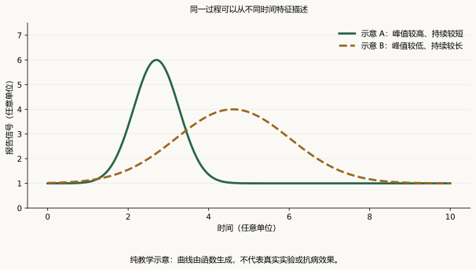

# 第 20 章　如何阅读植物免疫证据：从一张图到一个可信结论

学会植物免疫，不只意味着知道某些蛋白的名字，还意味着能够回答：这项研究实际观察到了什么？哪一步解释最有把握？哪些结论仍需其他证据？面对一张复杂图，初学者最容易感到困难的，往往不是某个技术名词，而是作者省略了的推理过程。

本章以证据阅读为主线，不要求掌握实验操作或编程。读完后，你应能区分反应指标与抗病结局、必要性与充分性、相关与因果，理解生物学重复，并完成一份结构清楚的论文笔记。建议在读完[第 0 章](../learning/ch00-细胞与分子基础.md)和[第 2 章](../part1-免疫骨架/ch02-PTI与ETI的关系演变.md)后提前阅读本章，随后在各机制章节中反复使用。

## 20.1 一篇论文通常包含三个不同层次

**观察层**记录被测到的现象，例如某种信号增强、某个蛋白在特定位置出现。**解释层**提出能够说明现象的机制，例如一个受体复合体影响下游反应。**外推层**讨论这个机制对其他物种、田间条件或育种有什么意义。

这三个层次都重要，但证据要求不同。清晰的成像可以支持定位，未必证明直接相互作用；在某一遗传背景中得到的结果，可以支持一个机制，未必保证换到另一作物后产生同样效果。论文讨论部分出现“可能”“提示”“有望”，通常是在标记这种边界。

阅读时，可以把句子分别标成“观察”“解释”“外推”。如果一段话从一个标记基因的上升直接跳到提高作物产量，中间很可能缺少组织、生理和环境层面的证据。识别这种跳跃，并不是否定研究，而是准确理解它完成了哪一步。

## 20.2 先看测量对象，再看图有多漂亮

免疫系统没有一个能够概括全部状态的“免疫值”。不同读数观察不同层次，而且可能具有不同时间动态。一个早期信号很强但无法持续，和一个早期较弱却能形成有效后续响应的系统，最终结局可能不同。

| 证据或读数 | 直接支持的问题 | 常见的过度解释 |
|---|---|---|
| RNA 表达 | 哪些转录本发生变化？ | 转录本越高，抗性一定越强 |
| 蛋白丰度或修饰 | 特定蛋白状态是否变化？ | 一个位点变化解释所有输出 |
| ROS、钙或信号报告 | 某类早期响应如何变化？ | 峰值高就是防御成功 |
| 细胞死亡、组织损伤 | 哪些细胞或组织失去完整性？ | 损伤越大，免疫越有效 |
| 微生物负担 | 特定条件下微生物数量或活动如何变化？ | 所有差异都来自直接免疫作用 |
| 生长、产量、繁殖 | 宿主表现及代价如何变化？ | 长势好就已经证明抗病 |
| 空间或单细胞数据 | 什么位置或状态存在异质性？ | 一个新聚类就是新细胞谱系 |

同一读数也可能受测量方式影响。报告基因信号通常是代理指标；它是否与目标过程同步，取决于表达调控、报告分子的稳定性和检测条件。一个稳定的报告蛋白可能在信号已经下降后仍可见。因此，图例中的检测对象、时间点和单位不是附属信息，而是理解结论的一部分。

## 20.3 相关、必要、充分、直接作用：四类不同的机制命题

这些命题回答不同问题，不能简单排成一条从弱到强的等级链。某种作用可以是直接的，却因功能冗余而不是特定输出的必要条件；一个因素也可能是必要的，却通过间接过程发挥作用。

**相关性**指两个变化在观察中共同出现。它提示值得解释的联系，但不能单独决定方向，也不能排除共同原因。例如生长较慢与防御标记较高同时出现，既可能涉及资源分配，也可能由某个更上游状态共同驱动。

**必要性**关注缺少某因素时，某个结果能否正常发生。如果某因素缺失后响应减弱，通常应表述为“对完整响应有贡献”或“在该条件下对该输出重要”。只有读数和条件允许时，才适合使用“必需”。“对某一种输出必需”也不自动等于“对所有免疫必需”。

**充分性**关注引入或激活某因素，能否在指定背景下带来某个结果。这里的背景不可省略：现成的伙伴、代谢状态或组织能力，可能是结果出现的前提。因此，“在一个系统中足以触发输出”不意味着这个因素在任何细胞中单独就足够。

**直接作用**则要求更具体的物理或生化关系。共定位说明空间重叠，通常不等于直接结合；共同出现于一个复合体，也可能由第三个成员连接；遗传顺序支持功能关系，未必证明直接催化或转运。研究中常把多种证据结合起来，以缩小这些解释空间。

**理解练习。** 某材料中 A 的变化总伴随 B 的变化，这是相关证据；缺少 A 后 B 的正常变化减弱，增加了功能依赖证据；若还有与特定分子作用匹配的证据，才可进一步讨论直接机制。证据链不是简单地“图越多越好”，而是每张图能否排除一个重要替代解释。

## 20.4 对照的作用：让不同解释可以被区分

对照并不是文章格式上的配件。它提供反事实参照：如果目标因素没有发生变化，本来会怎样？一个比较是否有说服力，取决于两组是否在研究问题之外尽可能可比。

假设某遗传材料防御指标偏高，同时植株明显矮小。仅凭两项共存，无法判断是防御导致生长改变，还是发育异常使指标发生变化，或者另一个因素同时影响二者。阅读时应寻找能够区分这些解释的证据，而不是预先选一个最符合故事的方向。

**互补证据**可加强某基因与表型的联系；**独立材料**可降低特定遗传背景导致结论的风险；**不同测量层次**可以检查结果是否相互一致。这些证据并非每篇论文都必须以同一形式出现，但作者应说明其结论依赖哪些比较、哪些局限尚未排除。

空间与时间也属于对照逻辑。比较两种处理时，如果一个样本来自年轻叶片，另一个来自衰老叶片，那么差异可能主要来自发育。根部研究若把不同发育区域混在一起，也会出现类似问题。看懂“比较是否公平”，比先记住测量仪器型号更有价值。

## 20.5 重复、样本量与误差线：统计图的基础语法

**生物学重复（biological replicate）**反映独立生物单位之间的变异；**技术重复（technical replicate）**反映对同一样本重复测量的变异。真正的独立单位由设计决定，可以是独立植株、独立批次或其他合理单位，不能仅凭图上有多少个点来判断。

如果从一株植物取了多张叶片，叶片可能共享许多背景。若把每张叶片都当作完全独立植株，就会夸大独立信息量，这属于**伪重复（pseudoreplication）**问题。正确处理方式取决于样本的层级结构；重点是不能把同一来源的多个测量伪装成多个独立来源。

下面是**人为构造的教学数据，不来自真实实验，也不能用于推断任何具体分子的作用**。每个数是一个假想报告信号的任意单位值。

| 组别 | 独立植株 | 第一次技术读数 | 第二次技术读数 | 植株平均值 |
|---|---|---:|---:|---:|
| A | A1 | 9 | 11 | 10 |
| A | A2 | 11 | 13 | 12 |
| A | A3 | 10 | 12 | 11 |
| B | B1 | 11 | 13 | 12 |
| B | B2 | 12 | 14 | 13 |
| B | B3 | 13 | 15 | 14 |

两组各有 3 株独立植物，而不是各有 6 个独立植物样本。根据植株平均值，A 组均值为 11，B 组均值为 13，差值为 2 个任意单位。这些描述不等于完成统计推断，更不等于证明抗病性提高。技术读数比较稳定，也不能补偿独立生物样本的信息不足。

**标准差（standard deviation, SD）**描述数据分散程度；**标准误（standard error, SE）**描述估计量的不确定性，在简单独立同分布条件下，均值标准误常按 SD/√n 计算。**置信区间（confidence interval, CI）**则依所用模型和方法表达参数估计的不确定性。看到误差线时必须读图例，不能默认它们都代表同一件事。

P 值也不是“结论为假的概率”。它与指定零假设及统计模型下观察到当前或更极端数据的相容程度有关。小 P 值不能替代效应大小、设计质量和可重复性；没有达到某个显著性阈值，也不能自动证明两组完全相同。

## 20.6 时间曲线：峰值、持续时间与基线是不同信息

一条信号曲线可以从多个角度描述：刺激前基线、出现变化的时刻、峰值、达到峰值的时间、恢复速度，以及一定时间范围内的累积读数。两个样本可能峰值相似而持续时间不同，也可能峰值不同但后续转录结果接近。

**图 20.1　教学示意：高峰与持久不是一回事。** 图中两条曲线由示意函数生成，没有真实实验含义。横纵坐标使用任意单位，只用来说明比较时间过程时不能仅看最高点。曲线下的面积也不能直接等同于防御效果。

归一化会进一步影响视觉理解。如果每条曲线都把自己的最大值设为 1，原本峰值幅度的差别就消失了；如果相对各自基线计算倍数变化，较低的基线可能带来较大的倍数。归一化并不错误，但必须与问题一致，并清楚说明参照是什么。

植物免疫具有动态性。研究者在一个时刻观察到没有差异，可能确实意味着该时刻相似，也可能错过早期变化或延迟响应。读者应避免用单个时间点的结果覆盖整个过程，同时也不能因为存在时间可能性，就无依据地替一个没有证据的模型辩护。

## 20.7 组学图谱：信息丰富不等于因果链完整

转录组、蛋白质组、代谢组和微生物组可以帮助发现系统性变化。它们的价值在于扩大观察范围，也因此带来多重比较、批次效应和解释选择的问题。在成千上万个特征中寻找差异时，需要控制多重检验造成的误判风险。所谓“显著富集”，还取决于背景基因集合和注释质量。

**通路富集**表示与某注释集合相关的特征出现了超出某种背景预期的分布，不等于这条通路的所有成员都被激活。**共表达网络**表示表达模式有关联，也不直接给出调控方向。**差异代谢物**提示化学状态变化，但如果没有可靠鉴定，就不宜把一个质谱特征直接写成确定化合物。

微生物相对丰度还有组成性约束：所有组分的比例总和固定。某一类群比例上升，可能是它增加，也可能是其他类群减少。相对丰度图本身不能完全回答绝对数量问题。某微生物与健康状态相关，同样不等于它就是健康的原因。

单细胞数据提供了另一层分辨率，但来自同一株或同一样本的许多细胞共享来源。统计推断若忽略这种层级，可能夸大差异证据。Zimmerman 等人和 Squair 等人的方法研究讨论了这类问题，强调需要在分析中正确处理独立样本和样本间变异（Zimmerman et al., 2021；Squair et al., 2021）。这些原则适用于解释植物数据，但具体方法的适用性仍取决于研究设计。

对初学者而言，可以先问四件事：样本究竟来自多少个独立来源？分析比较的是细胞比例还是细胞内部状态？批次与生物条件是否混在一起？是否有独立证据支持最重要的生物学解释？这四个问题通常比记住软件名称更能帮助判断结论。

## 20.8 两个里程碑案例：把“证明了什么”写准确

### 案例一：PTI 与 ETI 的协同

2021 年 Ngou 等人与 Yuan 等人的研究，为细胞表面和胞内免疫系统的相互增强提供了关键证据。读这组论文，应把具体感知系统、遗传背景与输出读数记在一起，再判断作者讨论的依赖或协同出现在哪一层（Ngou et al., 2021；Yuan et al., 2021）。

合适的概括是：在研究所检验的系统中，两类感知入口的配合有助于形成完整响应。过度的概括则是：所有 PTI 和 ETI 在任何条件下都彼此绝对必需。后者需要覆盖远多于这些研究实际检验的情况。模型的重要性，来自它修正了简单的分离观，而不是赋予我们忽略物种和受体差异的理由。

### 案例二：从结构到通道功能

一种蛋白复合体的结构看起来具有通道形态，可以提出很强的功能假说。但结构形态与离子实际通过，是两个层次的问题。ZAR1 抗病小体的结构研究与后续通道功能研究，应按它们各自提供的证据来阅读，而不应把后来的功能结论全部提前归到最早的结构论文上（Wang et al., 2019；Bi et al., 2021）。

这一案例可以推广成通用阅读习惯：先写“观察到的结构特征”，再写“结构提示的功能”，最后写“独立功能证据”。当三者彼此吻合，机制解释更有说服力；但从一个代表性复合体推广到所有同类蛋白，仍需要新的证据。

## 20.9 从论文摘要走向精读

摘要适合回答研究问题、主要发现和大致意义，却通常省略关键条件与例外。只读摘要，可以写出摘要层面的概括，不能假装已经审核每幅图的对照、样本量和分析。若全文不可访问，应明确保留这个限制。

正式精读可以分三轮。第一轮读题目、摘要和总模型，建立问题地图；第二轮逐图读结果，写出每张图直接支持的一句话；第三轮回到方法、补充材料与讨论，检查条件、替代解释和外推边界。这个顺序可以按个人习惯调整，但不能让漂亮的总模型替代中间证据。

还要检查文献的版本状态。预印本未完成正式同行评议；正式论文可能有作者更正、编辑说明或撤稿信息。DOI 和年份也可能有不同层次：在线发表年份、卷期年份，以及 DOI 字符串中的年份并不一定一致。核对时应以出版社的正式记录为准，不应凭 DOI 外观猜日期。

在具体图中遇到技术缩写时，可以转读[第 21 章的 Co-IP 与 Y2H](../part7-研究技术与实验逻辑/ch21-蛋白质相互作用研究技术.md)、[第 22 章的表达定位与转录调控](../part7-研究技术与实验逻辑/ch22-表达定位与转录调控研究技术.md)和[第 23 章的遗传与免疫读数](../part7-研究技术与实验逻辑/ch23-遗传学与免疫表型研究技术.md)。这些章节把本章的推理原则落实到图例、条带、报告信号及对照比较。

## 20.10 一页论文笔记模板

下面的表格既可用于课堂，也可用于自学。每格只写一两句话，但要写完整。

| 项目 | 需要写清的内容 |
|---|---|
| 研究问题 | 作者想区分哪两种或哪几种解释？ |
| 研究对象与范围 | 物种、器官、主要背景与论文类型 |
| 关键观察 | 哪个被测量的量在怎样的比较中改变？ |
| 最强证据 | 哪一项结果最能排除重要替代解释？ |
| 机制解释 | 证据如何连接，是否存在跳步？ |
| 尚未证明 | 哪些箭头仍属推测，哪些范围未被检验？ |
| 与本书的联系 | 它修正了哪一章的哪个概念？ |
| 文献状态 | DOI、正式版本及可见更正；实际阅读到摘要还是全文 |

不要用“文章很重要、做得很全面”作为笔记主体。更有用的是写出：“它把原先共同变化的两个过程分开比较，支持其中一个过程在特定条件下对另一个过程有贡献。”当你能这样描述研究，通常已经开始真正理解科学推理。

## 本章自测与讲解

**1. 某处理使 ROS 峰值提高 50%，可以写成“抗病性提高 50%”吗？**

不可以。它们是不同测量对象。即使比例计算无误，也只能首先描述该 ROS 读数；抗病性需要与疾病结局匹配的证据，二者不存在通用换算关系。

**2. 一株植物测了 100 个细胞，另一株也测了 100 个，是否就是每组 n=100？**

对细胞描述性分析，可以报告测得的细胞数；但若要推断植株层面的条件差异，不能把它们当成 100 株独立植物。此例每组生物学重复数为 1，无法估计组内植株间变异；增加细胞数或更换统计模型，不能补足缺失的独立生物学重复。

**3. 一个突变体没有显著差异，能否宣布该基因完全不参与免疫？**

不能。结果可能与条件、读数、统计精度、功能冗余或实际效应有关。应报告在所检验条件下未发现明确差异，而不是对所有情境作出否定。

**4. 共表达分析显示 A 与 B 高度相关，为什么还不能画出“A 直接激活 B”？**

共表达没有自动给出因果方向，二者也可能受共同上游调控。直接激活是更具体的命题，需要与该命题相匹配的证据。

**5. DOI 中有“024”，而出版社记载正式发表在 2025 年，应引用哪一年？**

通常按正式出版记录及所采用参考文献规范填写。DOI 是标识符，不是可靠的发表日期编码。若在线发表与卷期年份不同，可在笔记中分别记录。

**6. 如何判断自己是否真正读懂一篇文章？**

试着不用作者的总模型图，只凭自己的笔记说明研究问题、关键比较、最强证据和未解决问题。如果只能复述结论，不能解释为什么它比替代解释更合理，说明还需要回到结果与对照。

## 推荐阅读与参考文献

- Bi G, et al. *The ZAR1 resistosome is a calcium-permeable channel triggering plant immune signaling.* Cell, 2021; 184: 3528–3541.e12. [原始论文](https://doi.org/10.1016/j.cell.2021.05.003)。与结构论文配对，练习区分形态与功能证据。
- Ngou BPM, et al. *Mutual potentiation of plant immunity by cell-surface and intracellular receptors.* Nature, 2021; 592: 110–115. [原始论文](https://doi.org/10.1038/s41586-021-03315-7)。练习按具体输出解释“相互增强”。
- Squair JW, et al. *Confronting false discoveries in single-cell differential expression.* Nature Communications, 2021; 12: 5692. [原始方法研究](https://doi.org/10.1038/s41467-021-25960-2)。关注样本间变异与假发现；不要求初读时掌握所有计算细节。
- Wang J, et al. *Reconstitution and structure of a plant NLR resistosome conferring immunity.* Science, 2019; 364: eaav5870. [原始论文](https://doi.org/10.1126/science.aav5870)。用来辨认结构直接展示了什么，以及哪些功能仍需独立验证。
- Yuan M, et al. *Pattern-recognition receptors are required for NLR-mediated plant immunity.* Nature, 2021; 592: 105–109. [原始论文](https://doi.org/10.1038/s41586-021-03316-6)。练习让强结论保留原研究的对象与条件。
- Zimmerman KD, Espeland MA, Langefeld CD. *A practical solution to pseudoreplication bias in single-cell studies.* Nature Communications, 2021; 12: 738. [原始方法研究](https://doi.org/10.1038/s41467-021-21038-1)。理解细胞数量为何不能替代独立样本数量。

[← 第 19 章：根部免疫](ch19-根部免疫与共生边界.md) · [第 21 章：Co-IP、Y2H 与蛋白互作 →](../part7-研究技术与实验逻辑/ch21-蛋白质相互作用研究技术.md) · [回到学习路线](../learning/学习路线与知识地图.md)
