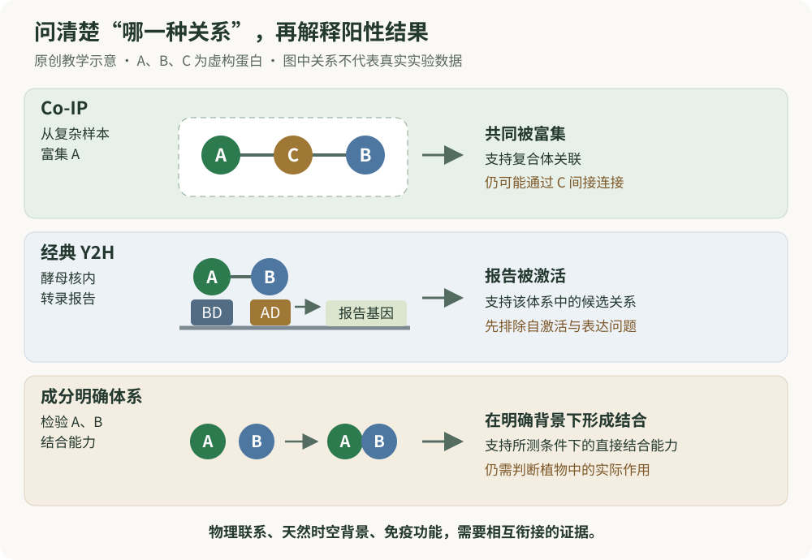
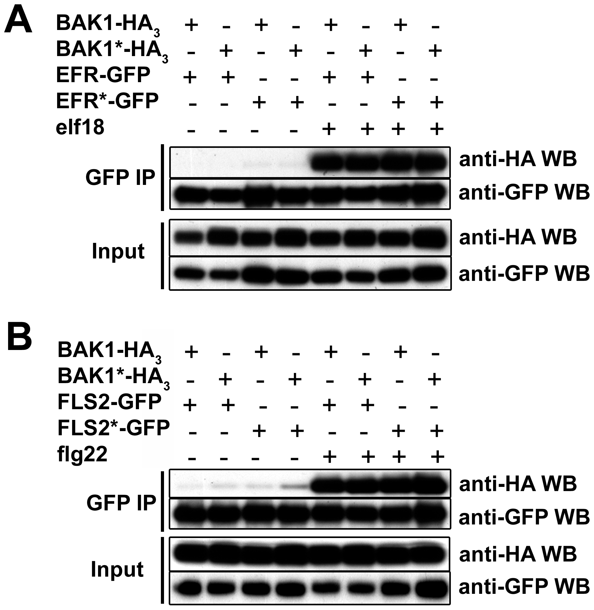
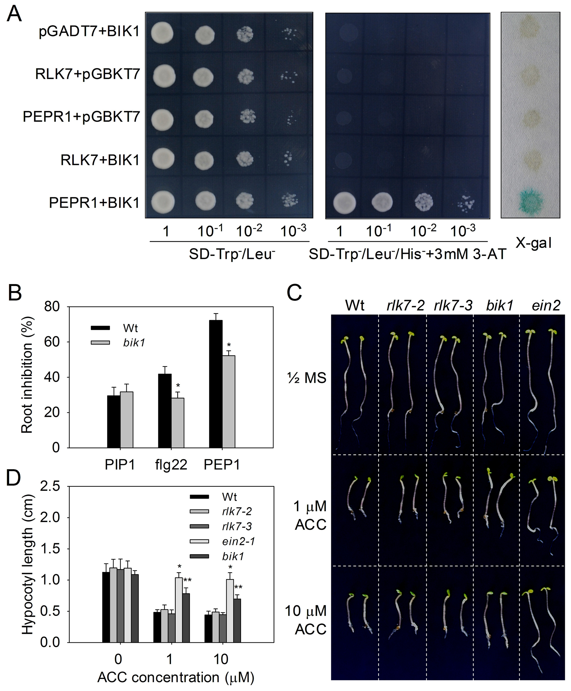
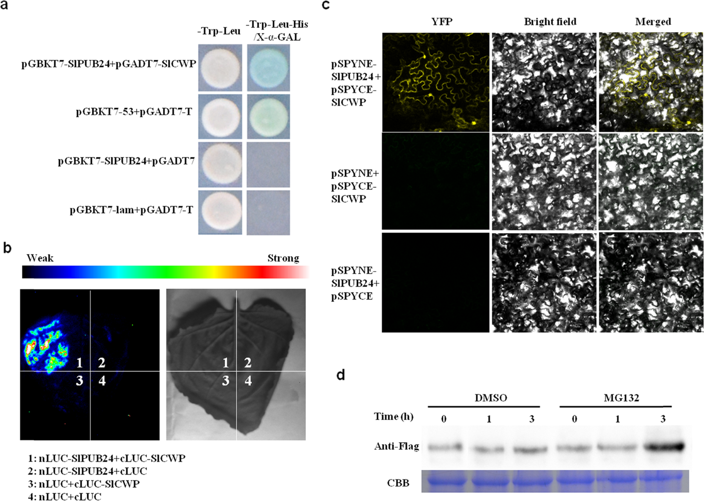

# 第 21 章　蛋白质相互作用研究技术：怎样读懂 Co-IP、Y2H 与互作证据

读植物免疫论文时，经常会遇到这样的句子：“A 与 B 相互作用，因此 A 通过 B 调控免疫。”前半句需要物理联系的证据，后半句还需要功能与因果证据。中间的距离，不能仅用一张条带图或一幅发光图跨过。

本章从**免疫共沉淀（co-immunoprecipitation，Co-IP）**和**酵母双杂交（yeast two-hybrid，Y2H）**讲起，再介绍常见的互补方法。重点是理解研究者在问什么、仪器实际检测什么，以及结论能够走到哪里。读完后，你应能独立读懂基本的 Co-IP 图和 Y2H 对照表，并为一组互作结果写出有分寸的结论。

**前置知识。** 蛋白质有三维结构和亚细胞位置；抗体可以识别特定抗原或标签；基因表达能产生可检测的报告信号。若这些概念还陌生，先读[第 0 章](../learning/ch00-细胞与分子基础.md)。有关相关性、直接性与必要性的区别，参见[第 20 章](../part6-专题与研读/ch20-如何阅读植物免疫证据.md)。

**阅读路线。** 第一次阅读先掌握 21.1—21.5 和比较表；第二次加入成像与组学方法；最后对照出版原图和自测检查自己是否把“共沉淀”“接近”“直接结合”“具有功能”混在了一起。

## 21.1 “相互作用”至少包含四种不同的问题

植物免疫依靠受体、激酶、辅助蛋白和转录调控因子之间的联系。但是，论文中的“互作”并不总指两个蛋白表面直接接触。

**第一种是空间共存。** A 和 B 都出现在细胞核或质膜，说明它们有相遇的可能；一个细胞器中同时存在大量蛋白，共定位本身不证明特异联系。

**第二种是同一复合体中的关联。** A 与 B 能一起被富集，可能因为直接结合，也可能通过第三个蛋白 C、核酸或更大的结构连接。Co-IP 主要提供这一层的信息。

**第三种是分子尺度的接近或结合能力。** 某些细胞内报告方法要求两种标签足够接近；由成分清楚的蛋白体系得到的结合证据，则有助于判断是否需要细胞中的其他成员。两者的研究背景不同。

**第四种是生物学作用。** 即使 A 能结合 B，也还需要解释：这种关系在什么组织、什么状态下发生？改变这层关系，是否影响目标免疫输出？大量真实的物理联系并不是某一个表型的决定因素。

**图 21.1　互作方法观察的是不同层面的关系。** 上图中的字母代表虚构蛋白。Co-IP 可保留由 C 连接的 A—B 关系；Y2H 把蛋白关系转化为酵母中的转录报告；成分明确的体系有助于检验直接结合能力。三种图景不能互相替代，任何一种都还需与植物中的功能证据衔接。本图为原创教学示意。

这里没有“一种方法永远优于另一种”的排序。较接近天然环境的方法，可能难以排除间接连接；较简化的体系，可能失去天然修饰、膜环境或其他必要伙伴。方法选择的关键，是让测量对象与研究问题对应。

## 21.2 Co-IP 的原理：富集 A，再看 B 是否同行

**免疫沉淀（immunoprecipitation，IP）**利用抗体识别目标蛋白或其标签，使该蛋白从复杂样本中被富集。若研究者进一步检测随它一起富集的其他蛋白，就形成了 Co-IP 的基本思路。“沉淀”在现代实验中常指蛋白被珠子等固相载体捕获，并不意味着目标蛋白自己形成肉眼可见的沉淀。

设 A 是被抗体捕获的目标，B 是候选伙伴。概念过程是：从细胞样本中获得蛋白组分，在尽量保留相关复合体的条件下富集 A，再检查所获组分中是否出现 B。A 常被称为**诱饵（bait）**，B 是被考察的**候选伙伴（prey）**。这些名称表示实验中的角色，不代表 A 在生物学上一定处于 B 的上游。

关键读数通常来自**免疫印迹（immunoblot，IB；也称 Western blot，WB）**。IP 回答“用什么把样本中的目标富集出来”，IB 回答“用什么抗体检测富集后的样本”。两者是不同环节。

| 图中的标签 | 应当怎样读 | 主要提供的信息 |
|---|---|---|
| Input | 富集之前的起始样本的一部分 | A、B 是否存在，丰度是否有明显差异 |
| IP: anti-A | 用识别 A 的抗体富集 | 本次捕获对象是 A |
| IB: anti-A | 用识别 A 的抗体检测 | A 是否被成功捕获，捕获量是否可比 |
| IB: anti-B | 用识别 B 的抗体检测 | 富集 A 后的组分中是否有 B |
| IgG control | 与目标无关的匹配抗体对照 | 抗体或载体相关的非特异背景 |
| Tag-only control | 只有标签、没有目标蛋白的对照 | 标签或载体本身能否带来候选信号 |

“IP: anti-GFP；IB: anti-HA”这类写法，通常表示先富集 GFP 标记的诱饵，再检测 HA 标记的候选伙伴。读者必须结合图例确认哪个蛋白带哪种标签。**GFP 是标签名，不是本实验的生物学问题；HA 阳性的条带也只有在身份得到支持时，才可归属于相应的融合蛋白。**

Co-IP 常被称为“体内互作证据”，因为样本来自细胞或组织。但测量是在细胞裂解并经过富集之后进行的。天然关联可能在这一过程中丢失，也可能出现原本在细胞内被空间隔开的成分之间的异常接触。因此，更准确的描述是“在所检验样本中可检测到共沉淀关联”，并结合其他证据讨论其细胞内意义。

## 21.3 Co-IP 图怎样读：四个检查点比条带深浅更重要

**先确认输入。** 如果处理后 Input 中 B 已明显增多，那么 IP 组分中 B 的增加，可能部分来自可用 B 的增加。不能跳过这一层，直接宣布结合亲和力增强。

**再确认捕获。** 如果某一组没有成功富集 A，未检出 B 就无法有效检验 A—B 关系。如果富集的 A 多了一倍，随之检测到更多 B，也不自动说明每个 A 更倾向于结合 B。

**然后检查背景。** 无诱饵、标签单独或合适抗体对照中的 B 信号，可以帮助判断 B 是否容易黏附载体、标签或抗体。不同对照排除的解释不同；只出现一个写着“negative”的泳道，并不等于所有背景都被排除。

**最后评估条带身份与可比性。** 应看目标分子量、完整融合蛋白与可能降解产物的关系、抗体特异性，以及是否处于可比较的检测范围。IP 抗体本身的重链或轻链有时会干扰相近位置的信号，不能看到条带就默认来自目标蛋白。截取一条最漂亮的泳道，也不能替代独立重复和完整背景信息。

下面是**虚构的教学结果，不是实验数据**。“可检出”只表示在这一示例的检测条件下出现信号，不代表绝对有无。

| 检测项目 | 对照状态：A＋B | 信号状态：A＋B | 信号状态：标签＋B |
|---|---|---|---|
| Input 中 A 或标签 | 可检出 A | 可检出 A | 可检出标签 |
| Input 中 B | 可检出 | 与对照近似 | 与对照近似 |
| IP 后 A 或标签 | 捕获到 A | A 捕获量近似 | 捕获到标签 |
| IP 后 B | 未检出 | 可检出 | 未检出 |

合适的结论是：**在该检测条件下，信号状态与 A、B 共沉淀关联的出现有关；标签对照不支持这一信号仅由标签造成。** 这仍不能单独证明 A、B 直接接触，也不能证明刺激前它们绝无关联，因为较弱或短暂的关系可能低于检测能力。

**反向 Co-IP（reciprocal Co-IP）**把 B 作为捕获对象，再检测 A。两个方向一致，可以降低某一抗体、标签或捕获方向造成结果的疑虑。然而，如果 A—C—B 构成复合体，两个方向照样可能阳性；反向结果不把间接关系自动变成直接关系。

还有一个容易忽略的层次：**内源蛋白**指天然表达的目标蛋白，**外源表达蛋白**则通过引入的表达系统产生。较接近内源丰度和原有组织背景的结果，有助于减少异常丰度造成的碰撞。但“内源 Co-IP”也需要抗体、背景和样本状态等对照；“内源”不是自动正确的保证。

## 21.4 Y2H 的原理：把候选关系转成转录报告

经典 Y2H 的出发点很巧妙：某些转录激活因子的**DNA 结合结构域（DNA-binding domain，BD）**与**转录激活结构域（activation domain，AD）**可以分开。BD 负责把系统定位到相应 DNA 位点，AD 负责帮助启动转录；当两者被有效带到一起时，报告基因就可能被激活。

Fields 与 Song 在 1989 年发表奠基性研究，将一个不易直接观察的蛋白关系，转化为容易检测的遗传报告。这是 Y2H 得以用于候选配对和伙伴筛选的关键思想（Fields & Song, 1989）。[原始论文](https://doi.org/10.1038/340245a0)

在一个简化示意中，A 与 BD 融合，B 与 AD 融合。如果 A、B 的关系使 AD 在相应启动子附近发挥作用，报告就可能出现。报告可以是某种酵母生长能力或显色信号。**研究者看到的是报告基因输出，通过对照再把输出归因于候选蛋白关系；并不是直接看到两个蛋白接触的照片。**

因此，Y2H 图里经常出现两类条件。一类用于确认相关构件被保留、细胞具有基本生长能力；另一类用于读取互作报告。这两者不能混淆：“酵母长出来了”只有结合选择条件和图例才有意义。保留构件的条件下生长正常，本身不表示互作阳性。

论文中的 “BD-A＋AD-B” 也不是两种游离蛋白，而是两个融合蛋白。融合方向和标签位置可能影响折叠、稳定性或作用界面。某一方向阳性、交换方向后阴性，并不直接说明生物学关系是“单向的”；它也可能反映融合构型的不同影响。

## 21.5 Y2H 最重要的判断：报告是不是自己亮起来的

**自激活（autoactivation）**指在缺少候选伙伴时，系统仍能激活报告。植物转录因子可能含有自身的激活区域，某些蛋白也能通过非预期途径影响报告。因此，“BD-A＋空 AD”是理解 A 的重要参照；“空 BD＋AD-B”则检查另一侧可能存在的背景。这些对照与已知阳性对照承担不同任务。

| 虚拟组合 | 构件保留/基本生长检查 | 互作报告 | 可怎样解释 |
|---|---|---|---|
| BD-A＋AD-B | 正常 | 阳性 | 存在待解释的候选信号 |
| BD-A＋空 AD | 正常 | 阳性 | A 相关自激活使上一行难以归因于 B |
| 空 BD＋AD-B | 正常 | 阴性 | 未见这一侧单独产生报告 |
| 已知阳性配对 | 正常 | 阳性 | 此批检测系统能够产生阳性输出 |

这个结果表**不能支持“A 与 B 特异互作”**，因为最关键的替代解释尚未排除。即使第一行的颜色稍深，也不能只凭肉眼把已有自激活背景“扣掉”，再宣布特异结合。是否存在可解释的差异，需要与报告特性、独立重复及适当验证相联系。

再考虑相反结果：A＋B 没有报告。这个阴性至少有两类解释。一类是二者在所测体系中不形成可检测关系；另一类是检测前提未满足，例如融合蛋白缺乏足够表达、发生降解、没有进入相关区室，或者影响了酵母状态。**检测不到，与证明在植物中永不结合，是不同命题。**

经典核内 Y2H 对植物膜蛋白尤其需要谨慎。完整膜蛋白的天然环境是脂质膜，而经典系统需要在酵母核内完成转录报告。只检验膜蛋白的可溶片段时，得到的是“这些片段在该系统中的关系”，不能无条件扩展为全长受体在植物质膜上的状态。另有适合某些膜蛋白问题的分裂泛素等变体，但它们具有不同原理与适用条件，不能与经典 Y2H 混称。

植物中的特定修饰、辅助蛋白或配体环境也未必在酵母中存在。Y2H 阳性可支持在异源体系中的二元关联能力；其对直接性的支持通常比从复杂植物裂解物中共沉淀更聚焦，但酵母内源成分仍可能影响结果。**不要把“Y2H 阳性”写成“已排除所有桥接，且已证明植物体内直接结合”。**

## 21.6 Co-IP 与 Y2H 为什么常放在同一篇论文里

Co-IP 较容易保留来源细胞中的部分复合体背景，却也因此可能保留间接关联。Y2H 把关系放到一个较简化的异源报告体系中，方便考察候选配对，却可能缺少植物中的关键条件。两者组合的价值来自背景不同。

如果 Co-IP 阳性而 Y2H 阴性，可以考虑依赖植物特定条件的关系、复合体桥接，或 Y2H 不适合目标蛋白；也应保留 Co-IP 背景伪影这一可能。若 Y2H 阳性而 Co-IP 阴性，则可考虑在植物中空间或时间不重叠、关联过于短暂，或裂解后未能保留；同样不能排除 Y2H 的假阳性。**不一致结果需要解释，不能一律舍弃“不符合故事”的一张图。**

多种技术都使用同一套强表达融合蛋白时，可能共享丰度异常、标签干扰等问题。因此，“做了三种技术”并不自动等于三份完全独立的证据。真正的相互补足，是让方法的主要假设和误差来源有所不同。

## 21.7 Pull-down：成分是否明确决定了直接性解释

**亲和捕获（pull-down）**通常借助某种亲和标签或配基富集诱饵，再检测候选蛋白是否随之保留。它与 Co-IP 的共同点是“先富集，再检测”；区别常在于捕获方式和使用的材料。名字本身不能告诉我们材料是否纯化。

若诱饵与候选伙伴都来自成分清楚、质量得到支持的纯化制备，且没有必需的第三种桥接成分，那么阳性结果可以支持**所测条件下的直接结合能力**。若把标签诱饵与复杂细胞裂解物混合，检出 B 仍可能涉及 C 或核酸桥接。将一张图标为“GST pull-down”，并不会自动消除这些可能。

阅读时应关注：是否比较标签单独和目标融合蛋白；输入与捕获是否得到检查；目标蛋白是否完整、具有适当状态；背景是否可解释。纯化后的蛋白若折叠不良，既可能失去真实结合，也可能异常聚集造成非特异保留。

此外，固相表面与局部富集会改变分子的相遇环境。Pull-down 的条带强度通常不能直接换算为**解离常数（dissociation constant，KD）**。KD 描述特定模型和条件下的平衡结合关系；要讨论亲和力，需合适的定量测量与模型，而不是把“拉下来更多”当作数值亲和力。

## 21.8 BiFC：互补荧光显示了什么位置

**双分子荧光互补（bimolecular fluorescence complementation，BiFC）**把荧光蛋白分成两个本身不能正常发光的片段，分别连接候选蛋白。两片段被带到合适位置后，可能重组为具有荧光的结构。Hu 等人的早期研究展示了这种思路如何用于在活细胞中观察蛋白关系及其位置（Hu et al., 2002）。[原始论文](https://doi.org/10.1016/S1097-2765(02)00496-3)

BiFC 的吸引力，是可以同时获得候选关系与空间位置的信息。但它观察到的是**荧光互补产物的位置**。互补过程可能稳定原本短暂的关系，荧光成熟又存在延迟，因而图中亮点不一定精确等同于最初接触的时刻或地点。典型 BiFC 体系也不适合把信号消失速度直接解释为天然复合体解离速度。

合理对照不仅包括空片段，还应考虑表达和定位可比、却缺乏预期关系的参照。两个蛋白都大量聚集到同一位置，会增加偶然接近或片段自发互补的机会。改变融合方向得到一致结果可以增加信心，但不能替代背景检查。

尤其要区分三句话：“A、B 共定位”“A、B 的融合构件产生 BiFC 信号”“A、B 在天然条件下直接结合并发挥特定功能”。这三句话分别需要不同证据。把荧光图放大，并不会让推理自动跨越它们。

## 21.9 Split-LUC：发光是关联的代理，不是亲和力刻度

**分裂荧光素酶互补（split-luciferase complementation，split-LUC）**也把报告蛋白分成两个部分。候选蛋白关系使片段接近并恢复部分酶活，随后通过发光检测。植物文献中常见的 **LCI** 指荧光素酶互补成像（luciferase complementation imaging）。Chen 等人将该方法用于多种植物蛋白关系，并以已知关系及受损变体检验了报告的解释能力（Chen et al., 2008）。[原始论文](https://doi.org/10.1104/pp.107.111740)

理解图像时，先看伪彩色标尺是否相同，再看信号是否经过合理比较。同样的颜色在不同标尺下可能代表不同读数。发光大小还受融合蛋白丰度、片段几何关系、报告酶状态和底物可用性等影响；它不能直接说明两种蛋白的亲和力差多少。

部分 split-LUC 体系可用于观察随条件变化的关联，但可逆性与时间分辨能力取决于具体片段和检测系统。不能把一种荧光素酶版本的性质推广到所有互补报告。它与 BiFC 的共同价值，是在细胞环境中提供可测量的候选关联；共同限制是融合构件和报告过程本身会参与结果形成。

## 21.10 FRET–FLIM：寿命变短为什么提示分子接近

**福斯特共振能量转移（Förster resonance energy transfer，FRET）**发生在合适的供体与受体荧光团之间，对纳米尺度距离和相对取向敏感。它要求的接近程度远小于普通共聚焦图像中“两个颜色重叠”的尺度。

**荧光寿命成像（fluorescence lifetime imaging microscopy，FLIM）**测量的是荧光团受激后回到较低能态所经历的时间特征。当合适受体引入了能量转移途径，供体寿命可能缩短。因此，FRET–FLIM 常通过比较“供体单独”与“供体加受体”的寿命，评估局部接近关系。Russinova 等人关于 BRI1 与 BAK1/SERK3 的研究，是在植物细胞中结合定位和这一读数研究受体关系的早期实例（Russinova et al., 2004）。[原始论文](https://doi.org/10.1105/tpc.104.025387)

寿命变化不是简单的“更亮或更暗”。但供体环境、不同细胞状态、标签取向及局部密度仍需考虑。阳性支持适合能量转移的近距离关系，不自动排除二者同处一个较大复合体；阴性也可能由于标签几何关系不合适。FRET–FLIM 因而提供了比普通共定位更具体的空间证据，却不是所有直接结合问题的最终裁判。

## 21.11 AP–MS 与邻近标记：从单个伙伴走向候选网络

**亲和纯化—质谱（affinity purification–mass spectrometry，AP–MS）**把富集与蛋白鉴定相结合。Co-IP 后用针对 B 的抗体检测，通常是在问“是否有这个已知候选”；用质谱鉴定富集组分，则可以问“其中有哪些候选蛋白”。Van Leene 等人建立的拟南芥串联亲和纯化平台展示了这类方法用于解析植物复合体网络的价值（Van Leene et al., 2007）。[原始论文](https://doi.org/10.1074/mcp.M700078-MCP200)

质谱名单不是已经验证的直接伙伴名单。常见高丰度蛋白、载体结合背景，以及复杂样本中的间接复合体成员，都可能进入列表。对照中的背景、跨独立样本的稳定性、相对富集以及蛋白鉴定可信度，需要一起阅读。“实验组检出，对照没检出”也可能部分反映随机采样和检测深度。

**邻近标记（proximity labeling）**换了观察方式：把能够标记附近蛋白的酶与目标位置或蛋白相联系，使处于其周围的部分蛋白获得可追踪标记，再鉴定这些蛋白。TurboID 是其中一种常用工具；Branon 等人报告其开发，Mair 等人进一步展示了它在植物复合体和细胞类型特异蛋白邻域中的应用（Branon et al., 2018；Mair et al., 2019）。[开发论文](https://doi.org/10.1038/nbt.4201)；[植物应用论文](https://doi.org/10.7554/eLife.47864)

邻近标记有助于捕捉某些不易在裂解后保留的空间关系，但“附近”包含直接伙伴、间接伙伴，以及恰好处于同一区域的其他蛋白。它还可能累计一段时间内的接近历史，而不是只报告一个瞬间的复合体。恰当的定位背景参照十分关键：如果目标位于细胞核，对照却分散在另一种区室，差异可能主要来自位置。

因此，AP–MS 更偏向在所用富集条件下保留的关联集合，邻近标记更偏向标记条件下的蛋白邻域。它们的候选名单不完全重叠，可能有技术背景，也可能包含真实的时空差异。名单越长，不表示机制解释越完整。

## 21.12 用一张表选择问题，而不是选择“最强技术”

| 方法 | 核心读数 | 最适合先问的问题 | 不能单独推出 |
|---|---|---|---|
| Co-IP | 目标富集组分中的伙伴信号 | 在该样本中能否检测到复合体关联？ | 直接结合、天然亲和力、功能必要性 |
| 经典 Y2H | 酵母转录报告 | 该异源体系中候选配对能否产生关联报告？ | 植物中的天然时空关系 |
| 纯化组分 pull-down | 随诱饵保留的候选蛋白 | 明确组分中是否具有结合能力？ | 完整植物中的功能和定量亲和力 |
| BiFC | 重组荧光及其位置 | 哪些位置可见互补报告？ | 未受干扰的实时结合与解离 |
| Split-LUC | 重组酶的发光 | 候选关联报告是否随条件变化？ | 由亮度直接得到结合强弱常数 |
| FRET–FLIM | 供体寿命等能量转移读数 | 标签是否达到适合能量转移的距离和取向？ | 所有背景下的直接性或功能 |
| AP–MS | 富集组分的蛋白鉴定与相对信号 | 哪些蛋白构成候选关联集合？ | 列表中每个蛋白都直接结合诱饵 |
| 邻近标记 | 被标记的蛋白及其富集 | 目标周围有哪些候选成员？ | 邻近等于结合、标记多少等于亲和力 |

**关键方法 Box：阳性、阴性与“不可解释”。** 阳性不是“结果符合愿望”，而是相对于有意义的背景出现了目标报告；阴性也应以检测前提得到支持为条件。若诱饵没有表达、报告本身失效，或关键背景已高度阳性，这组结果可能首先属于“不足以解释”，而不是简单归入互作有或无。

## 21.13 两个里程碑：技术的进步改变了能提出的问题

**案例一：Y2H 将蛋白问题转成遗传读数。** Fields 与 Song 面对的是怎样在细胞中识别候选蛋白联系的问题。通过分开再功能性接近的转录模块，蛋白关系得以转换为报告输出。它的影响在于打开了系统筛选和候选检验的空间；读者仍需把报告成立的前提与天然生物学背景分开（Fields & Song, 1989）。

**案例二：FLS2 与 BAK1 的关联具有状态依赖性。** Chinchilla 等人将受体复合体证据与遗传和响应证据结合，支持 BAK1 参与相关免疫信号，并显示 FLS2—BAK1 关联与配体状态有关。它把“受体有哪些伙伴”进一步变成“何时形成有关联的受体状态”（Chinchilla et al., 2007）。[原始论文](https://doi.org/10.1038/nature05999)

这个案例的重要性不在于 Co-IP 单独证明了全部机制，而在于物理关联与功能证据回答了相邻的问题。与[第 3 章](../part2-分子机制/ch03-受体与信号转导.md)结合阅读时，可以分别标出：哪张图讨论关联，哪张图讨论响应，哪一句属于机制整合。

## 21.14 对着出版原图，逐步读懂四个真实文献案例

下面直接展示论文发表的完整图片，保留作者的分面字母、泳道标签、色标与对照，不重绘实验结果。**原图与中文解读分开：图片属于原论文，下面的读图顺序和结论边界是本书的教学解释。** 点击图片可放大；每幅图后均有论文、出版社原图与转载许可链接。

### 案例一：Co-IP 的原图中，哪一条带才是“被一起带下来”的伙伴？ {#case-coip}

**研究问题。** 免疫受体 EFR、FLS2 与共受体 BAK1 形成关联时，是否一定要求这些蛋白先具有正常的激酶催化能力？Schwessinger 等人（2011）把“能够进入同一个可检测复合体”与“能够催化磷酸化”分开考察。对初学者而言，这张图首先是一堂如何读懂 Input、IP 和 WB 的课。

{.paper-figure}

**图 21.2｜出版原图。** Schwessinger, B. et al. (2011), *Phosphorylation-Dependent Differential Regulation of Plant Growth, Cell Death, and Innate Immunity by the Regulatory Receptor-Like Kinase BAK1*, **Figure 8A、8B**，PLOS Genetics 7: e1002046。[论文与图例](https://doi.org/10.1371/journal.pgen.1002046) · [出版社原图](https://journals.plos.org/plosgenetics/article/figure/image?size=large&id=10.1371/journal.pgen.1002046.g008)。© 2011 Schwessinger et al.；依原文 **CC BY** 声明转载（原文版权段未标具体版本；[PLOS 复用许可说明](https://journals.plos.org/plosgenetics/s/licenses-and-copyright)）。图片未裁切、未改色、未改动；使用出版社提供的 PNG。

**第一步：先读顶部的组合表。** A 分面考察 EFR，B 分面考察 FLS2。每一分面的八个泳道，应从左向右读作四种蛋白组合，先展示没有相应配体的状态，再展示有相应配体的状态。蛋白名后的星号表示原文定义的激酶失活版本，**不是统计显著性的星号**。这里研究的是已发表材料的结果，不需要把星号误解成一种额外处理。

| 在每一分面中比较的泳道 | 保持相同的蛋白组合 | 主要改变的变量 |
|---|---|---|
| 第 1 与第 5 道 | 受体与 BAK1 均为未加星号版本 | 是否具有对应配体 |
| 第 2 与第 6 道 | 受体未加星号，BAK1 带星号 | 是否具有对应配体 |
| 第 3 与第 7 道 | 受体带星号，BAK1 未加星号 | 是否具有对应配体 |
| 第 4 与第 8 道 | 受体与 BAK1 均带星号 | 是否具有对应配体 |

**第二步：从下往上检查三件事。** 最下方的 Input 两行显示起始样本中能否检测到 HA 标记的 BAK1 和 GFP 标记的受体；不能把它们当成共沉淀结果。中间 `GFP IP / anti-GFP WB` 显示 GFP 标记的受体确实进入了富集组分。最上方 `GFP IP / anti-HA WB` 才是关键：先捕获受体，再看 BAK1 是否随之被检出。因此，真正承载“共沉淀”命题的是最上方 anti-HA 那一行，但它的解释离不开下面的输入与捕获检查。

**第三步：观察对应配体前后的变化。** A 分面中，后四道出现明显的 BAK1 共沉淀信号；B 分面也呈现相应的配体相关增加。带星号组合中仍可观察到这种关联。这支持作者把复合体关联与这些蛋白的正常催化能力区分开来。不要把各泳道看上去相近的深度改写成“所有组合亲和力完全一样”：发表图没有给出这种分子尺度的测量，较强条带也未必处在适合精细定量的线性范围。

**对照帮我们排除了什么？又没有排除什么？** Input 削弱了“没有伙伴蛋白，所以没有共沉淀”的解释；IP 中的 anti-GFP 检查削弱了“根本没有捕获到受体”的解释。同一种蛋白组合的配体前后比较，让研究者能够讨论状态相关的关联变化。不过，这一张 Figure 8 没有展示游离 GFP 或 IgG 组，因此读者不能在解读时凭空补出这些对照。它也不能单独排除细胞内其他成分的桥接。

**适合写出的结论。** “在原文所检验的植物表达背景中，带星号的受体与 BAK1 组合仍可产生配体相关的共沉淀信号，支持这些蛋白的正常激酶催化能力并非该关联读数出现的必要前提。”这不等于“激酶活性对免疫没有作用”，因为关联和下游功能是不同问题。

### 案例二：Y2H 为什么要同时看“长出来”“报告选择”和“显色”？ {#case-y2h}

**研究问题。** 同样参与植物免疫的两种受体，是否都使用胞质激酶 BIK1 作为可检测的伙伴？Hou 等人（2014）比较 PEPR1 与 RLK7 的激酶区段。这张图特别适合学习一个经常被忽略的情形：**一个候选组合为阴性时，怎样判断阴性究竟意味着什么？**

{.paper-figure}

**图 21.3｜出版原图。** Hou, S. et al. (2014), *The Secreted Peptide PIP1 Amplifies Immunity through Receptor-Like Kinase 7*, **Figure 9A—D**，PLOS Pathogens 10: e1004331。[论文与图例](https://doi.org/10.1371/journal.ppat.1004331) · [出版社原图](https://journals.plos.org/plospathogens/article/figure/image?size=large&id=10.1371/journal.ppat.1004331.g009)。© 2014 Hou et al.；[CC BY 4.0](https://creativecommons.org/licenses/by/4.0/)。图片未裁切、未改色、未改动。本文所链接的[2015 年勘误](https://doi.org/10.1371/journal.ppat.1004710)更正作者机构，不涉及 Figure 9。

**先读 A 分面中的列，再读行。** 左边一块是维持相应构件的基础生长检查；中间一块是依赖报告系统的选择性生长；最右边是另一种报告的显色。左侧每一行都能见到生长，意味着这些组合并非简单地“酵母完全不能活”。从左到右逐渐变少的斑点来自原图所示的稀释系列，**不是四个生物学重复**；它有助于观察报告是否只在最密的一点勉强出现。

| A 分面从上向下的行 | 观察重点 | 对候选解释的作用 |
|---|---|---|
| pGADT7＋BIK1 | 只有 BIK1 一侧带候选蛋白 | 检查 BIK1 与空伙伴组合的报告背景 |
| RLK7＋pGBKT7 | RLK7 片段与另一侧空载组合 | 检查 RLK7 一侧的背景 |
| PEPR1＋pGBKT7 | PEPR1 片段与另一侧空载组合 | 检查 PEPR1 一侧的背景 |
| RLK7＋BIK1 | 左侧生长，但未显示与最末行类似的选择生长及蓝色报告 | 该体系未检出这一片段组合的阳性报告 |
| PEPR1＋BIK1 | 选择生长与显色均有清楚信号 | 为该组合提供阳性证据，也证明本批系统能够给出阳性读数 |

图中的 RLK7、PEPR1 简写，在原图例中对应的是**激酶区段**，不是完整膜受体。因而，最稳妥的结论是“在所用 Y2H 条件下，PEPR1 激酶区段与 BIK1 有报告，而 RLK7 激酶区段与 BIK1 没有同样的报告”。不要把它扩张成“完整 RLK7 在任何植物细胞、任何状态下都不可能与 BIK1 发生联系”。基础生长还没有证明每种融合蛋白的表达量和折叠完全相同。

**再读 B 分面：作者为什么没有停在酵母上？** 这里的纵轴是根生长抑制率，黑、灰柱分别对应野生型和 `bik1`。PIP1 条件下两者接近，而另外两种刺激下 `bik1` 的抑制响应减弱。它提供植物中的功能比较，与 A 分面的关系筛查相互补充。柱子低在本图中表示“生长抑制响应较小”，并不是直接测得“更健康”或“更抗病”。

**C、D 分面补充的是什么？** C 展示幼苗外观，D 用下胚轴长度概括有关乙烯前体响应的差异。`rlk7` 材料与野生型在该比较中接近，`bik1` 与乙烯响应异常对照则有所不同。这个补充比较有助于作者区分两条信号的功能特征；它不是对 Y2H 结合强度的第二次测量。原图例给出的是均值及标准误，读者不能把植物照片中的每一根幼苗或稀释斑点都当成独立统计重复。

**适合写出的结论。** “Y2H 与所示植物响应共同支持 PIP1—RLK7 与 PEPR1 相关信号对 BIK1 具有不同的依赖特征。”重要的是两个层次的证据方向相互协调，而不是把一个阴性 Y2H 结果当成普遍的不结合定律。

### 案例三：Split-LUC 的一片叶子有四个区，为什么只展示最亮的一块不够？ {#case-split-luc}

**研究问题。** 番茄蛋白 SlPUB24 与候选细胞壁相关蛋白 SlCWP 之间的关系，能否在酵母之外的植物细胞背景中得到支持？Liu 等人（2021）的 Figure 7 把 Y2H、分裂荧光素酶互补成像、BiFC 和蛋白稳定性读数放在同一张图中。这里优先读 **b 分面**，再查看其余分面的证据分工。

{.paper-figure}

**图 21.4｜出版原图。** Liu, X., Meng, G., Wang, M., Qian, Z., Zhang, Y. & Yang, W. (2021), *Tomato SlPUB24 enhances resistance to Xanthomonas euvesicatoria pv. perforans race T3*, **Figure 7a—d**，Horticulture Research 8: 30。[论文与图例](https://doi.org/10.1038/s41438-021-00468-4) · [出版社原图](https://media.springernature.com/full/springer-static/image/art%3A10.1038%2Fs41438-021-00468-4/MediaObjects/41438_2021_468_Fig7_HTML.png)。© 2021 The Author(s)；[CC BY 4.0](https://creativecommons.org/licenses/by/4.0/)。图片未裁切、未改色、未改动。

**第一步：用右侧灰度照片理解左侧的彩色图。** b 分面的左右两张图对应同一片叶子的区域布局。灰度照片让读者看见组织，左侧伪彩色图显示报告信号；上面的色带从 Weak 到 Strong，说明这是用颜色表达信号强弱。该技术读到的是**生物发光**。原图例使用了 fluorescence 一词，本书按荧光素酶报告的原理解释，不把它与 c 分面的 YFP 荧光混为一谈。

**第二步：把四个区的构件配对逐一读出来。** nLUC 与 cLUC 分别是荧光素酶的两个互补片段。这里的 1—4 是四种不同组合的编号，**不是一组数据的四个重复**。

| b 分面区域 | 原图所列配对 | 主要回答的问题 |
|---|---|---|
| 1 | nLUC–SlPUB24＋cLUC–SlCWP | 两个候选蛋白同时存在时，是否出现互补报告？ |
| 2 | nLUC–SlPUB24＋cLUC | 缺少 SlCWP、只保留另一半报告时，是否也出现类似信号？ |
| 3 | nLUC＋cLUC–SlCWP | 缺少 SlPUB24 时，报告背景如何？ |
| 4 | nLUC＋cLUC | 两个报告片段本身在本图背景中产生多少可见信号？ |

原图中 1 区出现清楚的高信号斑块，其余三个区没有相近的高信号。这比只截取 1 区有说服力，因为 2—4 区让读者看见“去掉某一伙伴之后会怎样”。但空片段对照并不等价于所有表达量相似、定位相似的非相关蛋白对照；一张图也不能保证所有融合物丰度完全相同。

**第三步：颜色能说明多少？** 色带没有给出可用于这里计算的绝对数值刻度，本分面也没有独立重复点或误差条。因此可以描述“候选配对具有高于所示对照的互补发光”，不能从红色面积估算“亲和力提高几倍”。1 区中的多个亮斑也不是多份独立样本；组织表达分布和检测方式都可能影响斑块形状。

**第四步：逐一衔接 a、c、d。** a 中候选组合和已知阳性组合具有报告，而 SlPUB24 与空载组合及另一个阴性配对没有同样报告；这是酵母背景中的支持。c 中上排候选配对可见 YFP，下两排为空伙伴对照，并同时展示明场与叠加图；这提供植物细胞中的荧光互补证据，不能读成两个独立荧光蛋白的一般共定位。b 与 c 的报告分子不同，却都属于互补方法，仍可能共享融合标签和表达背景的影响。

d 中上排检测的是 SlCWP–Flag，下排 CBB 是总蛋白染色。两组处理的时间序列用于讨论与蛋白酶体相关的蛋白积累差异。**它没有直接显示泛素链，也不是 Co-IP 图**；从“候选蛋白有关联”到“SlPUB24 直接泛素化 SlCWP”之间仍有更具体的机制命题，不能由这一个面板自动补齐。CBB 也不能代替对 SlPUB24 融合蛋白自身的检查。

**适合写出的结论。** “所示 Y2H、split-LUC 和 BiFC 为 SlPUB24—SlCWP 候选关系提供相互补充的支持；蛋白积累结果提示需要进一步讨论稳定性调控。”把不同方法的贡献说清楚，比把每幅阳性图都写成一次“直接结合证明”更专业。

### 案例四：FLS2—BAK1 的经典发现，怎样与眼前的开放原图连接？ {#case-fls2-bak1}

**历史问题。** FLS2 能感知相关分子线索，BAK1 是否参与了受体信号过程？Chinchilla 等人（2007）把响应、配体结合和 Co-IP 分开检验。这项经典研究的导读保留在这里，但不把案例一的 2011 年图片冒充成 2007 年的原始发现图。2007 年论文图片在此提供[出版社原图入口](https://www.nature.com/articles/nature05999/figures/4)；本页直接展示的受体 Co-IP 出自有明确开放转载声明的 **Schwessinger 等人（2011）Figure 8**。

| 原文位置 | 关键比较 | 与本章出版原图衔接时应当保留的区别 |
|---|---|---|
| Chinchilla 2007，Figure 1、2 | `bak1` 材料的相关生长及部分免疫响应减弱 | 功能受影响不自动说明两个蛋白直接接触 |
| Chinchilla 2007，Figure 3 | `bak1` 材料仍保有相关配体结合能力 | 帮助区分配体结合与结合之后的信号过程 |
| Chinchilla 2007，Figure 4a | anti-FLS2 捕获后检测 BAK1–Myc，并有 IgG 对照及 FLS2 复检 | 捕获与检测标签不同于本章图 21.2；不能套用同一套泳道说明 |
| Chinchilla 2007，Figure 4b | 以 anti-Myc 捕获 BAK1–Myc，再检测 FLS2 | 反向捕获为关联提供补充支持，仍不排除间接连接 |
| Schwessinger 2011，Figure 8；即本章图 21.2 | 比较受体与 BAK1 不同版本的配体相关共沉淀 | 在已建立的受体复合体问题上，进一步区分关联与催化能力 |

2007 年 Figure 4 的关键是捕获方向与配体状态：a 先捕获 FLS2，b 则先捕获 BAK1–Myc。原文描述未刺激样本中可检测的关联很少，刺激后增加，因此应说“可检测关联增强”，不应把弱背景武断改写为绝对零。相关解读依据[原论文](https://doi.org/10.1038/nature05999)及[作者机构存档](https://pure.mpg.de/rest/items/item_1221687_1/component/file_1221686/content)中的正文与 Figure 4 图例，不对无法直接核验的条带强度重新定量。

**研究逻辑怎样发展？** 早期研究先把共受体和受体信号联系起来；后续研究再问，进入复合体、发生磷酸化、启动下游输出是否必须一起发生。案例一使读者看见，这些命题可以分别检验。论文之间的连续性在于问题逐步变得具体，而不是后一张图简单“重复证明前一张图”。

**适合写出的结论。** “多类证据支持 BAK1 参与 FLS2 相关信号；后续 Co-IP 比较进一步区分了受体复合体关联与蛋白的催化功能。”关于接触界面、天然组成比例以及对不同免疫输出的贡献，还需要与相应命题匹配的结构、生化或遗传证据。

### 把四个案例重新连成证据链

读完原图后，可以分别写下“作者看见了什么”和“这使哪一种解释更可信”。下面的表格总结本章三张出版原图的证据分工，不把不同论文中不同蛋白的结果拼成同一个实验。

| 论文原图 | 直接展示的读数 | 适合支持的层次 | 不能自动补出的命题 |
|---|---|---|---|
| Schwessinger 2011，Figure 8 | 输入、捕获与伙伴共沉淀的免疫印迹 | 特定状态和蛋白版本下的复合体关联 | 精确亲和力、直接接触、全部免疫输出 |
| Hou 2014，Figure 9A | 酵母基础生长、选择生长与显色 | 所测激酶区段的 Y2H 报告差异 | 完整受体在所有植物条件下的结合能力 |
| Hou 2014，Figure 9B—D | 植物生长响应和形态 | 所检验信号对相关基因的功能依赖 | 酵母报告的分子机制或结合常数 |
| Liu 2021，Figure 7a—c | Y2H、互补发光与互补荧光 | 候选关系在不同报告背景下得到支持 | 仅凭三项阳性就证明直接酶促机制 |
| Liu 2021，Figure 7d | 特定处理下的蛋白积累变化 | 蛋白稳定性方面的线索 | 已直接测得目标上的泛素链 |

多种方法的价值在于约束不同解释。正反 Co-IP 可以减少单一捕获方向的疑虑；空伙伴比较可以限制某些报告背景；植物遗传和响应结果把关系问题连接到功能问题。它们不是把“阳性数量”简单相加。一组方法即使全部阳性，仍可能共享表达量、标签和异源体系的影响。

若论文进一步比较某个关系改变的蛋白版本，就要检查该版本是否仍稳定、定位是否相近、其他功能是否严重受损。一个整体错误折叠的蛋白，可能同时丢失结合和生理功能；这种双重丢失不能特异归因于“互作界面”。关于功能因果与遗传证据，继续读[第 23 章](ch23-遗传学与免疫表型研究技术.md)。

可以把论文结论拆为三个槽位：**在什么背景下，用什么证据，支持什么层面的命题。** 例如，“在所检验植物表达背景中，Figure 8 的 Co-IP 支持配体相关的受体—BAK1 关联”，比没有条件限定的“两个蛋白直接结合”更准确，也更便于后续研究检验。

**开放问题。** 同一种关系是否只出现在少数细胞或某个短暂状态？天然丰度下有多少蛋白真正参与相关复合体？观察到的物理联系中，哪些决定信号，哪些只是伴随结果？研究这些问题，需要保留空间、时间、丰度和功能四条线索。它们也是从“找到伙伴”走向“理解免疫机制”的入口。

## 21.15 自测：为每一张图守住结论边界

**1. “IP: anti-A；IB: anti-B”表示先检测 A，再沉淀 B 吗？**

不是。IP 标明富集阶段所用抗体，IB 标明检测阶段所用抗体。这一写法通常表示先富集 A，再检测所得组分中的 B。若不知道每种标签连接哪个蛋白，应先回到图例核对，不能仅凭标签名字判断生物学方向。

**2. 处理后 IP 中的 B 条带增强了，但 Input 中 B 也明显增加，能说 A 对 B 的亲和力增强吗？**

不能。可用 B 增加就可能带来更多共沉淀；诱饵捕获量、检测范围和背景也影响条带。适当比较可以帮助讨论关联变化，但条带本身不是 KD 测量，不能直接推出亲和力改变。

**3. 正向与反向 Co-IP 都阳性，为什么还不能证明直接结合？**

因为 A—C—B 复合体可以让两种捕获方向都检出对方。反向 Co-IP 增加了关联证据的可靠性，却没有排除桥接成员。直接性需要更符合该命题的证据，例如成分明确体系中的结合检验。

**4. Y2H 中 A＋B 有报告，A＋空伙伴也有报告，该怎样写结论？**

应先指出 A 相关自激活背景，使 A＋B 的报告不能被直接归因于候选关系。已知阳性对照成功不能解决这一问题，因为它只说明系统能够报告。这里最合理的评价是候选互作尚未被该组结果有效检验。

**5. 一个完整植物膜蛋白在经典 Y2H 中阴性，能据此排除其与另一膜蛋白的关系吗？**

不能。经典系统依赖核内转录报告，可能不保留膜环境、构象和植物中的必要条件。还应确认蛋白表达与检测适用性。只测可溶片段的结果也只能首先说明片段在该体系中的行为。

**6. 两个荧光信号重叠、BiFC 阳性和 FRET–FLIM 阳性，三者完全等价吗？**

不等价。普通共定位表示光学分辨尺度上的空间重叠；BiFC 表示形成了荧光互补产物，可能带有稳定和累计效应；FRET–FLIM 则提供与标签距离和取向相关的能量转移证据。三者都不能跳过对照，直接推出免疫功能。

**7. 标题写着“GST pull-down”，是否已经说明 A、B 直接结合？**

没有。必须查看材料是否为成分明确的纯化蛋白，还是含有大量其他成分的裂解物。后者仍可能存在桥接。标签背景、蛋白完整性和状态也决定了结果是否可解释；技术名称不是直接性的证明。

**8. TurboID 名单有 B，而 AP–MS 名单没有 B，这是否说明其中一个结果必然错误？**

不是。邻近标记可记录一定条件和时间内的空间邻域，AP–MS 依赖所用富集条件下能够保留的关联。B 可能只是邻近成员，也可能参与容易在裂解后丢失的关系；当然，两者也都有背景和检测限制。差异本身提出问题，并未指定答案。

**9. Co-IP、Y2H、BiFC 都阳性，为什么还要关心天然丰度和功能证据？**

因为三种方法可能共享异常表达或融合标签造成的影响；即使物理关系是真实的，也未必决定所研究的免疫表型。接近天然背景的证据有助于判断生理相关性，遗传与响应证据则帮助说明这层关系是否对目标过程有贡献。

## 21.16 推荐阅读与参考文献

**入门必读：** Fields 与 Song（1989）帮助理解 Y2H 为什么能把蛋白关系转换为遗传报告；Chen 等人（2008）适合练习区分植物中的候选关系、报告信号与对照。

**原图案例：** Schwessinger 等人（2011）Figure 8 用于练习 Co-IP；Hou 等人（2014）Figure 9 用于练习 Y2H 与植物功能读数；Liu 等人（2021）Figure 7 用于练习 split-LUC、多方法衔接与证据边界。

**机制研读：** Chinchilla 等人（2007）适合与第 3 章一起阅读，观察物理关联证据怎样与功能证据衔接；Russinova 等人（2004）帮助理解普通定位与荧光寿命读数的差别。

**进阶拓展：** Van Leene 等人（2007）、Branon 等人（2018）与 Mair 等人（2019）分别展示复合体富集、工具开发和植物蛋白邻域研究。阅读时把“候选集合”与“已经逐一确证的直接伙伴”分开。

- Branon, T. C. et al. *Efficient proximity labeling in living cells and organisms with TurboID.* Nature Biotechnology, 2018; 36: 880–887. [DOI: 10.1038/nbt.4201](https://doi.org/10.1038/nbt.4201)
- Chen, H. et al. *Firefly luciferase complementation imaging assay for protein-protein interactions in plants.* Plant Physiology, 2008; 146: 368–376. [DOI: 10.1104/pp.107.111740](https://doi.org/10.1104/pp.107.111740)
- Chinchilla, D. et al. *A flagellin-induced complex of the receptor FLS2 and BAK1 initiates plant defence.* Nature, 2007; 448: 497–500. [DOI: 10.1038/nature05999](https://doi.org/10.1038/nature05999)
- Fields, S. & Song, O. *A novel genetic system to detect protein–protein interactions.* Nature, 1989; 340: 245–246. [DOI: 10.1038/340245a0](https://doi.org/10.1038/340245a0)
- Hou, S. et al. *The Secreted Peptide PIP1 Amplifies Immunity through Receptor-Like Kinase 7.* PLOS Pathogens, 2014; 10: e1004331. [DOI: 10.1371/journal.ppat.1004331](https://doi.org/10.1371/journal.ppat.1004331)
- Hu, C.-D., Chinenov, Y. & Kerppola, T. K. *Visualization of interactions among bZIP and Rel family proteins in living cells using bimolecular fluorescence complementation.* Molecular Cell, 2002; 9: 789–798. [DOI: 10.1016/S1097-2765(02)00496-3](https://doi.org/10.1016/S1097-2765(02)00496-3)
- Liu, X., Meng, G., Wang, M., Qian, Z., Zhang, Y. & Yang, W. *Tomato SlPUB24 enhances resistance to Xanthomonas euvesicatoria pv. perforans race T3.* Horticulture Research, 2021; 8: 30. [DOI: 10.1038/s41438-021-00468-4](https://doi.org/10.1038/s41438-021-00468-4)
- Mair, A. et al. *Proximity labeling of protein complexes and cell-type-specific organellar proteomes in Arabidopsis enabled by TurboID.* eLife, 2019; 8: e47864. [DOI: 10.7554/eLife.47864](https://doi.org/10.7554/eLife.47864)
- Russinova, E. et al. *Heterodimerization and endocytosis of Arabidopsis brassinosteroid receptors BRI1 and AtSERK3 (BAK1).* The Plant Cell, 2004; 16: 3216–3229. [DOI: 10.1105/tpc.104.025387](https://doi.org/10.1105/tpc.104.025387)
- Schwessinger, B., Roux, M., Kadota, Y., Ntoukakis, V., Sklenar, J., Jones, A. & Zipfel, C. *Phosphorylation-Dependent Differential Regulation of Plant Growth, Cell Death, and Innate Immunity by the Regulatory Receptor-Like Kinase BAK1.* PLOS Genetics, 2011; 7: e1002046. [DOI: 10.1371/journal.pgen.1002046](https://doi.org/10.1371/journal.pgen.1002046)
- The PLOS Pathogens Staff. *Correction: The Secreted Peptide PIP1 Amplifies Immunity through Receptor-Like Kinase 7.* PLOS Pathogens, 2015; 11: e1004710. [DOI: 10.1371/journal.ppat.1004710](https://doi.org/10.1371/journal.ppat.1004710)
- Van Leene, J. et al. *A tandem affinity purification-based technology platform to study the cell cycle interactome in Arabidopsis thaliana.* Molecular & Cellular Proteomics, 2007; 6: 1226–1238. [DOI: 10.1074/mcp.M700078-MCP200](https://doi.org/10.1074/mcp.M700078-MCP200)

本章的图 21.1 是原理示意；图 21.2—21.4 是按原文开放许可转载的出版原图，未修改图像。中文分面导读与原论文图例、结果及许可声明对应核验，并将本书的推理与作者观察区分。出版图并不等同于全部原始实验数据；这里的导读不替代对完整正文、图例和补充资料的研读。

[← 第 20 章：如何阅读植物免疫证据](../part6-专题与研读/ch20-如何阅读植物免疫证据.md) · [第 22 章：表达、定位与转录调控研究技术 →](ch22-表达定位与转录调控研究技术.md)
