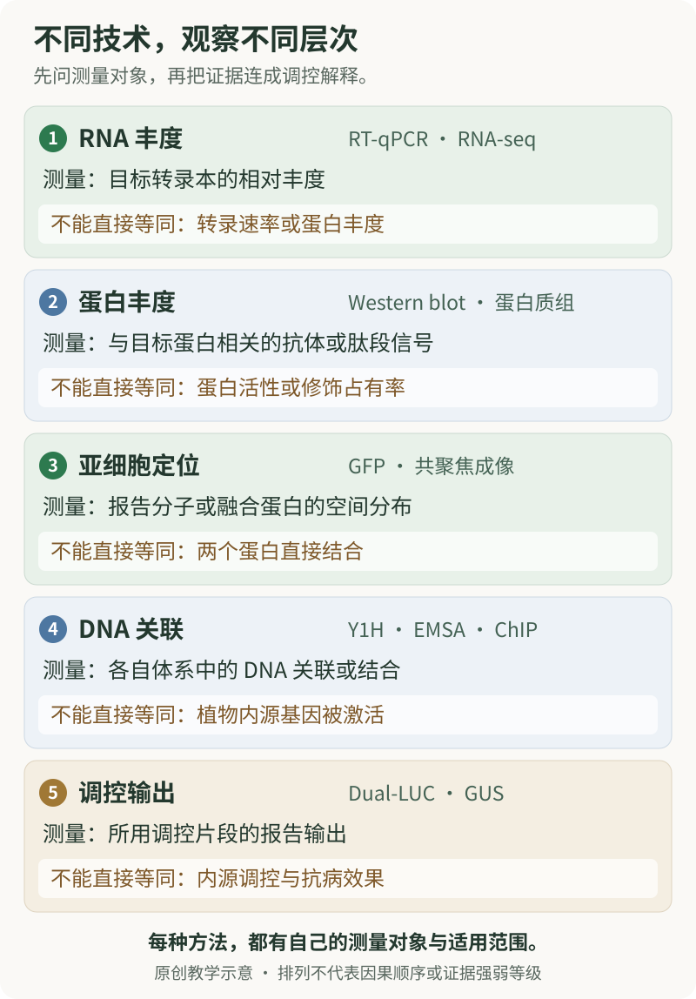

# 第 22 章　表达、定位与转录调控：从“发生变化”到“怎样调控”

一篇植物免疫论文可能同时出现 RT-qPCR 柱状图、Western blot 条带、绿色荧光照片和启动子报告信号。它们都与某个基因有关，却没有测量同一件事。RNA 增多、蛋白增多、蛋白进入细胞核、蛋白与启动子关联，以及启动子输出增强，是五个需要分别检验的命题。

本章帮助你读懂这些技术的原理、图中标记与对照逻辑。**学习目标**是能够说明每种方法实际观察什么，区分蛋白质互作与蛋白质—DNA 关联，并为一个转录调控结论整理证据。**前置知识**见[第 0 章](../learning/ch00-细胞与分子基础.md)的 DNA—RNA—蛋白质关系；实验对照与重复的基础见[第 20 章](../part6-专题与研读/ch20-如何阅读植物免疫证据.md)。

**阅读路线：**第一次先读 22.1—22.4，理解表达与定位；第二次读 22.5—22.9，把不同转录调控技术联系起来；最后完成综合案例与自测。本章与[第 21 章的 Co-IP、Y2H](ch21-蛋白质相互作用研究技术.md)互补，遗传和免疫输出的判断则由[第 23 章](ch23-遗传学与免疫表型研究技术.md)继续展开。

## 22.1 先确定问题位于哪一个层次

“基因 A 被激活了”是常见但含糊的说法。它可能指转录本增多，也可能指 A 编码的蛋白受到修饰而活性改变。读图时，应把这句话改写成能对应测量对象的描述。

| 具体问题 | 常见技术 | 直接读数 | 需要另行建立的结论 |
|---|---|---|---|
| 某转录本的相对丰度是否改变？ | RT-qPCR、RNA-seq | 核酸扩增信号或序列计数 | 转录速率、蛋白量与功能 |
| 某蛋白的可检测丰度或修饰是否改变？ | Western blot、蛋白质组学 | 抗体信号或肽段信号 | 催化活性与生物学后果 |
| 蛋白主要分布在哪里？ | 荧光融合蛋白、共聚焦成像、分级分析 | 荧光空间分布或组分富集 | 原生状态定位、直接互作 |
| 蛋白是否能与一段 DNA 发生关联？ | Y1H、EMSA | 报告输出或迁移改变 | 植物细胞内占位与功能 |
| 蛋白在样本染色质中是否关联某区域？ | ChIP-qPCR、ChIP-seq | DNA 片段的相对富集 | 直接接触碱基与激活/抑制作用 |
| 某调控区域的报告输出是否受影响？ | 双荧光素酶、GUS 等报告系统 | 报告酶活性或信号 | 内源基因的完整调控及免疫贡献 |

**图 22.1　先认清测量对象，再解释调控关系。** 五个卡片区分RNA丰度、蛋白丰度、亚细胞定位、DNA关联与调控输出。它们是不同观察维度，不表示固定的因果顺序或证据等级。本图为原创教学示意。

这些方法不是一场按“先进程度”排列的比赛。少数清楚的问题配上合适的证据，往往比很多不能互相解释的检测更有说服力。尤其要留意，**RNA 水平由产生和降解共同决定，蛋白水平由合成和降解共同决定**；只测到稳态丰度，不能直接确定是哪一个过程发生了改变。

## 22.2 RT-qPCR：测到的是相对转录本丰度

**逆转录定量 PCR（reverse transcription quantitative PCR，RT-qPCR）**先把 RNA 信息转成互补 DNA，再利用扩增过程中累积的荧光信号估计目标的起始量。在论文中，RT 指逆转录；普通 qPCR 也可用于 DNA，并不自动包含 RNA 表达分析。

**定量循环数（quantification cycle，Cq）**表示扩增信号到达所用判定水平时的循环位置，旧文常写 Ct。对同一套经过验证的检测而言，起始模板较多通常会较早出现相应信号，即 Cq 较小。但是，不同基因之间的原始 Cq 还受检测效率、背景和信号特性影响，不能直接排成“哪个基因表达最高”。

### 为什么需要参照基因

两份样本中测到的目标信号不同，既可能来自真实的 RNA 丰度差异，也可能来自样本量、RNA 状态和后续测量的差别。**参照基因（reference gene）**提供归一化依据，前提是它在所比较条件中适合担任这一角色。“管家基因”是功能或使用习惯的称呼，不是永远不变的保证。

初学者应理解经典相对定量公式的含义，而不是把公式当作不需要条件的按钮。常见写法为：

- ΔCq = 目标基因 Cq − 参照基因 Cq；
- ΔΔCq = 比较组 ΔCq − 基准组 ΔCq；
- 相对倍数 = 2−ΔΔCq。

这里底数 2 对应近似理想的扩增倍增，经典方法还要求目标与参照的扩增效率足够相近。若这些假设不成立，应采用与实际效率相符的定量分析，而不能把所有结果强行代入同一公式（Livak & Schmittgen, 2001）。2025 年的 MIQE 2.0 进一步强调效率校正、检测范围、归一化与透明报告的重要性（Bustin et al., 2025）。

下面是**人为构造的算术示例，没有生物学实测含义**。假定效率与参照稳定性的条件均已满足：

| 样本 | 目标 Cq | 参照 Cq | ΔCq |
|---|---:|---:|---:|
| 基准组示例 | 25 | 20 | 5 |
| 比较组示例 | 23 | 20 | 3 |

ΔΔCq 为 −2，对应的相对倍数为 4。正确读法是“在这些分析假设下，目标转录本相对参照的估计丰度为基准的 4 倍”。它不说明每个细胞都增加 4 倍，也不说明蛋白、转录速率或抗病性增加了 4 倍。真实研究还需要独立生物学重复和不确定性，不能用这两行示例完成显著性判断。

### 对照为什么会改变解释

| 图注或方法中的信息 | 它帮助排除什么问题 |
|---|---|
| 无逆转录酶对照（no-RT） | DNA 残留是否影响 RNA 相关读数 |
| 无模板对照（NTC） | 试剂背景、污染或非目标扩增的可能性 |
| 目标检测特异性和效率 | 荧光是否来自预期对象，定量假设是否成立 |
| 参照基因的适用性验证 | 归一化分母本身是否随条件变化 |
| 独立样本、技术重复与批次说明 | 误差线描述生物差异还是重复测量误差 |

没有显著扩增信号，也不必然等于生物学上绝对没有该 RNA；它可能低于检测能力。单个标记基因升高则只说明所测表达指标改变，需要与其他层次证据一起理解。

## 22.3 Western blot：条带位置、强度与特异性要一起读

**蛋白质免疫印迹（Western blot，WB；也称 immunoblot，IB）**通过分离和转移蛋白，再利用抗体辨认目标。常规变性电泳主要按表观分子大小区分条带；它帮助判断信号是否位于合理位置，却不能只凭“大小差不多”确认身份。

图中常见 `α-GFP` 或 `anti-GFP` 表示用识别 GFP 的抗体检测，并不表示检测了 GFP 基因的 RNA。若目标蛋白带有标签，预期条带位置还包含标签的贡献。一个额外小条带可能涉及降解或非特异识别；较慢迁移可能有多种原因，不能看到上移就立即认定某一种修饰。

**条带更深，不自动等于蛋白按相同比例更多。**定量需要信号处于可解释的响应范围，避免饱和，并采用合理的背景处理和归一化。参照蛋白可能受条件影响，总蛋白信号也需验证适用性。Janes（2015）通过定量免疫印迹研究说明，这些因素会实质改变结论，不能把图像灰度当作不受测量系统影响的绝对丰度。

| 阅读对象 | 应该问的问题 |
|---|---|
| 分子量标记与目标条带 | 所标位置是否合理，能否辨认被量化的条带？ |
| 抗体或标签特异性 | 有没有独立依据说明信号对应目标？ |
| 上样参照或总蛋白 | 归一化依据是否在当前比较中可靠？ |
| 不同面板与曝光 | 它们能否直接比较，是否可能饱和？ |
| 生物学重复与完整图 | 代表图能否反映重复结果，裁剪是否保留理解所需信息？ |

磷酸化特异性抗体还带来另一层问题：信号升高可能涉及目标总量增加、相应修饰状态改变，或二者并存。**同一目标蛋白的总量证据**有助于区分这些情况；它与用于评估上样的全泳道总蛋白信号不是同一概念。即使计算了磷酸化信号与相应目标蛋白总量信号的相对比例，仍不能自动把它换算为所有分子的修饰占比，更不能把它直接等同于催化速率。

在 Co-IP 图里，**IP** 标记富集时抓取谁，**IB/WB** 标记检测时寻找谁；两者不是同一个动作。回到[第 21 章](ch21-蛋白质相互作用研究技术.md)，就能理解为什么输入样品有蛋白、免疫富集有效和伴随蛋白被检出，是三个不同检查。

## 22.4 GFP、GUS 与共聚焦：看见信号之后，还要辨认它代表谁

**绿色荧光蛋白（green fluorescent protein，GFP）**等报告分子让研究者在细胞或组织中观察信号。但相似的绿色照片，可能回答完全不同的问题。论文中的示意标记可以这样理解：

| 常见示意 | 主要观察对象 | 不能直接推出 |
|---|---|---|
| `pA::GFP` | A 的所用调控区域驱动的报告表达 | A 蛋白本身的亚细胞定位 |
| `pA::A-GFP` | 在所用调控背景下，A 与 GFP 融合蛋白的分布 | 标签完全无影响、与内源蛋白绝对一致 |
| `pX::A-GFP`，pX 为其他启动子 | 在另一表达背景中，融合蛋白的分布 | A 在原生组织中的表达范围与丰度 |

这里的 `p` 表示启动子或论文所指定的调控片段，双冒号用来表示报告关系；它们是**读图符号**。所用调控片段可能没有包含全部内源调控信息，因此报告表达应保留其系统范围。

**β-葡萄糖醛酸苷酶（β-glucuronidase，GUS）**也是经典的植物报告工具，可以通过酶反应呈现组织分布或定量信号。早期 GUS 工作建立了广泛使用的基因表达报告思路（Jefferson et al., 1987）。组织染色适合看“哪些区域出现了报告活动”，但颜色深浅还受酶累积、反应背景与组织可及性等影响，不是天然线性的转录量标尺。

**共聚焦显微成像（confocal microscopy）**有助于减少离焦背景，观察光学切层中的分布。它并没有把光学分辨率变成原子分辨率：两个通道在同一像素出现，不等于两个蛋白直接接触。植物中叶绿素等自发荧光、通道串色以及显示范围调整，都可能影响视觉印象。

读定位图时，可靠的空间参照比“看起来像细胞膜”更有价值。Nelson 等（2007）建立的多色细胞器标记，是用已知位置帮助辨认未知分布的代表性资源。还应关注比例尺、图像是单一光学切层还是多层投影、信号是否饱和、不同样本显示尺度是否可比、融合蛋白是否保持相关功能，以及观察是否来自合适的组织与表达背景。把多层信息压在一张投影图中，可能产生单层中并不存在的重叠印象。

如果声称“处理后蛋白从细胞质进入细胞核”，最好区分整体蛋白增加与核内比例变化，并观察细胞间差异。来自同一植株的很多细胞提供了空间信息，但不能凭细胞数制造独立植株重复；这与[第 20 章](../part6-专题与研读/ch20-如何阅读植物免疫证据.md)的伪重复问题相同。

## 22.5 Y1H：蛋白与 DNA 的关系，如何变成酵母中的报告信号

**酵母单杂交（yeast one-hybrid，Y1H）**与 Y2H 的名字很像，研究对象却不同。经典 Y2H 主要询问两个候选蛋白在系统中能否使转录模块接近；Y1H 以一段 DNA 为识别对象，询问候选蛋白是否能在该体系中关联这段 DNA 并带来报告输出。

可以把其概念关系读成“目标 DNA—候选蛋白关联—转录激活模块发挥作用—报告信号”。报告系统把难以直接观察的分子关系转换为可检测输出；因此，必须检查报告背景和候选蛋白本身的状态。Li 与 Herskowitz（1993）的原始单杂交研究展示了用 DNA 元件寻找关联蛋白的思路。

**DNA 片段本身就引起较高报告背景**时，候选蛋白加入后的结果需要更谨慎解释；这与 Y2H 的自激活问题有关，却不是同一种具体情形。候选蛋白在酵母中的表达、折叠与功能状态，也会影响阴性结果。酵母不是植物，异源系统可能缺少某种修饰、伙伴或组织环境。

所以，一个经过适当对照的阳性结果支持“候选蛋白在该 Y1H 系统中与目标 DNA 关联并产生报告输出”。它仍需要体外结合、植物中的染色质关联及功能证据，才能进一步讨论内源直接调控。Y1H 阴性则只说明当前系统没有检测到该输出，不能简单宣布“植物中不可能结合”。

## 22.6 EMSA：利用迁移差异观察体外 DNA 结合

**电泳迁移率变动分析（electrophoretic mobility shift assay，EMSA）**也称凝胶迁移或 gel shift。它利用游离核酸与蛋白—核酸复合物在适当分离体系中迁移不同的原理，观察是否出现相对于游离探针的迁移变化。Fried 与 Crothers（1981）的经典研究是这一方法发展的代表。

读图时先找**游离探针（free probe）**的位置，再找**迁移改变的复合物信号（shifted complex）**。所谓“冷探针”通常指未标记的相应核酸，并不是低温探针。它能帮助询问未标记分子是否竞争同一种关联；不同序列的比较则帮助分析选择性。**超迁移（supershift）**是指相应抗体与复合物中的成分结合后产生进一步迁移变化，它可增加成分身份的信息，但仍依赖抗体特异性。

| 比较的逻辑 | 能增加什么信息 | 仍不能保证什么 |
|---|---|---|
| 有无候选蛋白时，标记 DNA 的迁移 | 迁移变化是否与该蛋白条件相关 | 粗提物中究竟是哪一个成分作用 |
| 相应未标记 DNA 的竞争 | 是否存在可竞争的结合关系 | 单凭竞争确定唯一识别序列 |
| 不同 DNA 序列的比较 | 对所比较序列是否有选择性 | 把某个短片段的结果推广到全部染色质 |
| 定义清楚的蛋白与 DNA 组分 | 为体外直接结合提供依据 | 植物体内占位、调控方向或生理功能 |

“纯化蛋白与 DNA 发生体外结合”比“粗提物出现了一条上移带”更接近一个明确的直接结合命题。即便如此，也要考虑样品身份、纯度、标签和非特异结合等解释。EMSA 不是在植物染色质原位拍摄分子接触；体外容易接近的片段，在细胞中可能被染色质组织或竞争者限制。

## 22.7 ChIP：看样本染色质中的关联，不能跳过“间接”这一可能

**染色质免疫沉淀（chromatin immunoprecipitation，ChIP）**将目标蛋白或特定组蛋白状态相关的染色质组分富集，再分析其中的 DNA。针对候选区域定量称 ChIP-qPCR，结合高通量测序称 ChIP-seq。

这与 Co-IP 有共同的“通过抗体富集目标”逻辑，但后续问题不同：Co-IP 通常检测伴随的蛋白；ChIP 的常见读数是伴随染色质中哪些 DNA 区域更富集。这里的 **Input** 指免疫富集前的染色质参照，并不是 RT-qPCR 中的参照基因，也不是另一种阴性抗体。

| 图中项目 | 作用 |
|---|---|
| Input 相关归一化 | 考虑相应区域在输入染色质中的代表程度 |
| 适当的抗体、标签或遗传阴性背景 | 评估非特异富集和检测背景 |
| 不预期关联的 DNA 区域 | 检查富集是否具有区域选择性 |
| 独立样本与蛋白状态信息 | 判断结果是否稳定，目标丰度变化是否影响解释 |

某启动子区域富集，支持目标在所研究条件下**与该染色质区域关联**。目标也可能通过其他蛋白间接关联 DNA；富集片段覆盖一个区域，不一定准确对应某个碱基上的直接接触。直接与间接关联的区分，即使在更精细的结合图谱分析中也是重要问题（Yamada et al., 2019）。

富集还不等于激活：一个因子可以与某区域关联但不改变当前读数，也可以参与抑制，或在另一条件下才改变输出。Sun 等（2015）对 SARD1 和 CBP60g 的研究提供了植物免疫中的 ChIP-seq 案例。阅读这种论文的关键，是追踪作者如何把占位图谱与表达及遗传证据联系起来，而不是把每个峰直接改画成“促进免疫”的箭头。

ChIP-seq 曲线的纵轴通常是经处理的测序信号，不是“该位点被结合的细胞百分比”。不同样本的纵轴尺度、背景与归一化也会改变视觉比较，必须读清图例。

## 22.8 双荧光素酶：报告输出改变，与蛋白互作是两回事

**双荧光素酶报告分析（dual-luciferase reporter assay，Dual-LUC）**通常使用一种荧光素酶报告所关注的调控输出，再用另一种作为参照。例如图中常见萤火虫荧光素酶 LUC/FLUC 与海肾荧光素酶 REN/RLUC。报告信号有助于比较某调控片段在不同条件下的输出（Hellens et al., 2005）。

**Dual-LUC 与 split-LUC 必须分开。**前者通常比较两种报告酶的信号；后者把荧光素酶分成片段，通过互补报告候选蛋白接近的情况，详见[第 21 章](ch21-蛋白质相互作用研究技术.md)。两者都出现发光图，并不意味着测量相同。

一个候选转录因子加入后 LUC/REN 增大，首先支持的是这个报告系统中的相对输出改变。它可能涉及目标调控片段，也可能受到候选因子对宿主状态、其他因子或参照表达的间接影响。因此，需要理解空背景、调控片段自身的基线、候选蛋白状态及参照信号。

以下为**人为构造的比值示例，单位任意**：

| 情形 | LUC | REN | LUC/REN |
|---|---:|---:|---:|
| 基准 | 100 | 100 | 1 |
| 情形 A | 200 | 100 | 2 |
| 情形 B | 100 | 50 | 2 |

两种情形的比值都为 2，但 A 来自分子变大，B 来自分母变小。因此，“双报告比值上升”不能无条件改写成“目标启动子活性翻倍”。在报告系统中观察到相关调控片段的依赖，也仍需结合内源表达与结合证据来判断直接调控；这类功能报告不能单独确定蛋白直接接触 DNA。

## 22.9 DAP-seq 与染色质可及性：补上另一个观察角度

**DNA 亲和纯化测序（DNA affinity purification sequencing，DAP-seq）**在体外考察候选蛋白与 DNA 文库的结合偏好，帮助发现可能的识别区域。O’Malley 等（2016）用这一思路建立了大规模植物转录因子结合图谱，并分析了 DNA 甲基化与结合的关系。

DAP-seq 所用的原始基因组 DNA 可以保留部分 DNA 修饰信息，但不保留完整的原生染色质组织、细胞伙伴与组织状态；不同文库制备方式也会影响保留的信息。因此，DAP-seq 阳性而某条件下 ChIP 阴性，可能反映体外结合能力与细胞内可及性或占位的不同，并不必然意味着其中一个技术“错了”。

**转座酶可及染色质测序（assay for transposase-accessible chromatin using sequencing，ATAC-seq）**等分析则帮助定位相对容易被检测系统接近的区域（Buenrostro et al., 2013）。开放区域可能为调控提供条件，但“开放”不等于已经证明某个特定转录因子结合，更不等于目标基因一定被激活。阅读时，把“能接近”“有关联”“改变输出”分别写下，许多看似矛盾的图就有了解释空间。

## 22.10 综合读图：怎样支持“转录因子 T 调控基因 G”

下面的 T 与 G 是**抽象教学符号，不对应具体研究结果**。假设论文提出：某宿主转录因子 T 在指定条件下影响基因 G 的表达。不同证据承担的任务如下。

| 假想观察 | 合理解释 | 尚存的关键问题 |
|---|---|---|
| T 改变时，G 的 RT-qPCR 读数改变 | G 的转录本相对丰度与该变化有关 | 是直接调控，还是其他状态间接造成？ |
| T 在有关细胞核中可检测到 | 空间上具备参与核内调控的可能 | 是否真的与 G 的调控区域关联？ |
| ChIP 显示 G 的某区域富集 | 在所测条件下存在染色质关联 | 是否由 T 直接接触 DNA？ |
| 定义清楚的组分中出现选择性体外结合 | 支持 T 对该 DNA 的直接结合能力 | 是否足以解释植物中的调控？ |
| G 的调控片段在报告系统中响应 T | 支持该系统中的调控输出关系 | 内源调控、组织与剂量是否一致？ |
| 遗传证据连接 T、G 与指定输出 | 加强这条关系的生物学意义 | 是否仍有平行途径或多效性？ |

这不是要求每篇论文机械完成所有技术，而是提醒：**每加入一项证据，应明确它排除了哪个替代解释。**多项共同受过表达影响的检测，也可能共享同一个偏差，不能因为“有三种方法”就默认彼此独立。

较稳妥的综合表述是：“在所研究组织与条件下，T 与 G 的调控区域关联；体外证据支持相应结合能力，报告与遗传结果进一步支持 T 参与 G 的表达调控。”若要写成“通过某一直接调控关系产生植物保护”，还必须把这个分子关系与具体生物学结局相连。

**关键问题：**同一转录因子在不同组织或时间与相似 DNA 元件关联，为什么可能产生不同输出？这会把你带回染色质、合作因子、代谢和组织状态。技术的价值，在于让这些解释可以被比较，而不是把复杂性全部折叠成一根箭头。

## 22.11 自测与讲解

**1. 某目标基因的 Cq 比另一个基因低，能直接说它的 RNA 更多吗？**

不能直接说。不同检测的扩增效率、信号性质与阈值背景可能不同。相对定量首先需要明确可比较的检测系统、归一化依据与效率条件；原始 Cq 的跨基因排序不自动等于丰度排序。

**2. RT-qPCR 提示相对转录本丰度上升，为什么不能直接写“转录速度加快”？**

稳态转录本丰度由产生和降解共同决定。转录增加、降解减少或细胞组成变化，都可能影响组织整体读数。要识别具体过程，需要与该过程对应的额外证据。

**3. Western blot 的目标条带更深，参照条带也更深，怎样理解？**

先判断上样、检测响应范围和参照稳定性。不能只选目标条带比较，也不能不加验证地用参照抵消一切差异。可靠归一化之后的相对信号，仍是受抗体与检测条件限定的丰度指标。

**4. `pA::GFP` 在细胞核中很亮，能证明 A 蛋白定位于细胞核吗？**

不能。这个示意主要报告所用 A 调控区域驱动的 GFP 表达，观察到的是报告分子的分布。研究 A 蛋白定位需要对应蛋白证据，例如保持相关功能的融合蛋白或适当的内源检测，并考虑标签与表达背景。

**5. Y1H、EMSA 和 ChIP 都阳性，为什么还要讨论转录输出？**

这些结果从不同角度支持 DNA 关联或结合，却没有自动给出作用方向。结合可能促进、抑制或在当前条件下不明显改变表达。报告输出与内源表达证据回答另一个问题。

**6. ChIP-qPCR 中的 Input，与 RT-qPCR 中的参照基因有什么不同？**

Input 是免疫富集前的染色质参照，用于理解某区域相对输入的富集。参照基因则为表达定量提供归一化基础。二者都帮助比较，但来源、用途与假设不同，不能互相替换。

**7. 一个图标注 LUC/REN，另一个标注 nLUC/cLUC，它们都在检测蛋白互作吗？**

不是。LUC/REN 常见于双荧光素酶报告分析，比较两种报告酶的输出；nLUC/cLUC 常表示拆分荧光素酶片段，用于互补类互作报告。最终还要依据图示和方法确定检测对象，不能只看发光颜色。

**8. DAP-seq 出现候选结合区域，而叶片 ChIP 没有相应信号，最合理的解释是什么？**

目前只能说，两种系统给出了不同层次的结果。体外结合能力不保证在所测叶片状态中占位；可及性、伙伴、蛋白状态和检测能力都可能参与差异。不能据此直接宣布“没有调控”或“ChIP 必然失败”。

## 推荐阅读与参考文献

初读建议先看 Livak 与 Schmittgen 的相对定量思想，再结合 MIQE 2.0 理解其适用条件；随后读 Hellens 的报告系统和 Sun 的植物免疫实例，把“技术能测什么”与“作者怎样建立论点”对照起来。以下方法论文跨不同生物系统，其一般测量原理可供理解，并不意味着所有具体条件适用于植物。

- Buenrostro JD, Giresi PG, Zaba LC, Chang HY, Greenleaf WJ. *Transposition of native chromatin for fast and sensitive epigenomic profiling of open chromatin, DNA-binding proteins and nucleosome position.* Nature Methods, 2013; 10:1213–1218. [DOI](https://doi.org/10.1038/nmeth.2688)。重点：可及性证据与特定蛋白占位的区别。
- Bustin SA, et al. *MIQE 2.0: Revision of the Minimum Information for Publication of Quantitative Real-Time PCR Experiments Guidelines.* Clinical Chemistry, 2025; 71:634–651. [DOI](https://doi.org/10.1093/clinchem/hvaf043)。重点：效率、归一化和报告透明度。
- Fried M, Crothers DM. *Equilibria and kinetics of lac repressor-operator interactions by polyacrylamide gel electrophoresis.* Nucleic Acids Research, 1981; 9:6505–6525. [DOI](https://doi.org/10.1093/nar/9.23.6505)。重点：迁移差异怎样成为结合证据。
- Hellens RP, et al. *Transient expression vectors for functional genomics, quantification of promoter activity and RNA silencing in plants.* Plant Methods, 2005; 1:13. [全文](https://pmc.ncbi.nlm.nih.gov/articles/PMC1334188/) · [DOI](https://doi.org/10.1186/1746-4811-1-13)。重点：报告读数与所研究调控层次。
- Janes KA. *An Analysis of Critical Factors for Quantitative Immunoblotting.* Science Signaling, 2015; 8:rs2. [DOI](https://doi.org/10.1126/scisignal.2005966)。重点：条带定量为何需要响应范围与可靠参照。
- Jefferson RA, Kavanagh TA, Bevan MW. *GUS fusions: beta-glucuronidase as a sensitive and versatile gene fusion marker in higher plants.* The EMBO Journal, 1987; 6:3901–3907. [DOI](https://doi.org/10.1002/j.1460-2075.1987.tb02730.x)。重点：报告工具与内源过程的联系和区别。
- Li JJ, Herskowitz I. *Isolation of ORC6, a component of the yeast origin recognition complex by a one-hybrid system.* Science, 1993; 262:1870–1874. [DOI](https://doi.org/10.1126/science.8266075)。重点：单杂交的 DNA—蛋白关联逻辑。
- Livak KJ, Schmittgen TD. *Analysis of Relative Gene Expression Data Using Real-Time Quantitative PCR and the 2−ΔΔCT Method.* Methods, 2001; 25:402–408. [DOI](https://doi.org/10.1006/meth.2001.1262)。重点：相对定量的参照与数学假设。
- Nelson BK, Cai X, Nebenführ A. *A multicolored set of in vivo organelle markers for co-localization studies in Arabidopsis and other plants.* The Plant Journal, 2007; 51:1126–1136. [DOI](https://doi.org/10.1111/j.1365-313X.2007.03212.x)。重点：定位需要空间参照。
- O’Malley RC, et al. *Cistrome and Epicistrome Features Shape the Regulatory DNA Landscape.* Cell, 2016; 165:1280–1292. [DOI](https://doi.org/10.1016/j.cell.2016.04.038)。重点：体外结合图谱、DNA 修饰与细胞内状态的区别。
- Sun T, et al. *ChIP-seq reveals broad roles of SARD1 and CBP60g in regulating plant immunity.* Nature Communications, 2015; 6:10159. [DOI](https://doi.org/10.1038/ncomms10159)。重点：占位证据如何与免疫调控问题相连。
- Yamada N, Lai WKM, Farrell N, Pugh BF, Mahony S. *Characterizing protein–DNA binding event subtypes in ChIP-exo data.* Bioinformatics, 2019; 35:903–913. [DOI](https://doi.org/10.1093/bioinformatics/bty703)。重点：直接和间接关联是不同命题；在线发表时间为 2018 年，卷期年份为 2019 年。

下一步：[第 23 章：遗传学与免疫表型](ch23-遗传学与免疫表型研究技术.md) · 返回：[第 21 章：蛋白质相互作用](ch21-蛋白质相互作用研究技术.md)。
