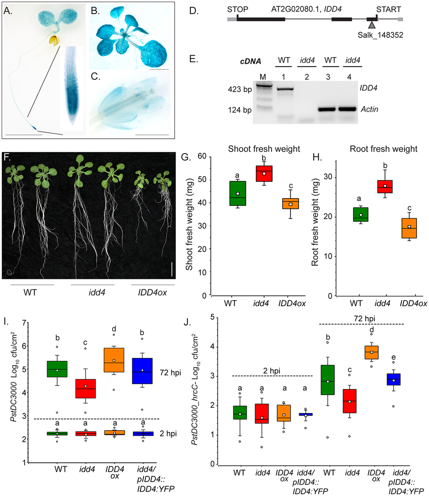
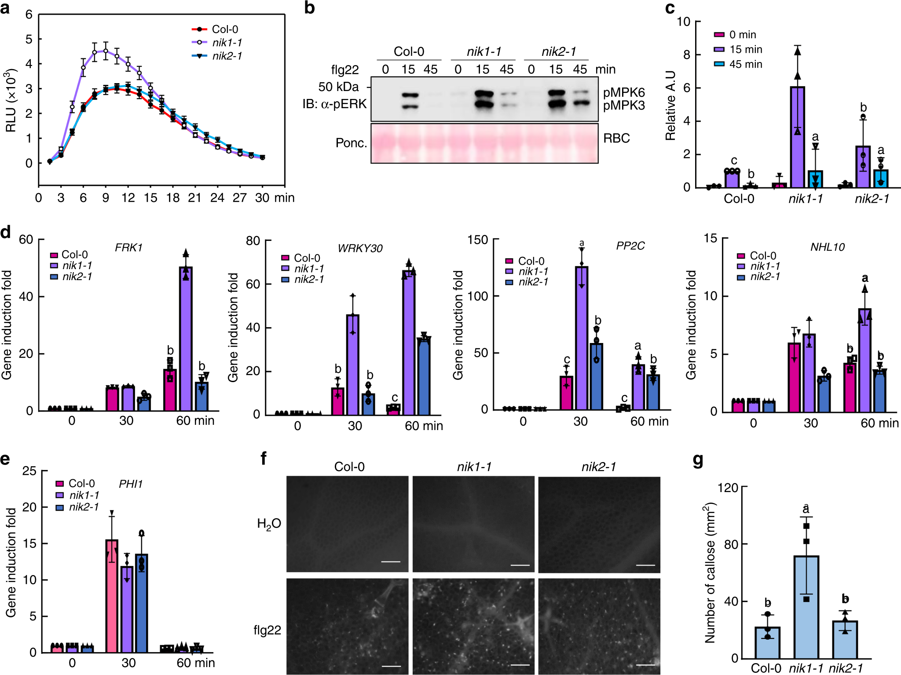
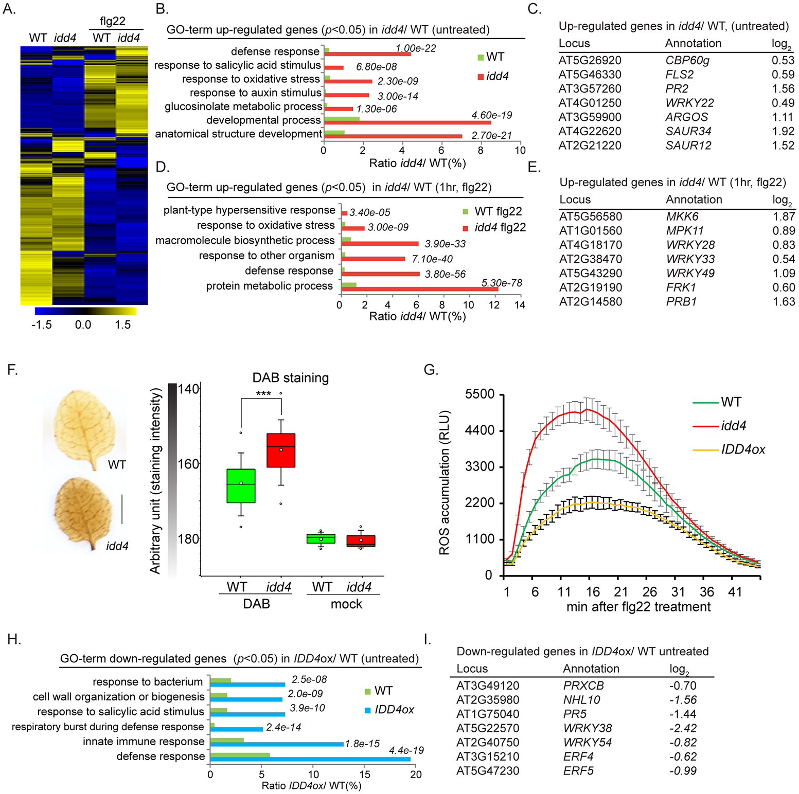

# 第 23 章　遗传学与免疫表型研究技术：把分子联系接回植物功能

在 [第 21 章](ch21-蛋白质相互作用研究技术.md)，我们学习了怎样判断两个蛋白是否存在物理联系；在 [第 22 章](ch22-表达定位与转录调控研究技术.md)，我们学习了怎样观察表达、定位与转录调控。接下来最重要的问题是：**这些联系对植物究竟有什么作用？**

一个蛋白可以与许多伙伴共沉淀，却只在特定细胞中影响一种响应；某个基因的 RNA 明显上升，也可能只是防御启动后的结果。本章用遗传学、免疫读数与组学把这些层次连接起来，重点是理解方法能支持什么结论，以及证据还缺哪一环。

**学习目标。** 读完本章，你应能解释突变体与互补材料的作用，区分 ROS、钙、MAPK 和细胞死亡等读数，识别磷酸化变化中的蛋白丰度混杂，并把一组分子与遗传观察写成有边界的功能结论。

**必备概念。** 基因型是遗传组成，表型是可观察或测量的性状；同一基因型的表型会随环境、发育与组织而变化。关于必要性、充分性、重复和统计推断的基础，请先阅读 [第 20 章](../part6-专题与研读/ch20-如何阅读植物免疫证据.md)。

**阅读路线。** 初读先看 23.1 的方法总表，再读 23.2 的遗传逻辑和 23.5 的完整案例；读论文时，按图中出现的技术返回 23.3 或 23.4。每次只问清楚一个问题，比先背下所有缩写更有效。

## 23.1 先确定问题，方法才有意义

植物免疫研究通常涉及四类不同的问题：某因素是否影响响应，影响发生在哪一层，可能通过什么分子关系实现，以及这种变化是否改善宿主表现。四类问题需要相互补充的证据。更多技术名称本身不会自动使结论更可靠。

| 科研问题 | 常用方法或证据 | 可以支持的结论 | 主要盲点 |
|---|---|---|---|
| 缺少 A 会怎样？ | 功能缺失材料与适当背景比较 | A 对指定条件下的表型有贡献 | 发育缺陷、遗传背景和功能冗余 |
| 表型确实与 A 有关吗？ | 互补、独立等位基因 | 加强 A 与表型的因果联系 | 恢复量异常或其他背景差异仍需解释 |
| A 与 B 的功能是否相互依赖？ | 单、双突变体等遗传比较 | 检验某输出中的功能依赖 | 不能单独证明直接结合或催化顺序 |
| 早期氧化响应是否改变？ | 化学发光、适当的氧化还原探针 | 指定检测体系中的氧化相关信号变化 | 探针选择性、组织状态和检测动态 |
| 钙信号的时空特征如何？ | 水母发光蛋白、荧光钙传感器 | 所在细胞或区室的钙相关动态 | 传感器特性、运动与 pH 等混杂 |
| MAPK 状态是否改变？ | 磷酸化特异性免疫印迹及相应总蛋白检测 | 所测 MAPK 的修饰相关信号变化 | 抗体特异性、总量变化、时间窗口 |
| 屏障或组织损伤是否变化？ | 胼胝质成像、细胞存活/死亡相关染色、电解质渗漏 | 沉积或膜完整性等表型变化 | 不能直接概括全部抗病效果 |
| 全局变化集中在哪些过程？ | RNA-seq、蛋白组、磷酸化组、代谢组 | 发现候选过程与分子 | 相关性、多重比较、样本混合 |
| 分子关系有何功能意义？ | 遗传、分子、时间和组织证据相互印证 | 缩小可解释机制的范围 | 多种方法可能共享同一个偏差 |

这里的“读数”（readout）是仪器或分析实际给出的量，例如发光强度、条带灰度或单位面积的荧光斑点数。“免疫增强”则是对这些量的生物学解释。两者之间需要理由，不能把图的纵轴直接改称“免疫强度”。

## 23.2 遗传学：把“同时出现”变成“功能有关”

### 功能缺失与互补回答相邻但不同的问题

**功能缺失（loss of function）**指基因的正常作用受到削弱或丧失。若某突变体的早期响应降低，最初可以说该基因可能影响这项响应。还要检查突变体是否只是生长较弱、组织组成不同，或者同时带有其他影响表型的遗传变化。

**遗传互补（genetic complementation）**关注恢复正常基因功能后，原来的表型能否随之恢复。功能缺失与互补构成一组有价值的反事实比较：缺少它时发生变化，恢复它时变化得到纠正。不过，互补材料中蛋白远高于正常水平时，恢复也可能包含剂量效应；没有恢复则可能来自表达位置、蛋白功能或遗传背景等问题。

**独立等位基因（independent alleles）**是在同一基因上具有不同改变的材料。多个独立材料指向同一表型，可以降低某一个材料特有变化造成误判的风险。相同表型不是机械要求：不同等位基因可能保留不同程度的功能。材料差异有时正是理解蛋白作用的线索。

### 不同遗传工具改变的层次不同

| 名称 | 主要改变 | 初学者尤其要分清的边界 |
|---|---|---|
| 基因敲除或其他功能缺失 | 改变基因或其产物的正常功能 | 有 DNA 改变不等于蛋白功能一定完全消失 |
| 基因沉默或敲低 | 通常降低特定 RNA 及其相关表达输出 | RNA 降低幅度不等于蛋白降低幅度，且不一定完全缺失 |
| 基因编辑 | 在指定基因组位置产生改变的一类工具 | “使用了编辑技术”本身不是因果证明，仍须核实材料和表型 |
| 过表达 | 增加某基因产物或扩大其出现范围 | 非生理剂量可能带来新的结合、负担或异常定位 |
| 互补 | 在功能受损背景中恢复相应功能 | 要结合恢复程度、表达状态与材料背景解读 |

过表达材料出现强响应，可以支持“在这个背景和表达状态下增加该因素会改变输出”。它未必证明该蛋白在正常植物中就是限速环节。相反，单基因缺失没有明显表型，也不能证明该基因无功能：其他家族成员可能补偿，作用可能只出现在未观察的条件，测量也可能不够敏感。

### 遗传上位性不等于一条已经画好的直线

**上位性（epistasis）**在经典遗传分析中，常指一个基因变化的表型遮盖另一个基因变化的表型。双突变体像其中一个单突变体，提示两者在所测性状上存在某种依赖；推断谁在“上游”，还取决于性状、突变性质和所假设的通路结构。

例如，若单突变体 *b* 的响应已接近检测下限，双突变体 *a b* 同样很低，并不一定说明 B 位于 A 下游。两个平行分支都可能影响同一输出，只是读数没有空间进一步下降。部分功能保留、反馈回路和生长异常，也会改变简单的上下游推断。

**里程碑思路：从异常表型寻找感知元件。** Gómez-Gómez 与 Boller 的研究把拟南芥对鞭毛蛋白的感知异常与 FLS2 联系起来，结合遗传定位、分子鉴定和互补建立了受体研究的重要起点。其教学价值在于从可重复的表型追问原因；“感知相关基因”到“直接结合配体的分子机制”，仍需要后续证据衔接（Gómez-Gómez & Boller, 2000）。[原始论文记录](https://pubmed.ncbi.nlm.nih.gov/10911994/)

## 23.3 免疫读数：看见的是哪一段响应？

### ROS：氧化信号有来源，也有检测边界

**活性氧（reactive oxygen species, ROS）**包括具有不同化学性质的多类分子。常见的鲁米诺（luminol）类化学发光分析把氧化相关反应转换为光信号；显色或荧光探针提供空间或相对变化信息。它们不都是“所有 ROS 的总量计”，不同探针也不能不加区分地互相替代。

读曲线时，应同时留意基线、峰值、达到峰值的时间和持续过程。一个低而宽的响应与一个高而短的响应，不能只凭峰值决定哪一个作用更强。探针可接近的位置、检测体系的反应条件以及组织活性，都可能影响读数。因此，ROS 图首先支持的是指定检测条件下的氧化相关响应，而不是直接证明抗病成功。

### 钙成像：一个亮点不是一张完整的信号地图

**钙传感器（calcium sensor）**将游离钙变化转为可检测信号。水母发光蛋白类报告体系通过发光响应钙；GCaMP、GECO 等荧光传感器则用荧光变化报告其所在区室的钙状态。它们有各自的灵敏度、动态范围和时间响应，读数不能脱离传感器解释。

基于单通道强度的测量可能受到报告蛋白丰度、焦面漂移或细胞运动影响。**比率型测量（ratiometric measurement）**用两个相关信号的比值减少某些共同扰动，但不是所有误差都会消失；pH、定位与信号饱和等问题仍需评估。对植物钙传感器的比较研究直接展示了灵敏度与伪影之间的取舍（Keinath et al., 2015）。[原始研究](https://doi.org/10.1016/j.molp.2015.05.006)

如果文章把整片组织的信号平均，单个细胞之间不同步的脉冲可能被平滑掉；如果只展示某个细胞，也不能据此代表全叶。读图时，先确认空间尺度，再比较幅度、频率和传播。

### MAPK 与 Western blot：修饰量和蛋白总量是两件事

**免疫印迹（Western blot, WB）**借助抗体识别蛋白。检测总蛋白的抗体与检测特定磷酸化状态的抗体，回答不同问题。植物论文常用磷酸化相关条带作为 MAPK 响应指标，但“条带变深”还可能来自对应蛋白更多、上样更多、检测饱和或非目标条带。

一个基础的读图框架是同时区分三层：目标蛋白的磷酸化信号、目标蛋白总量，以及样本上样可比性的证据。上样参照不能自动代替目标蛋白总量；一个常用参照蛋白，也不保证在所有条件下稳定。蛋白身份应由适当证据确认，不能只因为条带分子量接近，就认定是某个 MAPK。

若磷酸化条带与目标总蛋白都增加约相同比例，结果可能主要反映蛋白增多。若总蛋白相近而磷酸化信号改变，才更有理由讨论相对修饰状态的变化。即便如此，普通条带比值通常也不是精确的“百分之多少蛋白被磷酸化”，更不能独自证明是谁完成了修饰。

**分支响应的例子。** Boudsocq 等人结合功能分析与基因表达研究，展示了钙依赖蛋白激酶参与不同免疫输出的方式。这里值得学习的是分支思维：钙相关信号、MAPK、氧化响应与基因表达彼此联系，但不必在每个背景中等比例改变（Boudsocq et al., 2010）。[原始研究](https://doi.org/10.1038/nature08794)

### 胼胝质、细胞死亡与组织表现需要分别解释

**胼胝质（callose）**是一类可在特定位置沉积的多糖。论文中常见苯胺蓝（aniline blue）染色，用于观察沉积斑点的位置、数目或面积，但各指标并非同一个量。图像中的“亮点更多”还可能受曝光、组织厚度、背景和计数规则影响。一个视野也不能代表整株植物。

胼胝质是防御反应的重要组成，但沉积量与抗病效果并非处处单调对应。Nishimura 等人的研究中，缺少一种胼胝质合成酶的拟南芥材料出现了与水杨酸相关的抗性变化，说明其他响应可以改变最终结局（Nishimura et al., 2003）。[原始研究](https://doi.org/10.1126/science.1086716)

**细胞死亡读数**也要按测量对象理解。台盼蓝（trypan blue）等染色可用于观察失去正常膜完整性的细胞；电解质渗漏（electrolyte leakage）反映离子从组织释放的程度，可见坏死反映宏观组织损伤。它们能提供互补信息，却都不能单独鉴定某一种死亡机制。机械损伤、衰老和其他胁迫也可能影响这些指标。

超敏反应（hypersensitive response, HR）与局部细胞死亡相关，但“出现坏死斑”不能独自证明发生了特定受体介导的 HR。死亡更强也不必然对植物更有利：组织损失本身有代价，病原生活方式也影响结果。是否抗病、是否耐受，以及生长或繁殖是否受损，需要各自对应的结局证据，概念参见 [第 11 章](../part4-交叉前沿/ch11-免疫与发育的权衡.md)。

## 23.4 组学：擅长扩大视野，因果关系仍需检验

### 每一种“组”都有自己的测量对象

**转录组测序（RNA sequencing, RNA-seq）**观察样本中 RNA 的相对组成与丰度变化；常规稳态 RNA-seq 不直接等于转录速率，也不直接告诉我们蛋白量。**蛋白质组（proteomics）**扩大蛋白检测范围，但蛋白更多不等于活性更高。**磷酸化蛋白质组（phosphoproteomics）**关注被检测到的磷酸化肽段及其相对变化；**代谢组（metabolomics）**关注可测化学成分或质谱特征。

代谢物的稳态含量也不同于代谢通量：水池水位相同，不代表流入和流出速度相同。另一个重要边界是鉴定可信度。一个质谱峰可以是待鉴定特征，而非已经确定的化合物；同分异构体、多个离子形式及数据库匹配的不确定性，都会影响解释。

磷酸化组尤其容易混入总蛋白量的影响。某个磷酸化肽段增多，可能因为磷酸化比例提高，也可能只是承载它的蛋白增多。结合对应蛋白的丰度信息有助于区分两者，但缺失测量、位点定位不确定或多个修饰形式仍会限制解释。检测到差异位点，不等于已经确定负责该位点的激酶。

**里程碑思路：从位点图谱走向功能问题。** Nühse 等人的研究将定量磷酸化信息与植物功能分析结合，展示了从候选修饰变化继续追问生物学作用的路径。方法上的启发是把组学当作提出具体问题的入口，而不是把所有变化位点直接写成已知调控机制（Nühse et al., 2007）。[原始研究](https://doi.org/10.1111/j.1365-313X.2007.03192.x)

### 看懂火山图，也要看懂图外的信息

差异分析通常同时报告**效应大小（effect size）**与统计不确定性。例如 log₂ 倍数变化为 1，对应所比较的量为 2 倍；这个差别是否稳定，还依赖样本变异与设计。火山图上很显眼的点可能是效应大但不稳定，也可能是效应很小却估计精确。

一次比较成千上万个特征，会产生多重检验问题。**错误发现率（false discovery rate, FDR）**关注被判为发现的结果中错误发现比例的期望。在相应假设成立时，控制 FDR 可以限制整体筛选的错误风险；它不是某个候选为假的概率，也不保证这一张具体名单恰好有指定比例的错误（Benjamini & Hochberg, 1995）。[原始统计论文](https://doi.org/10.1111/j.2517-6161.1995.tb02031.x)

RNA-seq 方法研究强调计数数据、样本变异和效应估计应一起考虑。DESeq2 等方法通过统计建模改善估计，不能替代实际的独立重复，也不会把有混杂的取样自动变成有效设计（Love et al., 2014）。[原始方法论文](https://doi.org/10.1186/s13059-014-0550-8)

### 发现、独立验证与机制验证不是同一种验证

用另一种检测方法在同一批样本中复测，可评估测量结果是否一致；在新的独立样本中观察到相同趋势，进一步检验生物学可重复性；通过合适的功能比较检验候选因素是否影响目标过程，才开始接近机制验证。三者都有价值，但不能用同一个“已经验证”掩盖区别。

单细胞数据同样适用这个原则。来自同一株植物的许多细胞共享来源，通常不能被当作许多株独立植物。层级模型或样本层面的汇总应与设计相匹配；再复杂的方法也不能创造没有采集的生物重复。伪重复问题的原始方法研究可帮助理解这一点（Zimmerman et al., 2021）。[方法研究](https://doi.org/10.1038/s41467-021-21038-1)

## 23.5 真实论文读图：把遗传、早期响应与转录组接起来

下面直接阅读论文正式发表的图片。图23.1、图23.2和图23.3分别完整转载对应论文的 Figure 1、Figure 2和 Figure 2，保留原面板、坐标、误差线和统计标记。可以点击图片放大；每幅图下都有原始图片、论文和许可链接。讲解中的比较来自原图及原图例，不另外构造数值或补画曲线。

先把三个问题分开：**表型是否与这个基因有关，某项信号读数如何变化，变化涉及哪些基因集合？** 三张图分别侧重一个问题；它们来自两项研究，不能拼成一条已经验证的共同通路。

### 案例一：IDD4 的互补结果，怎样把表型归因到基因？ {#case-complementation}

**先看原图。** Völz等人研究拟南芥转录因子IDD4与生长、防御之间的联系。先找到图23.1下方的 **I、J面板**，再回看上方D、E中的材料鉴定。这一阅读顺序能先看清要解释的表型，再检查材料是否支持相应比较（Völz et al., 2019）。

{.paper-figure}

**图23.1　IDD4遗传学研究的真实原图。** 完整转载Völz, R. et al.（2019），*INDETERMINATE-DOMAIN 4 (IDD4) coordinates immune responses with plant-growth in Arabidopsis thaliana*，*PLOS Pathogens* **15**: e1007499，**Figure 1（A–J，本节重点I、J及D、E）**。[论文及原图例](https://journals.plos.org/plospathogens/article?id=10.1371/journal.ppat.1007499#ppat-1007499-g001) · [DOI](https://doi.org/10.1371/journal.ppat.1007499) · [出版社原始PNG图片](https://journals.plos.org/plospathogens/article/figure/image?download&size=large&id=10.1371/journal.ppat.1007499.g001)。© 2019 Völz et al.，[CC BY 4.0](https://creativecommons.org/licenses/by/4.0/)。图片内容未改动，未裁切、重绘或重新计算数据；中文解读另写于正文。论文版权声明及本图图例未注明排除此图的另行授权限制。

**第一步，认清四类材料。** WT是野生型；*idd4*是基因功能受损材料；IDD4ox是过表达材料；最后一组 *idd4/pIDD4::IDD4:YFP* 是在突变体背景中恢复IDD4表达的互补材料。这里“pIDD4”表示采用IDD4自身启动子，“YFP”是所融合的荧光标签。过表达与互补的遗传背景及表达安排不同，不能把二者都简称为“把基因加回来”。

**第二步，读纵轴，再比较同一时间的材料。** I、J记录的是单位叶面积的细菌数量，以log₁₀标尺表示；横轴才是宿主基因型。纵轴更低表示所测样本中的细菌数量更少，不能把它改读成“植物更小”或“基因表达更少”。图上标注的2 hpi与72 hpi是两个观察时间，hpi表示接种后的小时数；它们是理解已发表结果的时间标签。

| 重点观察 | 原图I中可以直接看到什么？ | 对推理有什么作用？ |
|---|---|---|
| 较早观察时间 | 四类材料的分布接近，字母均为a | 提供早期比较基线，减少只看末端结果造成的误判 |
| 较晚观察时间：WT与*idd4* | *idd4*的数量分布低于WT，标记字母不同 | 表型与基因功能受损相联系 |
| 较晚观察时间：*idd4*与互补材料 | 互补材料回到接近WT的范围；WT与互补均标b | 恢复基因功能能够纠正这一比较中的异常 |
| IDD4ox | 过表达材料偏向另一方向 | 提供不同表达背景下的补充观察，不能代替互补证据 |

**第三步，看“恢复”是否适用于每个面板。** I面板中WT与互补组共享字母b，按作者的统计标注，二者未被判为有显著差异。可是J面板较晚时间的WT标b、互补组标e，不能因为正文概括“恢复”就忽略原图中的不同字母。这里稳妥的做法是把结论限定到具体比较：I支持恢复至与WT未检出差异的范围；J中互补结果向WT方向变化，却不能照抄为“所有条件下完全恢复”。未检出差异本身也不是严格的等效性证明。

**第四步，把材料鉴定和表型分开。** D显示基因位置与插入示意；E的RT-PCR中，IDD4相关产物在WT中可见、在*idd4*中未见，而Actin参照仍存在。这支持所检测转录产物受到影响，但E不是蛋白免疫印迹，不能仅凭这张图定量IDD4蛋白残留。F–H展示生长与鲜重，提示这个因子还关联发育性状；因此，“与防御结局有关”并不自动等于“完全独立于生长影响”。

**读统计时多停一步。** 原图例把箱体定义为第25至75百分位，并把须线描述为SEM；不要套用另一种箱线图的默认规则。作者报告三个生物学重复及n=30，但仅凭图上的点数不能自行重建取样层级，更不能把每个点都改称独立实验。统计字母应按原图例理解，不在教材中另行估计P值。

**结论如何写？** 在论文所比较的背景中，IDD4功能与指定防御结局存在遗传联系，互补材料加强了该归因。图中没有直接测量IDD4与DNA或其他蛋白的接触，不能单独据此画出直接分子作用箭头。与[第22章](ch22-表达定位与转录调控研究技术.md)的转录调控证据合读，才能继续讨论“怎样影响”。

### 案例二：真实的ROS曲线与MAPK条带，为什么要分开读？ {#case-ros-mapk}

**先看原图。** Li等人比较了野生型Col-0与两个受体样激酶相关材料 *nik1-1*、*nik2-1* 的早期响应。图23.2是一张真正的多面板结果图：a是ROS相关发光曲线，b是MAPK免疫印迹，c为相应定量，d、e为转录读数，f、g为胼胝质观察与统计。第一次阅读先只看a–c（Li et al., 2019）。

{.paper-figure}

**图23.2　NIK相关材料中多种PTI读数的真实原图。** 完整转载Li, B., Ferreira, M. A., Huang, M. et al.（2019），*The receptor-like kinase NIK1 targets FLS2/BAK1 immune complex and inversely modulates antiviral and antibacterial immunity*，*Nature Communications* **10**: 4996，**Figure 2（a–g，本节重点a–c）**。[论文及原图例](https://www.nature.com/articles/s41467-019-12847-6#Fig2) · [DOI](https://doi.org/10.1038/s41467-019-12847-6) · [出版社原始PNG图片](https://media.springernature.com/full/springer-static/image/art%3A10.1038%2Fs41467-019-12847-6/MediaObjects/41467_2019_12847_Fig2_HTML.png)。© 2019 The Author(s)，[CC BY 4.0](https://creativecommons.org/licenses/by/4.0/)。图片内容未改动，所有面板及原有统计标记保留；中文解读另写于正文。已核对论文许可声明及图例，本图没有另行排除许可的信用说明。

**第一步，读a的坐标。** 横轴是原论文的观察时间，纵轴是RLU，即相对发光单位，图上另有×10³缩放。紫色空心圆对应 *nik1-1*，红色实心圆对应Col-0，蓝色倒三角对应 *nik2-1*。不能只凭颜色的显眼程度认定哪条线是对照。

图中 *nik1-1* 的早期峰值更高，另外两条曲线较接近；随后各组信号均回落。这个观察同时包含幅度与时间信息，不是整个观察窗口始终维持同一个倍数。原图例说明误差线为均值±SE、n>10；这不等于图中每一个时间点都是新的独立植物，也不能只凭误差线是否重叠重新宣布显著性。图a没有给出面积检验，教材也不从图片像素中补算一个“总ROS量”。

**第二步，按组读b的泳道。** 图b先分Col-0、*nik1-1*、*nik2-1*，每组内部再按时间排列。上半部分的α-pERK信号对应磷酸化相关检测，右边标有pMPK6、pMPK3；下半部分的Ponc.是Ponceau S染色，RBC指Rubisco相关上样参照。先比较相同观察时间的不同基因型，再看同一基因型随时间变化，避免把邻接泳道误当成同一种比较。

**第三步，不把RBC当成总MPK3或总MPK6。** 下方染色支持总上样的可比性，却没有直接告诉我们每份样本含有多少目标MAPK。作者另在补充图4f、g讨论MPK3/MPK6总量；图b本身并不包含这项目标总量证据。因此，在只读主图时，应说“磷酸化相关条带信号改变”，不能单凭RBC近似就算出某个精确的磷酸化比例。

| 面板 | 它的读数是什么？ | 与其他面板相比，需要保留什么区别？ |
|---|---|---|
| a | 一段时间内的相对发光信号 | 信号动态不同于单一最高点；RLU不是ROS分子数 |
| b、c | 磷酸化相关条带及其图像定量 | 原图c为相对任意单位，不是精确位点占有率 |
| d、e | 指定标记基因的相对诱导 | 单个标记不能代表整个转录组或完整信号分支 |
| f、g | 胼胝质相关图像与沉积统计 | 组织沉积是另一层响应，不自动等于抗病收益 |

**第四步，利用不完全一致的结果学习“分支”。** *nik2-1*在a中的ROS曲线接近Col-0，但b、c的MAPK相关读数仍有变化；e中的PHI1也没有照着d中所有标记的方向同比例上升。真实数据常常如此。不同输出并非一把共同的“免疫强度尺”，一个读数接近参考值，不必与另一个读数改变相矛盾。

**结论如何写？** 这些材料在所测早期PTI输出上呈现不同程度的变化，说明应分别描述ROS动态、MAPK相关信号及后续读数。仅凭本图还不能说ROS变化导致MAPK变化，也不能把某一条最高的曲线换成“全部免疫最强”。本节围绕原图的信号解释，不把论文其他部分的抗病毒问题混入这里的比较。

### 案例三：IDD4转录组热图怎样读，才不会把颜色当成机制？ {#case-omics}

**先看原图。** 回到Völz等人的IDD4论文。这次读 Figure 2，重点是左上角A的热图、B/D/H的功能注释汇总与C/E/I的基因表。与案例一来自同一研究，使读者可以把“宿主有何表型”与“RNA表达有哪些变化”联系起来，同时保留二者之间尚未解决的因果距离（Völz et al., 2019）。

{.paper-figure}

**图23.3　IDD4研究的转录组与响应原图。** 完整转载Völz, R. et al.（2019），*INDETERMINATE-DOMAIN 4 (IDD4) coordinates immune responses with plant-growth in Arabidopsis thaliana*，*PLOS Pathogens* **15**: e1007499，**Figure 2（A–I，本节重点A–E、H、I）**。[论文及原图例](https://journals.plos.org/plospathogens/article?id=10.1371/journal.ppat.1007499#ppat-1007499-g002) · [DOI](https://doi.org/10.1371/journal.ppat.1007499) · [出版社原始PNG图片](https://journals.plos.org/plospathogens/article/figure/image?download&size=large&id=10.1371/journal.ppat.1007499.g002)。© 2019 Völz et al.，[CC BY 4.0](https://creativecommons.org/licenses/by/4.0/)。图片内容未改动，未裁切或重绘；中文解读另写于正文。论文版权声明及本图图例未注明另行排除此图的授权限制。

**第一步，先写出热图的比较方向。** A有四列：未处理的WT、*idd4*，以及flg22相关处理背景中的WT、*idd4*。横向比较同一行，才是在比较同一个基因在这四类样本中的相对模式。原图例说明先对FPKM表达量按基因/行归一化，再聚类；黄色和蓝色因此表示该行中的相对高低，不是一个跨基因通用的绝对表达标尺。

这意味着：同一行从蓝变黄可以提示该基因在不同条件中的模式变化；不同两行都很黄，却不能据此说它们的RNA分子数相等。热图颜色最显眼的行，也不自动是效应最大或统计证据最强的候选。A的四列是比较类别，不能数成四个独立生物重复；论文另说明RNA分析使用三个生物学重复。

**第二步，把基因层面与集合层面分开。** C、E、I列出具体基因及log₂变化值；B、D、H汇总的是GO功能类别。GO意为Gene Ontology，即按照已知功能进行注释的体系。某类防御相关基因在名单中集中，说明这类注释与表达变化有关，并不等于已经测到该通路的物质流量，更不代表这一类别的每一个成员都同方向变化。

| 对应面板 | 比较对象 | 初学者容易漏掉的限制 |
|---|---|---|
| B、C | 未处理背景中，*idd4*相对WT的上调基因 | 基础状态差异不等于处理后的诱导幅度差异 |
| D、E | flg22相关处理背景中，*idd4*相对WT的上调基因 | 不能与B/C混成同一批未经处理的样本 |
| H、I | 未处理背景中，IDD4ox相对WT的下调基因 | 过表达与功能缺失来自不同比较，不能逐项假定严格镜像 |

**第三步，从原图里的数字练一次尺度转换。** C中PR2的log₂变化为1.56；把2取1.56次方，约为2.95，表示这项比较中的RNA丰度约为参考的2.95倍。I中NHL10为−1.56，对应约0.34倍。这里的数值直接来自原图；换算只是帮助理解对数，不是重新分析原始RNA-seq数据，也不把RNA差异解释成相同倍数的蛋白活性。

**第四步，区分图中统计说明的层次。** 图B、D、H标题写了p<0.05，方法段另描述Benjamini–Hochberg校正与筛选阈值。读者应同时核对图例、方法和补表，不能把图中的每一个P值都默认解释成同一检验的FDR。还要留意，C中部分列出的log₂变化小于1，不能仅凭方法段提到“两倍”就宣称这些展示项目全部超过两倍；复核名单时需要回到原补表与具体比较步骤。发表图也是需要仔细阅读的证据，而不是免于核对的答案。

**第五步，检查表达与功能之间的距离。** F、G又提供DAB染色和ROS相关响应。它们使论文不仅停留于基因名单，但仍未单独证明C或E中的某一个基因造成了案例一的表型。原图保留这些面板，正好提醒我们：多个层次的变化可以相互呼应，直接因果联系还需要特定的功能证据。尤其不能从GO中的“defense response”直接跳到“这些都是IDD4直接结合的靶基因”；DNA占据需要另读该论文的ChIP相关证据。

**结论如何写？** IDD4相关遗传背景伴随特定RNA表达模式及功能类别的变化，与论文观察到的生长、防御相关表型形成可继续追问的联系。热图、GO图与表型图共同缩小解释范围，却不会自动把每个差异基因都变成直接调控节点。

### 案例四：FLS2 互补后幼苗更小，为什么反而支持功能恢复？ {#case-fls2-genetics}

**阅读入口。** 本例保留经典论文的原站图页导读；FLS2经典图片未在本书中复制。若先练习可直接放大的互补原图，请回看[案例一的IDD4 Figure 1](#case-complementation)，再比较两项研究中“恢复”的读数为何不同。

**第一步，读清真实论文的问题。** Gómez-Gómez 与 Boller（2000）研究的是拟南芥对鞭毛蛋白相关信号 flg22 的感知。这里的功能表型包括生长抑制，因此“长得更小”可以表示重新产生该响应，不能直接解释为更健康或更抗病。

**第二步，按原始图例认清比较。** 原论文图 2B 展示幼苗鲜重与代表性植株图。两个 *fls2* 材料在功能互补后恢复了对 flg22 的敏感性。读者可以把公开结果整理成下表；表中只归纳方向，不补造柱高或样本量（Gómez-Gómez & Boller, 2000）。[原论文图 2 及结果](https://www.sciencedirect.com/science/article/pii/S1097276500802658)

| 论文中的比较对象 | 结果方向 | 支持的判断 |
|---|---|---|
| 野生型参考 | 存在 flg22 相关生长抑制 | 这个背景能够产生所测响应 |
| *fls2-17*、*fls2-24* | 对该响应不敏感 | FLS2 功能受损与响应缺陷有关 |
| 相应功能互补材料 | 生长抑制响应恢复，趋于野生型表现 | 恢复 FLS2 功能可以纠正这项缺陷 |

**第三步，界定遗传证据。** 这支持 FLS2 对该背景中的正常感知响应具有必要性，并加强候选基因与表型的归因。它还没有独自回答配体究竟接触 FLS2，还是先接触同一复合体中的其他成员；恢复的是一项植物响应，不是一张直接结合图。

**第四步，看看后续研究补了哪一环。** Chinchilla 等（2006）的图 3A 展示标记配体与特定蛋白条带的交联信号及竞争结果；图 3C 用 FLS2 特异性识别进一步确认该标记对象的身份。这些证据把“需要这个基因”推进到“配体与这个蛋白具有特异物理联系”（Chinchilla et al., 2006）。[原论文，参见图 3](https://pmc.ncbi.nlm.nih.gov/articles/PMC1356552/)

**可以写的结论：** 遗传互补与后续物理证据分别回答功能归因和配体关联问题，共同支持 FLS2 的受体身份。

**不能说明：** 仅凭 2000 年互补图就完成了配体结合证明，或已经解释所有受体伙伴、全部下游分支和所有环境中的抗病效果。这一案例最值得学习的，是不同年份的证据如何补上不同的缺口。

## 23.6 把技术组合成证据，而不是组合成清单

> **方法理解 Box：读一组功能实验的四个问题**
>
> 1. 改变了什么？是基因功能、蛋白丰度，还是某种处理条件？
> 2. 实际测了什么？把纵轴、单位、时间和组织写清楚。
> 3. 对照排除了什么？基线、遗传背景、总蛋白和检测背景不能互相替代。
> 4. 哪个解释还活着？指出最重要的替代解释，再判断现有数据能否区分。

同一种过表达材料被用于 Co-IP、荧光互补和报告基因分析，虽然有三种方法，仍可能共同受到异常蛋白剂量影响。证据互补的关键，是不同方法能否检查彼此的薄弱环节。遗传功能、分子联系、时空合理性和宿主结局构成不同维度，没有一个维度可以由其他维度的数量完全替代。

当前的重要问题之一，是如何把不同尺度对齐：一个蛋白修饰发生在特定细胞，一张 RNA-seq 图来自整片叶，一项生长性状来自整株植物。三者都可能正确，却未必已经构成同一条连续因果链。组织异质性、时间错配和反馈调节，是阅读现代植物免疫研究时应持续保留的解释空间。

**关键问题（Key Question）。** 如果一项分子变化只在少量细胞中发生，什么样的空间与功能证据，才能说明它足以影响整株植物的防御表现？如果不同免疫读数出现相反变化，怎样区分分支调控、测量偏差与真正的生理权衡？

## 自测与解释

**1. 某个敲低材料的目标 RNA 下降，能否直接认为该蛋白完全失去功能？**

不能。RNA、蛋白丰度与蛋白功能是不同层次；已有蛋白可能较稳定，剩余少量蛋白也可能足以完成某项任务。结论应与实际验证到的层次匹配。

**2. 一个突变体响应降低，互补后恢复，还需要关心材料的生长状态吗？**

需要。互补加强基因与表型的联系，但该基因也可能通过发育或组织状态间接影响读数。是否属于特定信号过程，需要与这些替代解释区分。

**3. 双突变体与其中一个单突变体表型相似，是否已经证明两个蛋白直接依次作用？**

没有。遗传结果可以支持功能依赖，但检测下限、分支汇合、反馈和等位基因性质都可能产生相似模式。直接结合或催化还需要对应的分子证据。

**4. 磷酸化条带变为原来的 2 倍，总蛋白条带也变为原来的 2 倍，最稳妥的解释是什么？**

在信号处于可比较范围、背景处理合理等前提下，没有足够证据说明相对磷酸化水平提高。磷酸化信号增加可能主要随蛋白总量增加；普通条带比值也不自动给出精确位点占有率。

**5. 一株植物拍了 100 个细胞，能否写成有 100 个独立植物样本？**

不能。这些细胞共享同一来源。它们可以描述该植株的细胞间差异，却不能提供 100 株植物的独立变异信息。分析必须保留样本的层级关系。

**6. 一个材料的 ROS 峰值较高，但组织死亡也更多，能否认定抗病性改善？**

不能。ROS 与死亡分别描述某些响应和损伤，没有单独给出抗病结局。过强或失调的响应还可能增加宿主代价，应结合问题对应的结局证据判断。

**7. FDR 控制在 5%，是否表示每个入选基因都有 95% 的概率真实？**

不是。FDR 是对发现集合中错误比例期望的控制，依赖方法假设；它不是每个候选的真假概率，也不保证某一份名单的实际错误比例恰好是 5%。

**8. RNA-seq 与同一批样本的 RT-qPCR 结果一致，是否完成了机制验证？**

没有。这支持两种测量方式的结果一致，但还没有独立检验新样本中的可重复性，更没有证明该 RNA 变化造成了免疫表型。测量确认、独立验证与功能因果验证应分别说明。

## 推荐阅读

- **入门必读：** Gómez-Gómez 与 Boller（2000）。关注如何把遗传异常与候选基因联系起来，再思考受体身份还需要哪些证据。
- **原图研读：** Völz等（2019）的Figure 1、Figure 2，以及Li等（2019）的Figure 2。按23.5的顺序练习基因型、观察时间、纵轴与结论边界。
- **机制进阶：** Boudsocq 等（2010）与 Nühse 等（2007）。前者帮助理解输出分支，后者帮助理解组学发现怎样与功能问题衔接。
- **读图进阶：** Keinath 等（2015）。重点看不同钙报告体系的比较逻辑，理解“更亮”“更敏感”和“更准确”并非同一概念。
- **统计拓展：** Benjamini 与 Hochberg（1995）、Love 等（2014）、Zimmerman 等（2021）。初读无需推导公式，先掌握错误发现、效应大小和独立样本的含义。

## 参考文献

1. Benjamini, Y. & Hochberg, Y. *Controlling the false discovery rate: a practical and powerful approach to multiple testing.* Journal of the Royal Statistical Society: Series B (Methodological), 1995; **57**: 289–300. [DOI](https://doi.org/10.1111/j.2517-6161.1995.tb02031.x)
2. Boudsocq, M. et al. *Differential innate immune signalling via Ca²⁺ sensor protein kinases.* Nature, 2010; **464**: 418–422. [DOI](https://doi.org/10.1038/nature08794)
3. Chinchilla, D., Bauer, Z., Regenass, M., Boller, T. & Felix, G. *The Arabidopsis receptor kinase FLS2 binds flg22 and determines the specificity of flagellin perception.* The Plant Cell, 2006; **18**: 465–476. [DOI](https://doi.org/10.1105/tpc.105.036574)
4. Gómez-Gómez, L. & Boller, T. *FLS2: an LRR receptor-like kinase involved in the perception of the bacterial elicitor flagellin in Arabidopsis.* Molecular Cell, 2000; **5**: 1003–1011. [DOI](https://doi.org/10.1016/S1097-2765(00)80265-8)
5. Keinath, N. F. et al. *Live cell imaging with R-GECO1 sheds light on flg22- and chitin-induced transient [Ca²⁺]cyt patterns in Arabidopsis.* Molecular Plant, 2015; **8**: 1188–1200. [DOI](https://doi.org/10.1016/j.molp.2015.05.006)
6. Li, B., Ferreira, M. A., Huang, M. et al. *The receptor-like kinase NIK1 targets FLS2/BAK1 immune complex and inversely modulates antiviral and antibacterial immunity.* Nature Communications, 2019; **10**: 4996. [DOI](https://doi.org/10.1038/s41467-019-12847-6)
7. Love, M. I., Huber, W. & Anders, S. *Moderated estimation of fold change and dispersion for RNA-seq data with DESeq2.* Genome Biology, 2014; **15**: 550. [DOI](https://doi.org/10.1186/s13059-014-0550-8)
8. Nishimura, M. T. et al. *Loss of a callose synthase results in salicylic acid-dependent disease resistance.* Science, 2003; **301**: 969–972. [DOI](https://doi.org/10.1126/science.1086716)
9. Nühse, T. S., Bottrill, A. R., Jones, A. M. E. & Peck, S. C. *Quantitative phosphoproteomic analysis of plasma membrane proteins reveals regulatory mechanisms of plant innate immune responses.* The Plant Journal, 2007; **51**: 931–940. [DOI](https://doi.org/10.1111/j.1365-313X.2007.03192.x)
10. Völz, R., Kim, S.-K., Mi, J. et al. *INDETERMINATE-DOMAIN 4 (IDD4) coordinates immune responses with plant-growth in Arabidopsis thaliana.* PLOS Pathogens, 2019; **15**: e1007499. [DOI](https://doi.org/10.1371/journal.ppat.1007499)
11. Zimmerman, K. D., Espeland, M. A. & Langefeld, C. D. *A practical solution to pseudoreplication bias in single-cell studies.* Nature Communications, 2021; **12**: 738. [DOI](https://doi.org/10.1038/s41467-021-21038-1)
