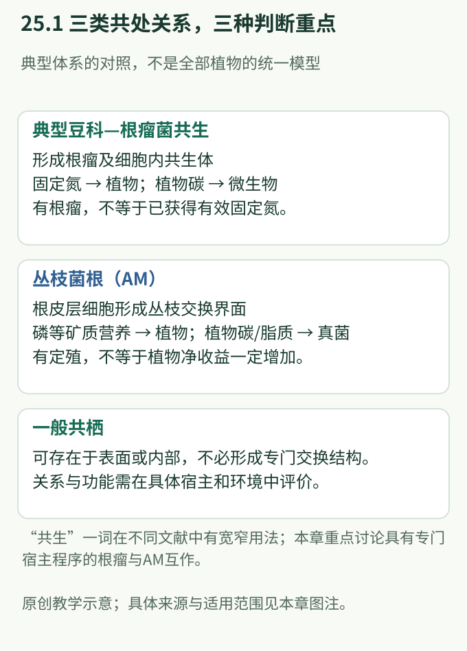
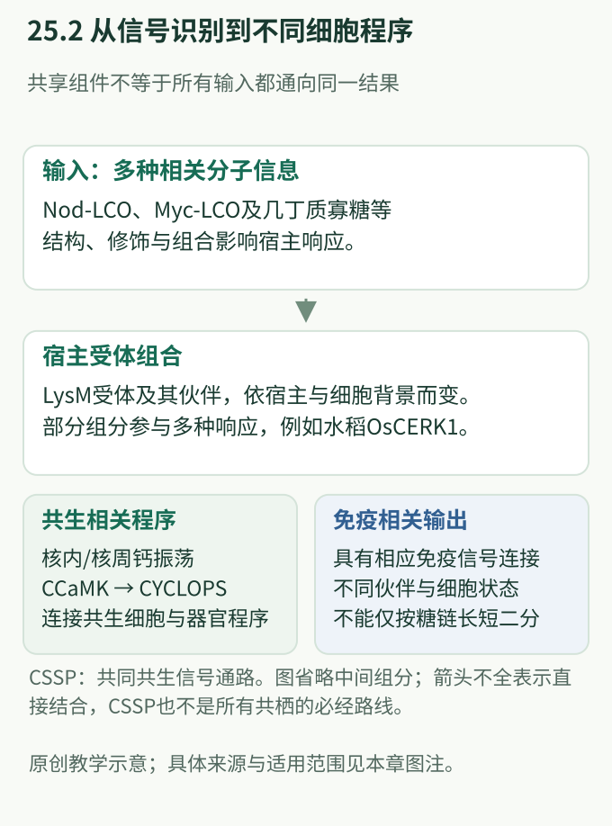
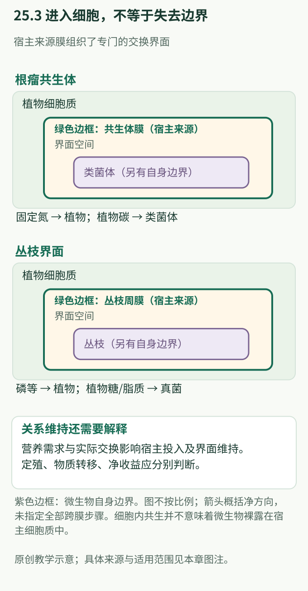

# 第 25 章　共生识别与免疫协调：允许进入以后，如何维持互利

> 第八篇 · 免疫与微生物
>
> 共生需要宿主识别信号、建立交换界面，并持续调节资源投入；任何一层成功，都不能代替其余层次。

根瘤细胞能够容纳大量细菌，根皮层细胞能够容纳高度分枝的真菌结构，而这些细胞仍然保持活性。这与“识别微生物后立即清除”的简单免疫图景不同。真正的问题是：**植物如何把某些接触转化为受控的细胞内共生，同时保留组织边界和防御能力？**

[第 19 章](../part6-专题与研读/ch19-根部免疫与共生边界.md)强调根部反应的位置和环境背景。本章进一步追踪一条因果链：信号被识别以后，怎样变成核内信息、细胞重塑、营养交换和关系维持。

**学习目标。** 能区分根瘤共生、丛枝菌根与一般共栖；解释共同共生信号通路为何不能独自规定最终结局；画出宿主膜包围的交换界面；区分定殖、资源转移与植物净收益；正确评价“共生抑制免疫”这一表述的范围。

**先修概念。** 受体与配体、蛋白磷酸化、细胞膜与膜运输、转录调控、氮磷营养。可先读[第 0 章](../learning/ch00-细胞与分子基础.md)、[第 3 章](../part2-分子机制/ch03-受体与信号转导.md)和第 19 章。

**阅读路线。** 初读按“互作类型 → 识别 → 核钙 → 交换 → 营养 → 免疫协调”阅读；进阶重点比较研究深读中的必要性、通路位置和功能结局三类证据。

## 25.1 三种关系不能用同一套“有益菌”模型解释

**根瘤共生（root nodule symbiosis）**的典型代表是豆科植物与根瘤菌的关系。植物形成根瘤这一专门器官，部分宿主细胞内部建立共生体，细菌分化为承担共生固氮功能的类菌体（bacteroid）。植物获得固定氮，同时承担器官建造、碳供应与维持适宜生理环境的代价。结瘤与固氮是不同过程：有根瘤不等于形成了有效的氮素供应。

**丛枝菌根（arbuscular mycorrhiza, AM）**分布于多类陆生植物。真菌在根外扩展吸收范围，在根皮层细胞中形成丛枝（arbuscule）等结构，帮助植物获取磷等矿质营养；植物向真菌提供有机碳，其中包括糖和脂质。AM 通常不形成根瘤那样的新器官，其关键重塑发生在原有根组织及细胞内部（Javot et al., 2007; Luginbuehl et al., 2017）。

**共栖（commensalism）**描述特定条件下一方获益、另一方未见明确净影响的关系；“一般共栖微生物”在群落研究中有时也宽泛指健康组织中的常驻成员。它们可以位于根表或组织内部，却不必形成根瘤、丛枝或专门的双向营养交换系统。因此，不应把 Nod 因子或共同共生信号通路当作所有常驻微生物的统一通行证。

| 比较维度 | 典型豆科—根瘤菌共生 | 丛枝菌根共生 | 一般共栖关系 |
|---|---|---|---|
| 宿主范围 | 以豆科经典体系为本章重点 | 多类陆生植物，但并非全部 | 广泛，依微生物与宿主而变 |
| 主要空间重塑 | 形成根瘤及细胞内共生体 | 根皮层细胞形成丛枝界面 | 可以没有专门交换结构 |
| 典型植物收益 | 获取固定氮 | 获取磷等矿质营养 | 可能无可测净影响，需分别评价 |
| 植物投入 | 碳、器官建造与维持 | 碳，包括脂质供给 | 随具体关系改变 |
| 不能凭什么判断成功 | 根瘤数量 | 定殖率或丛枝数量 | 仅凭检出或丰度增加 |

**图 25.1　三类互作具有不同的空间和收益判据。** 原创概念图，综合 Yano et al.（2008）、Javot et al.（2007）、Luginbuehl et al.（2017）与 Limpens et al.（2009）。根瘤面板概括典型豆科细胞内共生；一般共栖面板是比较框架，不表示所有共栖成员具有同一种机制。图中箭头代表可能的主要交换方向，不代表固定交换比例。

## 25.2 相似的糖信号，为什么不必得到同一个答案

Nod 因子通常属于**脂壳寡糖（lipochitooligosaccharide, LCO）**：具有寡糖骨架、脂质部分及不同的化学修饰。它们不是“整只根瘤菌”的缩影，而是能被宿主识别的一类分子信息。结构差异、宿主受体组合和后续兼容性共同影响关系能否继续。

2003 年的研究在百脉根 *Lotus japonicus* 中将 **NFR1**、**NFR5** 两类含溶菌素基序（lysin motif, LysM）的受体样蛋白定位到 Nod 信号识别的早期环节。相关宿主遗传缺陷不仅影响最终结瘤，也影响早期生理和细胞反应。这使“根瘤菌发出信号”推进到“宿主需要哪些受体组件”的层次（Madsen et al., 2003; Radutoiu et al., 2003）。但遗传上的必要性与直接配体结合不是同一种证据，不能把这些论文的所有结论都改写成已经解析了完整受体—配体结构。

菌根信号更适合用复数理解。Maillet 等人鉴定了 AM 真菌来源的硫酸化与非硫酸化 LCO，通常称为 Myc-LCO；后续研究还显示，几丁质寡糖（chitooligosaccharide, CO）能够参与宿主共生信号响应。**Myc 因子不是一个在所有植物中都由同一受体独立解码的唯一分子。** Sun 等人的比较表明，豆科与水稻对 Myc-LCO、CO 及其组合的反应存在差异，同一物种的不同表皮细胞也不完全相同（Maillet et al., 2011; Sun et al., 2015）。

常见教学简图把短链几丁质写成“共生”、长链写成“免疫”。链长确实可能影响识别和输出，但这不是脱离宿主、分子修饰、受体伙伴与测量条件的普遍二分法。尤其要区分“某信号能诱发核钙变化”与“该信号足以建立完整共生”。前者只到达了信号链中的一个层次。

水稻 **OsCERK1** 同时参与几丁质触发的免疫和 AM，是理解这一点的关键实例。Miyata 等人发现，影响 OsCERK1 功能会影响两类反应；而免疫识别伙伴 **OsCEBiP** 的缺失并不造成同样的 AM 缺陷。这支持共享组件可以借助不同伙伴和下游连接承担不同功能，不能仅凭蛋白最初得到的名称给它永久分配“免疫”或“共生”身份（Miyata et al., 2014）。

| 信息层次 | 植物实际需要整合什么 | 单一观察不能证明什么 |
|---|---|---|
| 分子结构 | 糖骨架、脂质部分及其他修饰 | 某种糖就是伙伴身份的完整证明 |
| 受体环境 | 受体存在、伙伴组合与细胞位置 | 同一家族受体功能全部等价 |
| 早期响应 | 核钙、转录和其他信号变化 | 已形成有效交换界面 |
| 后续兼容性 | 细胞重塑、营养需求和界面维持 | 早期识别成功就必然互利 |

## 25.3 共同共生通路传递许可，具体程序决定形态

**共同共生信号通路（common symbiosis signaling pathway, CSSP）**得名于一类宿主基因对根瘤和 AM 两种关系都很重要。它的意义不是把细菌与真菌等同，而是揭示宿主可以重复使用某些信号和细胞协调模块。

其中最醒目的动态特征是核内及核周的钙离子振荡。这里的“振荡”指钙信号随时间反复变化，不能用单个终点的“钙含量较高”替代。不同于把任意钙升高视为同一个开关，共生研究关注信号发生的位置、持续方式，以及接收信息的蛋白。

**钙和钙调蛋白依赖性蛋白激酶（calcium- and calmodulin-dependent protein kinase, CCaMK）**承担连接钙信息与下游磷酸化的重要功能。在蒺藜苜蓿 *Medicago truncatula* 中，该模块的经典基因名为 *`DMI3`*。相关宿主缺陷仍可保留早期钙振荡，却不能完成正常共生响应，这支持其作用位置在钙信号产生之后（Lévy et al., 2004）。

**CYCLOPS** 则把这一层连接到核内调控。2008 年研究支持它与 CCaMK 相互作用并可被其磷酸化；2014 年研究进一步证明 CYCLOPS 具有 DNA 结合和转录激活功能，并连接到结瘤调控基因 *`NIN`*。应把“发现相互作用与通路位置”和“阐明直接转录功能”分属不同阶段，不能把后来的机制倒写进早期论文（Yano et al., 2008; Singh et al., 2014）。

共享信号怎样产生根瘤或丛枝这样的不同结构？部分答案在下游的特定转录程序。**RAM1** 是 AM 相关的 GRAS 类转录调控因子。Gobbato 等人的结果显示，RAM1 对菌根相关响应具有特定作用，不能用完整的结瘤程序替代。2012 年论文将其与 RAM2 和脂质相关过程联系；2017 年的工作进一步将 RAM1 所调节的植物脂质合成、向真菌供碳与共生功能相联系。教学上应保留这一认知发展，避免把早期关于角质相关代谢的解释当作后来脂质交换模型的全部内容（Gobbato et al., 2012; Luginbuehl et al., 2017）。

**图 25.2　共享信号模块需要在宿主背景中解读。** 原创图综合 Madsen et al.（2003）、Radutoiu et al.（2003）、Lévy et al.（2004）、Yano et al.（2008）、Singh et al.（2014）、Miyata et al.（2014）与 Sun et al.（2015）。箭头是功能关系的简化，不表示每一步都由直接蛋白结合完成；图中省略核膜通道、核孔及多种调控伙伴，也不把 CSSP 画成所有微生物定殖的必经通路。

## 25.4 “位于细胞内部”并不等于暴露在植物细胞质中

理解共生最容易遗漏的结构，是微生物周围那一层**宿主来源的膜**。在典型根瘤细胞中，共生体（symbiosome）包括类菌体及其周围的宿主膜和间隙；类菌体并非自由漂浮于植物细胞质。宿主膜形成受控的运输边界，也具有独特的膜蛋白组成和成熟过程。Limpens 等人的研究表明，共生体的膜身份不同于简单套用普通内吞至液泡的路线（Limpens et al., 2009）。

AM 中，丛枝虽然深入皮层细胞的空间，却由宿主形成的**丛枝周膜（periarbuscular membrane）**包围。植物细胞质、宿主膜、界面空间和真菌自身的边界必须在图中分开。高度分枝增加了界面面积，但面积本身不等于运输通量；还需要正确定位的运输蛋白、驱动力和双方代谢。

蒺藜苜蓿 **MtPT4** 是这一界面的经典磷酸盐转运蛋白。其功能缺失不仅使菌根带来的磷收益受损，还伴随丛枝提前衰退，说明营养运输与共生结构维持可以彼此耦联。这超出了“运输蛋白只是共生完成以后负责收货”的线性模型（Javot et al., 2007）。

植物供给也不能只写成“给糖”。Luginbuehl 等人将宿主脂质代谢、相关遗传依赖和碳转移证据联系起来，支持植物来源脂质是 AM 真菌的重要有机碳来源。这里不宜进一步简化成“糖已经不重要”，也不应认为所有共生的碳流形式和比例一致（Luginbuehl et al., 2017）。

**图 25.3　宿主膜把容纳伙伴与调节交换连接起来。** 原创结构与功能示意，依据 Limpens et al.（2009）、Javot et al.（2007）及 Luginbuehl et al.（2017）；营养条件与关系维持的联系参照 Kiers et al.（2003）和 Das et al.（2022）。不按比例绘制；交换箭头概括净方向，不指定所有跨膜步骤、化学形态或调控反馈已经完全明确。

## 25.5 营养状态决定共生值得投入多少

“伙伴能够供应磷”与“植物当前需要为磷付出更多碳”是两个问题。根可以直接获取磷，也可以经菌根获得磷；宿主需要协调不同获取途径及其成本。因而营养条件不仅影响最终长势，还能在共生建立之前改变根的响应准备程度。

Das 等人证明，水稻磷饥饿响应转录因子 **PHR2** 参与调控 AM。一个特别有解释力的观察是：在尚未被真菌定殖的根中，PHR2 功能变化已经影响多类共生相关基因的表达。结合其对相关基因的结合证据和植物功能结果，研究将磷状态与信号识别、宿主容纳和营养交换连接起来。因此，低磷不是实验的背景标签，而可参与设置共生程序的启动条件（Das et al., 2022）。

根瘤同样不是形成以后便得到无条件的长期供给。Kiers 等人在豆科—根瘤菌体系中提供了宿主根据固氮表现改变伙伴收益的证据，“宿主制裁（host sanctions）”由此成为理解互利稳定性的概念。不过，制裁是对特定资源分配与伙伴适合度结果的概括，不代表植物能够像人一样预先识别所有“合作”与“不合作”成员，也不等于所有低效根瘤都采用相同调控机制（Kiers et al., 2003）。

评价净收益时，至少应分开四层：伙伴是否存在、是否形成正确界面、是否发生资源转移、宿主在该环境中的生长或繁殖结果。资源转移有时并不立即表现为生物量差异，因为植物的限制因素可能已转到另一种资源。反过来，长势改善也不能单独证明它来自预设的交换路径。

| 观察层次 | 可以支持的判断 | 仍需区分的问题 |
|---|---|---|
| 根中微生物更多 | 定殖或丰度发生变化 | 活性、空间位置及交换效率 |
| 形成丛枝或根瘤 | 特定结构发育发生 | 是否成熟、是否正常维持 |
| 营养元素进入植物 | 存在资源获取或转移 | 哪条途径、代价与替代来源 |
| 植物生长或繁殖改善 | 当前条件下存在净收益 | 营养、免疫或其他过程的贡献 |

## 25.6 共生协调的是具体反应，不是给整株免疫断电

共生要求宿主允许某些细胞发生重塑，并把特定伙伴维持在可交换资源的位置。若把这概括为“全面关闭免疫”，就无法解释三个事实：共享受体可以有不同输出；共生体仍有宿主膜边界；伙伴进入以后仍受营养和结构维持条件约束。更准确的表述是，免疫与共生程序在特定细胞、阶段和资源背景下得到协调。

这种协调也不能简单理解为所有防御读数下降。某个细胞中的氧化还原变化、某类转录响应和整株对另一种胁迫的反应，分属不同层次。仅凭一个防御标记变化，既不能判断完整免疫能力，也不能判断互利是否建立。[第 20 章](../part6-专题与研读/ch20-如何阅读植物免疫证据.md)中的证据分层在这里同样适用。

**拟南芥模型的边界尤其重要。** *Arabidopsis thaliana* 是研究模式识别、根细胞身份和一般微生物组互作的重要体系，却不是形成常规 AM 的标准宿主。比较系统基因组研究显示，AM 能力在多个谱系中的丢失与一组共生相关基因的丢失相关，拟南芥所在谱系是其中的重要实例（Delaux et al., 2014）。

这意味着：拟南芥能够响应某类糖信号，不足以证明它保留完整 AM 程序；其缺磷响应也不能直接替代水稻或豆科中的菌根调控。另一方面，不能把非 AM 宿主等同于“没有有益真菌互作”。需要区分特定的丛枝结构与其他根部共存方式，而不是依据一种模型的强项或缺项定义全部植物。

> **Key Question：** 植物怎样将“能识别伙伴”“有能力容纳伙伴”和“当前值得继续供养伙伴”连接起来，而又保留这些判断各自的调节空间？

## 25.7 里程碑研究深读：把信号、容纳与交换分开检验

### Maillet 等，2011：把未知的菌根信号变成可定义的分子

**面对的问题。** 菌根真菌能够在接触之前引发宿主反应，但“存在可扩散信号”并没有说明信号是什么。

**关键思路。** 将分子结构鉴定与植物反应、宿主遗传依赖相互连接；单纯找到一种分子，或者单纯观察根分枝增加，都不足以确定共生信号身份。

**关键证据链。** ①研究识别出真菌来源的 LCO 混合物；②这些信号影响多类植物的菌根形成和宿主根发育；③蒺藜苜蓿的部分反应依赖 DMI 共生信号途径。这把分子身份、功能与宿主通路连成了同一个解释（Maillet et al., 2011）。

**认知改变与边界。** 菌根伙伴与根瘤伙伴可以使用具有结构亲缘性的信号，但这不证明全部菌根宿主使用完全相同的识别机制。阅读时还应分开“促进某反应”“该反应依赖某通路”和“该分子是自然条件下唯一必需信号”。

### Yano 等，2008：为什么一个总称为“共生缺陷”的表型需要拆开

**面对的问题。** 同一宿主模块参与两种共生，但器官发育与细胞内容纳是否属于不可分割的同一步？

**关键思路。** 不只问有没有成熟根瘤，还分别考察早期器官发育、伙伴进入的组织位置和丛枝形成。

**关键证据链。** ①百脉根 *`cyclops`* 材料的细胞内容纳严重受损，却仍保留部分根瘤原基发育；②研究把 CYCLOPS 定位到细胞核，并建立它与 CCaMK 的相互作用和磷酸化联系；③水稻中的结果支持该功能跨越豆科范围。多层证据因此将 CYCLOPS 与共同的细胞内容纳程序联系起来（Yano et al., 2008）。

**认知改变与边界。** “共生失败”并非一个单一机制标签。早期论文提出的分支关系是当时证据支持的模型；结合后来 CYCLOPS 的转录功能研究，不能将其永久定义为只影响进入、绝不参与器官调控的蛋白（Singh et al., 2014）。

### Javot 等，2007：营养交换为什么也是结构维持问题

**面对的问题。** 丛枝周膜上的磷转运蛋白是否只影响植物最终拿到多少磷，而不影响伙伴关系本身？

**关键思路。** 把宿主磷状态、生长表现与丛枝的形成、成熟及衰退联系起来，避免只用根中真菌总量解释全部过程。

**关键证据链。** ①不同宿主遗传证据共同支持 MtPT4 的功能重要性；②缺乏正常 MtPT4 功能时，菌根相关的磷收益受损；③丛枝可出现但提前衰退，关系难以持续。这说明“最初建立”和“继续维持”具有不同要求（Javot et al., 2007）。

**认知改变与边界。** 交换可以是维持共生的条件。不过，“转运缺陷导致衰退”还不足以独自说明植物直接测量了哪一种信号，也不能把特定营养背景中的结果提升为所有宿主一律采用同一制裁机制的证明。

## 25.8 开放问题：共同模块如何产生可靠而可调整的关系

- **识别信息在何处被整合？** 受体组合、信号时间特征与细胞身份各贡献多少，哪些规律跨物种保守？相似的核钙响应之后出现不同转录结果，是需要解释的现象。
- **宿主感知的是供给、代谢状态，还是界面完整性？** 丛枝或根瘤的维持与营养表现相关，但直接连接资源流和结构命运的环节仍需具体区分。
- **局部收益怎样与整株分配协调？** 一个根段的伙伴有价值，不等于整株在当前碳预算下应无限扩大共生。局部与远端营养信息如何共同设置投入，是不同共生体系可比较的问题。
- **共同通路有多“共同”？** 豆科、水稻和其他宿主共享一些组件，却具有不同受体、组织与代谢背景。寻找保守性时也要解释系统性的差异。

## 25.9 方法概念表：每一种读数只回答一层问题

| 证据类型 | 主要测量对象 | 最有帮助的比较 | 解释边界 |
|---|---|---|---|
| 宿主遗传分析 | 某组件对特定表型的必要性 | 多个独立证据与正常功能恢复 | 表型相似不等于直接相互作用 |
| 动态钙成像 | 核内及核周信号的时空变化 | 相同细胞身份与不同宿主背景 | 有振荡不等于已形成共生 |
| 蛋白定位与界面成像 | 宿主膜、微生物及运输蛋白的位置 | 发育阶段与结构完整性 | 共定位不自动证明运输功能 |
| 资源转移与营养测量 | 元素或碳流、宿主营养结局 | 直接吸收与共生途径的贡献 | 元素增加不自动等于净收益 |
| 转录与结合证据 | 调控因子、靶基因和细胞程序 | 结合、表达及功能相互支持 | 结合峰或表达变化不能独自说明全部因果 |
| 比较系统基因组 | 共生能力与基因保留的演化联系 | 多次独立丢失而非仅比较两物种 | 相关保留提示候选功能，仍需功能证据 |

## 本章自测与讲解

**1. 根中检测到一种真菌，而且植物没有病症，能否称其为丛枝菌根共生？**

不能。无病症和组织内检出不能替代对 AM 特有结构、宿主兼容性及功能的判断。一般内生、共栖与丛枝菌根是不同层面的描述。

**2. 为什么不能用“短链是共生信号，长链是免疫信号”完成所有分类？**

链长只是分子特征之一。修饰、受体伙伴、宿主物种、细胞身份及读数都会影响结论。特定条件下的规律不能直接成为所有植物通用的身份判据。

**3. 某宿主仍出现核钙振荡，却不能形成正常共生，应怎样理解？**

这说明信号产生与后续解码、转录或结构建立可能分离。CCaMK/DMI3 的经典研究提示，保留早期信号不能证明下游程序完整；还需要定位缺陷层次。

**4. 丛枝位于皮层细胞内部，为什么仍需要跨膜运输蛋白？**

丛枝与植物细胞质之间仍隔着宿主丛枝周膜、界面空间和真菌自身边界。空间上的细胞内位置不等于双方细胞质直接连通。

**5. 共生定殖率提高，但植物生物量没有增加，是否说明伙伴完全没有贡献？**

不能。还需判断资源是否转移、碳投入如何，以及生长是否受其他因素限制。但同样不能反向宣称一定有益：定殖、交换和净收益必须分别有证据。

**6. 拟南芥的某种根部免疫反应降低，能否据此推断它获得了 AM 能力？**

不能。AM 需要特定识别、细胞重塑、宿主膜界面和交换程序。一个免疫读数下降并不能补全这些层次，拟南芥也不是常规 AM 宿主。

## 推荐阅读

- 🔴 **必读：Maillet et al.（2011）。** 从信号化学身份、宿主反应及遗传依赖三个层次理解 Myc-LCO 的发现，注意“促进”与“唯一必需”的区别。
- 🔴 **必读：Javot et al.（2007）。** 观察运输缺陷怎样连接丛枝寿命，理解共生建立与维持为何应分开评价。
- 🟡 **重要：Yano et al.（2008）与 Singh et al.（2014）。** 连续阅读同一模块从遗传分支与蛋白相互作用，发展到直接转录调控的证据链。
- 🟡 **重要：Sun et al.（2015）与 Miyata et al.（2014）。** 建立跨宿主、跨细胞背景阅读受体和信号结论的习惯。
- 🟢 **拓展：Das et al.（2022）与 Delaux et al.（2014）。** 分别从营养调控和演化丢失理解共生能力为何不是所有根都默认具备的状态。

## 参考文献

- Das D, Paries M, Hobecker K, et al. *PHOSPHATE STARVATION RESPONSE transcription factors enable arbuscular mycorrhiza symbiosis.* Nature Communications, 2022; 13: 477. [DOI: 10.1038/s41467-022-27976-8](https://doi.org/10.1038/s41467-022-27976-8).
- Delaux PM, Varala K, Edger PP, Coruzzi GM, Pires JC, Ané JM. *Comparative phylogenomics uncovers the impact of symbiotic associations on host genome evolution.* PLOS Genetics, 2014; 10: e1004487. [DOI: 10.1371/journal.pgen.1004487](https://doi.org/10.1371/journal.pgen.1004487).
- Gobbato E, Marsh JF, Vernié T, et al. *A GRAS-type transcription factor with a specific function in mycorrhizal signaling.* Current Biology, 2012; 22: 2236–2241. [DOI: 10.1016/j.cub.2012.09.044](https://doi.org/10.1016/j.cub.2012.09.044).
- Javot H, Penmetsa RV, Terzaghi N, Cook DR, Harrison MJ. *A Medicago truncatula phosphate transporter indispensable for the arbuscular mycorrhizal symbiosis.* Proceedings of the National Academy of Sciences USA, 2007; 104: 1720–1725. [DOI: 10.1073/pnas.0608136104](https://doi.org/10.1073/pnas.0608136104).
- Kiers ET, Rousseau RA, West SA, Denison RF. *Host sanctions and the legume–rhizobium mutualism.* Nature, 2003; 425: 78–81. [DOI: 10.1038/nature01931](https://doi.org/10.1038/nature01931).
- Lévy J, Bres C, Geurts R, et al. *A putative Ca2+ and calmodulin-dependent protein kinase required for bacterial and fungal symbioses.* Science, 2004; 303: 1361–1364. [DOI: 10.1126/science.1093038](https://doi.org/10.1126/science.1093038).
- Limpens E, Ivanov S, van Esse W, et al. *Medicago N2-fixing symbiosomes acquire the endocytic identity marker Rab7 but delay the acquisition of vacuolar identity.* The Plant Cell, 2009; 21: 2811–2828. [DOI: 10.1105/tpc.108.064410](https://doi.org/10.1105/tpc.108.064410).
- Luginbuehl LH, Menard GN, Kurup S, et al. *Fatty acids in arbuscular mycorrhizal fungi are synthesized by the host plant.* Science, 2017; 356: 1175–1178. [DOI: 10.1126/science.aan0081](https://doi.org/10.1126/science.aan0081).
- Madsen EB, Madsen LH, Radutoiu S, et al. *A receptor kinase gene of the LysM type is involved in legume perception of rhizobial signals.* Nature, 2003; 425: 637–640. [DOI: 10.1038/nature02045](https://doi.org/10.1038/nature02045).
- Maillet F, Poinsot V, André O, et al. *Fungal lipochitooligosaccharide symbiotic signals in arbuscular mycorrhiza.* Nature, 2011; 469: 58–63. [DOI: 10.1038/nature09622](https://doi.org/10.1038/nature09622).
- Miyata K, Kozaki T, Kouzai Y, et al. *The bifunctional plant receptor, OsCERK1, regulates both chitin-triggered immunity and arbuscular mycorrhizal symbiosis in rice.* Plant and Cell Physiology, 2014; 55: 1864–1872. [DOI: 10.1093/pcp/pcu129](https://doi.org/10.1093/pcp/pcu129).
- Radutoiu S, Madsen LH, Madsen EB, et al. *Plant recognition of symbiotic bacteria requires two LysM receptor-like kinases.* Nature, 2003; 425: 585–592. [DOI: 10.1038/nature02039](https://doi.org/10.1038/nature02039).
- Singh S, Katzer K, Lambert J, Cerri M, Parniske M. *CYCLOPS, a DNA-binding transcriptional activator, orchestrates symbiotic root nodule development.* Cell Host & Microbe, 2014; 15: 139–152. [DOI: 10.1016/j.chom.2014.01.011](https://doi.org/10.1016/j.chom.2014.01.011).
- Sun J, Miller JB, Granqvist E, et al. *Activation of symbiosis signaling by arbuscular mycorrhizal fungi in legumes and rice.* The Plant Cell, 2015; 27: 823–838. [DOI: 10.1105/tpc.114.131326](https://doi.org/10.1105/tpc.114.131326).
- Yano K, Yoshida S, Müller J, et al. *CYCLOPS, a mediator of symbiotic intracellular accommodation.* Proceedings of the National Academy of Sciences USA, 2008; 105: 20540–20545. [DOI: 10.1073/pnas.0806858105](https://doi.org/10.1073/pnas.0806858105).
