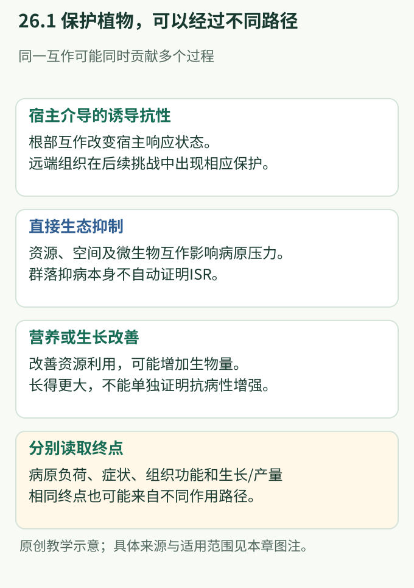
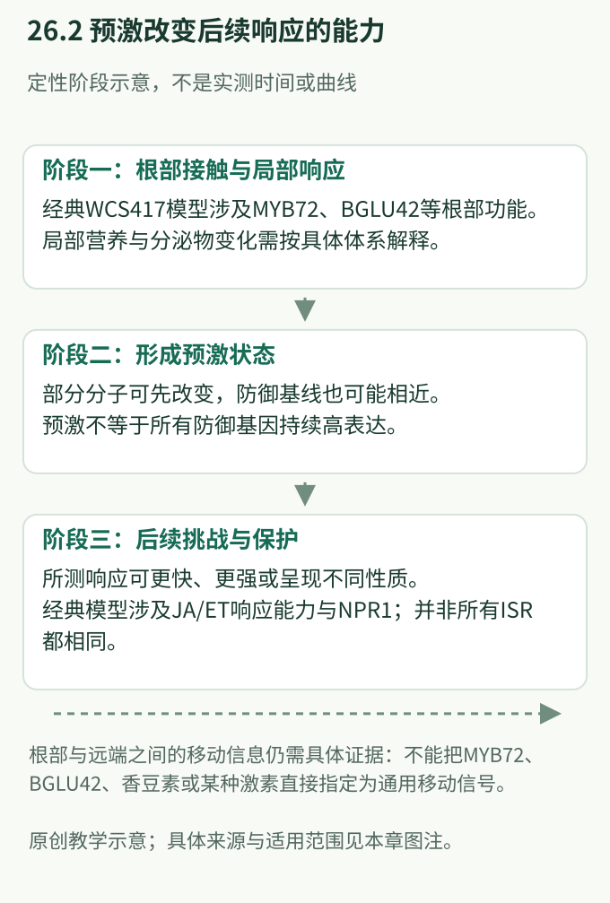
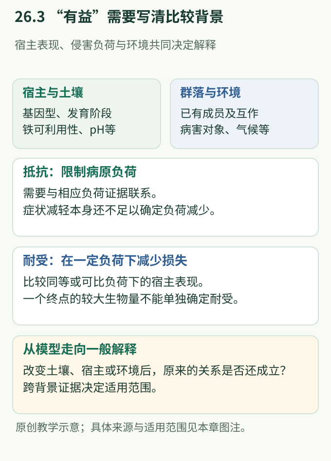

# 第26章 有益微生物与诱导抗性：保护植物的收益从何而来

> 核心问题：根部有微生物之后，植物长得更好、叶片病得更轻，是否就说明它获得了免疫保护？

一株植物同时生活在营养环境和微生物环境中。根部微生物可能帮助它获得铁，可能改变附近病原承受的竞争，也可能使远端叶片更有效地应对后来的侵害。这些过程可以同时出现，却回答不同问题。解释“有益”不能停在一个健康表型上，而要追问收益经过了谁、改变了什么、在何种背景下成立。

**学习目标**

- 区分促生、宿主介导的诱导抗性和直接生态抑制。
- 根据原始证据解释经典 WCS417 模型中的 JA、ET、SA 与 NPR1。
- 理解根部 MYB72—BGLU42、铁营养和根分泌物为何连接，但不能直接等同。
- 判断抑病土壤研究中的相关性、功能因果与跨环境适用范围。
- 同时用病原负荷、宿主损失和生长代价评价保护。

**先修与衔接：**激素基础见[第5章](../part2-分子机制/ch05-激素信号网络.md)，系统免疫与防御预激见[第18章](../part6-专题与研读/ch18-系统免疫与防御预激.md)，根部组织背景见[第19章](../part6-专题与研读/ch19-根部免疫与共生边界.md)。本章承接这些概念，重点解释保护收益的来源；应用评价衔接[第15章](../part5-转化与展望/ch15-微生物组工程与生物防治.md)。

**阅读路线：**先读26.1建立结果分类，再以26.2—26.4追踪宿主介导的过程；26.5转到土壤群落，26.6讨论收益和适用条件。三处“思路拆解”分别训练通路区分、必要性判断和代谢联系的阅读。

## 26.1 “有益”必须拆成可区分的生物学结果

**促生（plant growth promotion）**指一定条件下生物量、生长速度或相关表现改善。它可能来自营养供给、发育变化或胁迫缓解。**抗病保护**则要求病害相关终点改善。若没有病害背景，观察到较大的叶片不能说明植物更抗病；即使症状变轻，也需要进一步区分植物减少了病原，还是承受了相近的病原负荷。

**抵抗（resistance）**强调限制病原建立或增殖；**耐受（tolerance）**强调在一定病原负荷下减少宿主损失。耐受不是完全没有防御，也不是单纯“看起来不生病”。它描述病原负荷与损失之间的关系，严格比较通常需要多个负荷水平，而非只看一组照片。

| 结果或过程 | 核心变化 | 应结合的证据 | 常见误读 |
|---|---|---|---|
| 促生 | 植物生长或营养改善 | 生物量、元素状态、发育阶段 | 植物更大，所以免疫更强 |
| 宿主介导的抗性 | 植物自身应对能力改变 | 宿主依赖性、空间关系、病害结果 | 标志基因升高即证明保护 |
| 直接生态抑制 | 病原所处环境更不利 | 资源、空间或微生物作用与病害的联系 | 所有生防效果都是 ISR |
| 耐受改善 | 相同负荷造成的损失较少 | 病原负荷与宿主损失的对应关系 | 症状少必然意味着病原少 |

**直接生态抑制（direct ecological suppression）**包括资源与空间竞争以及微生物之间的抑制性作用。这里“直接”指主要因果路径经过病原或其生态条件，不代表整个过程没有宿主参与。宿主提供的碳源、组织结构和分泌物，仍可能决定这种作用能否发生。

相反，**诱导系统抗性（induced systemic resistance，ISR）**强调局部微生物互作改变了宿主远端保护能力。根部细菌和叶部病原空间分离，是支持宿主介导解释的重要条件；还需区分保护是否由宿主响应介导，而非微生物或其产物在远端直接抑制病原。单独观察空间距离，尚不能识别内部传递信号。

**图26.1 保护收益可以经过不同路径。**原创概念图，依据 Pieterse et al. (1996, 1998)、Mendes et al. (2011) 和 Harbort et al. (2020) 整合。三条路径可以共存；各框比较不同因果类别，不代表每个体系都已证明所有连接。

## 26.2 WCS417 改变了“系统抗性只有一种激素模式”的认识

经典研究使用拟南芥与 WCS417 根际细菌；早期论文称其为 *Pseudomonas fluorescens* WCS417r，后续文献常称 *Pseudomonas simiae* WCS417。阅读历史时，应识别名称变化，避免把它们误当作相互独立的重复发现。

1996年，Pieterse 等发现，WCS417 相关系统保护可以不伴随水杨酸（salicylic acid，SA）积累和典型病程相关蛋白基因的持续激活。这说明已有的系统性获得抗性（SAR）特征，不能覆盖全部有益根际细菌诱导的保护。这里没有证明 SA 在植物防御中不重要，而是找到了一个具有不同依赖关系的情境 (Pieterse et al., 1996；[原始研究](https://doi.org/10.1105/tpc.8.8.1225))。

### ⬡ 思路拆解一：共享 NPR1，为何仍能区分 ISR 与 SAR？

**面对的问题：**若两种起始刺激都使叶片病害减少，能否认为它们采用同一套内部过程？

**关键思路：**1998年的研究比较不同宿主信号能力下，两类保护能否形成，而不是仅比较健康植株的外观。

**关键证据链：**① 原文图1和表1把症状与叶片病原负荷联系起来；② 茉莉酸（jasmonic acid，JA）和乙烯（ethylene，ET）响应受损时，WCS417 诱导保护受阻，而经典 SAR 仍可出现；③ **NPR1**功能缺失影响两类保护；④ 表2显示根部细菌定殖差异不能解释这些结果。因此，共用调控节点不等于前后所有步骤相同 (Pieterse et al., 1998；[原始研究](https://doi.org/10.1105/tpc.10.9.1571))。

**影响：**研究把“保护表型相似”拆成“信号依赖既有差异，也有交汇”。原文进一步提出 JA、ET 响应组分的先后关系；今天应将其作为该体系的遗传模型，不能画成已经逐项证明直接生化作用的普遍直线。

另一个容易忽略的词是“响应”。依赖 JA/ET 响应能力，并不等于两种激素必须持续大量积累；依赖 NPR1，也不意味着必须先检测到高水平 SA 和持续的 **PR1**输出。这些层次分别涉及信号浓度、感知能力、调控网络和最终功能。

> **◆ 认知修正：ISR 不是“SA 非依赖”的同义词。** SS101 根际细菌诱导拟南芥抗性的原始研究显示，该体系的保护依赖 SA 信号，其激素关系不同于经典 WCS417 模型。菌株、宿主和被评估的病害共同限定结论 (van de Mortel et al., 2012；[原始研究](https://doi.org/10.1104/pp.112.207324))。

## 26.3 根部经历怎样变成叶片在挑战后的不同反应？

WCS417 研究中的一个重要现象是：保护已经能够建立时，叶片未必出现大范围、持续的防御转录升高。Verhagen 等比较根和叶的转录响应，发现局部根部变化与远端叶片变化并不对称；许多叶片差异在后续挑战后才表现出来。于是，关注点由“现在开了多少防御基因”转向“下一次反应被怎样改变” (Verhagen et al., 2004；[原始研究](https://doi.org/10.1094/MPMI.2004.17.8.895))。

这就是**防御预激（defense priming）**在该情境中的意义。预激是一种响应状态，并非与 ISR 并列的另一条通路。预激期可以已有代谢、蛋白或少数转录变化；“基线相近”只适用于所测指标，不能推成细胞内部毫无变化。后续更快或更强的响应，也必须与实际保护相联系，不能自动把更高的应激读数视为更健康。

| 根—叶联系的环节 | 需要回答的问题 | 单独不足的观察 |
|---|---|---|
| 根部启动 | 哪些宿主能力使局部互作产生系统后果？ | 根中某基因上调 |
| 信息传递 | 什么信息离开起始组织，怎样到达远端？ | 叶片某代谢物增多 |
| 远端状态形成 | 叶片如何改变后续响应能力？ | 一次静态转录比较 |
| 保护执行 | 改变的响应是否减少病害及宿主损失？ | 一个防御标志物增强 |

在本章涉及的经典研究中，根部必要因子与远端响应能力已经可以分别定位，但从根到叶的移动信息并未由这些结果完整闭合。根部产生的分子、运输过程和叶片的局部放大可能分工；同一个终点也可能由多条信息路线共同达成。

因此，不能把 JA/ET 的遗传依赖直接改写为“JA 或 ET 就是根向叶移动的唯一信号”，也不能因为根外分泌物增加，就画出它们进入维管、到达叶片并触发防御的实线。第18章讨论的 NHP 等 SAR 证据，同样不能直接补到每一种根际微生物 ISR 的空白处。

**图26.2 预激改变后续响应，根部启动因子不等于移动信号。**原创定性概念图，依据 Verhagen et al. (2004)、Van der Ent et al. (2008) 和 Zamioudis et al. (2014)。阶段示意不表示实测时间或效应量；更快、更强须依具体指标判断，虚线保留尚未确定的组织间联系。

## 26.4 MYB72—BGLU42 把局部免疫准备接到铁营养和根部化学环境

**MYB72**是调节基因表达的转录因子，**BGLU42**是与糖苷加工相关的β-葡萄糖苷酶。前者主要帮助决定哪些代谢程序被调动，后者参与影响相关产物的释放。将两者连起来，不是说根部已经找到一个通向所有保护终点的总开关。

### ⬡ 思路拆解二：MYB72 是必要环节，为什么还不是充分解释？

**面对的问题：**根中被细菌诱导的基因很多，哪一个真正参与系统保护？

**关键思路：**Van der Ent 等将局部表达、宿主遗传差异和其他诱导途径的完整性一起比较。

**关键证据链：**① 图1中，两种独立的 *`myb72`* 缺失背景不能形成相应 ISR，根部细菌数量不足不能解释结果；② 图2表明其他诱导抗性能力仍保留，因而不是所有防御普遍崩溃；③ 图6中较高 MYB72 表达没有单独带来持续抗性。组合证据支持 MYB72 参与根部早期步骤，却不足以单独解释完整保护 (Van der Ent et al., 2008；[原始研究](https://doi.org/10.1104/pp.107.113829))。

**影响：**“必需但不充分”提示还存在协作组分或条件。它并非负面结果，而是阻止研究者把一个相关转录因子误写成全部机制。

### ⬡ 思路拆解三：BGLU42 让铁响应与 ISR 发生了怎样的联系？

**面对的问题：**MYB72 调动的下游程序中，哪些可能解释局部根部反应和远端保护之间的关系？

**关键思路：**Zamioudis 等从 MYB72 依赖的表达变化出发，把候选功能、病害结果和根内外代谢物分布相互对照。

**关键证据链：**① 图1所示候选程序与缺铁响应重叠；② 图3显示 BGLU42 功能缺失影响 WCS417 诱导保护；③ 图5区分根内积累与根外释放：缺少 BGLU42 时，两处荧光酚类信号的变化并不相同。因而代谢物“存在”与“释放到根周围”需要分开解释 (Zamioudis et al., 2014；[原始研究](https://doi.org/10.1111/nph.12980))。

**影响：**这项研究把系统抗性与局部营养响应相接，但没有证明荧光物质都是同一化合物，也没有证明它们就是根—叶移动信号。共同依赖一个节点，仍允许下游分为营养、根际互作和系统防御等不同方向。

为什么铁特别重要？土壤中“有铁”不等于根能够获得足够的可利用铁。宿主的铁状态会影响代谢，代谢物进入根际又会改变微生物接触到的资源和化学环境。因此，免疫研究中看似附带的营养条件，可能正是决定局部互作是否产生收益的背景。

**香豆素（coumarins）**是一类结构相关的植物代谢物，不应被当作单一功能分子。Stringlis 等进一步把 MYB72/BGLU42 相关分泌过程与香豆素组分及根相关群落改变联系起来，说明宿主代谢可以参与筛选微生物，而不是只被动接受外来成员 (Stringlis et al., 2018；[原始研究](https://doi.org/10.1073/pnas.1722335115))。

Harbort 等则显示，香豆素与根部细菌的合作可以在缺铁背景下改善宿主营养表现。这使“促生≠抗病”的区分更加具体：同一代谢领域与微生物群落的互作，可能首先带来营养收益；群落组成变化和生长恢复，不能替代病害终点。不同香豆素、不同菌株和不同土壤的作用也不能相互等同 (Harbort et al., 2020；[原始研究](https://doi.org/10.1016/j.chom.2020.09.006))。

## 26.5 抑病土壤：从“谁比较多”走向“谁在何时发挥了什么作用”

**抑病土壤（disease-suppressive soil）**指在特定宿主—病害关系中，土壤使病害程度低于预期。它不是没有病原的土壤，也不是对所有作物都同样有效的标签。较轻的病害可能涉及微生物活动，也可能受理化环境影响；首先要明确这两个层次如何联系。

Mendes 等以甜菜根部病害为背景，将群落描述与功能证据结合，识别与抑病相关的细菌类群和微生物功能。这项工作的重要性不在于提供一份“健康土壤物种清单”，而在于从复杂群落中建立可继续检验的因果线索 (Mendes et al., 2011；[原始研究](https://doi.org/10.1126/science.1203980))。

仅凭富集仍有多种解释。某成员可能参与保护，也可能只是偏好健康根系释放的资源；还可能由第三个土壤因素同时促进该成员和宿主。即使某成员具有保护作用，其他伙伴也可能决定它在完整群落中能否发挥功能。比较整个属或科的丰度，尤其不能代表其中每株微生物都具有同样特征。

Carrión 等将视角推进到根内群落，发现根部受到真菌侵害时，某些微生物类群与相关功能发生响应，并通过功能分析将其中部分变化与宿主保护联系起来。这里的重点是**保护能力可以随侵害背景被激活**，不能只从侵害前的群落名单推断最后结果 (Carrión et al., 2019；[原始研究](https://doi.org/10.1126/science.aaw9285))。

| 研究层次 | 能够增加的理解 | 仍需保留的边界 |
|---|---|---|
| 抑病与易发病背景比较 | 土壤状态与病害存在联系 | 理化条件和微生物作用可能共同变化 |
| 群落关联 | 找到与保护共同变化的成员 | 富集可能是原因，也可能是后果 |
| 功能与宿主结果联系 | 某过程参与保护的因果解释增强 | 单一背景中的必要性不等于普遍必要性 |
| 多地点、多宿主复现 | 估计效应稳定性与适用范围 | 平均有效不代表各条件下均有效 |

这两项研究与 ISR 研究互相补充：前者关注土壤和根相关微生物功能怎样影响病害，后者特别强调宿主内部的系统响应。若没有远端保护和相应宿主依赖证据，就不应把根内群落的全部抑病作用统称为 ISR。不同保护路径可以汇合，也应各自保留可检验的解释。

## 26.6 有益关系的价值取决于损失减少、维持代价和背景稳定性

植物为根际提供碳和代谢物，也需要维持感知、调控与防御能力。微生物带来的营养收益可能补偿其中一部分成本，却不能让成本消失。反过来，生长减慢也不一定全部来自防御耗能，还可能涉及发育调整或环境限制，解释需要比较相应生理背景。

van Hulten 等比较拟南芥的预激与直接防御激活，发现其研究条件下预激的适合度代价相对较小，疾病背景下保护收益能够超过成本。这提供了理解预激价值的原始证据，但研究并非在所有根际微生物情境中逐一测量成本，因此不能据此宣称“所有 ISR 都无代价” (van Hulten et al., 2006；[原始研究](https://doi.org/10.1073/pnas.0510213103))。

评价微生物收益时，应将三个问题同时保留：病原负荷是否下降，相同负荷造成的损失是否降低，最终生长或繁殖表现是否改善。一个处理可能增强抵抗却付出较大生长代价，也可能主要改善营养并提高耐受。它们都可能对植物有价值，但机制与适用目标不同。

**跨背景可重复性**也不是简单地“重复成功或失败”。宿主基因型决定响应能力；发育阶段决定组织需求；土壤铁状态与酸碱条件影响代谢；原有群落改变伙伴关系；气候与病害压力改变保护收益。Harbort 等对不同铁可利用性土壤的比较，提供了营养互作受环境限定的具体例子，而不是抽象地说“田间很复杂” (Harbort et al., 2020)。

阅读不同地点的结果时，首先检查是否比较了同一种收益。一个地点报告生物量，另一个报告病斑，不能直接当作同一功能的复现。其次区分微生物是否存在、相关功能是否表达、宿主是否获益：三个环节中任何一个改变，都可能造成整体结果变化。第15章的应用问题，只有建立在这些机制分层之上才容易解释。

**图26.3 抵抗、耐受与环境背景共同限定“有益”。**原创概念图，依据 Mendes et al. (2011)、Carrión et al. (2019)、Harbort et al. (2020) 的研究范围，并结合本章结果分类整理。抵抗和耐受为概念关系，图中不表示论文实测数值或跨作物效应大小。

## 26.7 开放问题：把哪些空白留在模型里？

- **根部启动如何连接远端状态？** MYB72、BGLU42 的局部功能与叶片保护已有联系，但哪种移动信息在特定情境下承担关键传递，仍需区分生成、运输与接收。
- **铁响应和免疫准备共享到哪一层？** 共同调控因子可能连接两者，也可能形成分支；营养恢复是否足以解释某种保护，不能从表达重叠判断。
- **群落变化何时具有保护意义？** 组成、活性和相互作用可能不同步；静态丰度能否预测后续功能，是一个独立问题。
- **保护收益能否跨越宿主与土壤？** 可重复的也许是功能关系，而不是固定成员名单；需要知道哪些背景变化会改变因果路径。

> **Key Question：** 如果根部营养、群落组成与叶片抗性同时改变，哪些证据才能判断它们属于一条连续因果链，还是共享起点的几条分支？

## 关键实验方法 Box：先理解测量对象，再判断结论

| 方法或证据类型 | 基本原理与用途 | 解释时应注意 | 代表原始研究 |
|---|---|---|---|
| 宿主遗传学比较 | 将特定宿主能力与保护是否成立联系 | 基础健康、定殖差异和其他响应完整性 | Pieterse et al., 1998；Van der Ent et al., 2008 |
| 时空转录比较 | 区分根部启动、叶片基线与挑战后反应 | 时间分辨率、组织混合和检测范围 | Verhagen et al., 2004 |
| 根内外代谢分析 | 区分产生、积累与释放 | 总荧光不能识别全部化学成分 | Zamioudis et al., 2014；Stringlis et al., 2018 |
| 群落与功能联合分析 | 连接成员、功能状态和宿主结果 | 相对丰度不是绝对数量，关联网络不是直接互作图 | Mendes et al., 2011；Carrión et al., 2019 |
| 生长与病害联合评价 | 区分保护、营养补偿和代价 | 同龄不一定同发育阶段，症状与负荷应分开 | van Hulten et al., 2006；Harbort et al., 2020 |

## 推荐阅读

| 分级 | 文献 | 阅读重点 |
|---|---|---|
| 🔴 必读 | Pieterse et al., 1998 | 从图1和两张表理解激素依赖、共享节点与定殖解释 |
| 🔴 必读 | Van der Ent et al., 2008 | 学会把“必要”与“充分”分开 |
| 🟡 重要 | Zamioudis et al., 2014；Stringlis et al., 2018 | 追踪从转录因子到根部代谢环境的证据演进 |
| 🟡 重要 | Mendes et al., 2011；Carrión et al., 2019 | 比较根际与根内的保护研究各自解释了什么 |
| 🟢 拓展 | van de Mortel et al., 2012；Harbort et al., 2020 | 用激素反例和营养背景修正单一模型 |

## 本章自测与讲解

**1. 根部存在某细菌后植物生物量增加，能否称其具有诱导抗性？**

**解析：**只能先支持该条件下的促生作用。还需病害结果，并区分营养改善、生态抑制和宿主介导保护；若称系统抗性，还须建立局部互作与远端结果的联系。

**2. WCS417 相关保护依赖 NPR1，是否说明它与经典 SAR 是同一条通路？**

**解析：**共享节点不足以证明整条通路相同。经典研究中，两者对 SA 积累及 JA/ET 响应能力的依赖不同；应保留起点、交汇点和下游输出的区别。

**3. *`myb72`* 背景下 ISR 消失，MYB72 表达升高却不单独带来抗性，这两个结果矛盾吗？**

**解析：**不矛盾。前者支持必要性，后者表明不足以单独产生完整输出。还须结合定殖和其他防御能力，排除一般生理缺陷后，才能定位其早期作用。

**4. 根外香豆素增加、叶片抗性增强，能否把香豆素认定为长距离信号？**

**解析：**不能。香豆素可能改变营养或根际环境；远端变化也可能由其他信息引起。需要分别证明移动及其功能，而不是只依赖两处变化同时出现。

**5. 一个细菌类群在抑病土壤中富集，为何仍不足以证明它负责抑病？**

**解析：**富集可能是健康根系或土壤条件的后果。需将功能与保护联系，并考察伙伴和环境依赖；分类相近的成员也不一定承担相同作用。

**6. 两组植株病原负荷相近，其中一组症状较轻、产量损失较少，最应考虑什么解释？**

**解析：**结果与耐受改善相符，不能直接称为抵抗增强。还应检查病原负荷的时间变化和多个负荷水平下的损失关系，并区分营养补偿、发育差异和防御作用。

## 参考文献

- Carrión, V. J., Perez-Jaramillo, J., Cordovez, V., et al. *Pathogen-induced activation of disease-suppressive functions in the endophytic root microbiome.* Science, 2019; 366: 606–612. DOI: [10.1126/science.aaw9285](https://doi.org/10.1126/science.aaw9285).
- Harbort, C. J., Hashimoto, M., Inoue, H., et al. *Root-secreted coumarins and the microbiota interact to improve iron nutrition in Arabidopsis.* Cell Host & Microbe, 2020; 28: 825–837.e6. DOI: [10.1016/j.chom.2020.09.006](https://doi.org/10.1016/j.chom.2020.09.006).
- Mendes, R., Kruijt, M., de Bruijn, I., et al. *Deciphering the rhizosphere microbiome for disease-suppressive bacteria.* Science, 2011; 332: 1097–1100. DOI: [10.1126/science.1203980](https://doi.org/10.1126/science.1203980).
- Pieterse, C. M. J., van Wees, S. C. M., Hoffland, E., van Pelt, J. A., & van Loon, L. C. *Systemic resistance in Arabidopsis induced by biocontrol bacteria is independent of salicylic acid accumulation and pathogenesis-related gene expression.* The Plant Cell, 1996; 8: 1225–1237. DOI: [10.1105/tpc.8.8.1225](https://doi.org/10.1105/tpc.8.8.1225).
- Pieterse, C. M. J., van Wees, S. C. M., van Pelt, J. A., et al. *A novel signaling pathway controlling induced systemic resistance in Arabidopsis.* The Plant Cell, 1998; 10: 1571–1580. DOI: [10.1105/tpc.10.9.1571](https://doi.org/10.1105/tpc.10.9.1571).
- Stringlis, I. A., Yu, K., Feussner, K., et al. *MYB72-dependent coumarin exudation shapes root microbiome assembly to promote plant health.* Proceedings of the National Academy of Sciences USA, 2018; 115: E5213–E5222. DOI: [10.1073/pnas.1722335115](https://doi.org/10.1073/pnas.1722335115).
- van de Mortel, J. E., de Vos, R. C. H., Dekkers, E., et al. *Metabolic and transcriptomic changes induced in Arabidopsis by the rhizobacterium Pseudomonas fluorescens SS101.* Plant Physiology, 2012; 160: 2173–2188. DOI: [10.1104/pp.112.207324](https://doi.org/10.1104/pp.112.207324).
- Van der Ent, S., Verhagen, B. W. M., Van Doorn, R., et al. *MYB72 is required in early signaling steps of rhizobacteria-induced systemic resistance in Arabidopsis.* Plant Physiology, 2008; 146: 1293–1304. DOI: [10.1104/pp.107.113829](https://doi.org/10.1104/pp.107.113829).
- van Hulten, M., Pelser, M., van Loon, L. C., Pieterse, C. M. J., & Ton, J. *Costs and benefits of priming for defense in Arabidopsis.* Proceedings of the National Academy of Sciences USA, 2006; 103: 5602–5607. DOI: [10.1073/pnas.0510213103](https://doi.org/10.1073/pnas.0510213103).
- Verhagen, B. W. M., Glazebrook, J., Zhu, T., Chang, H.-S., van Loon, L. C., & Pieterse, C. M. J. *The transcriptome of rhizobacteria-induced systemic resistance in Arabidopsis.* Molecular Plant-Microbe Interactions, 2004; 17: 895–908. DOI: [10.1094/MPMI.2004.17.8.895](https://doi.org/10.1094/MPMI.2004.17.8.895).
- Zamioudis, C., Hanson, J., & Pieterse, C. M. J. *β-Glucosidase BGLU42 is a MYB72-dependent key regulator of rhizobacteria-induced systemic resistance and modulates iron deficiency responses in Arabidopsis roots.* New Phytologist, 2014; 204: 368–379. DOI: [10.1111/nph.12980](https://doi.org/10.1111/nph.12980).
