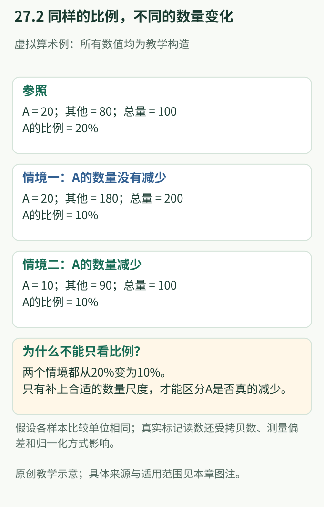

# 第27章 微生物组研究的证据与因果：组成变化怎样连接免疫功能

> 核心问题：两组植物的微生物组在图上明显分开，距离“微生物组改变了植物免疫”还有多远？

一张群落柱状图可以显示哪些序列占比发生变化，一张排序图可以显示哪些样本更相似。但植物是否因此更抗病，是另一个层次的问题。组成差异可能是免疫改变的原因，也可能是免疫改变的结果，还可能与免疫一起受土壤条件驱动。本章从测量对象出发，逐层连接数量、群落过程与宿主功能，让读者能够指出每项证据究竟支持模型中的哪一段。

**学习目标**

- 区分标记序列、基因功能潜力、实际活性与宿主免疫结果。
- 用具体数字解释相对丰度下降为何不一定意味着数量减少。
- 正确阅读多样性、排序和共现图，识别各自的解释范围。
- 理解区室、重复、土壤、批次和低生物量污染怎样改变结论。
- 说明定义群落研究如何增加因果理解，以及为何仍需宿主和环境证据。

**先修与衔接：**群落背景见[第10章](../part4-交叉前沿/ch10-植物微生物组与免疫.md)，一般论文阅读见[第20章](../part6-专题与研读/ch20-如何阅读植物免疫证据.md)，保护收益的分类见[第26章](ch26-有益微生物与诱导抗性.md)。本章重点是微生物组证据的特殊性质，不以数据分析软件为主线。

**阅读路线：**27.1确定测量对象，27.2理解分母，27.3阅读常见图形；27.4处理背景与重复，27.5—27.6连接群落过程、宿主因果与适用范围。两处深读分别关注定量信息和可解释的群落模型。

## 27.1 先问测到了什么，再问它能解释什么

常见的细菌群落研究读取 **16S rRNA 基因**的一段标记序列；真菌研究常使用**内转录间隔区（internal transcribed spacer，ITS）**。这些标记帮助识别群落成员及其相对组成，但测到的是核酸信号，并非直接清点每一个活细胞。标记选择、序列覆盖范围和参考数据库，都会限定哪些生物容易被看见、能够辨认到哪一级。

**扩增子序列变体（amplicon sequence variant，ASV）**指对测序误差进行推断和校正后区分的标记序列。Callahan 等提出的 DADA2 方法提高了区分真实序列差异与测序误差的能力。不过，“序列分辨率提高”与“物种鉴定已完成”并不相同：不同生物可能共享所测片段，同一基因组内也可能存在不同标记拷贝。因此，一个 ASV 不能自动对应一个物种，更不能自动对应一个功能确定的菌株 (Callahan et al., 2016；[原始研究](https://doi.org/10.1038/nmeth.3869))。

| 证据类型 | 主要观察对象 | 最直接回答的问题 | 尚不能单独证明 |
|---|---|---|---|
| 16S/ITS 扩增子 | 选定标记的序列及读数 | 哪些标记类型被检出、占比怎样变化？ | 完整基因组、活细胞数量、保护能力 |
| 宏基因组 | 群落中的 DNA 与基因 | 群落具有哪些功能潜力？ | 相关基因正在表达或产物已经起效 |
| 宏转录组 | 群落 RNA | 哪些转录程序在该时点较活跃？ | 蛋白活性、代谢通量和宿主收益 |
| 代谢物分析 | 可检测的化学组分 | 哪些产物或底物发生变化？ | 化合物来自谁、在何处发挥作用 |
| 宿主功能证据 | 防御响应、病原负荷与损失 | 植物的应对与结局是否改变？ | 全部变化均由某一个群落成员造成 |

例如，某类代谢相关基因在宏基因组中较多，可能因为携带者变多，也可能因为群落转向基因拷贝较多的成员。转录信号升高又可能来自单个细胞表达增强，或活跃成员总数增加。若代谢物同时升高，还要考虑宿主自身合成、其他微生物消耗减少或组织释放改变。这些不是互相排斥的解释，而是需要分别连接的环节。

读到“功能预测”时，尤其要辨认依据。由分类组成推测功能，依赖参考基因组与实际成员足够相似的假设；直接发现相应基因，则更接近功能潜力；两者都尚未等同于免疫作用。Bai 等对叶、根来源细菌的基因组比较提供了一个关键背景：分类与基因功能既有联系，也存在组内差异，不能用一个属名代替所有成员的功能 (Bai et al., 2015)。

**图27.1 从序列组成到宿主功能，需要连接不同测量层次。**原创概念图，依据 Callahan et al. (2016)、Bai et al. (2015) 和 Guo et al. (2020) 的测量范围整理。层次之间的连接表示待检验关系，不表示增加某类数据后即可自动证明因果。

## 27.2 分母决定含义：比例下降有不止一种数量解释

**相对丰度（relative abundance）**是某成员读数在所定义总读数中的比例。它回答“这一部分占整体多少”，而不是“单位根组织上有多少”。把所有比例加起来固定为整体，就使各部分的读数相互约束：即使 A 自身不变，其他成员增加也会使 A 的比例下降。

下面是专为解释分母而设置的**虚拟例子**。假设数量均用同一种可比单位表示，采样范围相同，暂不考虑测量偏差。

| 情境 | A 的数量 | 其他成员数量 | 总量 | A 的比例 | 相对参照的数量解释 |
|---|---:|---:|---:|---:|---|
| 参照 | 20 | 80 | 100 | 20% | 比较起点 |
| 情境1 | 20 | 180 | 200 | 10% | A 未减少，其他成员增加 |
| 情境2 | 10 | 90 | 100 | 10% | A 减少，整体总量未变 |

两种情境在只显示百分比的图中都会把 A 从20%画成10%。若将它们都写成“宿主清除了 A 的一半”，就把一个比例结果误当成数量机制。反过来，比例不变也可能遮住全部成员一起增加或减少。这里不是说比例没有价值，而是它描述群落内部配置，需要与群落总负荷共同解释。

**图27.2 相同的10%可以来自不同数量状态。**原创教学图，数字均为虚拟例，不是论文数据。依据 Guo et al. (2020) 关于群落总负荷的定量逻辑设计；所有数量假定具有相同计量单位和采样范围。

### ⬡ 思路拆解一：Guo 等怎样把“微生物占比”重新接回宿主？

**面对的问题：**常规组成分析将群落压缩成百分比，如何知道植物单位组织所关联的微生物负荷是否同时变化？

**关键思路：**宿主相关定量丰度分析（host-associated quantitative abundance profiling，HA-QAP）利用校准信息，把微生物标记数量联系到宿主基因组数量。它改变的是解释所用的参照，而不只是多画一张图。

**关键证据链：**① 原文图2通过已知数量关系检验方法，区分总体改变与某些成员改变；② 图5中的自然根部样本显示，加入负荷信息后，一些成员变化的解释与单纯比例分析不同；③ 宏基因组中微生物与宿主读数的关系提供另一类定量支持 (Guo et al., 2020；[原始研究](https://doi.org/10.1016/j.xplc.2019.100003))。

**影响：**群落解释由“微生物彼此占多少”推进到“微生物相对于植物有多少”。该文2019年在线发表、编入2020年卷期，本章按卷期引用为2020年。

**解释边界：**HA-QAP 的量是微生物标记对宿主基因组的比值，不是精确活细胞计数。不同生物的标记拷贝数、核酸回收差异和宿主参照的稳定性，仍会影响解释。研究中所谓“绝对定量”也应注明单位：每份样本、每单位质量或每宿主基因组，并非可互换。若处理同时改变根组织状态，分母的生物学含义更需说明。

## 27.3 多样性、排序与网络各自回答不同问题

**α多样性（alpha diversity）**描述单个样本内部的多样程度，涉及丰富度和均匀度。丰富度关注检出了多少类，均匀度关注数量是否集中在少数类。两个都包含两类成员的虚拟群落，数量分别为50与50、99与1，丰富度相同，均匀度却不同。因此，写“多样性改变”时，应说明使用哪个指标。

**β多样性（beta diversity）**描述样本之间的组成差异。两个样本可以各自具有相同丰富度，成员身份却完全不同；也可以成员相同、数量配置不同。是否强调稀有成员、丰度或系统发育关系，会影响所采用的距离度量及其生物学解释。

**主坐标分析（principal coordinates analysis，PCoA）**将样本间距离投影到少数坐标轴。图中点是样本，轴通常不是“免疫强度”或“健康程度”。两组分开只支持在所用度量下存在群落结构差异；轴解释的变异比例还提醒我们，二维图没有呈现全部差异。组间位置变化与某组内部更加分散，也应分开判断。

Lundberg 等研究拟南芥根部群落时，区室和土壤对群落结构的影响十分突出，宿主基因型也有一定贡献。这提示读者：排序图分开后，首先要询问分开的因素，而不是直接给某一组贴上“免疫更好”的标签。该研究中的因素相对贡献，也不能变成适用于所有植物的永久排序 (Lundberg et al., 2012；[原始研究](https://doi.org/10.1038/nature11237))。

**共现网络（co-occurrence network）**把共同变化的成员连接起来，但连线不自动表示物质交换、抑制或直接接触。两个成员可能都偏好湿润土壤，也可能分别响应同一种根分泌物；基于比例计算的关系，还可能受共同分母约束。

Lovell 等使用的是**裂殖酵母基因表达数据，而非植物微生物组**。他们展示绝对量转为相对量后，相关关系可能改变，甚至产生相反印象。这一组成数据原理适用于理解群落比例，但不能把原文的酵母结论写成某种植物细菌互作已经得到证明 (Lovell et al., 2015；[原始研究](https://doi.org/10.1371/journal.pcbi.1004075))。

> **◆ 认知修正：更多样、分得更开、连线更多，都不是免疫增强的通用判据。** 它们分别描述样本内部结构、样本间差异和统计关联；免疫评价需要独立的宿主证据。

## 27.4 区室、重复与背景决定比较是否具有生物学含义

根际、根表和根内并不是同一种环境。把不同区室的样本混在一起，可能使“宿主效应”实际反映样本组成不同。叶片也存在组织位置、叶龄和表面微环境差异。同一株植物的多个部位并非天然独立；它们共享发育、资源与环境经历。

**生物学重复**提供不同生物单位之间的变异信息；**技术重复**说明同一材料反复测量的稳定程度。将同一份根材料测量多次，不能当作许多株独立植物。若几株植物共享一个不可独立变化的环境单元，还需要判断真正的重复单位在植株层面，还是在容器、地块或其他层面。

| 潜在问题 | 容易产生的误判 | 阅读时应寻找的证据 |
|---|---|---|
| 处理与土壤来源重合 | 把土壤效应写成宿主免疫效应 | 土壤与宿主因素是否能分开比较 |
| 同株多处被当作独立样本 | 夸大重复数量与结论确定性 | 样本的层级和共享环境是否说明 |
| 处理与测量批次重合 | 把批次偏差写成群落重组 | 分组与批次是否交错、是否有批次信息 |
| 区室或发育阶段不一致 | 把空间和年龄差异写成保护机制 | 取样范围与植物状态是否可比 |
| 低生物量背景信号 | 把试剂或环境来源的序列写成真实成员 | 阴性对照及背景信号的解释 |

**批次效应（batch effect）**是测量过程中某批样本共同具有的偏差。如果全部健康样本属于一批，全部患病样本属于另一批，仅靠最终数据很难区分疾病与批次。统计模型可以处理有信息可辨认的差异，却不能凭空恢复从未分开的两个因素。

低生物量样本尤其需要注意。设想某种背景 DNA 在各样本中数量近似：当真实微生物 DNA 很多时，它占比很小；真实信号减少时，它就显得突出。结果可能被误读为“稀有成员在免疫状态下富集”。Salter 等的原始研究表明，试剂与实验环境来源的污染足以改变序列分析结果，影响还具有批次差异；该工作支持测量原则，不能直接替某个植物样本判定污染来源 (Salter et al., 2014；[原始研究](https://doi.org/10.1186/s12915-014-0087-z))。

阴性对照的价值是帮助估计背景，而不是提供一张可以机械删除的物种黑名单。某类群可能既存在于环境中，也出现在试剂背景里；是否属于样本的真实信号，需要结合数量、检出分布、批次及其他证据。检测到微量序列，尤其不等于已经建立稳定宿主关联。

## 27.5 定义群落让成员关系可解释，却不会自动复制自然

自然群落观察具有丰富生态背景，却难以逐个定位参与者。**定义群落（defined community）**由身份已知的成员组成，提供缩小解释范围的模型；**合成群落（synthetic community，SynCom）**通常用于这类研究，不意味着成员必须经过遗传改造。它的价值在于知道比较中改变了哪些参与者，而不是成员越少就越接近真实机制。

### ⬡ 思路拆解二：Bai 等为何同时发现功能重叠与器官偏好？

**面对的问题：**叶片和根部环境不同，其微生物是否属于彼此隔离、功能完全不同的群体？

**关键思路：**将自然群落的分类信息、代表成员基因组和已知成员群落在宿主器官中的表现联系起来。

**关键证据链：**① 图2显示基因组功能差异与分类关系密切相连，叶、根来源成员具有广泛重叠；② 图4支持相关成员能够形成器官相关群落；③ 图5的器官比较又显示区室偏好。因此，“共享部分功能潜力”与“在不同部位的竞争和定殖表现不同”可以同时成立 (Bai et al., 2015；[原始研究](https://doi.org/10.1038/nature16192))。

**影响：**研究把“不同区室是否有不同成员”推进到“重叠成员怎样形成不同区室的群落”。它没有证明所有成员可互换，也没有通过基因功能重叠证明相同免疫保护。宿主器官偏好和保护功能仍是不同终点。

定义群落还有助于理解**优先效应（priority effect）**：先前到达者改变了后续成员面对的环境，使到达历史影响最终群落。Carlström 等对拟南芥叶部群落的研究显示，成员缺失与到达历史可以改变群落结构，有些菌株的影响比其他成员更突出 (Carlström et al., 2019；[原始研究](https://doi.org/10.1038/s41559-019-0994-z))。

这项结果应怎样读？首先，“关键成员”是相对于某个群落背景和测量终点定义的；对组成影响大，不能直接称为“免疫保护最关键”。其次，某成员消失后其他成员改变，可能包含经由第三个成员产生的间接效应。因此，基于成员变化建立的因果网络，比静态共现更接近群落过程，却仍不意味着每条边都是直接分子互作。

最后，定义群落简化了成员库及环境。自然土壤中的其他生物、持续迁入和季节变化，可能改变同一成员的作用。简化模型与自然观察互相补充：前者使关系可解释，后者检验解释是否在更丰富的背景中仍有用。

## 27.6 从群落过程走到宿主免疫：必须指出因果发生在哪里

考虑两个都能解释同一观察的模型。模型一中，某土壤条件同时改变微生物组和植物健康；两者相关，但没有证据表明菌群居中传递了作用。模型二中，土壤改变菌群，菌群进一步影响宿主免疫。它们可以产生近似的群落图和病害图，区别在于第二个模型多了一段必须被证据支持的因果关系。

**图27.3 相同关联可以对应不同因果结构。**原创教学模型，结合 Lundberg et al. (2012) 的土壤与区室背景、Bai et al. (2015) 和 Carlström et al. (2019) 的群落模型研究整理。图示用于比较解释，不是某篇论文已经完整验证的通路。

对宿主免疫的解释至少要兼顾三类联系：群落状态是否改变了宿主的防御能力；这种变化是否与病原负荷或损失减少一致；相应宿主信号能力是否参与这一联系。只测到免疫标志基因升高，可能反映组织受压而非保护；只测到病害下降，可能来自第26章讨论的直接生态抑制或营养补偿。

宿主遗传差异有助于定位免疫贡献，但也可能改变根分泌物、植物大小和群落定殖。若保护消失的同时相关微生物几乎不再存在，就不能立即把结果全部归于下游免疫执行缺陷。必须区分“宿主未形成相似的微生物关联”和“关联形成后不能产生相同响应”。同样，基线病害已不同的宿主，应比较各自背景中的变化，而非只比较最终高低。

时间关系也很关键。若群落变化出现在明显组织受损之后，它可能是营养泄漏或生态位改变的后果。变化早于病害能增强先后顺序的解释，却仍不能排除更早发生的共同原因。时间证据、宿主证据和群落功能证据需要相互约束。

**可迁移性（transportability）**问的是某个解释在新背景中是否成立。跨土壤或作物重复时，不必要求每个 ASV 都相同，但应核对所声称的功能是否相同：例如都限制病原负荷，还是一个改善营养、另一个提高防御标志物。对不同终点取平均不能创造一个普遍免疫机制。

## 27.7 开放问题：证据增加后，还有哪些解释未被排除？

- **数量与活性怎样连接？** 负荷变化和单个成员活性变化可能并存，怎样确定谁贡献了宿主相关产物？
- **空间是否隐藏关键关系？** 整根平均值可能相似，微生物在根尖或成熟组织的分布却不同。
- **群落关键成员能否跨背景保持作用？** 其影响依赖伙伴、到达历史还是宿主状态，各自需要不同解释。
- **功能是否比成员身份更可迁移？** 同样保护可能由不同成员提供，也可能只是表面相同、内部过程不同。

> **Key Question：** 当数量、基因表达、代谢物和病害结果同时变化时，哪项证据真正定位了因果关系，哪项只是描述同一过程的另一个侧面？

## 关键实验方法 Box：每类方法补上一种信息

| 方法类型 | 提供的关键参照 | 主要边界 | 原始研究入口 |
|---|---|---|---|
| 扩增子误差模型 | 将真实标记差异与测序误差区分 | 不自动等同物种或菌株鉴定 | Callahan et al., 2016 |
| 宿主相关定量 | 将标记数量归一到宿主基因组 | 不直接计数活细胞 | Guo et al., 2020 |
| 区室与背景比较 | 区分空间、土壤和宿主关联 | 共同变化的因素可能难以分离 | Lundberg et al., 2012 |
| 定义群落研究 | 使成员身份与群落变化可追踪 | 简化模型的范围及间接效应 | Bai et al., 2015；Carlström et al., 2019 |
| 测量背景对照 | 估计试剂和批次信号 | 不能机械删除所有共同检出类群 | Salter et al., 2014 |

## 推荐阅读

| 分级 | 文献 | 阅读重点 |
|---|---|---|
| 🔴 必读 | Guo et al., 2020 | 对照图2理解分母，再读自然样本中的解释变化 |
| 🔴 必读 | Bai et al., 2015 | 同时保留功能重叠、成员差异和区室偏好 |
| 🟡 重要 | Lundberg et al., 2012；Carlström et al., 2019 | 从自然背景推进到可解释的群落过程 |
| 🟡 重要 | Salter et al., 2014 | 理解低生物量与批次怎样改变测量结果 |
| 🟢 拓展 | Callahan et al., 2016；Lovell et al., 2015 | 分别理解序列纠错与组成数据，不把方法精度误当因果强度 |

## 本章自测与讲解

**1. 某 ASV 增多，是否等于一种具有确定免疫功能的细菌增多？**

**解析：**不等于。ASV 是所测标记的序列单位，不自动对应物种或菌株；相对读数还受总量和测量偏差影响。功能须有独立证据。

**2. A 从20%降到10%，怎样说明它的数量可能没有减少？**

**解析：**参照中 A 为20、其他成员为80；若 A 仍为20而其他成员增至180，总量由100变成200，A 就变成10%。比例下降并不唯一确定 A 的数量怎样变化。

**3. HA-QAP 得到微生物标记对宿主基因组的比值为某个数，能否把它直接写成每个植物细胞的活菌数？**

**解析：**不能。标记拷贝、基因组与细胞、核酸信号与存活状态并非一一对应。应保留原始计量单位，并说明宿主参照及回收差异。

**4. PCoA 上两组分离，处理组α多样性更高，能否判断处理改善免疫？**

**解析：**这些结果说明群落结构与样本内部多样程度有差异。还需辨认土壤、区室、批次等影响，并获得独立的宿主防御和保护证据。

**5. 定义群落中某成员缺失后群落改变，为什么不能直接称它为保护植物的关键菌？**

**解析：**所测终点是群落结构。该成员可能经由其他成员产生间接影响；免疫保护需要相应宿主结果，关键性也受群落与环境背景限定。

**6. 健康植株全部来自土壤甲，患病植株全部来自土壤乙，发现群落不同后最难排除什么？**

**解析：**土壤可能同时影响微生物组与疾病，也可能影响测量时的植物状态。样本多不能自动解决这种因素重合；应区分共同原因与菌群介导的模型。

## 参考文献

- Bai, Y., Müller, D. B., Srinivas, G., et al. *Functional overlap of the Arabidopsis leaf and root microbiota.* Nature, 2015; 528: 364–369. DOI: [10.1038/nature16192](https://doi.org/10.1038/nature16192).
- Callahan, B. J., McMurdie, P. J., Rosen, M. J., Han, A. W., Johnson, A. J. A., & Holmes, S. P. *DADA2: High-resolution sample inference from Illumina amplicon data.* Nature Methods, 2016; 13: 581–583. DOI: [10.1038/nmeth.3869](https://doi.org/10.1038/nmeth.3869).
- Carlström, C. I., Field, C. M., Bortfeld-Miller, M., Müller, B., Sunagawa, S., & Vorholt, J. A. *Synthetic microbiota reveal priority effects and keystone strains in the Arabidopsis phyllosphere.* Nature Ecology & Evolution, 2019; 3: 1445–1454. DOI: [10.1038/s41559-019-0994-z](https://doi.org/10.1038/s41559-019-0994-z).
- Guo, X., Zhang, X., Qin, Y., et al. *Host-associated quantitative abundance profiling reveals the microbial load variation of root microbiome.* Plant Communications, 2020; 1: 100003. Online publication: 2019. DOI: [10.1016/j.xplc.2019.100003](https://doi.org/10.1016/j.xplc.2019.100003).
- Lovell, D., Pawlowsky-Glahn, V., Egozcue, J. J., Marguerat, S., & Bähler, J. *Proportionality: A valid alternative to correlation for relative data.* PLOS Computational Biology, 2015; 11: e1004075. DOI: [10.1371/journal.pcbi.1004075](https://doi.org/10.1371/journal.pcbi.1004075).
- Lundberg, D. S., Lebeis, S. L., Paredes, S. H., et al. *Defining the core Arabidopsis thaliana root microbiome.* Nature, 2012; 488: 86–90. DOI: [10.1038/nature11237](https://doi.org/10.1038/nature11237).
- Salter, S. J., Cox, M. J., Turek, E. M., et al. *Reagent and laboratory contamination can critically impact sequence-based microbiome analyses.* BMC Biology, 2014; 12: 87. DOI: [10.1186/s12915-014-0087-z](https://doi.org/10.1186/s12915-014-0087-z).
